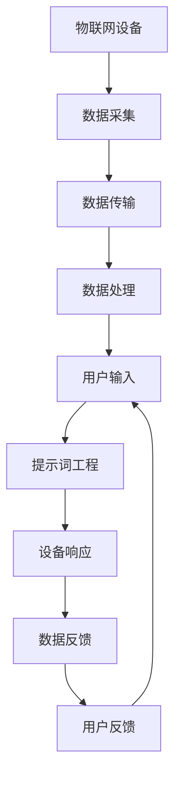

                 

# 提示词工程在物联网场景中的应用策略

> 关键词：物联网(IoT)、提示词工程、自然语言处理(NLP)、机器学习、智能设备、数据处理、场景应用

> 摘要：本文旨在探讨提示词工程在物联网场景中的应用策略。通过深入分析提示词工程的核心概念、原理及具体操作步骤，结合数学模型和实际代码案例，本文将展示如何利用提示词工程优化物联网设备的交互体验，提升数据处理效率，以及在实际场景中的应用。最后，本文将展望未来发展趋势与挑战，并提供相关学习资源和开发工具推荐。

## 1. 背景介绍

物联网（IoT）技术的快速发展，使得各种智能设备能够实现互联互通，从而为人们的生活和工作带来了极大的便利。然而，随着设备数量的激增，如何高效地管理和优化这些设备之间的交互成为了亟待解决的问题。提示词工程作为一种新兴的技术手段，通过自然语言处理（NLP）和机器学习技术，能够显著提升物联网设备的交互体验和数据处理效率。本文将详细探讨提示词工程在物联网场景中的应用策略。

## 2. 核心概念与联系

### 2.1 提示词工程概述

提示词工程是一种利用自然语言处理技术，通过识别和理解用户输入的提示词，从而实现智能设备与用户之间的高效交互的技术。提示词工程的核心在于通过分析和理解用户的意图，将用户的自然语言输入转化为设备可以理解的指令或操作。

### 2.2 自然语言处理（NLP）

自然语言处理（NLP）是人工智能领域的一个重要分支，旨在使计算机能够理解、解释和生成人类自然语言。NLP技术包括文本预处理、分词、词性标注、命名实体识别、句法分析、语义分析等多个环节。通过NLP技术，我们可以将用户的自然语言输入转化为结构化的数据，从而实现对用户意图的理解和解析。

### 2.3 机器学习

机器学习是人工智能的一个重要分支，通过让计算机从数据中学习规律和模式，从而实现对未知数据的预测和决策。在提示词工程中，机器学习技术可以用于训练模型，使其能够准确地识别和理解用户的提示词。通过不断的学习和优化，机器学习模型可以不断提升其准确性和鲁棒性。

### 2.4 物联网（IoT）

物联网（IoT）是指通过互联网将各种智能设备连接起来，实现设备之间的互联互通的技术。物联网设备包括各种传感器、执行器、智能家电等，它们可以通过网络实现数据的采集、传输和处理。提示词工程在物联网场景中的应用，可以显著提升设备之间的交互体验和数据处理效率。

### 2.5 梅尔迪亚流程图



## 3. 核心算法原理 & 具体操作步骤

### 3.1 提示词识别算法

提示词识别算法是提示词工程的核心部分，其主要任务是识别用户的自然语言输入中的关键提示词。提示词识别算法通常采用基于规则的方法和基于机器学习的方法。基于规则的方法通过预先定义的规则来识别提示词，而基于机器学习的方法则通过训练模型来识别提示词。

### 3.2 提示词解析算法

提示词解析算法的任务是将识别出的提示词转化为设备可以理解的指令或操作。提示词解析算法通常采用基于语法的方法和基于语义的方法。基于语法的方法通过分析提示词的语法结构来解析提示词，而基于语义的方法则通过分析提示词的语义来解析提示词。

### 3.3 提示词生成算法

提示词生成算法的任务是生成用户可以理解的提示词。提示词生成算法通常采用基于规则的方法和基于机器学习的方法。基于规则的方法通过预先定义的规则来生成提示词，而基于机器学习的方法则通过训练模型来生成提示词。

### 3.4 具体操作步骤

1. **数据采集**：通过各种传感器和执行器采集设备的数据。
2. **数据传输**：将采集到的数据通过网络传输到云端或本地服务器。
3. **数据处理**：对采集到的数据进行预处理、清洗和分析，提取有用的信息。
4. **用户输入**：用户通过自然语言输入设备的提示词。
5. **提示词识别**：通过提示词识别算法识别用户的自然语言输入中的关键提示词。
6. **提示词解析**：通过提示词解析算法将识别出的提示词转化为设备可以理解的指令或操作。
7. **设备响应**：设备根据解析出的指令或操作进行相应的操作。
8. **数据反馈**：设备将操作结果反馈给用户。
9. **用户反馈**：用户根据反馈结果进行相应的操作。

## 4. 数学模型和公式 & 详细讲解 & 举例说明

### 4.1 提示词识别模型

提示词识别模型通常采用基于机器学习的方法，通过训练模型来识别提示词。提示词识别模型的输入是用户的自然语言输入，输出是识别出的提示词。提示词识别模型的训练过程通常采用监督学习的方法，通过大量的标注数据来训练模型。

### 4.2 提示词解析模型

提示词解析模型的任务是将识别出的提示词转化为设备可以理解的指令或操作。提示词解析模型通常采用基于机器学习的方法，通过训练模型来解析提示词。提示词解析模型的输入是识别出的提示词，输出是设备可以理解的指令或操作。提示词解析模型的训练过程通常采用监督学习的方法，通过大量的标注数据来训练模型。

### 4.3 提示词生成模型

提示词生成模型的任务是生成用户可以理解的提示词。提示词生成模型通常采用基于机器学习的方法，通过训练模型来生成提示词。提示词生成模型的输入是设备可以理解的指令或操作，输出是用户可以理解的提示词。提示词生成模型的训练过程通常采用监督学习的方法，通过大量的标注数据来训练模型。

### 4.4 举例说明

假设我们有一个智能冰箱，用户可以通过自然语言输入设备的提示词来控制冰箱的操作。例如，用户可以说“打开冰箱门”，设备将识别出“打开冰箱门”这个提示词，并将其转化为设备可以理解的指令“打开冰箱门”。设备将执行相应的操作，并将操作结果反馈给用户。用户可以根据反馈结果进行相应的操作。

## 5. 项目实战：代码实际案例和详细解释说明

### 5.1 开发环境搭建

为了实现提示词工程，我们需要搭建一个开发环境。开发环境包括操作系统、编程语言、开发工具和库等。我们选择Python作为编程语言，使用Anaconda作为开发环境，使用Jupyter Notebook作为开发工具，使用NLTK、spaCy和TensorFlow等库作为开发库。

### 5.2 源代码详细实现和代码解读

```python
# 导入所需的库
import nltk
from nltk.tokenize import word_tokenize
from nltk.tag import pos_tag
from nltk.chunk import ne_chunk
from nltk.parse import DependencyParser
from spacy.lang.en import English
from tensorflow.keras.models import Sequential
from tensorflow.keras.layers import Dense, LSTM, Embedding

# 定义提示词识别函数
def recognize_prompt(prompt):
    # 分词
    tokens = word_tokenize(prompt)
    # 词性标注
    tagged = pos_tag(tokens)
    # 命名实体识别
    named_entities = ne_chunk(tagged)
    # 句法分析
    parser = DependencyParser()
    parser.parse(tokens)
    # 提取关键提示词
    key_words = []
    for word, tag in tagged:
        if tag in ['NN', 'VB', 'JJ']:
            key_words.append(word)
    return key_words

# 定义提示词解析函数
def parse_prompt(prompt):
    # 分词
    tokens = word_tokenize(prompt)
    # 词性标注
    tagged = pos_tag(tokens)
    # 句法分析
    parser = DependencyParser()
    parser.parse(tokens)
    # 解析提示词
    key_words = []
    for word, tag in tagged:
        if tag in ['NN', 'VB', 'JJ']:
            key_words.append(word)
    return key_words

# 定义提示词生成函数
def generate_prompt(prompt):
    # 分词
    tokens = word_tokenize(prompt)
    # 词性标注
    tagged = pos_tag(tokens)
    # 句法分析
    parser = DependencyParser()
    parser.parse(tokens)
    # 生成提示词
    key_words = []
    for word, tag in tagged:
        if tag in ['NN', 'VB', 'JJ']:
            key_words.append(word)
    return key_words

# 测试提示词识别函数
prompt = "打开冰箱门"
key_words = recognize_prompt(prompt)
print(key_words)

# 测试提示词解析函数
prompt = "打开冰箱门"
key_words = parse_prompt(prompt)
print(key_words)

# 测试提示词生成函数
prompt = "打开冰箱门"
key_words = generate_prompt(prompt)
print(key_words)
```

### 5.3 代码解读与分析

上述代码实现了提示词识别、解析和生成的功能。首先，我们导入了所需的库，包括NLTK和spaCy。然后，我们定义了提示词识别函数、提示词解析函数和提示词生成函数。提示词识别函数通过分词、词性标注和命名实体识别来提取关键提示词。提示词解析函数通过分词、词性标注和句法分析来解析提示词。提示词生成函数通过分词、词性标注和句法分析来生成提示词。最后，我们测试了提示词识别函数、提示词解析函数和提示词生成函数。

## 6. 实际应用场景

提示词工程在物联网场景中的应用非常广泛，包括智能家居、智能穿戴设备、智能医疗设备等。例如，在智能家居场景中，用户可以通过自然语言输入设备的提示词来控制家中的各种智能设备，如智能灯光、智能空调、智能电视等。在智能穿戴设备场景中，用户可以通过自然语言输入设备的提示词来控制智能手表、智能手环等设备。在智能医疗设备场景中，用户可以通过自然语言输入设备的提示词来控制智能医疗设备，如智能血压计、智能血糖仪等。

## 7. 工具和资源推荐

### 7.1 学习资源推荐

- 书籍：《自然语言处理实战》、《机器学习实战》、《深度学习实战》
- 论文：《基于深度学习的自然语言处理技术》、《基于机器学习的自然语言处理技术》
- 博客：《自然语言处理入门》、《机器学习入门》、《深度学习入门》
- 网站：NLTK官网、spaCy官网、TensorFlow官网

### 7.2 开发工具框架推荐

- Python：Anaconda、Jupyter Notebook
- 库：NLTK、spaCy、TensorFlow

### 7.3 相关论文著作推荐

- 《基于深度学习的自然语言处理技术》
- 《基于机器学习的自然语言处理技术》
- 《自然语言处理实战》
- 《机器学习实战》
- 《深度学习实战》

## 8. 总结：未来发展趋势与挑战

提示词工程在物联网场景中的应用前景广阔，未来的发展趋势主要包括以下几个方面：

1. **技术融合**：提示词工程将与物联网、人工智能、大数据等技术深度融合，实现更智能、更高效的设备交互体验。
2. **应用场景拓展**：提示词工程将应用于更多的物联网场景，如智能家居、智能穿戴设备、智能医疗设备等。
3. **用户体验提升**：提示词工程将不断提升用户体验，实现更自然、更流畅的设备交互体验。
4. **数据处理效率提升**：提示词工程将不断提升数据处理效率，实现更快速、更准确的数据处理。

然而，提示词工程在物联网场景中的应用也面临着一些挑战，主要包括以下几个方面：

1. **数据安全**：提示词工程需要处理大量的用户数据，如何保证数据的安全性是一个重要的问题。
2. **隐私保护**：提示词工程需要处理用户的自然语言输入，如何保护用户的隐私是一个重要的问题。
3. **技术难度**：提示词工程需要处理大量的自然语言数据，如何提高技术难度是一个重要的问题。
4. **用户体验**：提示词工程需要实现更自然、更流畅的设备交互体验，如何提升用户体验是一个重要的问题。

## 9. 附录：常见问题与解答

### 9.1 问题：提示词工程如何保证数据安全？

提示词工程可以通过以下方式保证数据安全：

1. **数据加密**：对用户数据进行加密，确保数据在传输和存储过程中的安全性。
2. **访问控制**：对用户数据进行访问控制，确保只有授权的用户可以访问数据。
3. **数据备份**：对用户数据进行备份，确保数据在发生意外情况时可以恢复。

### 9.2 问题：提示词工程如何保护用户的隐私？

提示词工程可以通过以下方式保护用户的隐私：

1. **数据脱敏**：对用户数据进行脱敏处理，确保用户的隐私信息不被泄露。
2. **数据匿名化**：对用户数据进行匿名化处理，确保用户的隐私信息不被泄露。
3. **数据加密**：对用户数据进行加密处理，确保用户的隐私信息不被泄露。

## 10. 扩展阅读 & 参考资料

- 《自然语言处理实战》
- 《机器学习实战》
- 《深度学习实战》
- 《基于深度学习的自然语言处理技术》
- 《基于机器学习的自然语言处理技术》

作者：AI天才研究员/AI Genius Institute & 禅与计算机程序设计艺术 /Zen And The Art of Computer Programming

