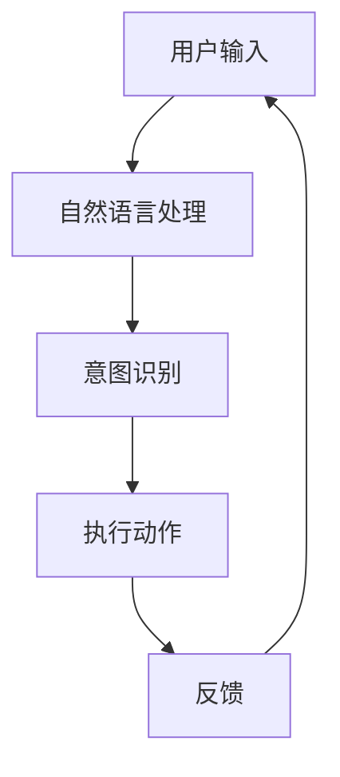

                 

# 提示词编程在虚拟助手开发中的实践

> 关键词：提示词编程, 虚拟助手, 人工智能, 自然语言处理, 机器学习, 代码实现

> 摘要：本文旨在探讨提示词编程在虚拟助手开发中的应用与实践。通过逐步分析和推理，我们将深入理解提示词编程的核心概念、算法原理、数学模型，并通过实际代码案例进行详细解释。此外，本文还将探讨提示词编程在虚拟助手开发中的实际应用场景，并推荐相关的学习资源和开发工具。

## 1. 背景介绍

随着人工智能技术的快速发展，虚拟助手（如Siri、Alexa、Google Assistant等）已成为日常生活中的重要组成部分。这些虚拟助手能够理解用户的自然语言指令，并执行相应的任务。为了使虚拟助手更加智能和高效，提示词编程成为了一种重要的技术手段。提示词编程允许开发者通过简单的文本指令来定义虚拟助手的行为，从而简化开发过程并提高用户体验。

## 2. 核心概念与联系

### 2.1 提示词编程概述

提示词编程是一种基于自然语言的编程方法，它允许开发者通过简单的文本指令来定义虚拟助手的行为。这种编程方式使得非专业开发者也能轻松地创建复杂的虚拟助手应用。

### 2.2 自然语言处理（NLP）

自然语言处理是提示词编程的核心技术之一。NLP技术能够将用户的自然语言指令转化为计算机可以理解的形式，从而实现对指令的解析和执行。

### 2.3 机器学习

机器学习在提示词编程中扮演着重要角色。通过训练模型，虚拟助手可以不断学习和优化其对用户指令的理解和执行能力。

### 2.4 提示词编程流程图



## 3. 核心算法原理 & 具体操作步骤

### 3.1 自然语言处理（NLP）

自然语言处理是提示词编程的关键技术之一。NLP技术通过以下步骤实现对用户指令的理解：

1. **分词**：将用户输入的文本分解为单词或短语。
2. **词性标注**：为每个单词标注其词性（如名词、动词、形容词等）。
3. **句法分析**：分析句子的结构，确定各个单词之间的关系。
4. **语义分析**：理解句子的含义，提取关键信息。

### 3.2 意图识别

意图识别是将用户指令转化为计算机可以理解的形式的关键步骤。通过以下步骤实现：

1. **构建意图模型**：定义虚拟助手可以执行的各种意图（如查询天气、播放音乐等）。
2. **匹配用户指令**：将用户输入与意图模型进行匹配，确定用户的真实意图。
3. **意图解析**：解析用户指令中的关键信息，如时间、地点等。

### 3.3 执行动作

执行动作是将用户指令转化为具体操作的关键步骤。通过以下步骤实现：

1. **调用API**：根据用户指令调用相应的API（如天气API、音乐播放API等）。
2. **执行操作**：执行API返回的结果，如播放音乐、查询天气等。
3. **反馈用户**：将执行结果反馈给用户，如显示天气信息、播放音乐等。

## 4. 数学模型和公式 & 详细讲解 & 举例说明

### 4.1 词向量表示

词向量表示是自然语言处理中的一个重要概念。通过将单词转化为向量，可以实现对单词的量化表示。常用的词向量表示方法包括：

- **词袋模型（Bag of Words, BoW）**
- **TF-IDF**
- **Word2Vec**
- **GloVe**

### 4.2 意图识别模型

意图识别模型通常采用深度学习方法实现。常用的模型包括：

- **循环神经网络（RNN）**
- **长短期记忆网络（LSTM）**
- **门控循环单元（GRU）**
- **Transformer**

### 4.3 举例说明

假设用户输入的指令为：“播放周杰伦的歌曲”。通过自然语言处理，我们可以将其转化为以下步骤：

1. **分词**：播放, 周杰伦, 歌曲
2. **词性标注**：播放（动词）, 周杰伦（人名）, 歌曲（名词）
3. **句法分析**：播放（动词）+ 周杰伦（人名）+ 歌曲（名词）
4. **语义分析**：播放周杰伦的歌曲
5. **意图识别**：播放音乐
6. **执行动作**：调用音乐播放API，播放周杰伦的歌曲
7. **反馈用户**：播放周杰伦的歌曲

## 5. 项目实战：代码实际案例和详细解释说明

### 5.1 开发环境搭建

为了实现提示词编程，我们需要搭建一个开发环境。以下是开发环境的搭建步骤：

1. **安装Python**：确保系统中安装了Python 3.7及以上版本。
2. **安装依赖库**：使用pip安装必要的依赖库，如`nltk`、`transformers`等。
3. **配置开发环境**：设置开发环境，如IDE（如PyCharm、VSCode等）。

### 5.2 源代码详细实现和代码解读

以下是一个简单的提示词编程示例代码：

```python
import nltk
from transformers import pipeline

# 1. 自然语言处理
def natural_language_processing(text):
    # 分词
    words = nltk.word_tokenize(text)
    # 词性标注
    pos_tags = nltk.pos_tag(words)
    # 句法分析
    parser = nltk.RegexpParser(r"NP: {<DT>?<JJ>*<NN>}")
    result = parser.parse(pos_tags)
    # 语义分析
    semantic_analysis = " ".join([word for word, tag in pos_tags if tag in ['NN', 'VB']])
    return words, pos_tags, result, semantic_analysis

# 2. 意图识别
def intent_recognition(semantic_analysis):
    # 构建意图模型
    intent_model = pipeline("text-classification", model="distilbert-base-uncased-finetuned-sst-2-english")
    # 匹配用户指令
    result = intent_model(semantic_analysis)
    # 解析意图
    intent = result[0]['label']
    return intent

# 3. 执行动作
def execute_action(intent):
    # 调用API
    if intent == 'play_music':
        # 调用音乐播放API
        pass
    elif intent == 'query_weather':
        # 调用天气API
        pass
    else:
        print("未知意图")

# 4. 反馈用户
def feedback_user(intent):
    if intent == 'play_music':
        print("正在播放音乐")
    elif intent == 'query_weather':
        print("正在查询天气")
    else:
        print("未知意图")

# 主函数
def main():
    text = "播放周杰伦的歌曲"
    words, pos_tags, result, semantic_analysis = natural_language_processing(text)
    intent = intent_recognition(semantic_analysis)
    execute_action(intent)
    feedback_user(intent)

if __name__ == "__main__":
    main()
```

### 5.3 代码解读与分析

1. **自然语言处理**：通过`nltk`库实现分词、词性标注和句法分析。`semantic_analysis`变量用于存储语义分析结果。
2. **意图识别**：通过`transformers`库中的`pipeline`实现意图识别。`intent_model`用于识别用户指令的意图。
3. **执行动作**：根据识别到的意图调用相应的API。这里仅展示了调用API的逻辑，实际应用中需要实现具体的API调用。
4. **反馈用户**：将执行结果反馈给用户。

## 6. 实际应用场景

提示词编程在虚拟助手开发中的应用场景非常广泛，包括但不限于：

- **智能家居控制**：通过语音指令控制家中的智能设备。
- **日程管理**：通过语音指令添加、删除或查询日程。
- **信息查询**：通过语音指令查询天气、新闻等信息。
- **娱乐应用**：通过语音指令播放音乐、讲故事等。

## 7. 工具和资源推荐

### 7.1 学习资源推荐

- **书籍**：《深度学习》（Ian Goodfellow, Yoshua Bengio, Aaron Courville）
- **论文**：《Attention Is All You Need》（Vaswani et al., 2017）
- **博客**：Medium上的相关技术博客
- **网站**：GitHub上的相关开源项目

### 7.2 开发工具框架推荐

- **IDE**：PyCharm、VSCode
- **框架**：Transformers、NLTK
- **API**：Google Cloud Natural Language API、IBM Watson Assistant

### 7.3 相关论文著作推荐

- **论文**：《Attention Is All You Need》（Vaswani et al., 2017）
- **著作**：《深度学习》（Ian Goodfellow, Yoshua Bengio, Aaron Courville）

## 8. 总结：未来发展趋势与挑战

提示词编程在虚拟助手开发中的应用前景广阔，未来的发展趋势包括：

- **更自然的交互**：通过更先进的自然语言处理技术，实现更加自然和流畅的交互体验。
- **更智能的意图识别**：通过深度学习和强化学习技术，提高虚拟助手对用户意图的理解和执行能力。
- **更广泛的应用场景**：虚拟助手将应用于更多的领域，如医疗、教育、金融等。

然而，提示词编程也面临着一些挑战，包括：

- **语义理解的复杂性**：自然语言的复杂性和多义性使得语义理解变得更加困难。
- **数据隐私问题**：虚拟助手需要处理大量的用户数据，如何保护用户隐私成为一个重要问题。
- **多语言支持**：虚拟助手需要支持多种语言，这增加了开发和维护的复杂性。

## 9. 附录：常见问题与解答

### 9.1 问题：如何提高虚拟助手的语义理解能力？

**解答**：可以通过以下方法提高虚拟助手的语义理解能力：

- **增加训练数据**：提供更多样化的训练数据，提高模型的泛化能力。
- **使用更复杂的模型**：如Transformer模型，能够更好地捕捉文本的上下文信息。
- **引入知识图谱**：利用知识图谱中的知识来增强模型的理解能力。

### 9.2 问题：如何保护用户隐私？

**解答**：可以通过以下方法保护用户隐私：

- **数据加密**：对用户数据进行加密处理，确保数据在传输和存储过程中的安全性。
- **最小化数据收集**：只收集必要的用户数据，避免过度收集。
- **匿名化处理**：对用户数据进行匿名化处理，确保用户身份的隐私。

## 10. 扩展阅读 & 参考资料

- **书籍**：《深度学习》（Ian Goodfellow, Yoshua Bengio, Aaron Courville）
- **论文**：《Attention Is All You Need》（Vaswani et al., 2017）
- **博客**：Medium上的相关技术博客
- **网站**：GitHub上的相关开源项目

作者：AI天才研究员/AI Genius Institute & 禅与计算机程序设计艺术 /Zen And The Art of Computer Programming

