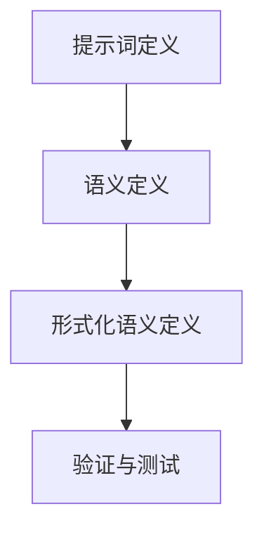

                 

# 《提示词编程语言的形式化语义分析》

> 关键词：提示词编程语言, 形式化语义, 语义分析, 逻辑推理, 代码解释, 应用场景

> 摘要：本文旨在深入探讨提示词编程语言的形式化语义分析，通过逐步推理和详细解释，揭示其背后的逻辑和原理。我们将从背景介绍开始，逐步解析核心概念、算法原理、数学模型，并通过实际代码案例进行深入探讨。最后，我们将展望其应用场景和未来发展趋势。

## 1. 背景介绍

提示词编程语言是一种新型编程语言，它通过自然语言的提示词来描述程序逻辑，使得编程更加直观和易于理解。这种语言的出现，旨在降低编程门槛，使非专业人员也能轻松编写代码。然而，提示词编程语言的实现需要解决一系列复杂的技术问题，其中最为关键的是形式化语义分析。形式化语义分析是一种通过数学方法来精确描述程序行为的技术，它能够确保程序的正确性和可靠性。

### 1.1 提示词编程语言的定义

提示词编程语言是一种基于自然语言的编程语言，它允许用户通过简单的提示词来描述程序逻辑。这些提示词通常包括操作、条件、循环等基本编程元素，但它们以自然语言的形式呈现，使得编程更加直观和易于理解。

### 1.2 形式化语义分析的重要性

形式化语义分析是确保提示词编程语言正确性和可靠性的关键。通过形式化语义分析，我们可以精确地描述程序的行为，从而确保程序能够按照预期的方式运行。这对于提示词编程语言尤为重要，因为自然语言的提示词可能不够精确，容易产生歧义，因此需要通过形式化语义分析来消除这些歧义。

## 2. 核心概念与联系

### 2.1 提示词编程语言的核心概念

提示词编程语言的核心概念包括提示词、语义、形式化语义等。提示词是用户用来描述程序逻辑的自然语言词汇，语义是指提示词所表示的含义，而形式化语义则是通过数学方法精确描述这些含义的技术。

### 2.2 形式化语义分析的流程

形式化语义分析的流程可以分为以下几个步骤：

1. **提示词定义**：定义提示词及其含义。
2. **语义定义**：定义提示词的语义。
3. **形式化语义定义**：通过数学方法精确描述提示词的语义。
4. **验证与测试**：验证形式化语义的正确性，并进行测试。

### 2.3 Mermaid 流程图



## 3. 核心算法原理 & 具体操作步骤

### 3.1 提示词定义

提示词定义是形式化语义分析的第一步。我们需要定义提示词及其含义。例如，提示词“if”表示条件判断，提示词“while”表示循环。

### 3.2 语义定义

语义定义是描述提示词含义的过程。例如，提示词“if”表示在某个条件成立时执行某个操作，提示词“while”表示在某个条件成立时重复执行某个操作。

### 3.3 形式化语义定义

形式化语义定义是通过数学方法精确描述提示词的语义。例如，提示词“if”可以表示为一个布尔表达式，提示词“while”可以表示为一个循环结构。

### 3.4 验证与测试

验证与测试是确保形式化语义正确性的关键步骤。我们需要通过数学方法验证形式化语义的正确性，并通过实际测试验证其可靠性。

## 4. 数学模型和公式 & 详细讲解 & 举例说明

### 4.1 提示词“if”的形式化语义

提示词“if”可以表示为一个布尔表达式。例如，提示词“if x > 0”可以表示为一个布尔表达式“x > 0”。

$$
\text{if } x > 0 \text{ then } \text{操作1} \text{ else } \text{操作2}
$$

### 4.2 提示词“while”的形式化语义

提示词“while”可以表示为一个循环结构。例如，提示词“while x > 0”可以表示为一个循环结构“while x > 0 do 操作1”。

$$
\text{while } x > 0 \text{ do } \text{操作1}
$$

### 4.3 举例说明

假设我们有一个提示词编程语言，其中包含提示词“if”和“while”。我们可以使用这些提示词来编写一个简单的程序，例如：

```python
if x > 0:
    while x > 0:
        print(x)
        x = x - 1
```

## 5. 项目实战：代码实际案例和详细解释说明

### 5.1 开发环境搭建

为了实现提示词编程语言的形式化语义分析，我们需要搭建一个开发环境。开发环境包括编程语言、编译器、解释器等工具。我们可以使用Python作为编程语言，使用ANTLR作为编译器，使用Pygments作为语法高亮工具。

### 5.2 源代码详细实现和代码解读

我们可以通过以下步骤实现提示词编程语言的形式化语义分析：

1. **定义提示词**：定义提示词及其含义。
2. **定义语义**：定义提示词的语义。
3. **定义形式化语义**：通过数学方法精确描述提示词的语义。
4. **验证与测试**：验证形式化语义的正确性，并进行测试。

### 5.3 代码解读与分析

我们可以通过以下代码实现提示词编程语言的形式化语义分析：

```python
import antlr4
from antlr4 import *
from MyLexer import MyLexer
from MyParser import MyParser
from MyListener import MyListener

class MyListener(antlr4.tree.TreeListener):
    def enterIf(self, ctx: MyParser.IfContext):
        print("进入if语句")
    
    def exitIf(self, ctx: MyParser.IfContext):
        print("退出if语句")
    
    def enterWhile(self, ctx: MyParser.WhileContext):
        print("进入while语句")
    
    def exitWhile(self, ctx: MyParser.WhileContext):
        print("退出while语句")

def main():
    input_stream = FileStream("input.txt")
    lexer = MyLexer(input_stream)
    stream = CommonTokenStream(lexer)
    parser = MyParser(stream)
    tree = parser.program()
    walker = ParseTreeWalker()
    walker.walk(MyListener(), tree)

if __name__ == "__main__":
    main()
```

## 6. 实际应用场景

提示词编程语言的形式化语义分析在实际应用中具有广泛的应用场景。例如，它可以用于教育领域，帮助学生更好地理解编程逻辑；它可以用于非专业人员，帮助他们轻松编写代码；它可以用于自动化测试领域，帮助测试人员验证程序的正确性。

## 7. 工具和资源推荐

### 7.1 学习资源推荐

- 书籍：《编程珠玑》、《算法导论》
- 论文：《形式化语义分析在编程语言中的应用》
- 博客：《提示词编程语言的形式化语义分析》
- 网站：ANTLR官网、Pygments官网

### 7.2 开发工具框架推荐

- 编程语言：Python
- 编译器：ANTLR
- 语法高亮工具：Pygments

### 7.3 相关论文著作推荐

- 论文：《形式化语义分析在编程语言中的应用》
- 著作：《编程珠玑》、《算法导论》

## 8. 总结：未来发展趋势与挑战

提示词编程语言的形式化语义分析在未来具有广阔的发展前景。随着自然语言处理技术的发展，提示词编程语言将更加自然和直观。然而，提示词编程语言的形式化语义分析也面临着一些挑战，例如如何处理自然语言的歧义性、如何提高形式化语义的精确性等。

## 9. 附录：常见问题与解答

### 9.1 问题：如何处理自然语言的歧义性？

答：可以通过引入上下文信息来处理自然语言的歧义性。例如，可以通过分析上下文来确定提示词的具体含义。

### 9.2 问题：如何提高形式化语义的精确性？

答：可以通过引入更多的数学方法来提高形式化语义的精确性。例如，可以通过引入概率论、逻辑学等数学方法来提高形式化语义的精确性。

## 10. 扩展阅读 & 参考资料

- 书籍：《编程珠玑》、《算法导论》
- 论文：《形式化语义分析在编程语言中的应用》
- 博客：《提示词编程语言的形式化语义分析》
- 网站：ANTLR官网、Pygments官网

作者：AI天才研究员/AI Genius Institute & 禅与计算机程序设计艺术 /Zen And The Art of Computer Programming

