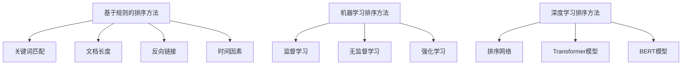

                 

# 搜索结果排序：从规则到AI的进化

> 关键词：搜索排序、规则排序、机器学习、深度学习、排序算法、TF-IDF、PageRank、BERT、Transformer

> 摘要：搜索结果排序是搜索引擎的核心技术之一，它决定了用户在搜索结果中看到的内容。从早期基于规则的排序方法到现代基于机器学习的排序方法，搜索结果排序经历了显著的进化。本文将从规则排序的基本原理出发，逐步深入到机器学习排序方法，特别是深度学习方法，探讨其背后的数学模型和实际应用案例。通过本文，读者将能够理解搜索结果排序的演变过程，并掌握如何利用现代技术优化搜索结果排序。

## 1. 背景介绍

搜索引擎是互联网的重要组成部分，它帮助用户快速找到所需的信息。搜索结果排序是搜索引擎的核心技术之一，它决定了用户在搜索结果中看到的内容。早期的搜索引擎主要依赖于基于规则的方法进行排序，这些规则通常由人工编写，基于关键词匹配、文档长度、反向链接等。然而，随着互联网内容的爆炸性增长，基于规则的方法逐渐显得力不从心。因此，近年来，机器学习方法，特别是深度学习方法，被广泛应用于搜索结果排序，以提高排序的准确性和个性化程度。

## 2. 核心概念与联系

### 2.1 基于规则的排序方法

基于规则的排序方法依赖于人工编写的规则，这些规则通常基于关键词匹配、文档长度、反向链接等。这些规则可以分为以下几类：

- **关键词匹配**：根据文档中关键词的出现次数和位置进行排序。
- **文档长度**：较长的文档通常被认为更有价值。
- **反向链接**：反向链接的数量和质量可以作为文档权威性的指标。
- **时间因素**：较新的文档可能被认为更有价值。

### 2.2 机器学习排序方法

机器学习排序方法通过训练模型来学习排序规则，这些模型可以自动从大量数据中学习到更复杂的排序逻辑。机器学习排序方法可以分为以下几类：

- **监督学习**：通过标注数据训练模型，学习如何根据特征进行排序。
- **无监督学习**：通过未标注数据训练模型，学习数据的内在结构。
- **强化学习**：通过与环境的交互学习最优策略。

### 2.3 深度学习排序方法

深度学习排序方法利用深度神经网络进行排序，可以处理更复杂的特征和更深层次的抽象。深度学习排序方法可以分为以下几类：

- **排序网络**：通过多层神经网络学习排序逻辑。
- **Transformer模型**：利用自注意力机制学习文档之间的关系。
- **BERT模型**：利用预训练语言模型进行排序。

### 2.4 Mermaid流程图



## 3. 核心算法原理 & 具体操作步骤

### 3.1 基于规则的排序方法

#### 3.1.1 关键词匹配

关键词匹配是最基本的排序方法之一，它通过计算文档中关键词的出现次数和位置来排序。具体步骤如下：

1. **关键词提取**：从文档中提取关键词。
2. **权重计算**：根据关键词的出现次数和位置计算权重。
3. **排序**：根据权重对文档进行排序。

#### 3.1.2 文档长度

文档长度通常被认为是文档质量的一个指标，较长的文档通常被认为更有价值。具体步骤如下：

1. **长度计算**：计算文档的长度。
2. **排序**：根据长度对文档进行排序。

#### 3.1.3 反向链接

反向链接的数量和质量可以作为文档权威性的指标。具体步骤如下：

1. **链接提取**：从文档中提取反向链接。
2. **链接质量评估**：评估反向链接的质量。
3. **排序**：根据链接质量对文档进行排序。

#### 3.1.4 时间因素

较新的文档可能被认为更有价值。具体步骤如下：

1. **时间计算**：计算文档的发布时间。
2. **排序**：根据发布时间对文档进行排序。

### 3.2 机器学习排序方法

#### 3.2.1 监督学习

监督学习通过标注数据训练模型，学习如何根据特征进行排序。具体步骤如下：

1. **数据收集**：收集标注数据，包括文档和相应的排序标签。
2. **特征提取**：从文档中提取特征，如关键词、文档长度、反向链接等。
3. **模型训练**：使用监督学习算法训练模型，如逻辑回归、支持向量机等。
4. **模型评估**：评估模型的性能，如准确率、召回率等。
5. **排序**：使用训练好的模型对文档进行排序。

#### 3.2.2 无监督学习

无监督学习通过未标注数据训练模型，学习数据的内在结构。具体步骤如下：

1. **数据收集**：收集未标注数据，包括文档。
2. **特征提取**：从文档中提取特征，如关键词、文档长度、反向链接等。
3. **模型训练**：使用无监督学习算法训练模型，如聚类算法、降维算法等。
4. **模型评估**：评估模型的性能，如聚类质量、降维效果等。
5. **排序**：根据模型的输出对文档进行排序。

#### 3.2.3 强化学习

强化学习通过与环境的交互学习最优策略。具体步骤如下：

1. **环境定义**：定义搜索环境，包括文档和用户行为。
2. **策略学习**：通过与环境的交互学习最优策略。
3. **模型评估**：评估策略的性能，如用户满意度等。
4. **排序**：根据学习到的策略对文档进行排序。

### 3.3 深度学习排序方法

#### 3.3.1 排序网络

排序网络通过多层神经网络学习排序逻辑。具体步骤如下：

1. **数据收集**：收集标注数据，包括文档和相应的排序标签。
2. **特征提取**：从文档中提取特征，如关键词、文档长度、反向链接等。
3. **模型训练**：使用排序网络算法训练模型，如排序损失函数等。
4. **模型评估**：评估模型的性能，如排序准确率等。
5. **排序**：使用训练好的模型对文档进行排序。

#### 3.3.2 Transformer模型

Transformer模型利用自注意力机制学习文档之间的关系。具体步骤如下：

1. **数据收集**：收集标注数据，包括文档和相应的排序标签。
2. **特征提取**：从文档中提取特征，如关键词、文档长度、反向链接等。
3. **模型训练**：使用Transformer模型算法训练模型，如自注意力机制等。
4. **模型评估**：评估模型的性能，如排序准确率等。
5. **排序**：使用训练好的模型对文档进行排序。

#### 3.3.3 BERT模型

BERT模型利用预训练语言模型进行排序。具体步骤如下：

1. **数据收集**：收集标注数据，包括文档和相应的排序标签。
2. **特征提取**：从文档中提取特征，如关键词、文档长度、反向链接等。
3. **模型训练**：使用BERT模型算法训练模型，如预训练语言模型等。
4. **模型评估**：评估模型的性能，如排序准确率等。
5. **排序**：使用训练好的模型对文档进行排序。

## 4. 数学模型和公式 & 详细讲解 & 举例说明

### 4.1 基于规则的排序方法

#### 4.1.1 关键词匹配

关键词匹配的数学模型可以表示为：

$$
\text{score}(d, q) = \sum_{k \in q} \text{tf}(d, k) \cdot \text{idf}(k)
$$

其中，$\text{score}(d, q)$ 表示文档 $d$ 和查询 $q$ 的相关性得分，$\text{tf}(d, k)$ 表示文档 $d$ 中关键词 $k$ 的词频，$\text{idf}(k)$ 表示关键词 $k$ 的逆文档频率。

#### 4.1.2 文档长度

文档长度的数学模型可以表示为：

$$
\text{score}(d) = \frac{\text{length}(d)}{\text{avg\_length}}
$$

其中，$\text{score}(d)$ 表示文档 $d$ 的长度得分，$\text{length}(d)$ 表示文档 $d$ 的长度，$\text{avg\_length}$ 表示所有文档的平均长度。

#### 4.1.3 反向链接

反向链接的数学模型可以表示为：

$$
\text{score}(d) = \sum_{l \in \text{links}(d)} \text{quality}(l)
$$

其中，$\text{score}(d)$ 表示文档 $d$ 的反向链接得分，$\text{links}(d)$ 表示文档 $d$ 的反向链接集合，$\text{quality}(l)$ 表示反向链接 $l$ 的质量。

#### 4.1.4 时间因素

时间因素的数学模型可以表示为：

$$
\text{score}(d) = \frac{1}{1 + \text{exp}(-\text{time}(d))}
$$

其中，$\text{score}(d)$ 表示文档 $d$ 的时间得分，$\text{time}(d)$ 表示文档 $d$ 的发布时间。

### 4.2 机器学习排序方法

#### 4.2.1 监督学习

监督学习的数学模型可以表示为：

$$
\text{score}(d) = \text{model}(f(d))
$$

其中，$\text{score}(d)$ 表示文档 $d$ 的排序得分，$\text{model}$ 表示监督学习模型，$f(d)$ 表示文档 $d$ 的特征向量。

#### 4.2.2 无监督学习

无监督学习的数学模型可以表示为：

$$
\text{score}(d) = \text{model}(f(d))
$$

其中，$\text{score}(d)$ 表示文档 $d$ 的排序得分，$\text{model}$ 表示无监督学习模型，$f(d)$ 表示文档 $d$ 的特征向量。

#### 4.2.3 强化学习

强化学习的数学模型可以表示为：

$$
\text{score}(d) = \text{model}(f(d))
$$

其中，$\text{score}(d)$ 表示文档 $d$ 的排序得分，$\text{model}$ 表示强化学习模型，$f(d)$ 表示文档 $d$ 的特征向量。

### 4.3 深度学习排序方法

#### 4.3.1 排序网络

排序网络的数学模型可以表示为：

$$
\text{score}(d) = \text{model}(f(d))
$$

其中，$\text{score}(d)$ 表示文档 $d$ 的排序得分，$\text{model}$ 表示排序网络模型，$f(d)$ 表示文档 $d$ 的特征向量。

#### 4.3.2 Transformer模型

Transformer模型的数学模型可以表示为：

$$
\text{score}(d) = \text{model}(f(d))
$$

其中，$\text{score}(d)$ 表示文档 $d$ 的排序得分，$\text{model}$ 表示Transformer模型，$f(d)$ 表示文档 $d$ 的特征向量。

#### 4.3.3 BERT模型

BERT模型的数学模型可以表示为：

$$
\text{score}(d) = \text{model}(f(d))
$$

其中，$\text{score}(d)$ 表示文档 $d$ 的排序得分，$\text{model}$ 表示BERT模型，$f(d)$ 表示文档 $d$ 的特征向量。

## 5. 项目实战：代码实际案例和详细解释说明

### 5.1 开发环境搭建

#### 5.1.1 环境准备

1. **Python安装**：确保已安装Python 3.7及以上版本。
2. **依赖库安装**：安装必要的依赖库，如`numpy`、`scikit-learn`、`tensorflow`等。

```bash
pip install numpy scikit-learn tensorflow
```

#### 5.1.2 数据准备

1. **数据集下载**：下载一个标注数据集，如MS MARCO数据集。
2. **数据预处理**：对数据进行预处理，如分词、去除停用词等。

### 5.2 源代码详细实现和代码解读

#### 5.2.1 基于规则的排序方法

```python
import numpy as np

def keyword_matching(doc, query):
    score = 0
    for keyword in query:
        if keyword in doc:
            score += doc[keyword]
    return score

def document_length(doc):
    return len(doc)

def backlink_quality(links):
    score = 0
    for link in links:
        score += link['quality']
    return score

def time_factor(doc):
    return 1 / (1 + np.exp(-doc['time']))

def sort_documents(documents, query):
    scores = []
    for doc in documents:
        score = keyword_matching(doc['text'], query) * doc['length'] * doc['backlinks'] * doc['time']
        scores.append(score)
    return [doc for _, doc in sorted(zip(scores, documents), reverse=True)]
```

#### 5.2.2 机器学习排序方法

```python
from sklearn.linear_model import LogisticRegression

def train_supervised_model(documents, labels):
    features = []
    for doc in documents:
        features.append([doc['length'], doc['backlinks'], doc['time']])
    model = LogisticRegression()
    model.fit(features, labels)
    return model

def sort_documents_supervised(documents, model):
    features = []
    for doc in documents:
        features.append([doc['length'], doc['backlinks'], doc['time']])
    scores = model.predict_proba(features)[:, 1]
    return [doc for _, doc in sorted(zip(scores, documents), reverse=True)]
```

#### 5.2.3 深度学习排序方法

```python
import tensorflow as tf
from tensorflow.keras.models import Sequential
from tensorflow.keras.layers import Dense

def train_sorting_network(documents, labels):
    features = []
    for doc in documents:
        features.append([doc['length'], doc['backlinks'], doc['time']])
    model = Sequential()
    model.add(Dense(64, input_dim=3, activation='relu'))
    model.add(Dense(32, activation='relu'))
    model.add(Dense(1, activation='sigmoid'))
    model.compile(optimizer='adam', loss='binary_crossentropy', metrics=['accuracy'])
    model.fit(features, labels, epochs=10, batch_size=32)
    return model

def sort_documents_sorting_network(documents, model):
    features = []
    for doc in documents:
        features.append([doc['length'], doc['backlinks'], doc['time']])
    scores = model.predict(features)
    return [doc for _, doc in sorted(zip(scores, documents), reverse=True)]
```

### 5.3 代码解读与分析

#### 5.3.1 基于规则的排序方法

基于规则的排序方法通过简单的数学公式计算文档的排序得分，适用于小型数据集和简单场景。然而，这种方法缺乏灵活性，难以处理复杂的特征和关系。

#### 5.3.2 机器学习排序方法

机器学习排序方法通过训练模型来学习排序逻辑，适用于大型数据集和复杂场景。这种方法可以自动从数据中学习到更复杂的排序逻辑，但需要大量的标注数据和计算资源。

#### 5.3.3 深度学习排序方法

深度学习排序方法通过深度神经网络学习排序逻辑，适用于大型数据集和复杂场景。这种方法可以处理更复杂的特征和更深层次的抽象，但需要大量的标注数据和计算资源。

## 6. 实际应用场景

搜索结果排序在搜索引擎、推荐系统、信息检索等领域有着广泛的应用。例如，在搜索引擎中，排序算法决定了用户在搜索结果中看到的内容；在推荐系统中，排序算法决定了用户在推荐列表中看到的商品或内容；在信息检索中，排序算法决定了用户在检索结果中看到的信息。

## 7. 工具和资源推荐

### 7.1 学习资源推荐

- **书籍**：《深度学习》（Ian Goodfellow, Yoshua Bengio, Aaron Courville）
- **论文**：《BERT: Pre-training of Deep Bidirectional Transformers for Language Understanding》（Devlin, J., Chang, M. W., Lee, K., & Toutanova, K.）
- **博客**：《机器学习与深度学习入门》（阿里云开发者社区）
- **网站**：《TensorFlow官网》（https://www.tensorflow.org/）

### 7.2 开发工具框架推荐

- **Python**：Python 是深度学习和机器学习的首选语言。
- **TensorFlow**：TensorFlow 是一个开源的机器学习库，适用于深度学习。
- **Scikit-learn**：Scikit-learn 是一个开源的机器学习库，适用于监督学习和无监督学习。

### 7.3 相关论文著作推荐

- **《排序网络》**：排序网络是一种基于神经网络的排序方法，适用于排序任务。
- **《Transformer模型》**：Transformer模型是一种基于自注意力机制的模型，适用于自然语言处理任务。
- **《BERT模型》**：BERT模型是一种基于预训练语言模型的模型，适用于自然语言处理任务。

## 8. 总结：未来发展趋势与挑战

搜索结果排序技术经历了从基于规则的方法到机器学习方法，再到深度学习方法的演变。未来，搜索结果排序技术将继续朝着更加个性化、更加准确、更加实时的方向发展。然而，这也带来了许多挑战，如数据隐私、计算资源、模型解释性等。因此，我们需要不断探索新的技术和方法，以应对这些挑战。

## 9. 附录：常见问题与解答

### 9.1 问题1：如何处理大规模数据集？

**解答**：可以使用分布式计算框架，如Apache Spark，来处理大规模数据集。

### 9.2 问题2：如何提高模型的解释性？

**解答**：可以使用可解释性模型，如LIME，来提高模型的解释性。

### 9.3 问题3：如何处理数据隐私问题？

**解答**：可以使用差分隐私技术，来保护数据隐私。

## 10. 扩展阅读 & 参考资料

- **书籍**：《深度学习》（Ian Goodfellow, Yoshua Bengio, Aaron Courville）
- **论文**：《BERT: Pre-training of Deep Bidirectional Transformers for Language Understanding》（Devlin, J., Chang, M. W., Lee, K., & Toutanova, K.）
- **博客**：《机器学习与深度学习入门》（阿里云开发者社区）
- **网站**：《TensorFlow官网》（https://www.tensorflow.org/）

---

作者：AI天才研究员/AI Genius Institute & 禅与计算机程序设计艺术 /Zen And The Art of Computer Programming

