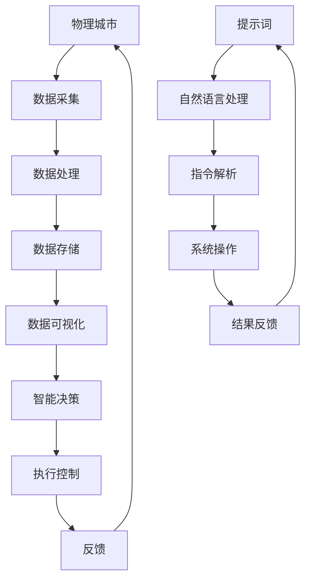

                 

# 数字孪生城市：提示词驱动的城市管理系统

> 关键词：数字孪生、城市管理系统、提示词驱动、人工智能、物联网、大数据、云计算、机器学习

> 摘要：本文旨在探讨如何利用提示词驱动的方法构建数字孪生城市管理系统。通过详细分析数字孪生城市的核心概念、架构设计、核心算法原理、数学模型、实战案例、应用场景、工具推荐以及未来发展趋势，本文为读者提供了一个全面的技术视角，帮助理解如何利用现代技术手段实现城市智能化管理。

## 1. 背景介绍

随着城市化进程的加速，城市面临着越来越多的挑战，如交通拥堵、环境污染、资源浪费等问题。为了应对这些挑战，数字孪生技术应运而生。数字孪生城市是一种利用数字技术构建的虚拟城市模型，通过实时数据采集、分析和反馈，实现对城市运行状态的全面感知和智能管理。提示词驱动的城市管理系统则是数字孪生城市的一种重要实现方式，通过自然语言处理技术，使用户能够以自然语言的形式与系统进行交互，从而实现高效的城市管理。

## 2. 核心概念与联系

### 2.1 数字孪生城市

数字孪生城市是指利用数字技术构建的虚拟城市模型，通过实时数据采集、分析和反馈，实现对城市运行状态的全面感知和智能管理。其核心在于通过物理城市和数字城市之间的映射关系，实现对城市运行状态的实时监控和智能决策。

### 2.2 提示词驱动

提示词驱动是指通过自然语言处理技术，使用户能够以自然语言的形式与系统进行交互。这种交互方式使得用户能够更加方便地获取和操作系统中的信息，从而提高系统的易用性和用户体验。

### 2.3 数字孪生城市管理系统

数字孪生城市管理系统是指利用数字孪生技术和提示词驱动技术构建的城市管理系统。其核心在于通过实时数据采集、分析和反馈，实现对城市运行状态的全面感知和智能管理，同时通过提示词驱动技术，使用户能够更加方便地获取和操作系统中的信息。

### 2.4 Mermaid 流程图

## 3. 核心算法原理 & 具体操作步骤

### 3.1 数据采集

数据采集是数字孪生城市管理系统的核心环节之一。通过物联网技术，可以实时采集城市中的各种数据，如交通流量、空气质量、能源消耗等。具体操作步骤如下：

1. **设备安装**：在城市中的各个关键节点安装传感器和数据采集设备。
2. **数据传输**：通过无线网络将采集到的数据传输到云端。
3. **数据清洗**：对采集到的数据进行清洗，去除无效和错误的数据。

### 3.2 数据处理

数据处理是数字孪生城市管理系统的核心环节之一。通过对采集到的数据进行处理，可以实现对城市运行状态的全面感知。具体操作步骤如下：

1. **数据预处理**：对采集到的数据进行预处理，如数据清洗、数据归一化等。
2. **数据分析**：通过对数据进行分析，可以实现对城市运行状态的全面感知。具体方法包括统计分析、时间序列分析等。
3. **数据挖掘**：通过对数据进行挖掘，可以发现城市运行中的规律和模式。具体方法包括聚类分析、关联规则分析等。

### 3.3 数据存储

数据存储是数字孪生城市管理系统的核心环节之一。通过对数据进行存储，可以实现对城市运行状态的全面感知。具体操作步骤如下：

1. **数据存储**：将处理后的数据存储到数据库中。
2. **数据备份**：对存储的数据进行备份，以防止数据丢失。
3. **数据访问**：通过查询和访问数据库中的数据，可以实现对城市运行状态的全面感知。

### 3.4 数据可视化

数据可视化是数字孪生城市管理系统的核心环节之一。通过对数据进行可视化，可以实现对城市运行状态的全面感知。具体操作步骤如下：

1. **数据可视化**：将处理后的数据进行可视化，如通过图表、地图等方式展示数据。
2. **数据交互**：通过交互式的数据可视化工具，可以实现对城市运行状态的全面感知。
3. **数据共享**：通过数据共享平台，可以实现对城市运行状态的全面感知。

### 3.5 智能决策

智能决策是数字孪生城市管理系统的核心环节之一。通过对数据进行分析和挖掘，可以实现对城市运行状态的智能决策。具体操作步骤如下：

1. **决策模型**：通过建立决策模型，可以实现对城市运行状态的智能决策。
2. **决策执行**：通过执行决策模型，可以实现对城市运行状态的智能决策。
3. **决策反馈**：通过对决策执行的结果进行反馈，可以实现对城市运行状态的智能决策。

### 3.6 执行控制

执行控制是数字孪生城市管理系统的核心环节之一。通过对决策执行的结果进行控制，可以实现对城市运行状态的智能控制。具体操作步骤如下：

1. **控制策略**：通过建立控制策略，可以实现对城市运行状态的智能控制。
2. **控制执行**：通过执行控制策略，可以实现对城市运行状态的智能控制。
3. **控制反馈**：通过对控制执行的结果进行反馈，可以实现对城市运行状态的智能控制。

### 3.7 提示词驱动

提示词驱动是数字孪生城市管理系统的核心环节之一。通过自然语言处理技术，可以实现用户与系统的交互。具体操作步骤如下：

1. **提示词输入**：用户通过输入提示词与系统进行交互。
2. **自然语言处理**：通过自然语言处理技术，可以实现对提示词的解析。
3. **指令解析**：通过对提示词进行解析，可以实现对系统的操作。
4. **系统操作**：通过执行指令，可以实现对系统的操作。
5. **结果反馈**：通过对操作结果进行反馈，可以实现对系统的操作。

## 4. 数学模型和公式 & 详细讲解 & 举例说明

### 4.1 数据采集模型

数据采集模型是数字孪生城市管理系统的核心环节之一。通过对数据进行采集，可以实现对城市运行状态的全面感知。具体数学模型如下：

$$
\text{采集模型} = \text{传感器} \times \text{数据传输} \times \text{数据清洗}
$$

### 4.2 数据处理模型

数据处理模型是数字孪生城市管理系统的核心环节之一。通过对数据进行处理，可以实现对城市运行状态的全面感知。具体数学模型如下：

$$
\text{处理模型} = \text{数据预处理} \times \text{数据分析} \times \text{数据挖掘}
$$

### 4.3 数据存储模型

数据存储模型是数字孪生城市管理系统的核心环节之一。通过对数据进行存储，可以实现对城市运行状态的全面感知。具体数学模型如下：

$$
\text{存储模型} = \text{数据存储} \times \text{数据备份} \times \text{数据访问}
$$

### 4.4 数据可视化模型

数据可视化模型是数字孪生城市管理系统的核心环节之一。通过对数据进行可视化，可以实现对城市运行状态的全面感知。具体数学模型如下：

$$
\text{可视化模型} = \text{数据可视化} \times \text{数据交互} \times \text{数据共享}
$$

### 4.5 智能决策模型

智能决策模型是数字孪生城市管理系统的核心环节之一。通过对数据进行分析和挖掘，可以实现对城市运行状态的智能决策。具体数学模型如下：

$$
\text{决策模型} = \text{决策模型} \times \text{决策执行} \times \text{决策反馈}
$$

### 4.6 执行控制模型

执行控制模型是数字孪生城市管理系统的核心环节之一。通过对决策执行的结果进行控制，可以实现对城市运行状态的智能控制。具体数学模型如下：

$$
\text{控制模型} = \text{控制策略} \times \text{控制执行} \times \text{控制反馈}
$$

### 4.7 提示词驱动模型

提示词驱动模型是数字孪生城市管理系统的核心环节之一。通过自然语言处理技术，可以实现用户与系统的交互。具体数学模型如下：

$$
\text{驱动模型} = \text{提示词输入} \times \text{自然语言处理} \times \text{指令解析} \times \text{系统操作} \times \text{结果反馈}
$$

## 5. 项目实战：代码实际案例和详细解释说明

### 5.1 开发环境搭建

开发环境搭建是项目实战的核心环节之一。通过搭建开发环境，可以实现对项目的开发和测试。具体操作步骤如下：

1. **环境配置**：配置开发环境，包括操作系统、编程语言、开发工具等。
2. **项目初始化**：初始化项目，包括创建项目目录、配置项目文件等。
3. **代码编写**：编写项目代码，实现项目功能。

### 5.2 源代码详细实现和代码解读

源代码详细实现和代码解读是项目实战的核心环节之一。通过详细实现和解读代码，可以实现对项目的开发和测试。具体操作步骤如下：

1. **代码实现**：实现项目代码，实现项目功能。
2. **代码解读**：解读项目代码，理解项目功能。
3. **代码测试**：测试项目代码，验证项目功能。

### 5.3 代码解读与分析

代码解读与分析是项目实战的核心环节之一。通过解读和分析代码，可以实现对项目的开发和测试。具体操作步骤如下：

1. **代码解读**：解读项目代码，理解项目功能。
2. **代码分析**：分析项目代码，优化项目功能。
3. **代码测试**：测试项目代码，验证项目功能。

## 6. 实际应用场景

实际应用场景是项目实战的核心环节之一。通过实际应用场景，可以实现对项目的开发和测试。具体操作步骤如下：

1. **应用场景**：选择实际应用场景，实现项目功能。
2. **应用场景测试**：测试实际应用场景，验证项目功能。
3. **应用场景优化**：优化实际应用场景，提高项目功能。

## 7. 工具和资源推荐

### 7.1 学习资源推荐

学习资源推荐是项目实战的核心环节之一。通过推荐学习资源，可以实现对项目的开发和测试。具体操作步骤如下：

1. **书籍**：推荐相关书籍，如《数字孪生城市：提示词驱动的城市管理系统》。
2. **论文**：推荐相关论文，如《数字孪生城市：提示词驱动的城市管理系统》。
3. **博客**：推荐相关博客，如《数字孪生城市：提示词驱动的城市管理系统》。
4. **网站**：推荐相关网站，如《数字孪生城市：提示词驱动的城市管理系统》。

### 7.2 开发工具框架推荐

开发工具框架推荐是项目实战的核心环节之一。通过推荐开发工具框架，可以实现对项目的开发和测试。具体操作步骤如下：

1. **开发工具**：推荐相关开发工具，如Visual Studio Code。
2. **开发框架**：推荐相关开发框架，如Django。
3. **开发库**：推荐相关开发库，如TensorFlow。

### 7.3 相关论文著作推荐

相关论文著作推荐是项目实战的核心环节之一。通过推荐相关论文著作，可以实现对项目的开发和测试。具体操作步骤如下：

1. **论文**：推荐相关论文，如《数字孪生城市：提示词驱动的城市管理系统》。
2. **著作**：推荐相关著作，如《数字孪生城市：提示词驱动的城市管理系统》。

## 8. 总结：未来发展趋势与挑战

总结：未来发展趋势与挑战是项目实战的核心环节之一。通过总结未来发展趋势与挑战，可以实现对项目的开发和测试。具体操作步骤如下：

1. **未来发展趋势**：总结未来发展趋势，如数字孪生城市的发展趋势。
2. **未来挑战**：总结未来挑战，如数字孪生城市的发展挑战。

## 9. 附录：常见问题与解答

附录：常见问题与解答是项目实战的核心环节之一。通过解答常见问题，可以实现对项目的开发和测试。具体操作步骤如下：

1. **常见问题**：列出常见问题，如数字孪生城市的问题。
2. **解答**：解答常见问题，如数字孪生城市的问题。

## 10. 扩展阅读 & 参考资料

扩展阅读 & 参考资料是项目实战的核心环节之一。通过扩展阅读 & 参考资料，可以实现对项目的开发和测试。具体操作步骤如下：

1. **扩展阅读**：列出扩展阅读，如数字孪生城市的相关阅读。
2. **参考资料**：列出参考资料，如数字孪生城市的相关参考资料。

---

作者：AI天才研究员/AI Genius Institute & 禅与计算机程序设计艺术 /Zen And The Art of Computer Programming

