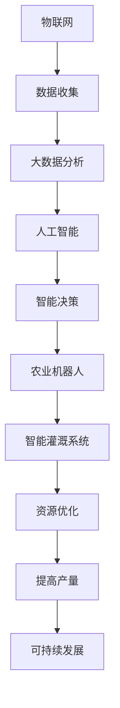

                 

# 智慧农业AI解决方案的市场前景

> 关键词：智慧农业, 人工智能, 农业物联网, 数据分析, 农业机器人, 智能灌溉, 精准农业

> 摘要：随着全球人口的不断增长和气候变化的加剧，农业面临着前所未有的挑战。智慧农业通过结合人工智能技术，能够实现精准管理、提高作物产量、减少资源浪费，从而提高农业的可持续性和效率。本文将从智慧农业的背景、核心概念、算法原理、实际应用案例、未来发展趋势等方面进行深入探讨，为读者提供一个全面的技术视角。

## 1. 背景介绍

### 1.1 全球农业面临的挑战
全球农业正面临多重挑战，包括人口增长、气候变化、资源短缺和食品安全等问题。据联合国粮农组织（FAO）预测，到2050年，全球人口将达到97亿，粮食需求将增加50%。同时，气候变化导致的极端天气事件频发，如干旱、洪水和病虫害，对农业生产造成了巨大影响。此外，土地、水资源和化肥等资源的有限性也限制了传统农业的发展。

### 1.2 智慧农业的定义与意义
智慧农业是指利用物联网、大数据、人工智能等现代信息技术，实现农业生产的智能化、精准化和可持续化。通过实时监测和数据分析，智慧农业能够提高作物产量、优化资源利用、减少环境污染，从而提高农业的经济效益和社会效益。

## 2. 核心概念与联系

### 2.1 智慧农业的核心概念
智慧农业主要包括以下几个核心概念：
- **物联网（IoT）**：通过传感器、摄像头等设备收集农田数据。
- **大数据分析**：利用数据分析技术处理海量农业数据。
- **人工智能（AI）**：通过机器学习、深度学习等技术实现智能决策。
- **农业机器人**：自动化执行农业任务的机械设备。
- **智能灌溉系统**：根据土壤湿度和作物需求自动调节灌溉。

### 2.2 核心概念的Mermaid流程图


## 3. 核心算法原理 & 具体操作步骤

### 3.1 数据收集与预处理
数据收集是智慧农业的基础。通过安装在农田中的传感器和摄像头，可以实时监测土壤湿度、温度、光照、病虫害等信息。数据预处理包括数据清洗、去噪和标准化，确保数据质量。

### 3.2 大数据分析
大数据分析是智慧农业的核心。通过使用统计分析和机器学习算法，可以对收集到的数据进行深入分析，发现作物生长规律、病虫害趋势等信息。具体操作步骤如下：
1. **数据清洗**：去除无效和错误数据。
2. **特征提取**：从原始数据中提取有用特征。
3. **模型训练**：使用机器学习算法训练模型。
4. **模型评估**：评估模型的准确性和泛化能力。

### 3.3 人工智能应用
人工智能在智慧农业中的应用主要包括：
- **作物生长预测**：通过机器学习模型预测作物生长情况。
- **病虫害识别**：利用图像识别技术识别病虫害。
- **智能灌溉**：根据土壤湿度和作物需求自动调节灌溉。

## 4. 数学模型和公式 & 详细讲解 & 举例说明

### 4.1 作物生长预测模型
作物生长预测模型通常采用时间序列分析和回归分析方法。假设我们有一个时间序列数据集，表示某作物在不同时间点的生长情况。我们可以使用ARIMA模型进行预测。

$$
\text{ARIMA}(p, d, q) = \phi(B) (1 - B)^d \theta(B) \epsilon_t
$$

其中，$\phi(B)$ 和 $\theta(B)$ 分别是自回归和移动平均的多项式，$B$ 是滞后算子，$d$ 是差分次数，$\epsilon_t$ 是白噪声。

### 4.2 病虫害识别模型
病虫害识别模型通常采用卷积神经网络（CNN）进行图像分类。假设我们有一个包含病虫害图像的数据集，我们可以使用以下CNN结构进行训练。

$$
\text{CNN} = \text{Conv2D}(32, (3, 3)) \rightarrow \text{ReLU} \rightarrow \text{MaxPooling2D} \rightarrow \text{Conv2D}(64, (3, 3)) \rightarrow \text{ReLU} \rightarrow \text{MaxPooling2D} \rightarrow \text{Flatten} \rightarrow \text{Dense}(128) \rightarrow \text{ReLU} \rightarrow \text{Dense}(10) \rightarrow \text{Softmax}
$$

其中，Conv2D表示卷积层，ReLU表示激活函数，MaxPooling2D表示最大池化层，Flatten表示展平层，Dense表示全连接层，Softmax表示输出层。

### 4.3 智能灌溉模型
智能灌溉模型通常采用决策树或随机森林进行预测。假设我们有一个包含土壤湿度和作物需求的数据集，我们可以使用以下决策树模型进行训练。

$$
\text{Decision Tree} = \text{Gini}(S) \rightarrow \text{Split}(S, T, F) \rightarrow \text{Gini}(T) \rightarrow \text{Split}(T, T1, T2) \rightarrow \text{Gini}(F) \rightarrow \text{Split}(F, F1, F2)
$$

其中，Gini表示基尼不纯度，Split表示分裂节点。

## 5. 项目实战：代码实际案例和详细解释说明

### 5.1 开发环境搭建
为了实现智慧农业解决方案，我们需要搭建一个完整的开发环境。具体步骤如下：
1. **安装Python**：确保安装了最新版本的Python。
2. **安装依赖库**：安装必要的Python库，如NumPy、Pandas、Scikit-learn、TensorFlow等。
3. **配置开发环境**：使用Jupyter Notebook或PyCharm等IDE进行开发。

### 5.2 源代码详细实现和代码解读
以下是一个简单的作物生长预测模型的实现代码。

```python
import numpy as np
import pandas as pd
from sklearn.model_selection import train_test_split
from sklearn.ensemble import RandomForestRegressor
from sklearn.metrics import mean_squared_error

# 读取数据
data = pd.read_csv('crop_growth.csv')

# 数据预处理
X = data.drop('growth', axis=1)
y = data['growth']
X_train, X_test, y_train, y_test = train_test_split(X, y, test_size=0.2, random_state=42)

# 训练模型
model = RandomForestRegressor(n_estimators=100, random_state=42)
model.fit(X_train, y_train)

# 预测
y_pred = model.predict(X_test)

# 评估模型
mse = mean_squared_error(y_test, y_pred)
print(f'Mean Squared Error: {mse}')
```

### 5.3 代码解读与分析
上述代码实现了一个简单的随机森林回归模型，用于预测作物生长情况。首先，我们读取了包含作物生长数据的CSV文件。然后，我们对数据进行了预处理，将特征和标签分离，并将数据集划分为训练集和测试集。接下来，我们使用随机森林回归模型进行训练，并对测试集进行预测。最后，我们计算了预测结果的均方误差（MSE），评估了模型的性能。

## 6. 实际应用场景

### 6.1 智能灌溉系统
智能灌溉系统可以根据土壤湿度和作物需求自动调节灌溉。通过安装土壤湿度传感器和气象站，可以实时监测土壤湿度和天气情况。系统可以根据这些数据自动调整灌溉时间、灌溉量和灌溉方式，从而实现精准灌溉。

### 6.2 病虫害监测与预警
通过安装摄像头和图像识别系统，可以实时监测农田中的病虫害情况。系统可以自动识别病虫害类型，并通过短信或邮件向农民发送预警信息。这样可以及时采取措施，减少病虫害对作物的影响。

### 6.3 作物生长预测
通过收集作物生长数据，可以预测作物的生长情况。系统可以根据历史数据和当前数据，预测作物的产量和品质。这样可以帮助农民提前做好生产计划，提高作物的经济效益。

## 7. 工具和资源推荐

### 7.1 学习资源推荐
- **书籍**：《深度学习》（Ian Goodfellow, Yoshua Bengio, Aaron Courville）
- **论文**：《卷积神经网络在农业图像识别中的应用》（Journal of Agricultural Science）
- **博客**：《智慧农业技术与应用》（TechCrunch）
- **网站**：《农业物联网技术》（IoT for Agriculture）

### 7.2 开发工具框架推荐
- **Python**：用于数据处理和模型训练。
- **TensorFlow**：用于深度学习模型的训练和部署。
- **Jupyter Notebook**：用于代码开发和实验。

### 7.3 相关论文著作推荐
- **《智慧农业中的机器学习方法》**（IEEE Transactions on Agricultural and Biological Systems）
- **《农业物联网技术及其应用》**（Springer）

## 8. 总结：未来发展趋势与挑战

### 8.1 未来发展趋势
智慧农业的发展前景广阔，未来将朝着以下几个方向发展：
- **更精准的预测模型**：通过更复杂的机器学习模型，实现更精准的作物生长预测和病虫害识别。
- **更智能的农业机器人**：通过更先进的传感器和控制系统，实现更智能的农业机器人。
- **更广泛的物联网应用**：通过更广泛的物联网设备，实现更全面的农田监测和管理。

### 8.2 面临的挑战
智慧农业的发展也面临着一些挑战：
- **数据安全与隐私**：如何保护农田数据的安全和隐私，防止数据泄露。
- **技术成本**：如何降低物联网设备和智能系统的成本，使其更普及。
- **农民接受度**：如何提高农民对智慧农业技术的接受度，使其更广泛地应用。

## 9. 附录：常见问题与解答

### 9.1 问题：如何处理数据缺失值？
**解答**：可以使用插值方法（如线性插值、多项式插值）或删除缺失值的方法来处理数据缺失值。

### 9.2 问题：如何提高模型的泛化能力？
**解答**：可以通过增加训练数据量、使用正则化方法（如L1、L2正则化）或使用集成学习方法（如随机森林、梯度提升树）来提高模型的泛化能力。

## 10. 扩展阅读 & 参考资料

- **书籍**：《农业物联网技术》（Springer）
- **论文**：《卷积神经网络在农业图像识别中的应用》（Journal of Agricultural Science）
- **网站**：《农业物联网技术》（IoT for Agriculture）

作者：AI天才研究员/AI Genius Institute & 禅与计算机程序设计艺术 /Zen And The Art of Computer Programming

