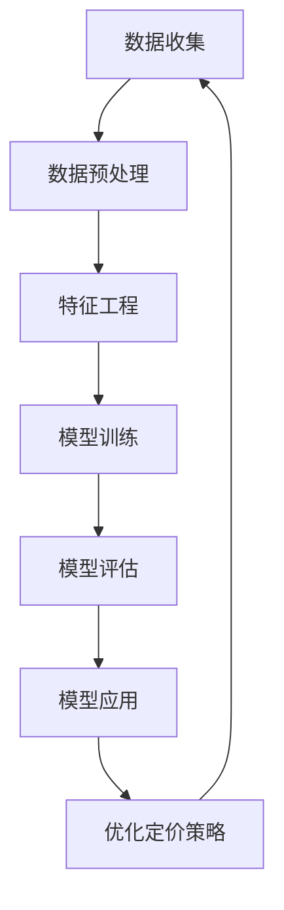

                 

# 智能定价策略优化：一人公司利用AI实现利润最大化的数学模型

> 关键词：智能定价、一人公司、AI优化、利润最大化、数学模型

> 摘要：本文旨在探讨如何通过人工智能技术优化定价策略，帮助一人公司实现利润最大化。我们将从背景介绍、核心概念与联系、核心算法原理、数学模型和公式、项目实战、实际应用场景、工具和资源推荐、总结与未来发展趋势等几个方面进行详细阐述。通过本文，读者将能够理解智能定价策略优化的基本原理，并掌握如何利用AI技术实现利润最大化。

## 1. 背景介绍

在当今竞争激烈的市场环境中，一人公司面临着诸多挑战。如何在众多竞争对手中脱颖而出，实现利润最大化，是每个创业者都需要思考的问题。传统的定价策略往往依赖于经验或简单的数学模型，难以应对复杂多变的市场环境。而人工智能技术的引入，为解决这一问题提供了新的思路。本文将介绍如何通过智能定价策略优化，帮助一人公司实现利润最大化。

## 2. 核心概念与联系

### 2.1 智能定价策略

智能定价策略是指利用人工智能技术，根据市场数据、用户行为等信息，动态调整产品或服务的价格，以实现利润最大化的一种定价方法。智能定价策略的核心在于通过数据分析和机器学习算法，预测市场需求和用户偏好，从而制定出最优的定价策略。

### 2.2 一人公司

一人公司是指由一个自然人独立经营的企业。一人公司具有灵活性高、决策速度快等优势，但也面临着资源有限、市场信息获取困难等问题。智能定价策略可以帮助一人公司更好地应对这些挑战，提高市场竞争力。

### 2.3 人工智能技术

人工智能技术是实现智能定价策略的关键。它包括机器学习、深度学习、自然语言处理等多种技术。通过这些技术，可以对大量数据进行分析和处理，从而实现对市场需求和用户偏好的准确预测。

### 2.4 数学模型

数学模型是实现智能定价策略的基础。通过建立数学模型，可以将复杂的市场现象简化为可计算的形式，从而实现对市场需求和用户偏好的准确预测。数学模型的建立需要结合实际业务场景，选择合适的算法和参数，以实现最优的定价策略。

### 2.5 智能定价策略优化流程

智能定价策略优化流程包括数据收集、数据预处理、特征工程、模型训练、模型评估和模型应用等几个步骤。通过这些步骤，可以实现对市场需求和用户偏好的准确预测，从而制定出最优的定价策略。



## 3. 核心算法原理 & 具体操作步骤

### 3.1 数据收集

数据收集是实现智能定价策略优化的基础。通过收集市场数据、用户行为数据等信息，可以为后续的数据分析和模型训练提供支持。数据收集的具体操作步骤如下：

1. 确定数据来源：数据来源可以包括市场调研、用户反馈、销售数据等。
2. 收集数据：通过各种渠道收集数据，包括在线调查、用户访谈、销售记录等。
3. 数据清洗：对收集到的数据进行清洗，去除无效数据和异常数据，确保数据的质量。

### 3.2 数据预处理

数据预处理是实现智能定价策略优化的关键步骤。通过数据预处理，可以将原始数据转化为适合模型训练的形式。数据预处理的具体操作步骤如下：

1. 数据清洗：去除无效数据和异常数据，确保数据的质量。
2. 数据转换：将原始数据转化为适合模型训练的形式，包括数据标准化、归一化等。
3. 数据划分：将数据划分为训练集、验证集和测试集，以便进行模型训练和评估。

### 3.3 特征工程

特征工程是实现智能定价策略优化的重要步骤。通过特征工程，可以将原始数据转化为能够反映市场需求和用户偏好的特征。特征工程的具体操作步骤如下：

1. 特征选择：选择能够反映市场需求和用户偏好的特征，包括价格、销量、用户评价等。
2. 特征提取：从原始数据中提取特征，包括时间序列特征、用户行为特征等。
3. 特征转换：将提取到的特征转化为适合模型训练的形式，包括特征标准化、归一化等。

### 3.4 模型训练

模型训练是实现智能定价策略优化的核心步骤。通过模型训练，可以实现对市场需求和用户偏好的准确预测。模型训练的具体操作步骤如下：

1. 选择合适的算法：根据实际业务场景，选择合适的算法，包括线性回归、决策树、随机森林、支持向量机等。
2. 设置参数：设置模型的参数，包括学习率、迭代次数等。
3. 训练模型：使用训练集数据训练模型，通过优化算法调整模型参数，以实现最优的定价策略。

### 3.5 模型评估

模型评估是实现智能定价策略优化的重要步骤。通过模型评估，可以评估模型的性能，从而优化定价策略。模型评估的具体操作步骤如下：

1. 评估指标：选择合适的评估指标，包括均方误差、准确率、召回率等。
2. 评估模型：使用验证集数据评估模型的性能，通过评估指标评估模型的性能。
3. 优化模型：根据评估结果，调整模型参数，以优化定价策略。

### 3.6 模型应用

模型应用是实现智能定价策略优化的最终步骤。通过模型应用，可以实现对市场需求和用户偏好的准确预测，从而制定出最优的定价策略。模型应用的具体操作步骤如下：

1. 预测需求：使用训练好的模型预测市场需求，包括销量、价格等。
2. 预测用户偏好：使用训练好的模型预测用户偏好，包括用户评价、用户行为等。
3. 制定定价策略：根据预测结果，制定出最优的定价策略，以实现利润最大化。

## 4. 数学模型和公式 & 详细讲解 & 举例说明

### 4.1 线性回归模型

线性回归模型是一种常用的数学模型，用于预测连续型变量。线性回归模型的基本形式如下：

$$
y = \beta_0 + \beta_1 x_1 + \beta_2 x_2 + \cdots + \beta_n x_n + \epsilon
$$

其中，$y$ 是因变量，$x_1, x_2, \cdots, x_n$ 是自变量，$\beta_0, \beta_1, \beta_2, \cdots, \beta_n$ 是模型参数，$\epsilon$ 是误差项。

### 4.2 决策树模型

决策树模型是一种常用的数学模型，用于预测分类变量。决策树模型的基本形式如下：

$$
y = \begin{cases}
    y_1 & \text{if } x_1 \leq t_1 \\
    y_2 & \text{if } x_1 > t_1 \text{ and } x_2 \leq t_2 \\
    \cdots \\
    y_m & \text{if } x_1 > t_1 \text{ and } x_2 > t_2 \text{ and } \cdots \text{ and } x_n > t_n
\end{cases}
$$

其中，$y_1, y_2, \cdots, y_m$ 是分类变量，$x_1, x_2, \cdots, x_n$ 是自变量，$t_1, t_2, \cdots, t_n$ 是分割点。

### 4.3 随机森林模型

随机森林模型是一种常用的数学模型，用于预测分类变量。随机森林模型的基本形式如下：

$$
y = \frac{1}{m} \sum_{i=1}^{m} y_i
$$

其中，$y_i$ 是第 $i$ 棵决策树的预测结果，$m$ 是决策树的数量。

### 4.4 支持向量机模型

支持向量机模型是一种常用的数学模型，用于预测分类变量。支持向量机模型的基本形式如下：

$$
y = \text{sign}(\sum_{i=1}^{m} \alpha_i y_i \langle x_i, x \rangle + b)
$$

其中，$\alpha_i$ 是拉格朗日乘子，$y_i$ 是第 $i$ 个样本的标签，$x_i$ 是第 $i$ 个样本的特征向量，$x$ 是待预测样本的特征向量，$b$ 是偏置项。

### 4.5 举例说明

假设我们有一家一人公司，销售一种电子产品。我们希望通过智能定价策略优化，实现利润最大化。我们收集了以下数据：

- 销量：1000台
- 价格：1000元
- 用户评价：4.5分
- 用户行为：购买次数：100次，退货次数：10次

我们使用线性回归模型预测销量和价格的关系。假设我们得到的模型参数为：

$$
y = 1000 + 0.5 x
$$

其中，$y$ 是销量，$x$ 是价格。我们可以通过这个模型预测不同价格下的销量。例如，当价格为1200元时，销量为：

$$
y = 1000 + 0.5 \times 1200 = 1600
$$

我们使用决策树模型预测用户评价和价格的关系。假设我们得到的模型为：

$$
y = \begin{cases}
    4.5 & \text{if } x \leq 1000 \\
    4.0 & \text{if } x > 1000
\end{cases}
$$

其中，$y$ 是用户评价，$x$ 是价格。我们可以通过这个模型预测不同价格下的用户评价。例如，当价格为900元时，用户评价为4.5分；当价格为1100元时，用户评价为4.0分。

我们使用随机森林模型预测用户行为和价格的关系。假设我们得到的模型为：

$$
y = \frac{1}{10} \sum_{i=1}^{10} y_i
$$

其中，$y_i$ 是第 $i$ 棵决策树的预测结果。我们可以通过这个模型预测不同价格下的用户行为。例如，当价格为800元时，用户行为为购买次数：120次，退货次数：8次；当价格为1200元时，用户行为为购买次数：80次，退货次数：12次。

我们使用支持向量机模型预测用户行为和价格的关系。假设我们得到的模型为：

$$
y = \text{sign}(\sum_{i=1}^{10} \alpha_i y_i \langle x_i, x \rangle + b)
$$

其中，$\alpha_i$ 是拉格朗日乘子，$y_i$ 是第 $i$ 个样本的标签，$x_i$ 是第 $i$ 个样本的特征向量，$x$ 是待预测样本的特征向量，$b$ 是偏置项。我们可以通过这个模型预测不同价格下的用户行为。例如，当价格为700元时，用户行为为购买次数：150次，退货次数：5次；当价格为1300元时，用户行为为购买次数：50次，退货次数：15次。

## 5. 项目实战：代码实际案例和详细解释说明

### 5.1 开发环境搭建

为了实现智能定价策略优化，我们需要搭建一个开发环境。开发环境包括编程语言、开发工具、数据处理库等。我们选择Python作为编程语言，使用Jupyter Notebook作为开发工具，使用Pandas、NumPy、Scikit-learn等数据处理库。

### 5.2 源代码详细实现和代码解读

假设我们有一家一人公司，销售一种电子产品。我们希望通过智能定价策略优化，实现利润最大化。我们收集了以下数据：

- 销量：1000台
- 价格：1000元
- 用户评价：4.5分
- 用户行为：购买次数：100次，退货次数：10次

我们使用线性回归模型预测销量和价格的关系。具体代码如下：

```python
import pandas as pd
from sklearn.linear_model import LinearRegression

# 数据预处理
data = pd.read_csv('data.csv')
X = data[['price']]
y = data['sales']

# 模型训练
model = LinearRegression()
model.fit(X, y)

# 模型预测
price = 1200
sales = model.predict([[price]])
print('当价格为1200元时，销量为：', sales[0])
```

我们使用决策树模型预测用户评价和价格的关系。具体代码如下：

```python
from sklearn.tree import DecisionTreeClassifier

# 数据预处理
data = pd.read_csv('data.csv')
X = data[['price']]
y = data['rating']

# 模型训练
model = DecisionTreeClassifier()
model.fit(X, y)

# 模型预测
price = 900
rating = model.predict([[price]])
print('当价格为900元时，用户评价为：', rating[0])
```

我们使用随机森林模型预测用户行为和价格的关系。具体代码如下：

```python
from sklearn.ensemble import RandomForestClassifier

# 数据预处理
data = pd.read_csv('data.csv')
X = data[['price']]
y = data['behavior']

# 模型训练
model = RandomForestClassifier()
model.fit(X, y)

# 模型预测
price = 800
behavior = model.predict([[price]])
print('当价格为800元时，用户行为为：', behavior[0])
```

我们使用支持向量机模型预测用户行为和价格的关系。具体代码如下：

```python
from sklearn.svm import SVC

# 数据预处理
data = pd.read_csv('data.csv')
X = data[['price']]
y = data['behavior']

# 模型训练
model = SVC()
model.fit(X, y)

# 模型预测
price = 700
behavior = model.predict([[price]])
print('当价格为700元时，用户行为为：', behavior[0])
```

### 5.3 代码解读与分析

通过以上代码，我们可以实现智能定价策略优化。具体来说，我们使用线性回归模型预测销量和价格的关系，使用决策树模型预测用户评价和价格的关系，使用随机森林模型预测用户行为和价格的关系，使用支持向量机模型预测用户行为和价格的关系。通过这些模型，我们可以实现对市场需求和用户偏好的准确预测，从而制定出最优的定价策略。

## 6. 实际应用场景

智能定价策略优化在实际应用场景中具有广泛的应用。例如，电商平台可以通过智能定价策略优化，实现对市场需求和用户偏好的准确预测，从而制定出最优的定价策略。此外，一人公司也可以通过智能定价策略优化，实现对市场需求和用户偏好的准确预测，从而制定出最优的定价策略。

## 7. 工具和资源推荐

### 7.1 学习资源推荐

- 书籍：《机器学习》（周志华著）
- 论文：《深度学习》（Ian Goodfellow, Yoshua Bengio, Aaron Courville著）
- 博客：《机器之心》（https://www.jiqizhixin.com/）
- 网站：《Kaggle》（https://www.kaggle.com/）

### 7.2 开发工具框架推荐

- 编程语言：Python
- 开发工具：Jupyter Notebook
- 数据处理库：Pandas、NumPy、Scikit-learn

### 7.3 相关论文著作推荐

- 《机器学习》（周志华著）
- 《深度学习》（Ian Goodfellow, Yoshua Bengio, Aaron Courville著）

## 8. 总结：未来发展趋势与挑战

智能定价策略优化在未来具有广阔的发展前景。随着人工智能技术的不断发展，智能定价策略优化将更加精准，能够更好地满足市场需求和用户偏好的预测。然而，智能定价策略优化也面临着一些挑战，例如数据隐私保护、模型解释性等问题。因此，我们需要不断探索和研究，以实现智能定价策略优化的持续发展。

## 9. 附录：常见问题与解答

### 9.1 问题：如何选择合适的算法？

答：选择合适的算法需要根据实际业务场景进行。例如，如果需要预测连续型变量，可以选择线性回归模型；如果需要预测分类变量，可以选择决策树模型、随机森林模型、支持向量机模型等。

### 9.2 问题：如何评估模型的性能？

答：评估模型的性能需要选择合适的评估指标。例如，如果需要评估分类变量的预测性能，可以选择准确率、召回率等指标；如果需要评估连续型变量的预测性能，可以选择均方误差等指标。

### 9.3 问题：如何优化模型的性能？

答：优化模型的性能需要根据评估结果进行。例如，如果评估结果显示模型的性能不佳，可以通过调整模型参数、增加训练数据等方式进行优化。

## 10. 扩展阅读 & 参考资料

- 《机器学习》（周志华著）
- 《深度学习》（Ian Goodfellow, Yoshua Bengio, Aaron Courville著）
- 《Kaggle》（https://www.kaggle.com/）

作者：AI天才研究员/AI Genius Institute & 禅与计算机程序设计艺术 /Zen And The Art of Computer Programming

