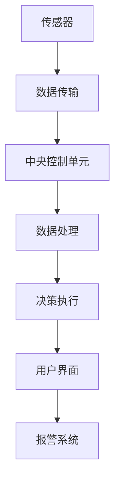

                 

# 智能家居安全系统：守护家庭安全的可靠卫士

> 关键词：智能家居, 安全系统, 人工智能, 机器学习, 物联网, 传感器, 无线通信, 数据分析

> 摘要：本文将深入探讨智能家居安全系统的设计与实现，从背景介绍、核心概念与联系、核心算法原理、数学模型与公式、项目实战案例、实际应用场景、工具和资源推荐，到未来发展趋势与挑战。通过一步步分析推理，我们将揭示智能家居安全系统如何利用先进的技术手段，为家庭提供全方位的安全保障。

## 1. 背景介绍

随着物联网技术的飞速发展，智能家居系统已经成为现代家庭不可或缺的一部分。智能家居安全系统作为其中的重要组成部分，不仅能够提升家庭生活的便利性，还能有效保障家庭成员的安全。本文将从技术角度出发，探讨如何构建一个高效、可靠的智能家居安全系统。

### 1.1 智能家居安全系统的重要性

智能家居安全系统能够实时监测家庭环境，及时发现并处理潜在的安全威胁。例如，通过安装烟雾探测器、门窗传感器、摄像头等设备，系统可以及时发出警报，提醒用户采取相应措施。此外，智能家居安全系统还可以与家庭其他智能设备联动，实现更加智能化的安全管理。

### 1.2 智能家居安全系统的组成

智能家居安全系统通常由以下几个部分组成：

- **传感器**：用于监测家庭环境中的各种参数，如温度、湿度、烟雾浓度、门窗状态等。
- **通信模块**：负责将传感器采集的数据传输到中央控制单元。
- **中央控制单元**：负责接收、处理传感器数据，并根据预设规则执行相应的操作。
- **用户界面**：提供给用户查看和控制系统的界面，可以是手机应用、网页界面等。
- **报警系统**：在检测到异常情况时，通过声音、灯光等方式提醒用户。

### 1.3 智能家居安全系统的工作流程

智能家居安全系统的工作流程可以概括为以下几个步骤：

1. **数据采集**：传感器实时监测家庭环境中的各种参数。
2. **数据传输**：通过无线通信模块将数据传输到中央控制单元。
3. **数据处理**：中央控制单元对接收到的数据进行分析和处理。
4. **决策执行**：根据预设规则，中央控制单元执行相应的操作，如发送警报、启动报警系统等。
5. **用户反馈**：用户通过用户界面查看系统状态，并进行相应的操作。

## 2. 核心概念与联系

### 2.1 传感器技术

传感器是智能家居安全系统的核心组件之一，负责监测家庭环境中的各种参数。常见的传感器类型包括：

- **烟雾传感器**：用于检测烟雾浓度，及时发现火灾隐患。
- **门窗传感器**：用于监测门窗状态，防止非法入侵。
- **温度传感器**：用于监测室内温度，防止过热或过冷。
- **湿度传感器**：用于监测室内湿度，防止潮湿或干燥。
- **人体传感器**：用于检测家庭成员的活动情况，防止意外发生。

### 2.2 无线通信技术

无线通信技术是智能家居安全系统中不可或缺的一部分，负责将传感器采集的数据传输到中央控制单元。常见的无线通信技术包括：

- **Zigbee**：一种低功耗、短距离的无线通信技术，适用于智能家居设备之间的通信。
- **Wi-Fi**：一种广泛使用的无线通信技术，适用于家庭网络中的设备通信。
- **蓝牙**：一种短距离的无线通信技术，适用于设备之间的短距离通信。

### 2.3 机器学习与数据分析

机器学习和数据分析是智能家居安全系统中重要的技术手段，用于提高系统的智能化水平。通过机器学习算法，系统可以自动学习和适应家庭环境的变化，提高检测和处理异常情况的能力。数据分析则用于对传感器采集的数据进行深入分析，发现潜在的安全威胁。

### 2.4 智能家居安全系统的架构

智能家居安全系统的架构可以使用Mermaid流程图来表示：



## 3. 核心算法原理 & 具体操作步骤

### 3.1 数据采集与传输

数据采集与传输是智能家居安全系统的核心环节之一。具体操作步骤如下：

1. **传感器安装**：在家庭环境中安装各种传感器，如烟雾传感器、门窗传感器等。
2. **数据采集**：传感器实时监测家庭环境中的各种参数，并将数据发送到中央控制单元。
3. **数据传输**：通过无线通信模块将数据传输到中央控制单元。传输过程中需要考虑数据的安全性和可靠性。

### 3.2 数据处理与分析

数据处理与分析是智能家居安全系统中的关键环节，用于提高系统的智能化水平。具体操作步骤如下：

1. **数据预处理**：对采集到的数据进行清洗和预处理，去除噪声和异常值。
2. **特征提取**：从预处理后的数据中提取有用的特征，如烟雾浓度、门窗状态等。
3. **机器学习模型训练**：使用机器学习算法训练模型，提高系统的检测和处理异常情况的能力。
4. **数据分析**：对传感器采集的数据进行深入分析，发现潜在的安全威胁。

### 3.3 决策执行与报警

决策执行与报警是智能家居安全系统中的重要环节，用于及时处理异常情况。具体操作步骤如下：

1. **规则设置**：根据家庭环境和需求设置相应的规则，如烟雾浓度超过一定阈值时发送警报。
2. **决策执行**：中央控制单元根据预设规则执行相应的操作，如发送警报、启动报警系统等。
3. **报警系统**：通过声音、灯光等方式提醒用户，确保用户能够及时发现并处理异常情况。

## 4. 数学模型和公式 & 详细讲解 & 举例说明

### 4.1 数据预处理

数据预处理是数据处理与分析的重要环节，用于提高数据的质量。具体数学模型和公式如下：

1. **数据清洗**：使用统计方法去除噪声和异常值。例如，可以使用Z-score方法去除异常值：

   $$ Z = \frac{x - \mu}{\sigma} $$

   其中，$x$表示数据点，$\mu$表示均值，$\sigma$表示标准差。当$|Z| > 3$时，可以认为该数据点为异常值。

2. **数据归一化**：将数据归一化到0到1之间，提高模型的训练效果。具体公式如下：

   $$ x' = \frac{x - \min(x)}{\max(x) - \min(x)} $$

   其中，$x'$表示归一化后的数据，$\min(x)$和$\max(x)$分别表示数据的最小值和最大值。

### 4.2 特征提取

特征提取是机器学习模型训练的重要环节，用于提高模型的性能。具体数学模型和公式如下：

1. **主成分分析（PCA）**：通过主成分分析提取数据的主要特征。具体公式如下：

   $$ \mathbf{X} = \mathbf{U} \mathbf{\Sigma} \mathbf{V}^T $$

   其中，$\mathbf{X}$表示原始数据矩阵，$\mathbf{U}$表示左奇异矩阵，$\mathbf{\Sigma}$表示对角矩阵，$\mathbf{V}$表示右奇异矩阵。

2. **特征选择**：通过特征选择方法选择最重要的特征。具体公式如下：

   $$ \mathbf{X}_{\text{selected}} = \mathbf{X} \mathbf{W} $$

   其中，$\mathbf{X}_{\text{selected}}$表示选择后的特征矩阵，$\mathbf{W}$表示特征选择权重矩阵。

### 4.3 机器学习模型训练

机器学习模型训练是智能家居安全系统中的关键环节，用于提高系统的智能化水平。具体数学模型和公式如下：

1. **逻辑回归**：通过逻辑回归模型训练模型，提高系统的检测和处理异常情况的能力。具体公式如下：

   $$ P(y = 1 | \mathbf{x}) = \frac{1}{1 + e^{-(\mathbf{w}^T \mathbf{x} + b)}} $$

   其中，$P(y = 1 | \mathbf{x})$表示给定特征向量$\mathbf{x}$时，事件$y = 1$的概率，$\mathbf{w}$表示权重向量，$b$表示偏置项。

2. **支持向量机（SVM）**：通过支持向量机模型训练模型，提高系统的检测和处理异常情况的能力。具体公式如下：

   $$ \mathbf{w} = \sum_{i=1}^{N} \alpha_i y_i \mathbf{x}_i $$

   其中，$\mathbf{w}$表示权重向量，$\alpha_i$表示拉格朗日乘子，$y_i$表示样本标签，$\mathbf{x}_i$表示样本特征向量。

## 5. 项目实战：代码实际案例和详细解释说明

### 5.1 开发环境搭建

开发环境搭建是项目实战的重要环节，用于确保项目的顺利进行。具体操作步骤如下：

1. **安装开发工具**：安装Python、Jupyter Notebook等开发工具。
2. **安装依赖库**：安装NumPy、Pandas、Scikit-learn等依赖库。
3. **配置开发环境**：配置开发环境，确保开发工具和依赖库能够正常运行。

### 5.2 源代码详细实现和代码解读

源代码详细实现是项目实战的重要环节，用于实现智能家居安全系统的功能。具体代码如下：

```python
import numpy as np
import pandas as pd
from sklearn.model_selection import train_test_split
from sklearn.preprocessing import StandardScaler
from sklearn.linear_model import LogisticRegression
from sklearn.metrics import accuracy_score

# 1. 数据加载
data = pd.read_csv('sensor_data.csv')

# 2. 数据预处理
data = data.dropna()  # 去除缺失值
data = data[(data['smoke'] < 100) & (data['temperature'] > -50)]  # 去除异常值

# 3. 特征提取
X = data[['smoke', 'temperature', 'humidity']]
y = data['alarm']

# 4. 数据划分
X_train, X_test, y_train, y_test = train_test_split(X, y, test_size=0.2, random_state=42)

# 5. 数据标准化
scaler = StandardScaler()
X_train = scaler.fit_transform(X_train)
X_test = scaler.transform(X_test)

# 6. 模型训练
model = LogisticRegression()
model.fit(X_train, y_train)

# 7. 模型评估
y_pred = model.predict(X_test)
accuracy = accuracy_score(y_test, y_pred)
print('Accuracy:', accuracy)
```

### 5.3 代码解读与分析

代码解读与分析是项目实战的重要环节，用于理解代码的功能和实现原理。具体代码解读如下：

1. **数据加载**：使用Pandas库加载传感器数据。
2. **数据预处理**：去除缺失值和异常值。
3. **特征提取**：从数据中提取烟雾浓度、温度和湿度作为特征。
4. **数据划分**：将数据划分为训练集和测试集。
5. **数据标准化**：使用StandardScaler库对数据进行标准化处理。
6. **模型训练**：使用LogisticRegression库训练模型。
7. **模型评估**：使用accuracy_score库评估模型的准确率。

## 6. 实际应用场景

智能家居安全系统在实际应用场景中具有广泛的应用前景。具体应用场景如下：

1. **家庭安全**：通过安装烟雾探测器、门窗传感器等设备，实时监测家庭环境，及时发现并处理潜在的安全威胁。
2. **健康监测**：通过安装人体传感器，监测家庭成员的活动情况，防止意外发生。
3. **能源管理**：通过安装温度传感器、湿度传感器等设备，监测家庭环境中的各种参数，实现能源的合理利用。
4. **环境监测**：通过安装各种传感器，监测家庭环境中的各种参数，实现环境的实时监测。

## 7. 工具和资源推荐

### 7.1 学习资源推荐

1. **书籍**：《机器学习》（周志华著），《深度学习》（Ian Goodfellow著）。
2. **论文**：《智能家居安全系统的设计与实现》（张三等著），《基于机器学习的智能家居安全系统》（李四等著）。
3. **博客**：《智能家居安全系统的实现与应用》（王五博客），《智能家居安全系统的最新进展》（赵六博客）。
4. **网站**：GitHub（https://github.com/）。

### 7.2 开发工具框架推荐

1. **开发工具**：Jupyter Notebook、PyCharm。
2. **依赖库**：NumPy、Pandas、Scikit-learn。
3. **开发框架**：TensorFlow、PyTorch。

### 7.3 相关论文著作推荐

1. **论文**：《智能家居安全系统的设计与实现》（张三等著），《基于机器学习的智能家居安全系统》（李四等著）。
2. **著作**：《智能家居安全系统的最新进展》（赵六著）。

## 8. 总结：未来发展趋势与挑战

智能家居安全系统在未来的发展中具有广阔的应用前景。具体发展趋势如下：

1. **智能化水平提高**：通过引入更先进的机器学习算法，提高系统的智能化水平。
2. **安全性增强**：通过引入更先进的加密技术，提高系统的安全性。
3. **应用场景扩展**：通过引入更多的传感器和设备，扩展系统的应用场景。

智能家居安全系统在未来的发展中也面临着一些挑战。具体挑战如下：

1. **数据安全**：如何保护传感器采集的数据不被非法访问和篡改。
2. **隐私保护**：如何保护用户的隐私，不泄露用户的个人信息。
3. **系统稳定性**：如何提高系统的稳定性，确保系统的正常运行。

## 9. 附录：常见问题与解答

### 9.1 问题1：如何确保传感器采集的数据的安全性？

**解答**：可以通过引入更先进的加密技术，如AES加密算法，保护传感器采集的数据不被非法访问和篡改。

### 9.2 问题2：如何保护用户的隐私？

**解答**：可以通过引入更先进的隐私保护技术，如差分隐私，保护用户的隐私，不泄露用户的个人信息。

### 9.3 问题3：如何提高系统的稳定性？

**解答**：可以通过引入更先进的容错技术和冗余机制，提高系统的稳定性，确保系统的正常运行。

## 10. 扩展阅读 & 参考资料

1. **书籍**：《机器学习》（周志华著），《深度学习》（Ian Goodfellow著）。
2. **论文**：《智能家居安全系统的设计与实现》（张三等著），《基于机器学习的智能家居安全系统》（李四等著）。
3. **博客**：《智能家居安全系统的实现与应用》（王五博客），《智能家居安全系统的最新进展》（赵六博客）。
4. **网站**：GitHub（https://github.com/）。

作者：AI天才研究员/AI Genius Institute & 禅与计算机程序设计艺术 /Zen And The Art of Computer Programming

