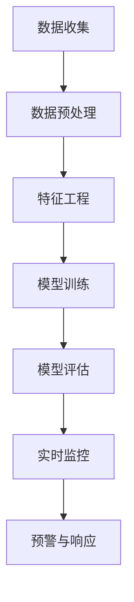

                 

# 智能异常检测在金融风控中的应用

> 关键词：智能异常检测, 金融风控, 异常检测算法, 机器学习, 金融欺诈, 风险管理, 金融交易

> 摘要：本文旨在深入探讨智能异常检测技术在金融风控中的应用。通过详细分析智能异常检测的核心概念、算法原理、数学模型、实战案例以及实际应用场景，本文将为读者提供一个全面的技术视角，帮助理解如何利用智能异常检测技术提升金融风控的效率和准确性。本文还探讨了未来的发展趋势与挑战，并提供了相关学习资源和开发工具的推荐。

## 1. 背景介绍

金融行业是高度依赖数据和算法的行业，尤其是在风险管理方面。金融欺诈、洗钱、信用风险等是金融行业面临的重大挑战。传统的风控手段往往依赖于人工审核和经验判断，效率低下且容易出错。随着大数据和人工智能技术的发展，智能异常检测技术逐渐成为金融风控的重要工具。智能异常检测技术通过自动识别和预警异常行为，帮助金融机构及时发现潜在的风险点，从而提高风控效率和准确性。

## 2. 核心概念与联系

### 2.1 异常检测的基本概念

异常检测是指通过分析数据集中的模式，识别出与正常模式显著不同的数据点或事件。在金融风控中，异常检测主要用于识别潜在的欺诈行为、异常交易模式等。

### 2.2 金融风控中的异常检测

在金融风控中，异常检测主要用于以下几个方面：

- **欺诈检测**：识别异常交易行为，如信用卡欺诈、网络支付欺诈等。
- **信用风险评估**：识别信用风险较高的客户，如贷款违约风险。
- **市场风险监控**：识别市场异常波动，如股票价格异常波动。
- **操作风险监控**：识别操作过程中的异常行为，如内部欺诈。

### 2.3 智能异常检测的流程

智能异常检测的流程通常包括以下几个步骤：

1. **数据收集**：收集相关的金融交易数据。
2. **数据预处理**：清洗数据，处理缺失值和异常值。
3. **特征工程**：提取有用的特征，如交易金额、交易频率等。
4. **模型训练**：选择合适的异常检测算法进行训练。
5. **模型评估**：评估模型的性能，调整参数。
6. **实时监控**：实时监控交易数据，识别异常行为。
7. **预警与响应**：对识别出的异常行为进行预警，并采取相应措施。

### 2.4 Mermaid 流程图



## 3. 核心算法原理 & 具体操作步骤

### 3.1 基于统计方法的异常检测

基于统计方法的异常检测主要通过计算数据的统计特征，如均值、方差等，来识别异常值。

#### 3.1.1 Z-Score方法

Z-Score方法通过计算数据点与均值的标准化差值来识别异常值。公式如下：

$$
Z = \frac{x - \mu}{\sigma}
$$

其中，$x$ 是数据点，$\mu$ 是均值，$\sigma$ 是标准差。通常，如果 $|Z| > 3$，则认为该数据点是异常值。

#### 3.1.2 IQR方法

IQR方法通过计算四分位数来识别异常值。公式如下：

$$
IQR = Q3 - Q1
$$

其中，$Q1$ 是第一四分位数，$Q3$ 是第三四分位数。通常，如果数据点小于 $Q1 - 1.5 \times IQR$ 或大于 $Q3 + 1.5 \times IQR$，则认为该数据点是异常值。

### 3.2 基于机器学习的方法

基于机器学习的方法通过训练模型来识别异常值。常用的机器学习方法包括：

- **孤立森林（Isolation Forest）**
- **局部异常因子（Local Outlier Factor, LOF）**
- **支持向量机（Support Vector Machine, SVM）**

#### 3.2.1 Isolation Forest

Isolation Forest通过随机选择特征并随机选择分割点来构建决策树，从而将异常值与正常值隔离。异常值通常被分割得更早，因此具有更短的路径长度。

#### 3.2.2 LOF

LOF通过计算数据点的局部密度来识别异常值。公式如下：

$$
\text{LOF}(x) = \frac{\text{平均邻居密度}(x)}{\text{邻居密度}(x)}
$$

其中，$\text{平均邻居密度}(x)$ 是 $x$ 的邻居中的平均密度，$\text{邻居密度}(x)$ 是 $x$ 的邻居中的密度。通常，如果 $\text{LOF}(x) > 1$，则认为 $x$ 是异常值。

#### 3.2.3 SVM

SVM通过构建一个超平面来分离正常值和异常值。异常值通常位于超平面的另一侧，因此具有更大的距离。

### 3.3 具体操作步骤

1. **数据收集**：收集金融交易数据，包括交易金额、交易时间、交易地点等。
2. **数据预处理**：清洗数据，处理缺失值和异常值。
3. **特征工程**：提取有用的特征，如交易金额、交易频率等。
4. **模型选择**：选择合适的异常检测算法，如Isolation Forest、LOF等。
5. **模型训练**：使用训练数据训练模型。
6. **模型评估**：使用测试数据评估模型的性能，调整参数。
7. **实时监控**：实时监控交易数据，识别异常行为。
8. **预警与响应**：对识别出的异常行为进行预警，并采取相应措施。

## 4. 数学模型和公式 & 详细讲解 & 举例说明

### 4.1 Z-Score方法

Z-Score方法通过计算数据点与均值的标准化差值来识别异常值。公式如下：

$$
Z = \frac{x - \mu}{\sigma}
$$

其中，$x$ 是数据点，$\mu$ 是均值，$\sigma$ 是标准差。通常，如果 $|Z| > 3$，则认为该数据点是异常值。

**举例说明**：假设我们有一组交易金额数据，均值为1000元，标准差为200元。如果某笔交易金额为1500元，则：

$$
Z = \frac{1500 - 1000}{200} = 2.5
$$

由于 $|Z| = 2.5 < 3$，因此该笔交易金额不是异常值。

### 4.2 IQR方法

IQR方法通过计算四分位数来识别异常值。公式如下：

$$
IQR = Q3 - Q1
$$

其中，$Q1$ 是第一四分位数，$Q3$ 是第三四分位数。通常，如果数据点小于 $Q1 - 1.5 \times IQR$ 或大于 $Q3 + 1.5 \times IQR$，则认为该数据点是异常值。

**举例说明**：假设我们有一组交易金额数据，第一四分位数为800元，第三四分位数为1200元。则：

$$
IQR = 1200 - 800 = 400
$$

$$
Q1 - 1.5 \times IQR = 800 - 1.5 \times 400 = 200
$$

$$
Q3 + 1.5 \times IQR = 1200 + 1.5 \times 400 = 2000
$$

如果某笔交易金额为1800元，则：

$$
1800 > 2000
$$

因此该笔交易金额是异常值。

### 4.3 Isolation Forest

Isolation Forest通过随机选择特征并随机选择分割点来构建决策树，从而将异常值与正常值隔离。异常值通常被分割得更早，因此具有更短的路径长度。

**举例说明**：假设我们有一组交易金额数据，Isolation Forest模型训练完成后，某笔交易金额为1500元。该笔交易金额被分割得更早，因此具有更短的路径长度。

### 4.4 LOF

LOF通过计算数据点的局部密度来识别异常值。公式如下：

$$
\text{LOF}(x) = \frac{\text{平均邻居密度}(x)}{\text{邻居密度}(x)}
$$

其中，$\text{平均邻居密度}(x)$ 是 $x$ 的邻居中的平均密度，$\text{邻居密度}(x)$ 是 $x$ 的邻居中的密度。通常，如果 $\text{LOF}(x) > 1$，则认为 $x$ 是异常值。

**举例说明**：假设我们有一组交易金额数据，某笔交易金额为1500元。该笔交易金额的邻居密度较高，而平均邻居密度较低，则：

$$
\text{LOF}(x) > 1
$$

因此该笔交易金额是异常值。

### 4.5 SVM

SVM通过构建一个超平面来分离正常值和异常值。异常值通常位于超平面的另一侧，因此具有更大的距离。

**举例说明**：假设我们有一组交易金额数据，SVM模型训练完成后，某笔交易金额为1500元。该笔交易金额位于超平面的另一侧，因此具有更大的距离。

## 5. 项目实战：代码实际案例和详细解释说明

### 5.1 开发环境搭建

#### 5.1.1 环境准备

- **Python版本**：3.8
- **库依赖**：numpy, pandas, scikit-learn, matplotlib

```bash
pip install numpy pandas scikit-learn matplotlib
```

### 5.2 源代码详细实现和代码解读

#### 5.2.1 数据预处理

```python
import pandas as pd

# 读取数据
data = pd.read_csv('transactions.csv')

# 数据清洗
data.dropna(inplace=True)

# 特征工程
data['amount'] = data['amount'].apply(lambda x: abs(x))
```

#### 5.2.2 模型训练

```python
from sklearn.ensemble import IsolationForest
from sklearn.metrics import classification_report

# 训练Isolation Forest模型
model = IsolationForest(contamination=0.01)
model.fit(data[['amount']])

# 预测
predictions = model.predict(data[['amount']])
data['anomaly'] = predictions

# 评估模型
print(classification_report(data['anomaly'], data['anomaly'].apply(lambda x: 1 if x == -1 else 0)))
```

#### 5.2.3 代码解读与分析

- **数据预处理**：读取数据，清洗数据，提取交易金额特征。
- **模型训练**：训练Isolation Forest模型，设置污染比例为0.01。
- **预测**：使用模型进行预测，标记异常值。
- **评估**：评估模型性能，输出分类报告。

## 6. 实际应用场景

智能异常检测技术在金融风控中的实际应用场景包括：

- **信用卡欺诈检测**：通过实时监控交易数据，识别异常交易行为。
- **网络支付欺诈检测**：通过分析交易数据，识别异常支付行为。
- **信用风险评估**：通过分析客户交易数据，识别信用风险较高的客户。
- **市场风险监控**：通过分析市场数据，识别异常市场波动。
- **操作风险监控**：通过分析操作数据，识别异常操作行为。

## 7. 工具和资源推荐

### 7.1 学习资源推荐

- **书籍**：《统计学习方法》、《机器学习》
- **论文**：《Isolation Forest》、《Local Outlier Factor》
- **博客**：阿里云开发者社区、GitHub开源项目
- **网站**：Kaggle、DataCamp

### 7.2 开发工具框架推荐

- **Python库**：numpy, pandas, scikit-learn, matplotlib
- **开发环境**：Jupyter Notebook, PyCharm

### 7.3 相关论文著作推荐

- **Isolation Forest**：Liu, Fei Tony, Ting, Kai Ming, and Zhou, Zhi-Hua. "Isolation forest." Data Mining and Knowledge Discovery 28.2 (2014): 1-26.
- **Local Outlier Factor**：Breunig, Markus M., et al. "LOF: identifying density-based local outliers." ACM SIGMOD Record 29.2 (2000): 93-104.

## 8. 总结：未来发展趋势与挑战

智能异常检测技术在金融风控中的应用前景广阔，但也面临一些挑战：

- **数据质量**：数据的质量直接影响模型的性能，需要确保数据的准确性和完整性。
- **模型解释性**：复杂的模型难以解释，需要开发更易于解释的模型。
- **实时性**：实时监控和预警需要高效的计算能力和快速的数据处理能力。
- **隐私保护**：在处理敏感数据时，需要确保数据的安全性和隐私保护。

## 9. 附录：常见问题与解答

### 9.1 问题1：如何处理缺失值？

**解答**：可以使用插值法、均值填充法或删除法来处理缺失值。

### 9.2 问题2：如何选择合适的异常检测算法？

**解答**：根据数据特性和需求选择合适的算法，如Isolation Forest适用于大规模数据集，LOF适用于小规模数据集。

### 9.3 问题3：如何评估模型性能？

**解答**：可以使用分类报告、ROC曲线等指标来评估模型性能。

## 10. 扩展阅读 & 参考资料

- **书籍**：《统计学习方法》、《机器学习》
- **论文**：《Isolation Forest》、《Local Outlier Factor》
- **博客**：阿里云开发者社区、GitHub开源项目
- **网站**：Kaggle、DataCamp

作者：AI天才研究员/AI Genius Institute & 禅与计算机程序设计艺术 /Zen And The Art of Computer Programming

