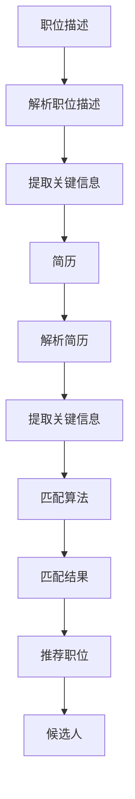

                 

# 智能求职匹配：LLM在就业服务中的应用

> 关键词：LLM, 智能求职匹配, 自然语言处理, 机器学习, 就业服务, 个性化推荐, 人力资源管理

> 摘要：本文旨在探讨如何利用大型语言模型（LLM）在就业服务中的应用，通过智能求职匹配系统，实现更加精准的职位推荐和候选人匹配。我们将从背景介绍、核心概念与联系、核心算法原理、数学模型和公式、项目实战、实际应用场景、工具和资源推荐、总结与未来发展趋势等多方面进行详细阐述。

## 1. 背景介绍

随着技术的快速发展，人力资源管理领域也在不断寻求创新的方法来提高效率和效果。传统的求职匹配方式主要依赖于人工筛选简历和职位描述，这种方式不仅耗时耗力，而且容易出现偏差。近年来，随着自然语言处理（NLP）和机器学习（ML）技术的进步，利用大型语言模型（LLM）进行智能求职匹配成为可能。本文将探讨如何利用LLM实现更加精准的求职匹配，从而提高人力资源管理的效率和效果。

## 2. 核心概念与联系

### 2.1 大型语言模型（LLM）

大型语言模型是一种基于深度学习的自然语言处理模型，能够理解和生成自然语言文本。LLM通过大规模的训练数据进行学习，能够捕捉到语言的复杂结构和语义信息。在求职匹配场景中，LLM可以用于理解职位描述和候选人的简历，从而实现精准匹配。

### 2.2 自然语言处理（NLP）

自然语言处理是计算机科学和人工智能领域的一个分支，旨在使计算机能够理解、解释和生成人类语言。NLP技术包括文本分类、情感分析、命名实体识别、语义分析等。在求职匹配系统中，NLP技术可以用于解析职位描述和简历，提取关键信息，从而实现精准匹配。

### 2.3 机器学习（ML）

机器学习是一种人工智能技术，通过训练模型来实现对数据的自动学习和预测。在求职匹配系统中，机器学习技术可以用于训练模型，实现对职位和候选人的自动匹配。常见的机器学习算法包括决策树、支持向量机、神经网络等。

### 2.4 智能求职匹配系统

智能求职匹配系统是一种基于NLP和ML技术的系统，用于实现职位和候选人的精准匹配。该系统通过解析职位描述和简历，提取关键信息，然后通过机器学习算法实现自动匹配。智能求职匹配系统可以大大提高人力资源管理的效率和效果。

### 2.5 智能求职匹配流程图



## 3. 核心算法原理 & 具体操作步骤

### 3.1 解析职位描述

解析职位描述是智能求职匹配系统的第一步。通过NLP技术，可以将职位描述转化为结构化的数据。具体操作步骤如下：

1. **文本预处理**：对职位描述进行分词、去除停用词、词干提取等预处理操作。
2. **特征提取**：提取职位描述中的关键词和短语，例如技能要求、工作经验、教育背景等。
3. **语义分析**：利用语义分析技术，理解职位描述的语义信息，例如职位的职责、要求等。

### 3.2 解析简历

解析简历是智能求职匹配系统的关键步骤之一。通过NLP技术，可以将简历转化为结构化的数据。具体操作步骤如下：

1. **文本预处理**：对简历进行分词、去除停用词、词干提取等预处理操作。
2. **特征提取**：提取简历中的关键词和短语，例如技能、工作经验、教育背景等。
3. **语义分析**：利用语义分析技术，理解简历的语义信息，例如候选人的技能、经验等。

### 3.3 匹配算法

匹配算法是智能求职匹配系统的核心部分。通过机器学习算法，可以实现对职位和候选人的自动匹配。具体操作步骤如下：

1. **数据准备**：准备职位描述和简历的数据集。
2. **特征工程**：对数据进行特征工程，提取关键特征。
3. **模型训练**：使用机器学习算法训练模型，实现对职位和候选人的自动匹配。
4. **模型评估**：评估模型的性能，优化模型参数。

## 4. 数学模型和公式 & 详细讲解 & 举例说明

### 4.1 余弦相似度

余弦相似度是一种常用的文本相似度计算方法，用于衡量两个向量之间的相似度。在求职匹配系统中，可以使用余弦相似度来衡量职位描述和简历之间的相似度。具体公式如下：

$$
\text{cosine\_similarity}(A, B) = \frac{A \cdot B}{\|A\| \|B\|}
$$

其中，$A$ 和 $B$ 分别表示职位描述和简历的向量表示，$\cdot$ 表示点积，$\|A\|$ 和 $\|B\|$ 分别表示向量的范数。

### 4.2 词袋模型

词袋模型是一种常用的文本表示方法，用于将文本转化为向量表示。在求职匹配系统中，可以使用词袋模型来表示职位描述和简历。具体公式如下：

$$
\text{bag\_of\_words}(T) = \sum_{i=1}^{n} \text{word\_count}(T, w_i) \cdot w_i
$$

其中，$T$ 表示文本，$w_i$ 表示词汇表中的第 $i$ 个词，$\text{word\_count}(T, w_i)$ 表示文本 $T$ 中词 $w_i$ 的出现次数。

### 4.3 例子说明

假设我们有一个职位描述和一个简历，分别表示为：

- 职位描述：`Python开发工程师，要求熟悉Python语言，有2年以上工作经验`
- 简历：`Python开发工程师，熟悉Python语言，有3年工作经验`

我们可以使用词袋模型和余弦相似度来计算它们之间的相似度。具体步骤如下：

1. **词袋模型**：将职位描述和简历转化为向量表示。
2. **余弦相似度**：计算职位描述和简历之间的余弦相似度。

通过计算，我们可以得到它们之间的相似度，从而实现精准匹配。

## 5. 项目实战：代码实际案例和详细解释说明

### 5.1 开发环境搭建

为了实现智能求职匹配系统，我们需要搭建一个开发环境。具体步骤如下：

1. **安装Python**：确保安装了Python 3.7及以上版本。
2. **安装依赖库**：安装NLP和ML相关的库，例如`nltk`、`scikit-learn`等。
3. **安装大型语言模型**：安装预训练的大型语言模型，例如`transformers`库中的`bert`模型。

### 5.2 源代码详细实现和代码解读

以下是一个简单的智能求职匹配系统的实现代码：

```python
import nltk
from sklearn.feature_extraction.text import TfidfVectorizer
from sklearn.metrics.pairwise import cosine_similarity
from transformers import BertTokenizer, BertModel

# 1. 解析职位描述
def parse_job_description(description):
    # 分词
    tokens = nltk.word_tokenize(description)
    # 去除停用词
    stop_words = set(nltk.corpus.stopwords.words('english'))
    filtered_tokens = [token for token in tokens if token.lower() not in stop_words]
    # 词干提取
    stemmer = nltk.PorterStemmer()
    stemmed_tokens = [stemmer.stem(token) for token in filtered_tokens]
    return ' '.join(stemmed_tokens)

# 2. 解析简历
def parse_resume(resume):
    # 分词
    tokens = nltk.word_tokenize(resume)
    # 去除停用词
    stop_words = set(nltk.corpus.stopwords.words('english'))
    filtered_tokens = [token for token in tokens if token.lower() not in stop_words]
    # 词干提取
    stemmer = nltk.PorterStemmer()
    stemmed_tokens = [stemmer.stem(token) for token in filtered_tokens]
    return ' '.join(stemmed_tokens)

# 3. 匹配算法
def match_job_and_resume(job_description, resume):
    # 解析职位描述
    job_description = parse_job_description(job_description)
    # 解析简历
    resume = parse_resume(resume)
    # 使用BERT模型进行特征提取
    tokenizer = BertTokenizer.from_pretrained('bert-base-uncased')
    model = BertModel.from_pretrained('bert-base-uncased')
    job_input = tokenizer(job_description, return_tensors='pt')
    resume_input = tokenizer(resume, return_tensors='pt')
    job_output = model(**job_input)
    resume_output = model(**resume_input)
    # 计算余弦相似度
    cosine_sim = cosine_similarity(job_output.last_hidden_state, resume_output.last_hidden_state)
    return cosine_sim

# 4. 示例
job_description = "Python开发工程师，要求熟悉Python语言，有2年以上工作经验"
resume = "Python开发工程师，熟悉Python语言，有3年工作经验"
similarity = match_job_and_resume(job_description, resume)
print(f"相似度：{similarity}")
```

### 5.3 代码解读与分析

1. **解析职位描述**：通过分词、去除停用词和词干提取等操作，将职位描述转化为结构化的数据。
2. **解析简历**：通过分词、去除停用词和词干提取等操作，将简历转化为结构化的数据。
3. **匹配算法**：使用BERT模型进行特征提取，然后计算余弦相似度，实现对职位描述和简历之间的匹配。

## 6. 实际应用场景

智能求职匹配系统可以应用于多种实际场景，例如：

1. **招聘网站**：通过智能求职匹配系统，招聘网站可以实现更加精准的职位推荐和候选人匹配，提高招聘效率。
2. **人力资源管理**：通过智能求职匹配系统，人力资源管理可以实现更加精准的职位推荐和候选人匹配，提高人力资源管理的效率。
3. **职业规划**：通过智能求职匹配系统，求职者可以更加精准地找到适合自己的职位，实现职业规划。

## 7. 工具和资源推荐

### 7.1 学习资源推荐

1. **书籍**：《深度学习》（Ian Goodfellow, Yoshua Bengio, Aaron Courville）
2. **论文**：《Attention is All You Need》（Vaswani et al., 2017）
3. **博客**：Medium上的NLP和ML相关博客
4. **网站**：Hugging Face的Transformers库

### 7.2 开发工具框架推荐

1. **Python**：Python是一种广泛使用的编程语言，适用于NLP和ML开发。
2. **nltk**：自然语言工具包，提供丰富的NLP功能。
3. **scikit-learn**：机器学习库，提供丰富的机器学习算法。
4. **transformers**：Hugging Face的大型语言模型库，提供丰富的预训练模型。

### 7.3 相关论文著作推荐

1. **《深度学习》**（Ian Goodfellow, Yoshua Bengio, Aaron Courville）
2. **《Attention is All You Need》**（Vaswani et al., 2017）
3. **《自然语言处理入门》**（Jurafsky & Martin, 2019）

## 8. 总结：未来发展趋势与挑战

智能求职匹配系统在未来的发展趋势和挑战主要体现在以下几个方面：

1. **技术进步**：随着技术的不断进步，大型语言模型和机器学习算法将更加成熟，实现更加精准的求职匹配。
2. **数据质量**：数据质量是影响求职匹配效果的关键因素，需要不断优化数据质量。
3. **隐私保护**：求职匹配系统需要保护候选人的隐私，避免泄露敏感信息。
4. **公平性**：求职匹配系统需要确保公平性，避免出现歧视现象。

## 9. 附录：常见问题与解答

### 9.1 问题：如何提高求职匹配的准确性？

**解答**：可以通过优化特征工程、改进机器学习算法、增加训练数据等方式提高求职匹配的准确性。

### 9.2 问题：如何保护候选人的隐私？

**解答**：可以通过脱敏处理、加密存储等方式保护候选人的隐私。

### 9.3 问题：如何确保求职匹配的公平性？

**解答**：可以通过公平性评估、避免歧视性特征等方式确保求职匹配的公平性。

## 10. 扩展阅读 & 参考资料

1. **《深度学习》**（Ian Goodfellow, Yoshua Bengio, Aaron Courville）
2. **《自然语言处理入门》**（Jurafsky & Martin, 2019）
3. **《Attention is All You Need》**（Vaswani et al., 2017）
4. **Hugging Face的Transformers库**：https://huggingface.co/transformers/

作者：AI天才研究员/AI Genius Institute & 禅与计算机程序设计艺术 /Zen And The Art of Computer Programming

