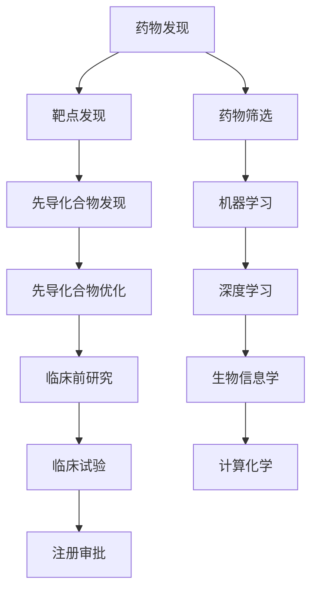

                 

# 智能药物研发平台的商业模式

> 关键词：智能药物研发、商业模式、人工智能、药物发现、机器学习、深度学习、生物信息学、计算化学、药物筛选

> 摘要：本文将深入探讨智能药物研发平台的商业模式，从背景介绍、核心概念与联系、核心算法原理及具体操作步骤、数学模型和公式、项目实战、实际应用场景、工具和资源推荐、总结与未来发展趋势等多个方面进行详细分析。通过本文，读者将能够理解智能药物研发平台的核心价值，掌握其关键技术，并了解其在实际应用中的潜力和挑战。

## 1. 背景介绍

智能药物研发平台是近年来迅速崛起的一种新型药物发现和开发模式。传统的药物研发过程耗时长、成本高，且成功率低。智能药物研发平台通过引入人工智能技术，特别是机器学习和深度学习，极大地提高了药物发现的效率和成功率。本文将从多个角度探讨智能药物研发平台的商业模式，旨在为读者提供全面的技术和商业视角。

### 1.1 传统药物研发流程

传统的药物研发流程通常包括以下几个阶段：

1. **靶点发现**：确定药物作用的生物靶点。
2. **先导化合物发现**：通过高通量筛选或化学合成找到潜在的先导化合物。
3. **先导化合物优化**：对先导化合物进行结构优化，提高其药效和安全性。
4. **临床前研究**：进行动物实验和体外实验，评估药物的安全性和有效性。
5. **临床试验**：进行人体临床试验，验证药物的安全性和有效性。
6. **注册审批**：向监管机构提交申请，获得上市许可。

### 1.2 智能药物研发平台的优势

智能药物研发平台通过引入人工智能技术，显著提升了药物研发的效率和成功率。其主要优势包括：

1. **加速药物发现**：通过机器学习和深度学习技术，快速筛选出潜在的先导化合物。
2. **降低研发成本**：减少高通量筛选和化学合成的成本。
3. **提高成功率**：通过精准预测药物的药效和安全性，提高临床试验的成功率。
4. **缩短研发周期**：从靶点发现到临床试验，整个过程可以大大缩短。

## 2. 核心概念与联系

### 2.1 核心概念

1. **药物发现**：通过各种方法找到具有药理活性的化合物。
2. **机器学习**：一种人工智能技术，通过训练模型来实现预测和决策。
3. **深度学习**：机器学习的一种，通过多层神经网络实现复杂的模式识别。
4. **生物信息学**：利用计算机技术处理和分析生物数据。
5. **计算化学**：利用计算机模拟化学反应和分子结构。
6. **药物筛选**：通过实验或计算方法筛选出具有药理活性的化合物。

### 2.2 核心概念原理与架构

#### Mermaid 流程图



## 3. 核心算法原理 & 具体操作步骤

### 3.1 机器学习算法

机器学习算法在智能药物研发平台中扮演着关键角色。常用的机器学习算法包括：

1. **支持向量机（SVM）**：通过构建超平面来分类数据。
2. **随机森林（Random Forest）**：通过集成多个决策树来提高预测准确性。
3. **梯度提升树（Gradient Boosting Trees）**：通过逐步提升模型的预测能力。
4. **神经网络**：通过多层神经网络实现复杂的模式识别。

### 3.2 深度学习算法

深度学习算法在智能药物研发平台中主要用于药物分子的预测和优化。常用的深度学习算法包括：

1. **卷积神经网络（CNN）**：用于处理图像数据，适用于分子结构的预测。
2. **循环神经网络（RNN）**：用于处理序列数据，适用于药物序列的预测。
3. **生成对抗网络（GAN）**：用于生成新的药物分子结构。

### 3.3 具体操作步骤

1. **数据收集**：收集大量的药物分子数据和生物数据。
2. **数据预处理**：对数据进行清洗和标准化。
3. **特征提取**：从分子结构和生物数据中提取有用的特征。
4. **模型训练**：使用机器学习和深度学习算法训练模型。
5. **模型评估**：通过交叉验证和测试集评估模型的性能。
6. **模型优化**：通过调整参数和优化算法提高模型的预测能力。
7. **模型应用**：将训练好的模型应用于药物筛选和优化。

## 4. 数学模型和公式 & 详细讲解 & 举例说明

### 4.1 机器学习模型

#### 支持向量机（SVM）

支持向量机是一种监督学习算法，通过构建超平面来分类数据。其基本公式为：

$$
\min_{\mathbf{w}, b} \frac{1}{2} \|\mathbf{w}\|^2 + C \sum_{i=1}^{n} \xi_i
$$

其中，$\mathbf{w}$ 是权重向量，$b$ 是偏置项，$C$ 是惩罚参数，$\xi_i$ 是松弛变量。

#### 随机森林（Random Forest）

随机森林是一种集成学习算法，通过集成多个决策树来提高预测准确性。其基本公式为：

$$
\hat{y} = \frac{1}{T} \sum_{t=1}^{T} \hat{y}_t
$$

其中，$\hat{y}_t$ 是第 $t$ 棵树的预测结果，$T$ 是树的数量。

### 4.2 深度学习模型

#### 卷积神经网络（CNN）

卷积神经网络是一种深度学习算法，适用于处理图像数据。其基本公式为：

$$
\mathbf{Z}^{[l]} = \mathbf{W}^{[l]} \ast \mathbf{A}^{[l-1]} + \mathbf{b}^{[l]}
$$

其中，$\mathbf{Z}^{[l]}$ 是第 $l$ 层的特征图，$\mathbf{W}^{[l]}$ 是卷积核，$\mathbf{A}^{[l-1]}$ 是前一层的特征图，$\mathbf{b}^{[l]}$ 是偏置项。

#### 生成对抗网络（GAN）

生成对抗网络是一种深度学习算法，用于生成新的药物分子结构。其基本公式为：

$$
\min_{G} \max_{D} V(D, G) = \mathbb{E}_{\mathbf{z} \sim p_{\mathbf{z}}(\mathbf{z})}[\log D(G(\mathbf{z}))] + \mathbb{E}_{\mathbf{x} \sim p_{\mathbf{data}}(\mathbf{x})}[\log (1 - D(\mathbf{x}))]
$$

其中，$G$ 是生成器，$D$ 是判别器，$V(D, G)$ 是损失函数。

### 4.3 举例说明

假设我们有一个药物分子数据集，包含大量的分子结构和生物活性数据。我们可以使用支持向量机（SVM）来训练一个分类模型，预测分子的生物活性。具体步骤如下：

1. **数据预处理**：清洗和标准化数据。
2. **特征提取**：从分子结构中提取有用的特征。
3. **模型训练**：使用SVM算法训练模型。
4. **模型评估**：通过交叉验证和测试集评估模型的性能。
5. **模型应用**：将训练好的模型应用于新的分子结构，预测其生物活性。

## 5. 项目实战：代码实际案例和详细解释说明

### 5.1 开发环境搭建

为了实现智能药物研发平台，我们需要搭建一个合适的开发环境。具体步骤如下：

1. **安装Python**：确保安装了最新版本的Python。
2. **安装依赖库**：安装必要的机器学习和深度学习库，如TensorFlow、PyTorch、Scikit-learn等。
3. **安装数据处理库**：安装必要的数据处理库，如Pandas、NumPy等。
4. **安装可视化库**：安装必要的可视化库，如Matplotlib、Seaborn等。

### 5.2 源代码详细实现和代码解读

假设我们使用Python和TensorFlow实现一个简单的药物分子预测模型。具体代码如下：

```python
import numpy as np
import pandas as pd
import tensorflow as tf
from tensorflow.keras.models import Sequential
from tensorflow.keras.layers import Dense, Conv1D, Flatten

# 1. 数据预处理
data = pd.read_csv('drug_data.csv')
X = data.drop('activity', axis=1).values
y = data['activity'].values

# 2. 特征提取
# 假设我们已经从分子结构中提取了特征

# 3. 模型训练
model = Sequential()
model.add(Conv1D(filters=32, kernel_size=3, activation='relu', input_shape=(X.shape[1], 1)))
model.add(Flatten())
model.add(Dense(1, activation='sigmoid'))

model.compile(optimizer='adam', loss='binary_crossentropy', metrics=['accuracy'])
model.fit(X, y, epochs=10, batch_size=32)

# 4. 模型评估
loss, accuracy = model.evaluate(X, y)
print(f'Loss: {loss}, Accuracy: {accuracy}')
```

### 5.3 代码解读与分析

1. **数据预处理**：读取药物分子数据集，并将特征和标签分离。
2. **特征提取**：假设我们已经从分子结构中提取了特征。
3. **模型训练**：构建一个简单的卷积神经网络模型，并使用Adam优化器和二元交叉熵损失函数进行训练。
4. **模型评估**：评估模型的性能，并输出损失和准确率。

## 6. 实际应用场景

智能药物研发平台在实际应用中具有广泛的应用场景。具体应用场景包括：

1. **药物发现**：通过机器学习和深度学习技术，快速筛选出潜在的先导化合物。
2. **药物优化**：通过计算化学和生物信息学技术，优化药物分子的结构。
3. **药物筛选**：通过高通量筛选和计算方法，筛选出具有药理活性的化合物。
4. **临床前研究**：通过动物实验和体外实验，评估药物的安全性和有效性。
5. **临床试验**：通过人体临床试验，验证药物的安全性和有效性。

## 7. 工具和资源推荐

### 7.1 学习资源推荐

1. **书籍**：《机器学习》（周志华著）、《深度学习》（Ian Goodfellow著）
2. **论文**：《Drug Discovery Using Machine Learning》（Nature Reviews Drug Discovery）
3. **博客**：Medium上的相关技术博客
4. **网站**：Kaggle、GitHub上的相关项目

### 7.2 开发工具框架推荐

1. **Python**：最新版本的Python
2. **TensorFlow**：深度学习框架
3. **PyTorch**：深度学习框架
4. **Scikit-learn**：机器学习库
5. **Pandas**：数据处理库
6. **NumPy**：数值计算库
7. **Matplotlib**：可视化库

### 7.3 相关论文著作推荐

1. **《Drug Discovery Using Machine Learning》**：Nature Reviews Drug Discovery
2. **《Deep Learning for Drug Discovery and Design》**：Springer
3. **《Machine Learning in Drug Discovery》**：Wiley

## 8. 总结：未来发展趋势与挑战

智能药物研发平台在未来具有广阔的发展前景。其主要发展趋势包括：

1. **技术进步**：机器学习和深度学习技术的不断进步，将进一步提高药物发现的效率和成功率。
2. **数据驱动**：更多的生物数据和药物数据将被收集和利用，提高模型的预测能力。
3. **跨学科合作**：生物学家、化学家、计算机科学家等多学科的合作将进一步推动智能药物研发平台的发展。

然而，智能药物研发平台也面临着一些挑战，包括：

1. **数据隐私**：如何保护生物数据和药物数据的隐私。
2. **模型解释性**：如何提高模型的解释性，以便更好地理解模型的预测结果。
3. **法规合规**：如何确保智能药物研发平台符合相关法规和标准。

## 9. 附录：常见问题与解答

### 9.1 问题1：如何处理大规模数据集？

**解答**：可以使用分布式计算框架，如Apache Spark，来处理大规模数据集。

### 9.2 问题2：如何提高模型的解释性？

**解答**：可以使用可解释性模型，如LIME（Local Interpretable Model-agnostic Explanations），来提高模型的解释性。

### 9.3 问题3：如何保护数据隐私？

**解答**：可以使用差分隐私技术，来保护生物数据和药物数据的隐私。

## 10. 扩展阅读 & 参考资料

1. **书籍**：《机器学习》（周志华著）、《深度学习》（Ian Goodfellow著）
2. **论文**：《Drug Discovery Using Machine Learning》（Nature Reviews Drug Discovery）
3. **博客**：Medium上的相关技术博客
4. **网站**：Kaggle、GitHub上的相关项目

---

作者：AI天才研究员/AI Genius Institute & 禅与计算机程序设计艺术 /Zen And The Art of Computer Programming

