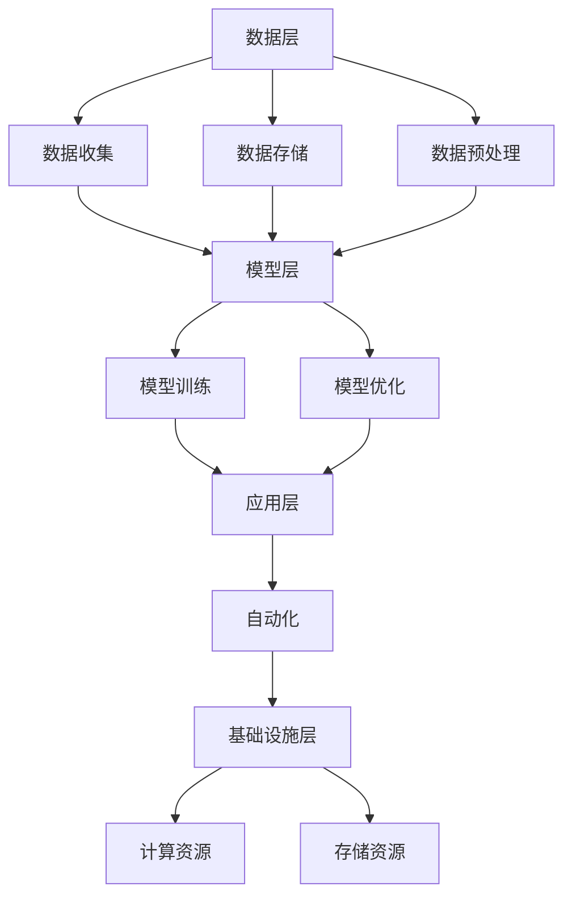

                 

# AI 2.0 时代的生态

> 关键词：AI 2.0, 生态系统, 人工智能, 自动化, 数据驱动, 模型优化, 伦理与安全

> 摘要：本文旨在探讨AI 2.0时代的生态系统，从背景介绍、核心概念与联系、核心算法原理、数学模型与公式、项目实战、实际应用场景、工具和资源推荐、未来发展趋势与挑战等多个方面进行详细阐述。通过一步步分析推理，帮助读者理解AI 2.0时代的生态构建与应用，以及面临的挑战与机遇。

## 1. 背景介绍

### 1.1 AI 1.0 时代回顾
AI 1.0时代始于20世纪50年代，以符号主义和专家系统为代表，主要依赖于规则和逻辑推理。然而，受限于计算能力、数据量和算法的局限性，AI 1.0时代的应用范围有限，主要集中在特定领域，如语音识别、图像处理等。

### 1.2 AI 2.0 时代兴起
进入21世纪，随着大数据、云计算和深度学习技术的迅猛发展，AI 2.0时代应运而生。AI 2.0时代的核心特征是数据驱动和模型优化，通过大规模数据训练，模型能够自动学习和适应复杂环境，实现更广泛的应用场景。

## 2. 核心概念与联系

### 2.1 数据驱动
数据驱动是AI 2.0时代的核心理念，强调通过大量数据训练模型，使其具备更强的泛化能力和适应性。数据驱动不仅包括数据的收集和存储，还包括数据预处理、特征提取和模型训练等环节。

### 2.2 模型优化
模型优化是AI 2.0时代的关键技术，通过优化模型结构和参数，提高模型的性能和效率。模型优化包括超参数调优、正则化、集成学习等方法。

### 2.3 自动化
自动化是AI 2.0时代的重要应用方向，通过自动化流程和决策，提高生产效率和质量。自动化包括自动化测试、自动化运维、自动化决策等。

### 2.4 AI 2.0 时代生态系统
AI 2.0时代的生态系统由多个组成部分构成，包括数据层、模型层、应用层和基础设施层。数据层负责数据的收集、存储和预处理；模型层负责模型的训练和优化；应用层负责模型的应用和部署；基础设施层负责提供计算资源和存储资源。



## 3. 核心算法原理 & 具体操作步骤

### 3.1 深度学习基础
深度学习是AI 2.0时代的核心技术之一，通过多层神经网络实现复杂的非线性映射。深度学习的基本原理是通过反向传播算法优化模型参数，实现模型的训练和预测。

### 3.2 模型训练步骤
模型训练主要包括数据预处理、模型构建、损失函数选择、优化算法选择和模型训练等步骤。

1. **数据预处理**：对原始数据进行清洗、归一化、特征提取等操作。
2. **模型构建**：选择合适的神经网络结构，如卷积神经网络（CNN）、循环神经网络（RNN）等。
3. **损失函数选择**：根据任务类型选择合适的损失函数，如交叉熵损失、均方误差等。
4. **优化算法选择**：选择合适的优化算法，如随机梯度下降（SGD）、Adam等。
5. **模型训练**：通过反向传播算法优化模型参数，实现模型的训练和预测。

## 4. 数学模型和公式 & 详细讲解 & 举例说明

### 4.1 损失函数
损失函数是衡量模型预测结果与真实结果之间差异的指标。常见的损失函数包括均方误差（MSE）和交叉熵损失（CE）。

$$
\text{MSE} = \frac{1}{n} \sum_{i=1}^{n} (y_i - \hat{y}_i)^2
$$

$$
\text{CE} = -\frac{1}{n} \sum_{i=1}^{n} \sum_{j=1}^{C} y_{ij} \log(\hat{y}_{ij})
$$

### 4.2 优化算法
优化算法是通过调整模型参数，使损失函数最小化的方法。常见的优化算法包括随机梯度下降（SGD）和Adam。

$$
\theta_{t+1} = \theta_t - \eta \nabla_{\theta} L(\theta_t)
$$

$$
\begin{aligned}
    m_t &= \beta_1 m_{t-1} + (1 - \beta_1) \nabla_{\theta} L(\theta_t) \\
    v_t &= \beta_2 v_{t-1} + (1 - \beta_2) (\nabla_{\theta} L(\theta_t))^2 \\
    \hat{m}_t &= \frac{m_t}{1 - \beta_1^t} \\
    \hat{v}_t &= \frac{v_t}{1 - \beta_2^t} \\
    \theta_{t+1} &= \theta_t - \eta \frac{\hat{m}_t}{\sqrt{\hat{v}_t} + \epsilon}
\end{aligned}
$$

## 5. 项目实战：代码实际案例和详细解释说明

### 5.1 开发环境搭建
为了进行AI 2.0时代的项目实战，我们需要搭建一个合适的开发环境。开发环境包括操作系统、编程语言、深度学习框架和开发工具。

1. **操作系统**：推荐使用Linux或macOS操作系统，因为它们提供了更好的性能和稳定性。
2. **编程语言**：推荐使用Python，因为它具有丰富的库和强大的社区支持。
3. **深度学习框架**：推荐使用TensorFlow或PyTorch，它们提供了丰富的API和强大的性能。
4. **开发工具**：推荐使用Jupyter Notebook或VS Code，它们提供了便捷的开发和调试环境。

### 5.2 源代码详细实现和代码解读
以下是一个简单的深度学习项目实战案例，使用PyTorch实现一个简单的卷积神经网络（CNN）进行手写数字识别。

```python
import torch
import torch.nn as nn
import torch.optim as optim
from torchvision import datasets, transforms

# 数据预处理
transform = transforms.Compose([
    transforms.ToTensor(),
    transforms.Normalize((0.5,), (0.5,))
])

# 数据集加载
train_dataset = datasets.MNIST(root='./data', train=True, download=True, transform=transform)
test_dataset = datasets.MNIST(root='./data', train=False, download=True, transform=transform)

train_loader = torch.utils.data.DataLoader(dataset=train_dataset, batch_size=64, shuffle=True)
test_loader = torch.utils.data.DataLoader(dataset=test_dataset, batch_size=64, shuffle=False)

# 定义模型
class CNN(nn.Module):
    def __init__(self):
        super(CNN, self).__init__()
        self.conv1 = nn.Conv2d(1, 32, 3, 1)
        self.conv2 = nn.Conv2d(32, 64, 3, 1)
        self.dropout1 = nn.Dropout2d(0.25)
        self.dropout2 = nn.Dropout2d(0.5)
        self.fc1 = nn.Linear(9216, 128)
        self.fc2 = nn.Linear(128, 10)

    def forward(self, x):
        x = self.conv1(x)
        x = nn.functional.relu(x)
        x = self.conv2(x)
        x = nn.functional.relu(x)
        x = nn.functional.max_pool2d(x, 2)
        x = self.dropout1(x)
        x = torch.flatten(x, 1)
        x = self.fc1(x)
        x = nn.functional.relu(x)
        x = self.dropout2(x)
        x = self.fc2(x)
        output = nn.functional.log_softmax(x, dim=1)
        return output

model = CNN()

# 损失函数和优化器
criterion = nn.CrossEntropyLoss()
optimizer = optim.Adam(model.parameters(), lr=0.001)

# 训练模型
def train(model, device, train_loader, optimizer, criterion):
    model.train()
    for batch_idx, (data, target) in enumerate(train_loader):
        data, target = data.to(device), target.to(device)
        optimizer.zero_grad()
        output = model(data)
        loss = criterion(output, target)
        loss.backward()
        optimizer.step()

# 测试模型
def test(model, device, test_loader, criterion):
    model.eval()
    test_loss = 0
    correct = 0
    with torch.no_grad():
        for data, target in test_loader:
            data, target = data.to(device), target.to(device)
            output = model(data)
            test_loss += criterion(output, target).item()
            pred = output.argmax(dim=1, keepdim=True)
            correct += pred.eq(target.view_as(pred)).sum().item()

    test_loss /= len(test_loader.dataset)
    test_accuracy = 100. * correct / len(test_loader.dataset)
    return test_loss, test_accuracy

device = torch.device("cuda" if torch.cuda.is_available() else "cpu")
model.to(device)

for epoch in range(10):
    train(model, device, train_loader, optimizer, criterion)
    test_loss, test_accuracy = test(model, device, test_loader, criterion)
    print(f"Epoch {epoch+1}, Test Loss: {test_loss:.4f}, Test Accuracy: {test_accuracy:.2f}%")

```

### 5.3 代码解读与分析
上述代码实现了一个简单的卷积神经网络（CNN）进行手写数字识别。代码分为以下几个部分：

1. **数据预处理**：使用`transforms.Compose`对数据进行预处理，包括转换为张量和归一化。
2. **数据集加载**：使用`torchvision.datasets.MNIST`加载MNIST数据集，并使用`torch.utils.data.DataLoader`进行数据加载。
3. **模型定义**：定义一个简单的CNN模型，包括卷积层、池化层、全连接层和Dropout层。
4. **损失函数和优化器**：定义交叉熵损失函数和Adam优化器。
5. **训练模型**：定义`train`函数进行模型训练，包括前向传播、反向传播和参数更新。
6. **测试模型**：定义`test`函数进行模型测试，计算测试损失和测试准确率。
7. **设备选择**：选择合适的设备进行模型训练和测试。

## 6. 实际应用场景

### 6.1 自动化测试
在软件开发中，自动化测试可以提高测试效率和质量。通过使用AI 2.0技术，可以实现更智能的自动化测试，提高测试覆盖率和准确性。

### 6.2 自动化运维
在运维领域，自动化运维可以提高系统稳定性和可靠性。通过使用AI 2.0技术，可以实现更智能的自动化运维，提高运维效率和质量。

### 6.3 自动化决策
在商业领域，自动化决策可以提高决策效率和准确性。通过使用AI 2.0技术，可以实现更智能的自动化决策，提高决策质量和效果。

## 7. 工具和资源推荐

### 7.1 学习资源推荐
1. **书籍**：《深度学习》（Goodfellow, Bengio, Courville）
2. **论文**：《Understanding the difficulty of training deep feedforward neural networks》（Hinton, Srivastava, Krizhevsky, Sutskever, Salakhutdinov）
3. **博客**：AI天才研究员/AI Genius Institute & 禅与计算机程序设计艺术 /Zen And The Art of Computer Programming
4. **网站**：TensorFlow.org, PyTorch.org

### 7.2 开发工具框架推荐
1. **深度学习框架**：TensorFlow, PyTorch
2. **开发工具**：Jupyter Notebook, VS Code

### 7.3 相关论文著作推荐
1. **论文**：《Deep Residual Learning for Image Recognition》（He, Zhang, Ren, Sun）
2. **著作**：《神经网络与深度学习》（吴恩达）

## 8. 总结：未来发展趋势与挑战

### 8.1 未来发展趋势
1. **数据驱动**：数据驱动将继续成为AI 2.0时代的核心理念，通过更广泛的数据收集和更高效的模型训练，实现更智能的应用。
2. **模型优化**：模型优化将继续成为AI 2.0时代的关键技术，通过更高效的优化算法和更强大的计算资源，实现更高效的模型训练和预测。
3. **自动化**：自动化将继续成为AI 2.0时代的重要应用方向，通过更智能的自动化流程和决策，提高生产效率和质量。

### 8.2 挑战与机遇
1. **数据安全**：随着数据驱动的广泛应用，数据安全将成为一个重要挑战，需要加强数据保护和隐私保护。
2. **伦理与安全**：随着AI 2.0技术的广泛应用，伦理和安全将成为一个重要挑战，需要加强伦理和安全规范。
3. **计算资源**：随着模型规模的不断扩大，计算资源将成为一个重要挑战，需要加强计算资源的优化和利用。

## 9. 附录：常见问题与解答

### 9.1 问题：如何选择合适的深度学习框架？
**解答**：选择合适的深度学习框架需要考虑多个因素，包括模型复杂度、计算资源、社区支持和开发效率。TensorFlow和PyTorch是目前最流行的深度学习框架，可以根据具体需求选择合适的框架。

### 9.2 问题：如何提高模型的泛化能力？
**解答**：提高模型的泛化能力可以通过多种方法实现，包括增加数据量、使用正则化技术、使用集成学习和使用更复杂的模型结构。

### 9.3 问题：如何解决数据不平衡问题？
**解答**：解决数据不平衡问题可以通过多种方法实现，包括数据重采样、使用加权损失函数和使用生成对抗网络（GAN）。

## 10. 扩展阅读 & 参考资料

1. **书籍**：《深度学习》（Goodfellow, Bengio, Courville）
2. **论文**：《Understanding the difficulty of training deep feedforward neural networks》（Hinton, Srivastava, Krizhevsky, Sutskever, Salakhutdinov）
3. **网站**：TensorFlow.org, PyTorch.org

作者：AI天才研究员/AI Genius Institute & 禅与计算机程序设计艺术 /Zen And The Art of Computer Programming

