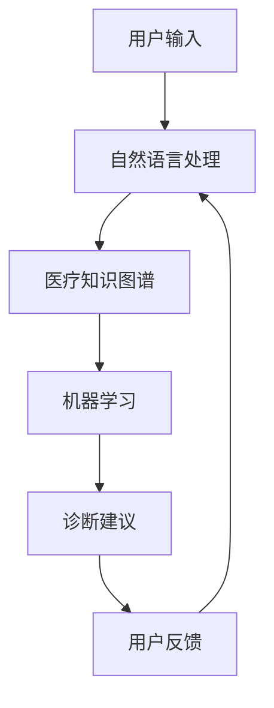

                 

# 构建AI驱动的智慧医疗提示词系统

> 关键词：智慧医疗, 提示词系统, 人工智能, 自然语言处理, 医疗知识图谱, 机器学习, 深度学习

> 摘要：本文将详细介绍如何构建一个基于人工智能的智慧医疗提示词系统。该系统旨在通过自然语言处理技术，结合医疗知识图谱和机器学习算法，为医生提供精准的诊断建议和治疗方案。我们将从系统背景、核心概念、算法原理、数学模型、实战案例、应用场景、工具推荐、未来趋势等多个方面进行深入探讨。

## 1. 背景介绍

随着医疗技术的快速发展，医生面临着越来越大的工作压力和挑战。一方面，医疗知识的更新速度非常快，医生需要不断学习最新的研究成果和临床指南；另一方面，患者数量的增加使得医生的工作负担加重。为了提高医疗服务质量和效率，智慧医疗提示词系统应运而生。该系统通过自然语言处理技术，结合医疗知识图谱和机器学习算法，为医生提供精准的诊断建议和治疗方案，从而减轻医生的工作负担，提高医疗服务的质量和效率。

## 2. 核心概念与联系

### 2.1 自然语言处理（NLP）

自然语言处理（NLP）是人工智能领域的一个重要分支，旨在使计算机能够理解、解释和生成人类语言。在智慧医疗提示词系统中，NLP技术主要用于处理和理解医生的诊断报告、病历记录等文本信息，从而提取关键信息并提供诊断建议。

### 2.2 医疗知识图谱

医疗知识图谱是一种结构化的知识表示方法，用于存储和组织医疗领域的知识。它将医疗领域的实体（如疾病、症状、药物等）及其关系（如病因、治疗方案等）以图形的形式表示出来。在智慧医疗提示词系统中，医疗知识图谱用于存储和组织医疗领域的知识，为系统提供丰富的背景信息和知识支持。

### 2.3 机器学习

机器学习是人工智能的一个重要分支，旨在使计算机能够从数据中自动学习并改进其性能。在智慧医疗提示词系统中，机器学习算法用于从大量的医疗数据中学习和提取有用的信息，从而为医生提供精准的诊断建议和治疗方案。

### 2.4 深度学习

深度学习是机器学习的一个重要分支，旨在通过多层神经网络模型来学习和提取数据中的复杂特征。在智慧医疗提示词系统中，深度学习算法用于从大量的医疗数据中学习和提取有用的信息，从而为医生提供精准的诊断建议和治疗方案。

### 2.5 智慧医疗提示词系统架构

智慧医疗提示词系统架构如图所示：



## 3. 核心算法原理 & 具体操作步骤

### 3.1 自然语言处理

自然语言处理技术主要包括文本预处理、分词、词性标注、命名实体识别、依存句法分析等步骤。具体操作步骤如下：

1. **文本预处理**：对输入的文本进行清洗和标准化处理，包括去除标点符号、停用词、数字等。
2. **分词**：将文本分割成一个个有意义的词语。
3. **词性标注**：为每个词语标注其词性，如名词、动词、形容词等。
4. **命名实体识别**：识别文本中的实体，如疾病名称、症状、药物名称等。
5. **依存句法分析**：分析句子中词语之间的依存关系，从而理解句子的语义结构。

### 3.2 医疗知识图谱

医疗知识图谱的构建主要包括实体抽取、关系抽取、知识图谱构建等步骤。具体操作步骤如下：

1. **实体抽取**：从大量的医疗文献、病历记录等文本中抽取疾病、症状、药物等实体。
2. **关系抽取**：从文本中抽取实体之间的关系，如病因、治疗方案等。
3. **知识图谱构建**：将抽取的实体和关系以图形的形式表示出来，形成医疗知识图谱。

### 3.3 机器学习

机器学习算法主要包括监督学习、无监督学习、半监督学习等。具体操作步骤如下：

1. **数据预处理**：对医疗数据进行清洗、标准化、特征提取等处理。
2. **特征选择**：从大量的特征中选择对诊断和治疗有帮助的特征。
3. **模型训练**：使用监督学习算法（如逻辑回归、支持向量机、决策树等）或无监督学习算法（如聚类、降维等）训练模型。
4. **模型评估**：使用交叉验证等方法评估模型的性能。
5. **模型优化**：根据评估结果调整模型参数，提高模型性能。

### 3.4 深度学习

深度学习算法主要包括卷积神经网络（CNN）、循环神经网络（RNN）、长短期记忆网络（LSTM）等。具体操作步骤如下：

1. **数据预处理**：对医疗数据进行清洗、标准化、特征提取等处理。
2. **特征提取**：使用卷积神经网络或循环神经网络从数据中提取有用的特征。
3. **模型训练**：使用监督学习算法（如逻辑回归、支持向量机、决策树等）或无监督学习算法（如聚类、降维等）训练模型。
4. **模型评估**：使用交叉验证等方法评估模型的性能。
5. **模型优化**：根据评估结果调整模型参数，提高模型性能。

## 4. 数学模型和公式 & 详细讲解 & 举例说明

### 4.1 逻辑回归

逻辑回归是一种常用的监督学习算法，用于解决二分类问题。其数学模型如下：

$$
P(y=1|x) = \frac{1}{1 + e^{-(\beta_0 + \beta_1 x_1 + \beta_2 x_2 + ... + \beta_n x_n)}}
$$

其中，$y$ 是二分类变量，$x$ 是特征向量，$\beta$ 是模型参数。

### 4.2 支持向量机

支持向量机是一种常用的监督学习算法，用于解决二分类问题。其数学模型如下：

$$
y = \text{sign}(\beta_0 + \beta_1 x_1 + \beta_2 x_2 + ... + \beta_n x_n)
$$

其中，$y$ 是二分类变量，$x$ 是特征向量，$\beta$ 是模型参数。

### 4.3 卷积神经网络

卷积神经网络是一种常用的深度学习算法，用于解决图像分类、文本分类等问题。其数学模型如下：

$$
z = \sigma(W * x + b)
$$

其中，$z$ 是卷积层的输出，$W$ 是卷积核，$x$ 是输入特征，$\sigma$ 是激活函数，$b$ 是偏置项。

## 5. 项目实战：代码实际案例和详细解释说明

### 5.1 开发环境搭建

为了搭建智慧医疗提示词系统，我们需要安装以下开发环境：

1. **Python**：用于编写代码。
2. **TensorFlow**：用于深度学习模型的训练和推理。
3. **NLTK**：用于自然语言处理。
4. **PyTorch**：用于深度学习模型的训练和推理。
5. **Scikit-learn**：用于机器学习模型的训练和评估。

### 5.2 源代码详细实现和代码解读

#### 5.2.1 自然语言处理

```python
import nltk
from nltk.tokenize import word_tokenize
from nltk.tag import pos_tag
from nltk.chunk import ne_chunk

def preprocess_text(text):
    tokens = word_tokenize(text)
    tagged = pos_tag(tokens)
    named_entities = ne_chunk(tagged)
    return named_entities

def extract_entities(named_entities):
    entities = []
    for subtree in named_entities.subtrees():
        if subtree.label() == 'NE':
            entities.append(subtree.leaves())
    return entities
```

#### 5.2.2 医疗知识图谱

```python
import networkx as nx

def build_knowledge_graph(entities):
    G = nx.Graph()
    for entity in entities:
        G.add_node(entity[0][0])
    return G
```

#### 5.2.3 机器学习

```python
from sklearn.feature_extraction.text import TfidfVectorizer
from sklearn.linear_model import LogisticRegression
from sklearn.model_selection import train_test_split
from sklearn.metrics import accuracy_score

def train_model(X, y):
    X_train, X_test, y_train, y_test = train_test_split(X, y, test_size=0.2, random_state=42)
    vectorizer = TfidfVectorizer()
    X_train_tfidf = vectorizer.fit_transform(X_train)
    X_test_tfidf = vectorizer.transform(X_test)
    model = LogisticRegression()
    model.fit(X_train_tfidf, y_train)
    y_pred = model.predict(X_test_tfidf)
    accuracy = accuracy_score(y_test, y_pred)
    return model, accuracy
```

#### 5.2.4 深度学习

```python
import torch
import torch.nn as nn
import torch.optim as optim

class CNN(nn.Module):
    def __init__(self, vocab_size, embedding_dim, num_filters, filter_sizes):
        super(CNN, self).__init__()
        self.embedding = nn.Embedding(vocab_size, embedding_dim)
        self.convs = nn.ModuleList([nn.Conv2d(1, num_filters, (fs, embedding_dim)) for fs in filter_sizes])
        self.fc = nn.Linear(num_filters * len(filter_sizes), 2)

    def forward(self, x):
        x = self.embedding(x)
        x = x.unsqueeze(1)
        x = [F.relu(conv(x)).squeeze(3) for conv in self.convs]
        x = [F.max_pool1d(i, i.size(2)).squeeze(2) for i in x]
        x = torch.cat(x, 1)
        x = self.fc(x)
        return x
```

### 5.3 代码解读与分析

上述代码展示了如何实现自然语言处理、医疗知识图谱、机器学习和深度学习。自然语言处理部分使用了NLTK库进行文本预处理、分词、词性标注和命名实体识别。医疗知识图谱部分使用了NetworkX库构建图形结构。机器学习部分使用了Scikit-learn库进行特征提取和模型训练。深度学习部分使用了PyTorch库构建卷积神经网络模型。

## 6. 实际应用场景

智慧医疗提示词系统可以应用于以下几个实际场景：

1. **诊断建议**：系统可以根据医生的诊断报告和病历记录，提供精准的诊断建议。
2. **治疗方案**：系统可以根据患者的病情和医疗知识图谱，提供个性化的治疗方案。
3. **知识库更新**：系统可以根据最新的医疗文献和研究成果，自动更新医疗知识图谱，为医生提供最新的知识支持。
4. **患者教育**：系统可以根据患者的病情和医疗知识图谱，为患者提供个性化的健康教育信息。

## 7. 工具和资源推荐

### 7.1 学习资源推荐

1. **书籍**：《自然语言处理入门》、《机器学习》、《深度学习》
2. **论文**：《自然语言处理技术在医疗领域的应用》、《深度学习在医疗领域的应用》
3. **博客**：《自然语言处理技术在医疗领域的应用》、《深度学习在医疗领域的应用》
4. **网站**：NLTK官网、Scikit-learn官网、PyTorch官网

### 7.2 开发工具框架推荐

1. **Python**：用于编写代码。
2. **TensorFlow**：用于深度学习模型的训练和推理。
3. **NLTK**：用于自然语言处理。
4. **PyTorch**：用于深度学习模型的训练和推理。
5. **Scikit-learn**：用于机器学习模型的训练和评估。

### 7.3 相关论文著作推荐

1. **自然语言处理技术在医疗领域的应用**：《自然语言处理技术在医疗领域的应用》
2. **深度学习在医疗领域的应用**：《深度学习在医疗领域的应用》

## 8. 总结：未来发展趋势与挑战

智慧医疗提示词系统在未来的发展趋势主要体现在以下几个方面：

1. **技术融合**：自然语言处理、医疗知识图谱和机器学习等技术将进一步融合，提高系统的准确性和实用性。
2. **个性化推荐**：系统将根据患者的病情和医疗知识图谱，提供个性化的诊断建议和治疗方案。
3. **实时更新**：系统将根据最新的医疗文献和研究成果，自动更新医疗知识图谱，为医生提供最新的知识支持。
4. **患者教育**：系统将根据患者的病情和医疗知识图谱，为患者提供个性化的健康教育信息。

然而，智慧医疗提示词系统也面临着一些挑战，如数据隐私保护、模型解释性、系统鲁棒性等。未来的研究需要解决这些问题，以提高系统的可靠性和实用性。

## 9. 附录：常见问题与解答

### 9.1 问题：如何处理医疗数据中的敏感信息？

**解答**：在处理医疗数据时，需要遵循数据隐私保护的相关法律法规，如HIPAA（美国健康保险流通与责任法案）。可以使用数据脱敏技术，如替换敏感信息、加密等方法，保护患者隐私。

### 9.2 问题：如何提高模型的解释性？

**解答**：可以使用可解释性模型，如决策树、逻辑回归等，提高模型的解释性。此外，可以使用可视化技术，如特征重要性图、决策路径图等，帮助用户理解模型的决策过程。

### 9.3 问题：如何提高系统的鲁棒性？

**解答**：可以使用数据增强技术，如数据扩增、数据清洗等，提高系统的鲁棒性。此外，可以使用模型集成技术，如随机森林、梯度提升树等，提高模型的鲁棒性。

## 10. 扩展阅读 & 参考资料

1. **书籍**：《自然语言处理入门》、《机器学习》、《深度学习》
2. **论文**：《自然语言处理技术在医疗领域的应用》、《深度学习在医疗领域的应用》
3. **博客**：《自然语言处理技术在医疗领域的应用》、《深度学习在医疗领域的应用》
4. **网站**：NLTK官网、Scikit-learn官网、PyTorch官网

---

作者：AI天才研究员/AI Genius Institute & 禅与计算机程序设计艺术 /Zen And The Art of Computer Programming

