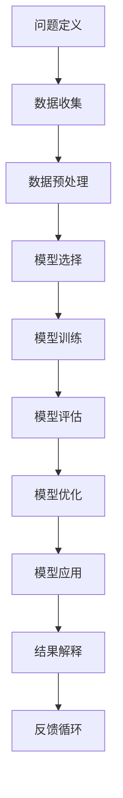

                 

# 模型思维应用: 快速理解新事物

> 关键词：模型思维, 快速理解, 新事物, 逻辑推理, 数据分析, 人工智能, 计算机科学

> 摘要：本文旨在通过模型思维的应用，帮助读者快速理解新事物。我们将从背景介绍开始，逐步深入探讨模型思维的核心概念、原理、算法、数学模型、实际案例、应用场景、工具推荐以及未来发展趋势。通过本文，读者将能够掌握如何运用模型思维来快速理解复杂系统，并在实际项目中应用这一方法。

## 1. 背景介绍

在当今快速变化的技术领域，快速理解新事物的能力变得尤为重要。无论是人工智能、机器学习、数据分析还是其他新兴技术，理解这些技术背后的原理和机制是至关重要的。模型思维是一种强大的工具，它可以帮助我们快速理解复杂系统，并从中提取有价值的信息。本文将通过逐步分析推理的方式，帮助读者掌握模型思维的应用方法。

## 2. 核心概念与联系

### 2.1 模型思维的基本概念

模型思维是指通过构建抽象模型来理解和分析复杂系统的方法。模型是一种简化现实世界的工具，它通过去除不必要的细节，保留关键特征来帮助我们更好地理解问题。模型思维的核心在于通过简化和抽象，将复杂问题转化为易于理解和处理的形式。

### 2.2 模型思维的应用场景

模型思维广泛应用于各个领域，包括但不限于：

- **数据分析**：通过构建数据模型来分析和预测数据趋势。
- **机器学习**：通过构建机器学习模型来实现自动化决策。
- **系统设计**：通过构建系统模型来优化系统性能。
- **风险管理**：通过构建风险模型来评估和管理风险。

### 2.3 模型思维的流程图



## 3. 核心算法原理 & 具体操作步骤

### 3.1 数据预处理

数据预处理是模型训练前的重要步骤，它包括数据清洗、特征选择和数据标准化等。数据预处理的目的是确保数据的质量和一致性，从而提高模型的性能。

#### 3.1.1 数据清洗

数据清洗是指去除数据中的噪声和错误，确保数据的准确性和完整性。常见的数据清洗方法包括：

- **缺失值处理**：通过插值、删除或填充缺失值来处理缺失数据。
- **异常值处理**：通过统计方法或可视化方法识别并处理异常值。
- **重复数据处理**：通过去重算法去除重复数据。

#### 3.1.2 特征选择

特征选择是指从原始数据中选择最相关的特征，以提高模型的性能。常见的特征选择方法包括：

- **相关性分析**：通过计算特征之间的相关系数来选择相关性高的特征。
- **特征重要性评估**：通过模型训练过程中特征的重要性评估来选择重要特征。
- **降维技术**：通过主成分分析（PCA）等降维技术来减少特征维度。

#### 3.1.3 数据标准化

数据标准化是指将数据转换为统一的尺度，以提高模型的性能。常见的数据标准化方法包括：

- **最小-最大标准化**：将数据缩放到指定的范围，如[0, 1]。
- **Z-score标准化**：将数据转换为均值为0、标准差为1的正态分布。
- **归一化**：将数据转换为单位向量。

### 3.2 模型选择

模型选择是指根据问题的特性和数据的特点选择合适的模型。常见的模型选择方法包括：

- **线性模型**：如线性回归、逻辑回归等。
- **树模型**：如决策树、随机森林等。
- **神经网络模型**：如深度学习模型、卷积神经网络（CNN）等。

### 3.3 模型训练

模型训练是指通过优化模型参数来使模型在训练数据上表现最佳。常见的模型训练方法包括：

- **梯度下降**：通过迭代优化模型参数来最小化损失函数。
- **正则化**：通过添加正则化项来防止过拟合。
- **交叉验证**：通过交叉验证来评估模型的泛化能力。

### 3.4 模型评估

模型评估是指通过评估指标来衡量模型的性能。常见的评估指标包括：

- **准确率**：分类模型的准确率。
- **召回率**：分类模型的召回率。
- **F1分数**：准确率和召回率的调和平均值。
- **均方误差**：回归模型的均方误差。

## 4. 数学模型和公式 & 详细讲解 & 举例说明

### 4.1 线性回归模型

线性回归模型是一种常用的回归模型，它通过拟合一条直线来预测目标变量。线性回归模型的数学表达式为：

$$
y = \beta_0 + \beta_1 x_1 + \beta_2 x_2 + \cdots + \beta_n x_n + \epsilon
$$

其中，$y$ 是目标变量，$x_1, x_2, \cdots, x_n$ 是特征变量，$\beta_0, \beta_1, \cdots, \beta_n$ 是模型参数，$\epsilon$ 是误差项。

### 4.2 逻辑回归模型

逻辑回归模型是一种常用的分类模型，它通过拟合一条S形曲线来预测目标变量。逻辑回归模型的数学表达式为：

$$
P(y=1|x) = \frac{1}{1 + e^{-(\beta_0 + \beta_1 x_1 + \beta_2 x_2 + \cdots + \beta_n x_n)}}
$$

其中，$P(y=1|x)$ 是目标变量为1的概率，$x_1, x_2, \cdots, x_n$ 是特征变量，$\beta_0, \beta_1, \cdots, \beta_n$ 是模型参数。

### 4.3 决策树模型

决策树模型是一种常用的分类和回归模型，它通过构建一棵树来预测目标变量。决策树模型的数学表达式为：

$$
y = \begin{cases}
    y_1 & \text{if } x \in R_1 \\
    y_2 & \text{if } x \in R_2 \\
    \vdots \\
    y_m & \text{if } x \in R_m
\end{cases}
$$

其中，$y_1, y_2, \cdots, y_m$ 是叶子节点的预测值，$R_1, R_2, \cdots, R_m$ 是特征空间的划分区域。

## 5. 项目实战：代码实际案例和详细解释说明

### 5.1 开发环境搭建

为了进行模型训练和评估，我们需要搭建一个开发环境。这里我们使用Python语言和Scikit-learn库来实现。

#### 5.1.1 安装Python和Scikit-learn

首先，确保已经安装了Python和pip。然后，使用pip安装Scikit-learn库：

```bash
pip install scikit-learn
```

### 5.2 源代码详细实现和代码解读

我们将使用一个简单的数据集来实现线性回归模型。数据集包含两个特征和一个目标变量。

#### 5.2.1 导入库和数据

```python
import numpy as np
import pandas as pd
from sklearn.model_selection import train_test_split
from sklearn.linear_model import LinearRegression
from sklearn.metrics import mean_squared_error

# 加载数据
data = pd.read_csv('data.csv')
X = data[['feature1', 'feature2']]
y = data['target']
```

#### 5.2.2 数据预处理

```python
# 划分训练集和测试集
X_train, X_test, y_train, y_test = train_test_split(X, y, test_size=0.2, random_state=42)

# 数据标准化
from sklearn.preprocessing import StandardScaler
scaler = StandardScaler()
X_train = scaler.fit_transform(X_train)
X_test = scaler.transform(X_test)
```

#### 5.2.3 模型训练

```python
# 创建线性回归模型
model = LinearRegression()

# 训练模型
model.fit(X_train, y_train)
```

#### 5.2.4 模型评估

```python
# 预测测试集
y_pred = model.predict(X_test)

# 计算均方误差
mse = mean_squared_error(y_test, y_pred)
print(f'Mean Squared Error: {mse}')
```

### 5.3 代码解读与分析

- **导入库和数据**：导入必要的库和数据集。
- **数据预处理**：将数据划分为训练集和测试集，并进行标准化处理。
- **模型训练**：创建线性回归模型并进行训练。
- **模型评估**：使用测试集进行预测，并计算均方误差来评估模型性能。

## 6. 实际应用场景

模型思维在实际应用中有着广泛的应用场景，包括但不限于：

- **金融风控**：通过构建风险模型来评估贷款违约风险。
- **医疗诊断**：通过构建诊断模型来预测疾病风险。
- **市场营销**：通过构建用户行为模型来预测用户购买行为。
- **智能推荐**：通过构建推荐模型来提高用户满意度。

## 7. 工具和资源推荐

### 7.1 学习资源推荐

- **书籍**：《统计学习方法》、《机器学习》
- **论文**：《深度学习》、《神经网络与深度学习》
- **博客**：Medium、Towards Data Science
- **网站**：Kaggle、GitHub

### 7.2 开发工具框架推荐

- **Python**：Scikit-learn、TensorFlow、PyTorch
- **R**：caret、mlr
- **Java**：Weka、Deeplearning4j

### 7.3 相关论文著作推荐

- **《统计学习方法》**：李航著
- **《机器学习》**：周志华著
- **《深度学习》**：Ian Goodfellow、Yoshua Bengio、Aaron Courville著

## 8. 总结：未来发展趋势与挑战

模型思维在未来将继续发挥重要作用，尤其是在以下几个方面：

- **自动化**：通过自动化工具和框架来简化模型构建过程。
- **可解释性**：提高模型的可解释性，以便更好地理解模型的决策过程。
- **实时性**：提高模型的实时处理能力，以应对快速变化的数据环境。

然而，模型思维也面临着一些挑战，包括：

- **数据隐私**：如何在保护数据隐私的同时进行模型训练。
- **模型泛化**：如何提高模型的泛化能力，以应对未知的数据。
- **模型解释**：如何提高模型的可解释性，以便更好地理解模型的决策过程。

## 9. 附录：常见问题与解答

### 9.1 问题：如何选择合适的模型？

**解答**：选择合适的模型需要考虑问题的特性和数据的特点。可以通过实验和比较不同模型的性能来选择最佳模型。

### 9.2 问题：如何处理缺失数据？

**解答**：可以通过插值、删除或填充缺失值来处理缺失数据。具体方法取决于数据的特性和问题的需求。

### 9.3 问题：如何提高模型的泛化能力？

**解答**：可以通过正则化、交叉验证和数据增强等方法来提高模型的泛化能力。

## 10. 扩展阅读 & 参考资料

- **书籍**：《统计学习方法》、《机器学习》
- **论文**：《深度学习》、《神经网络与深度学习》
- **博客**：Medium、Towards Data Science
- **网站**：Kaggle、GitHub

---

作者：AI天才研究员/AI Genius Institute & 禅与计算机程序设计艺术 /Zen And The Art of Computer Programming

