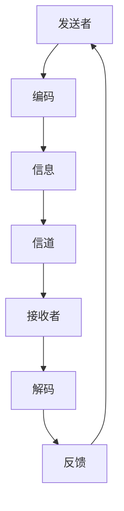

                 

# 沟通能力培养：出色的沟通和人际交往能力，能够与内部利益相关者和外部供应商建立联系和协作

> 关键词：沟通能力、人际交往、利益相关者、供应商协作、团队合作、项目管理、技术交流

> 摘要：在技术领域，沟通能力是成功的关键。本文将深入探讨如何培养出色的沟通和人际交往能力，特别是在与内部利益相关者和外部供应商建立联系和协作方面。我们将通过逻辑清晰的分析和具体的案例，帮助读者理解沟通的重要性，并提供实用的建议和工具，以提升个人和团队的沟通效率。

## 1. 背景介绍

在当今复杂多变的商业环境中，技术团队需要与各种利益相关者和供应商进行有效沟通。无论是内部的利益相关者，如项目经理、产品经理、设计师，还是外部的供应商，如软件开发公司、硬件制造商，良好的沟通能力都是确保项目成功的关键因素。本文将从以下几个方面进行探讨：

- **沟通的重要性**：为什么沟通在技术项目中如此重要。
- **沟通的挑战**：技术团队在沟通中面临的常见问题。
- **沟通的目标**：如何设定和实现有效的沟通目标。

### 1.1 沟通的重要性

有效的沟通能够确保项目目标的一致性，减少误解和冲突，提高团队协作效率。在技术项目中，沟通的重要性体现在以下几个方面：

- **明确项目目标**：确保所有利益相关者对项目目标有共同的理解。
- **提高协作效率**：通过及时的信息共享，减少重复工作和返工。
- **增强团队凝聚力**：良好的沟通能够增强团队成员之间的信任和合作。
- **促进创新**：开放的沟通渠道能够激发团队成员的创新思维。

### 1.2 沟通的挑战

技术团队在沟通中面临的挑战主要包括：

- **技术术语的障碍**：技术术语和行业术语可能导致沟通不畅。
- **信息不对称**：不同角色对项目的需求和期望可能存在差异。
- **文化差异**：跨国团队或跨文化团队可能面临沟通障碍。
- **时间压力**：紧迫的项目时间表可能导致沟通不足。

### 1.3 沟通的目标

设定明确的沟通目标是实现有效沟通的关键。沟通目标应包括：

- **明确的信息传递**：确保信息准确无误地传达给所有相关方。
- **及时的信息反馈**：建立及时的信息反馈机制，确保问题能够迅速解决。
- **建立信任关系**：通过透明和诚实的沟通，建立团队成员之间的信任。
- **促进团队合作**：通过有效的沟通，促进团队成员之间的合作和协调。

## 2. 核心概念与联系

### 2.1 沟通模型

沟通模型是理解沟通过程的基础。我们将使用以下流程图来描述沟通模型：



### 2.2 沟通的层次

沟通可以分为以下几个层次：

- **语言层次**：通过语言进行信息传递。
- **情感层次**：通过情感表达来影响对方。
- **行为层次**：通过行为来传递信息。
- **文化层次**：通过文化背景来理解信息。

### 2.3 沟通的类型

沟通可以分为以下几个类型：

- **正式沟通**：通过正式渠道进行的信息传递。
- **非正式沟通**：通过非正式渠道进行的信息传递。
- **口头沟通**：通过语言进行的信息传递。
- **书面沟通**：通过文字进行的信息传递。
- **非语言沟通**：通过肢体语言、表情等进行的信息传递。

## 3. 核心算法原理 & 具体操作步骤

### 3.1 沟通策略

有效的沟通策略包括以下几个方面：

- **明确目标**：确定沟通的目标和期望结果。
- **选择合适的沟通渠道**：根据沟通对象和内容选择合适的沟通渠道。
- **准备充分**：在沟通前做好充分的准备，包括信息整理和问题预测。
- **倾听和反馈**：积极倾听对方的观点，并及时给予反馈。
- **建立信任**：通过诚实和透明的沟通建立信任关系。
- **解决冲突**：及时解决沟通中的冲突和误解。

### 3.2 沟通技巧

有效的沟通技巧包括以下几个方面：

- **清晰表达**：使用简单明了的语言表达观点。
- **积极倾听**：倾听对方的观点，并给予积极的反馈。
- **非语言沟通**：通过肢体语言和表情增强沟通效果。
- **适应性沟通**：根据沟通对象和情境调整沟通方式。
- **情绪管理**：控制自己的情绪，避免情绪化的沟通。

## 4. 数学模型和公式 & 详细讲解 & 举例说明

### 4.1 沟通效率模型

沟通效率可以通过以下公式进行计算：

$$
\text{沟通效率} = \frac{\text{有效信息量}}{\text{总信息量}}
$$

其中，有效信息量是指传递给接收者的准确信息量，总信息量是指发送者提供的全部信息量。

### 4.2 沟通成本模型

沟通成本可以通过以下公式进行计算：

$$
\text{沟通成本} = \text{时间成本} + \text{人力成本} + \text{信息成本}
$$

其中，时间成本是指沟通所需的时间，人力成本是指参与沟通的人力资源成本，信息成本是指传递信息所需的资源成本。

### 4.3 案例分析

假设一个技术团队正在开发一个新项目，项目涉及多个利益相关者和外部供应商。为了确保项目的顺利进行，团队需要制定有效的沟通策略和技巧。

#### 4.3.1 沟通策略

- **明确目标**：确保所有利益相关者对项目目标有共同的理解。
- **选择合适的沟通渠道**：根据沟通对象和内容选择合适的沟通渠道。
- **准备充分**：在沟通前做好充分的准备，包括信息整理和问题预测。
- **倾听和反馈**：积极倾听对方的观点，并及时给予反馈。
- **建立信任**：通过诚实和透明的沟通建立信任关系。
- **解决冲突**：及时解决沟通中的冲突和误解。

#### 4.3.2 沟通技巧

- **清晰表达**：使用简单明了的语言表达观点。
- **积极倾听**：倾听对方的观点，并给予积极的反馈。
- **非语言沟通**：通过肢体语言和表情增强沟通效果。
- **适应性沟通**：根据沟通对象和情境调整沟通方式。
- **情绪管理**：控制自己的情绪，避免情绪化的沟通。

## 5. 项目实战：代码实际案例和详细解释说明

### 5.1 开发环境搭建

为了实现有效的沟通，我们需要搭建一个支持团队协作的开发环境。以下是一个简单的开发环境搭建步骤：

1. **选择合适的开发工具**：根据团队的需求选择合适的开发工具，如Git、Jira、Slack等。
2. **配置版本控制系统**：使用Git进行版本控制，确保代码的可追溯性和协作效率。
3. **设置项目管理工具**：使用Jira进行项目管理和任务分配，确保任务的透明度和可追踪性。
4. **配置即时通讯工具**：使用Slack进行即时通讯，确保团队成员之间的及时沟通。

### 5.2 源代码详细实现和代码解读

以下是一个简单的代码示例，用于展示如何实现有效的沟通：

```python
def communicate_with_stakeholders(stakeholders):
    """
    与利益相关者进行沟通
    :param stakeholders: 利益相关者列表
    """
    for stakeholder in stakeholders:
        if stakeholder == "项目经理":
            print("与项目经理沟通项目目标和进度")
        elif stakeholder == "产品经理":
            print("与产品经理沟通产品需求和功能")
        elif stakeholder == "设计师":
            print("与设计师沟通设计需求和细节")
        else:
            print("与供应商沟通技术细节和需求")

# 示例调用
communicate_with_stakeholders(["项目经理", "产品经理", "设计师", "供应商"])
```

### 5.3 代码解读与分析

上述代码定义了一个名为`communicate_with_stakeholders`的函数，用于与不同利益相关者进行沟通。函数通过遍历利益相关者列表，根据不同的角色进行针对性的沟通。这种代码结构清晰地展示了如何根据不同角色进行有效的沟通。

## 6. 实际应用场景

### 6.1 项目管理

在项目管理中，有效的沟通能够确保项目目标的一致性，减少误解和冲突，提高团队协作效率。例如，在一个大型软件开发项目中，项目经理需要与产品经理、设计师、开发人员等进行有效的沟通，确保项目目标的一致性和进度的透明度。

### 6.2 技术交流

在技术交流中，有效的沟通能够促进团队成员之间的知识共享和技术创新。例如，在一个技术论坛或会议上，技术人员需要与同行进行有效的沟通，分享自己的经验和见解，促进技术进步。

## 7. 工具和资源推荐

### 7.1 学习资源推荐

- **书籍**：《沟通的艺术》、《高效能人士的七个习惯》
- **论文**：《沟通理论与实践》、《有效沟通的策略与技巧》
- **博客**：Medium上的技术博客、LinkedIn上的技术文章
- **网站**：Coursera、Udemy等在线教育平台上的沟通课程

### 7.2 开发工具框架推荐

- **版本控制系统**：Git、SVN
- **项目管理工具**：Jira、Trello
- **即时通讯工具**：Slack、Microsoft Teams

### 7.3 相关论文著作推荐

- **论文**：《沟通理论与实践》、《有效沟通的策略与技巧》
- **著作**：《沟通的艺术》、《高效能人士的七个习惯》

## 8. 总结：未来发展趋势与挑战

### 8.1 未来发展趋势

- **数字化沟通**：随着数字化技术的发展，数字化沟通将成为主流。
- **跨文化沟通**：全球化趋势下，跨文化沟通将成为重要的沟通方式。
- **智能沟通**：人工智能技术的发展将为沟通提供更多的智能化工具。

### 8.2 挑战

- **技术障碍**：技术术语和行业术语可能导致沟通不畅。
- **文化差异**：跨国团队或跨文化团队可能面临沟通障碍。
- **时间压力**：紧迫的项目时间表可能导致沟通不足。

## 9. 附录：常见问题与解答

### 9.1 问题1：如何克服技术术语的障碍？

**解答**：可以通过以下方式克服技术术语的障碍：

- **使用简单的语言**：尽量使用简单明了的语言表达观点。
- **提供解释**：在使用技术术语时，提供相应的解释和背景信息。
- **使用图表和示例**：通过图表和示例来帮助理解技术术语。

### 9.2 问题2：如何解决跨文化沟通的挑战？

**解答**：可以通过以下方式解决跨文化沟通的挑战：

- **了解文化背景**：了解不同文化背景下的沟通习惯和价值观。
- **建立信任关系**：通过诚实和透明的沟通建立信任关系。
- **适应性沟通**：根据沟通对象和情境调整沟通方式。

## 10. 扩展阅读 & 参考资料

- **书籍**：《沟通的艺术》、《高效能人士的七个习惯》
- **论文**：《沟通理论与实践》、《有效沟通的策略与技巧》
- **博客**：Medium上的技术博客、LinkedIn上的技术文章
- **网站**：Coursera、Udemy等在线教育平台上的沟通课程

---

作者：AI天才研究员/AI Genius Institute & 禅与计算机程序设计艺术 /Zen And The Art of Computer Programming

