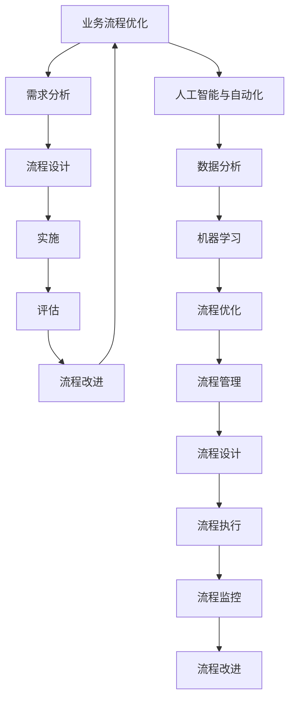

                 

# 流程优化：提高工作效率，降低运营成本

> 关键词：流程优化, 工作效率, 运营成本, 人工智能, 自动化, 数据分析, 机器学习, 流程管理

> 摘要：在当今快速变化的商业环境中，流程优化已成为提高工作效率和降低运营成本的关键。本文将通过逐步分析和推理，探讨如何利用人工智能和自动化技术优化业务流程，提高整体运营效率。我们将从核心概念、算法原理、实际案例、应用场景等多个角度进行深入剖析，旨在为读者提供全面的技术指导和实用建议。

## 1. 背景介绍

在数字化转型的大背景下，企业面临着前所未有的挑战和机遇。随着业务规模的不断扩大，企业需要处理的数据量也在不断增加，这给企业的运营带来了巨大的压力。如何在保证服务质量的同时，提高工作效率，降低运营成本，成为企业亟待解决的问题。流程优化作为提高效率和降低成本的有效手段，受到了广泛关注。通过优化业务流程，企业可以实现资源的有效配置，提高工作效率，从而在激烈的市场竞争中占据优势。

## 2. 核心概念与联系

### 2.1 业务流程优化

业务流程优化是指通过对现有业务流程进行分析、改进和优化，以提高工作效率和降低运营成本的过程。它涵盖了从需求分析、流程设计、实施到评估的全过程。

### 2.2 人工智能与自动化

人工智能（AI）和自动化技术在流程优化中发挥着重要作用。AI技术可以通过数据分析和机器学习算法，自动识别流程中的瓶颈和优化点，从而实现流程的智能化优化。自动化技术则可以替代人工操作，提高工作效率，减少人为错误。

### 2.3 流程管理

流程管理是指对业务流程进行规划、设计、执行和监控的过程。它包括流程设计、流程执行、流程监控和流程改进等多个环节。通过有效的流程管理，企业可以确保业务流程的高效运行。

### 2.4 Mermaid 流程图



## 3. 核心算法原理 & 具体操作步骤

### 3.1 数据分析

数据分析是流程优化的基础。通过对业务数据进行分析，可以发现流程中的瓶颈和优化点。数据分析主要包括数据收集、数据清洗、数据挖掘和数据可视化等步骤。

#### 3.1.1 数据收集

数据收集是指从各种来源获取数据的过程。常见的数据来源包括业务系统、传感器、社交媒体等。

#### 3.1.2 数据清洗

数据清洗是指对收集到的数据进行预处理，去除无效数据和错误数据，确保数据的质量。

#### 3.1.3 数据挖掘

数据挖掘是指从大量数据中提取有价值的信息和知识的过程。常用的数据挖掘技术包括聚类分析、关联规则挖掘、分类和回归分析等。

#### 3.1.4 数据可视化

数据可视化是指将数据以图形化的方式展示出来，便于理解和分析。常用的数据可视化工具包括Tableau、Power BI等。

### 3.2 机器学习

机器学习是流程优化的关键技术之一。通过机器学习算法，可以自动识别流程中的瓶颈和优化点，从而实现流程的智能化优化。

#### 3.2.1 监督学习

监督学习是指通过已知的数据集训练模型，使其能够对新的数据进行预测或分类。常用的方法包括线性回归、逻辑回归、支持向量机等。

#### 3.2.2 非监督学习

非监督学习是指在没有标签的情况下，通过算法自动发现数据中的模式和结构。常用的方法包括聚类分析、主成分分析等。

#### 3.2.3 强化学习

强化学习是指通过与环境的交互，学习最优策略的过程。常用的方法包括Q-learning、深度强化学习等。

### 3.3 自动化技术

自动化技术可以替代人工操作，提高工作效率，减少人为错误。常见的自动化技术包括机器人流程自动化（RPA）、自动化测试等。

#### 3.3.1 机器人流程自动化（RPA）

RPA是指通过软件机器人模拟人工操作，实现自动化处理。RPA可以应用于各种业务场景，如数据录入、报表生成等。

#### 3.3.2 自动化测试

自动化测试是指通过自动化工具对软件进行测试的过程。自动化测试可以提高测试效率，减少人为错误。

## 4. 数学模型和公式 & 详细讲解 & 举例说明

### 4.1 线性回归

线性回归是一种监督学习方法，用于预测连续值。其数学模型为：

$$
y = \beta_0 + \beta_1 x_1 + \beta_2 x_2 + \cdots + \beta_n x_n + \epsilon
$$

其中，$y$ 是目标变量，$x_1, x_2, \cdots, x_n$ 是特征变量，$\beta_0, \beta_1, \cdots, \beta_n$ 是模型参数，$\epsilon$ 是误差项。

### 4.2 逻辑回归

逻辑回归是一种监督学习方法，用于预测二分类问题。其数学模型为：

$$
P(y=1|x) = \frac{1}{1 + e^{-(\beta_0 + \beta_1 x_1 + \beta_2 x_2 + \cdots + \beta_n x_n)}}
$$

其中，$P(y=1|x)$ 是目标变量为1的概率，$x_1, x_2, \cdots, x_n$ 是特征变量，$\beta_0, \beta_1, \cdots, \beta_n$ 是模型参数。

### 4.3 聚类分析

聚类分析是一种非监督学习方法，用于发现数据中的模式和结构。常用的方法包括K-means聚类和层次聚类。

#### 4.3.1 K-means聚类

K-means聚类是一种基于距离的聚类方法。其数学模型为：

$$
J = \sum_{i=1}^{k} \sum_{x \in C_i} ||x - \mu_i||^2
$$

其中，$J$ 是聚类目标函数，$k$ 是聚类数目，$C_i$ 是第$i$个聚类，$\mu_i$ 是第$i$个聚类的中心点。

### 4.4 主成分分析

主成分分析是一种降维方法，用于将高维数据转换为低维数据。其数学模型为：

$$
Z = XW
$$

其中，$Z$ 是降维后的数据，$X$ 是原始数据，$W$ 是降维矩阵。

## 5. 项目实战：代码实际案例和详细解释说明

### 5.1 开发环境搭建

为了实现流程优化，我们需要搭建一个开发环境。开发环境包括操作系统、编程语言、开发工具和依赖库等。

#### 5.1.1 操作系统

推荐使用Linux操作系统，因为它具有良好的稳定性和兼容性。

#### 5.1.2 编程语言

推荐使用Python语言，因为它具有丰富的库和强大的数据处理能力。

#### 5.1.3 开发工具

推荐使用Jupyter Notebook，因为它具有强大的交互性和可视化能力。

#### 5.1.4 依赖库

推荐安装NumPy、Pandas、Matplotlib、Scikit-learn等库。

### 5.2 源代码详细实现和代码解读

#### 5.2.1 数据收集

```python
import pandas as pd

# 从CSV文件中读取数据
data = pd.read_csv('data.csv')

# 显示数据的前几行
print(data.head())
```

#### 5.2.2 数据清洗

```python
# 删除缺失值
data = data.dropna()

# 删除重复值
data = data.drop_duplicates()
```

#### 5.2.3 数据挖掘

```python
from sklearn.cluster import KMeans

# 划分聚类
kmeans = KMeans(n_clusters=3)
kmeans.fit(data)

# 获取聚类结果
labels = kmeans.labels_
```

#### 5.2.4 数据可视化

```python
import matplotlib.pyplot as plt

# 绘制聚类结果
plt.scatter(data['feature1'], data['feature2'], c=labels)
plt.xlabel('Feature 1')
plt.ylabel('Feature 2')
plt.title('K-means Clustering')
plt.show()
```

### 5.3 代码解读与分析

上述代码实现了数据收集、数据清洗、数据挖掘和数据可视化的过程。首先，我们从CSV文件中读取数据，并显示数据的前几行。然后，我们删除缺失值和重复值，以确保数据的质量。接着，我们使用K-means聚类算法对数据进行聚类，并获取聚类结果。最后，我们使用Matplotlib库绘制聚类结果，以便更好地理解聚类效果。

## 6. 实际应用场景

### 6.1 供应链管理

供应链管理是流程优化的重要应用场景之一。通过优化供应链流程，企业可以提高库存管理效率，降低库存成本，提高客户满意度。

### 6.2 客户服务

客户服务是流程优化的另一个重要应用场景。通过优化客户服务流程，企业可以提高客户满意度，降低客户流失率，提高客户忠诚度。

### 6.3 生产制造

生产制造是流程优化的关键应用场景之一。通过优化生产制造流程，企业可以提高生产效率，降低生产成本，提高产品质量。

## 7. 工具和资源推荐

### 7.1 学习资源推荐

- 书籍：《数据挖掘导论》（Introduction to Data Mining）
- 论文：《机器学习》（Machine Learning）
- 博客：Data Science Central
- 网站：Kaggle

### 7.2 开发工具框架推荐

- Jupyter Notebook
- Anaconda
- Scikit-learn

### 7.3 相关论文著作推荐

- 《数据挖掘导论》（Introduction to Data Mining）
- 《机器学习》（Machine Learning）

## 8. 总结：未来发展趋势与挑战

### 8.1 未来发展趋势

随着技术的不断发展，流程优化将更加智能化和自动化。未来，企业将更加依赖人工智能和自动化技术，实现流程的智能化优化。同时，数据驱动的决策将成为企业的重要决策方式。

### 8.2 挑战

尽管流程优化具有巨大的潜力，但也面临着一些挑战。首先，数据质量是流程优化的关键因素之一。如果数据质量不高，将直接影响流程优化的效果。其次，技术人才短缺也是一个重要的挑战。企业需要培养更多的技术人才，以应对流程优化的需求。

## 9. 附录：常见问题与解答

### 9.1 问题：如何选择合适的机器学习算法？

答：选择合适的机器学习算法需要根据具体问题和数据特点来决定。一般来说，监督学习适用于分类和回归问题，非监督学习适用于聚类和降维问题，强化学习适用于决策和控制问题。

### 9.2 问题：如何提高数据质量？

答：提高数据质量的方法包括数据清洗、数据标准化和数据验证。数据清洗可以去除无效数据和错误数据，数据标准化可以将数据转换为统一的格式，数据验证可以确保数据的准确性和完整性。

## 10. 扩展阅读 & 参考资料

- 书籍：《数据挖掘导论》（Introduction to Data Mining）
- 论文：《机器学习》（Machine Learning）
- 博客：Data Science Central
- 网站：Kaggle

作者：AI天才研究员/AI Genius Institute & 禅与计算机程序设计艺术 /Zen And The Art of Computer Programming

