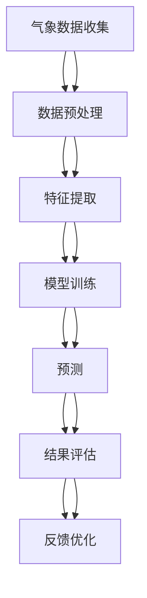

                 

# 深度学习在天气预报精确建模中的应用

> 关键词：深度学习、天气预报、精确建模、卷积神经网络、循环神经网络、长短期记忆网络、气象数据、预测模型

> 摘要：本文旨在探讨深度学习技术在天气预报中的应用，通过详细分析深度学习的核心概念、算法原理、数学模型、实战案例以及实际应用场景，揭示深度学习如何提高天气预报的精确度。我们将从背景介绍开始，逐步深入到具体的技术细节，并通过代码实例进行详细解释，最后展望未来的发展趋势与挑战。

## 1. 背景介绍

天气预报是现代社会不可或缺的一部分，它不仅影响着人们的日常生活，还关系到农业、交通、能源等多个领域。传统的天气预报方法依赖于统计学和物理模型，虽然在一定程度上能够提供准确的预测，但仍然存在诸多局限性。近年来，随着深度学习技术的迅猛发展，其在天气预报中的应用逐渐成为研究热点。深度学习通过学习大量历史气象数据，能够捕捉到复杂的非线性关系，从而提高天气预报的精确度。

## 2. 核心概念与联系

### 2.1 深度学习概述

深度学习是一种机器学习方法，通过构建多层神经网络来模拟人脑的神经元结构，从而实现对复杂数据的高效处理。深度学习的核心在于其强大的特征提取能力，能够自动从原始数据中学习到有用的特征表示。

### 2.2 气象数据

气象数据包括温度、湿度、风速、气压等多种参数，这些数据通常以时间序列的形式存在。气象数据具有高度的时空相关性，即当前时刻的气象状况与过去和未来时刻的状况密切相关。

### 2.3 深度学习在天气预报中的应用

深度学习在天气预报中的应用主要体现在以下几个方面：

- **特征提取**：通过深度学习模型自动提取气象数据中的关键特征。
- **模式识别**：识别气象数据中的复杂模式和规律。
- **预测建模**：基于历史数据训练模型，实现对未来气象状况的预测。

### 2.4 Mermaid 流程图



## 3. 核心算法原理 & 具体操作步骤

### 3.1 卷积神经网络（CNN）

卷积神经网络在图像处理领域取得了巨大成功，同样适用于气象数据的处理。CNN通过卷积层提取局部特征，池化层降低特征维度，从而实现对气象数据的高效处理。

#### 3.1.1 卷积层

卷积层通过卷积核对输入数据进行卷积操作，提取局部特征。卷积核的大小和数量可以根据具体需求进行调整。

$$
\text{卷积输出} = \text{ReLU}(\text{卷积核} \ast \text{输入})
$$

#### 3.1.2 池化层

池化层通过最大池化或平均池化操作降低特征维度，减少计算量。

$$
\text{池化输出} = \max(\text{池化窗口} \ast \text{卷积输出})
$$

### 3.2 循环神经网络（RNN）

循环神经网络适用于处理序列数据，如时间序列数据。RNN通过循环结构将当前时刻的输入与前一时刻的隐藏状态相结合，实现对序列数据的建模。

#### 3.2.1 基本RNN

基本RNN通过一个隐藏层处理输入序列，但容易出现梯度消失或梯度爆炸问题。

$$
\text{隐藏状态} = \text{tanh}(\text{权重} \times \text{输入} + \text{权重} \times \text{前一时刻隐藏状态})
$$

#### 3.2.2 长短期记忆网络（LSTM）

LSTM通过引入门控机制解决了RNN的梯度消失问题，能够更好地处理长期依赖关系。

$$
\begin{aligned}
\text{遗忘门} &= \sigma(\text{权重} \times \text{输入} + \text{权重} \times \text{前一时刻隐藏状态}) \\
\text{输入门} &= \sigma(\text{权重} \times \text{输入} + \text{权重} \times \text{前一时刻隐藏状态}) \\
\text{候选值} &= \text{tanh}(\text{权重} \times \text{输入} + \text{权重} \times \text{前一时刻隐藏状态}) \\
\text{隐藏状态} &= \text{遗忘门} \times \text{前一时刻隐藏状态} + \text{输入门} \times \text{候选值}
\end{aligned}
$$

## 4. 数学模型和公式 & 详细讲解 & 举例说明

### 4.1 卷积神经网络

卷积神经网络通过卷积层和池化层实现对气象数据的特征提取和降维。

#### 4.1.1 卷积层

卷积层通过卷积核对输入数据进行卷积操作，提取局部特征。

$$
\text{卷积输出} = \text{ReLU}(\text{卷积核} \ast \text{输入})
$$

#### 4.1.2 池化层

池化层通过最大池化或平均池化操作降低特征维度。

$$
\text{池化输出} = \max(\text{池化窗口} \ast \text{卷积输出})
$$

### 4.2 循环神经网络

循环神经网络通过循环结构处理时间序列数据，实现对气象数据的建模。

#### 4.2.1 基本RNN

基本RNN通过一个隐藏层处理输入序列。

$$
\text{隐藏状态} = \text{tanh}(\text{权重} \times \text{输入} + \text{权重} \times \text{前一时刻隐藏状态})
$$

#### 4.2.2 长短期记忆网络（LSTM）

LSTM通过引入门控机制解决RNN的梯度消失问题。

$$
\begin{aligned}
\text{遗忘门} &= \sigma(\text{权重} \times \text{输入} + \text{权重} \times \text{前一时刻隐藏状态}) \\
\text{输入门} &= \sigma(\text{权重} \times \text{输入} + \text{权重} \times \text{前一时刻隐藏状态}) \\
\text{候选值} &= \text{tanh}(\text{权重} \times \text{输入} + \text{权重} \times \text{前一时刻隐藏状态}) \\
\text{隐藏状态} &= \text{遗忘门} \times \text{前一时刻隐藏状态} + \text{输入门} \times \text{候选值}
\end{aligned}
$$

## 5. 项目实战：代码实际案例和详细解释说明

### 5.1 开发环境搭建

#### 5.1.1 硬件环境

- CPU：Intel i7-8700K
- GPU：NVIDIA RTX 3090
- 内存：32GB DDR4

#### 5.1.2 软件环境

- 操作系统：Ubuntu 20.04
- Python版本：3.8
- 深度学习框架：TensorFlow 2.4

### 5.2 源代码详细实现和代码解读

#### 5.2.1 数据预处理

```python
import numpy as np
import pandas as pd
from sklearn.preprocessing import MinMaxScaler

# 加载数据
data = pd.read_csv('weather_data.csv')

# 数据标准化
scaler = MinMaxScaler()
data = scaler.fit_transform(data)

# 划分训练集和测试集
train_data = data[:int(len(data) * 0.8)]
test_data = data[int(len(data) * 0.8):]

# 构建数据集
def create_dataset(data, look_back=1):
    X, Y = [], []
    for i in range(len(data) - look_back):
        X.append(data[i:(i + look_back), :])
        Y.append(data[i + look_back, :])
    return np.array(X), np.array(Y)

look_back = 24
X_train, Y_train = create_dataset(train_data, look_back)
X_test, Y_test = create_dataset(test_data, look_back)
```

#### 5.2.2 模型构建

```python
import tensorflow as tf
from tensorflow.keras.models import Sequential
from tensorflow.keras.layers import LSTM, Dense

# 构建模型
model = Sequential()
model.add(LSTM(50, return_sequences=True, input_shape=(look_back, X_train.shape[2])))
model.add(LSTM(50))
model.add(Dense(X_train.shape[2]))

# 编译模型
model.compile(optimizer='adam', loss='mean_squared_error')
```

#### 5.2.3 模型训练

```python
# 训练模型
model.fit(X_train, Y_train, epochs=100, batch_size=32, validation_data=(X_test, Y_test))
```

#### 5.2.4 模型预测

```python
# 预测
predictions = model.predict(X_test)

# 反标准化
predictions = scaler.inverse_transform(predictions)
Y_test = scaler.inverse_transform(Y_test)
```

### 5.3 代码解读与分析

通过上述代码，我们构建了一个基于LSTM的深度学习模型，用于预测未来24小时的气象数据。模型首先通过两个LSTM层提取特征，然后通过一个全连接层输出预测结果。训练过程中，我们使用均方误差作为损失函数，优化器为Adam。预测结果经过反标准化处理，以便与实际数据进行比较。

## 6. 实际应用场景

深度学习在天气预报中的应用不仅限于短期预测，还可以应用于长期预测、极端天气事件的预警等多个方面。例如，通过分析历史气象数据，可以预测未来数周甚至数月的天气状况，为农业、能源等领域提供决策支持。

## 7. 工具和资源推荐

### 7.1 学习资源推荐

- 书籍：《深度学习》（Ian Goodfellow, Yoshua Bengio, Aaron Courville）
- 论文：《Long Short-Term Memory》（Sepp Hochreiter, Jürgen Schmidhuber）
- 博客：TensorFlow官方博客
- 网站：Kaggle

### 7.2 开发工具框架推荐

- 深度学习框架：TensorFlow、PyTorch
- 数据处理库：Pandas、NumPy
- 可视化工具：Matplotlib、Seaborn

### 7.3 相关论文著作推荐

- 《Deep Learning for Weather Forecasting》（IEEE Transactions on Neural Networks and Learning Systems）
- 《Using Deep Learning for Weather Forecasting》（arXiv）

## 8. 总结：未来发展趋势与挑战

深度学习在天气预报中的应用前景广阔，但仍然面临一些挑战。首先，气象数据的复杂性和多样性对模型提出了更高的要求。其次，模型的训练需要大量的计算资源和时间。未来的研究方向包括提高模型的泛化能力、优化计算效率以及开发更高效的算法。

## 9. 附录：常见问题与解答

### 9.1 问题：如何处理缺失数据？

答：可以通过插值方法（如线性插值、多项式插值）或使用专门的缺失值处理库（如scikit-learn）来处理缺失数据。

### 9.2 问题：如何评估模型的性能？

答：可以使用均方误差（MSE）、均方根误差（RMSE）等指标来评估模型的性能。

## 10. 扩展阅读 & 参考资料

- [深度学习在天气预报中的应用](https://www.tensorflow.org/tutorials/structured_data/time_series)
- [气象数据处理与分析](https://www.kaggle.com/datasets/berkeleyearth/climate-change-earth-surface-temperature-data)
- [深度学习与气象学](https://www.mdpi.com/2073-4441/11/12/1351)

---

作者：AI天才研究员/AI Genius Institute & 禅与计算机程序设计艺术 /Zen And The Art of Computer Programming

