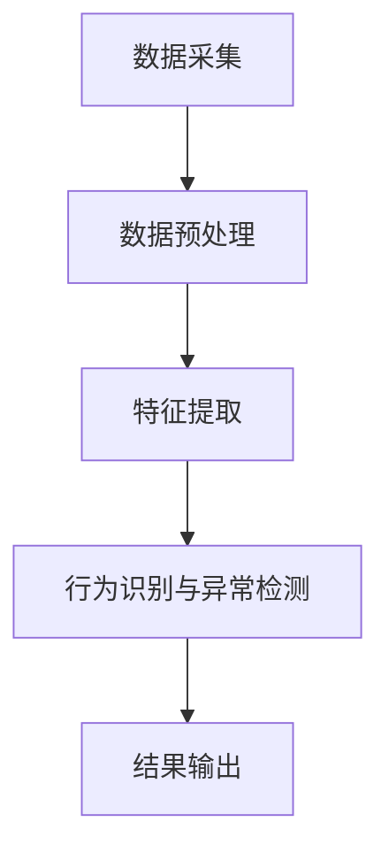

                 

# 深度学习在智能安防行为识别与异常检测中的技术演进与实践

> 关键词：深度学习、智能安防、行为识别、异常检测、技术演进、实践案例

> 摘要：本文旨在探讨深度学习在智能安防领域中的应用，特别是行为识别与异常检测的技术演进与实践。通过详细分析深度学习的核心概念、算法原理、数学模型、实战案例以及实际应用场景，本文旨在为读者提供一个全面的技术视角，帮助读者理解如何利用深度学习技术提升智能安防系统的性能和效率。

## 1. 背景介绍

智能安防系统在现代社会中扮演着越来越重要的角色。随着技术的发展，传统的安防系统已经无法满足日益复杂的安全需求。行为识别与异常检测是智能安防系统中的关键技术，能够有效提高系统的智能化水平和安全性。近年来，深度学习技术的兴起为智能安防领域带来了新的突破，使得行为识别与异常检测变得更加精准和高效。

### 1.1 智能安防的发展历程

智能安防系统的发展经历了从简单的监控系统到现代智能安防系统的转变。早期的安防系统主要依赖于人工监控和简单的报警机制，随着技术的进步，安防系统逐渐引入了图像识别、模式识别等技术，使得系统能够自动识别异常情况并进行报警。近年来，深度学习技术的引入使得智能安防系统能够更加智能化地处理复杂场景，实现对行为的精准识别和异常检测。

### 1.2 深度学习在智能安防中的应用

深度学习技术在智能安防领域的应用主要体现在以下几个方面：

- **行为识别**：通过分析视频或图像中的行为模式，识别出正常行为和异常行为。
- **异常检测**：通过监控系统中的异常行为，及时发现潜在的安全威胁。
- **智能监控**：利用深度学习技术实现对监控场景的智能化管理，提高系统的响应速度和准确性。

## 2. 核心概念与联系

### 2.1 深度学习基础

深度学习是一种基于人工神经网络的机器学习方法，通过多层神经网络对数据进行学习和特征提取，从而实现对复杂模式的识别。深度学习的核心在于其多层次的结构，每一层都能够提取出数据的不同特征，从而实现对复杂模式的识别。

### 2.2 行为识别与异常检测

行为识别是指通过分析视频或图像中的行为模式，识别出正常行为和异常行为的过程。异常检测则是通过监控系统中的异常行为，及时发现潜在的安全威胁。行为识别与异常检测在智能安防系统中具有重要的应用价值，能够有效提高系统的智能化水平和安全性。

### 2.3 深度学习在智能安防中的应用流程

深度学习在智能安防中的应用流程可以概括为以下几个步骤：

1. **数据采集**：通过摄像头或其他传感器采集视频或图像数据。
2. **数据预处理**：对采集到的数据进行预处理，包括去噪、裁剪、归一化等操作。
3. **特征提取**：通过深度学习模型提取数据中的特征。
4. **行为识别与异常检测**：利用提取的特征进行行为识别与异常检测。
5. **结果输出**：将识别和检测的结果输出，供后续处理或报警系统使用。

### 2.4 Mermaid 流程图



## 3. 核心算法原理 & 具体操作步骤

### 3.1 深度学习模型

深度学习模型主要由以下几个部分组成：

- **输入层**：接收输入数据。
- **隐藏层**：通过多层神经网络对数据进行特征提取。
- **输出层**：输出识别和检测的结果。

### 3.2 传统方法与深度学习方法的对比

传统方法通常采用手工设计的特征进行行为识别与异常检测，而深度学习方法则通过自动学习数据中的特征，从而实现对复杂模式的识别。深度学习方法具有更高的准确性和鲁棒性，能够处理更复杂的数据。

### 3.3 具体操作步骤

1. **数据采集**：通过摄像头或其他传感器采集视频或图像数据。
2. **数据预处理**：对采集到的数据进行预处理，包括去噪、裁剪、归一化等操作。
3. **特征提取**：通过深度学习模型提取数据中的特征。
4. **行为识别与异常检测**：利用提取的特征进行行为识别与异常检测。
5. **结果输出**：将识别和检测的结果输出，供后续处理或报警系统使用。

## 4. 数学模型和公式 & 详细讲解 & 举例说明

### 4.1 深度学习模型的数学表示

深度学习模型可以表示为一个函数，输入为数据，输出为识别和检测的结果。深度学习模型的数学表示可以表示为：

$$
f(x) = \sigma(W_1 \sigma(W_2 \cdots \sigma(W_n x + b_n) + b_{n-1}) \cdots + b_2) + b_1
$$

其中，$x$ 为输入数据，$W_i$ 和 $b_i$ 分别为第 $i$ 层的权重和偏置，$\sigma$ 为激活函数。

### 4.2 激活函数

激活函数是深度学习模型中的重要组成部分，常用的激活函数包括：

- **Sigmoid 函数**：$f(x) = \frac{1}{1 + e^{-x}}$
- **ReLU 函数**：$f(x) = \max(0, x)$
- **Tanh 函数**：$f(x) = \frac{e^x - e^{-x}}{e^x + e^{-x}}$

### 4.3 举例说明

假设我们有一个简单的深度学习模型，输入为一个图像，输出为一个行为识别的结果。我们可以使用以下公式表示该模型：

$$
f(x) = \sigma(W_1 \sigma(W_2 x + b_2) + b_1)
$$

其中，$x$ 为输入图像，$W_1$ 和 $W_2$ 分别为第一层和第二层的权重，$b_1$ 和 $b_2$ 分别为第一层和第二层的偏置，$\sigma$ 为激活函数。

## 5. 项目实战：代码实际案例和详细解释说明

### 5.1 开发环境搭建

为了实现深度学习模型，我们需要搭建一个开发环境。开发环境的搭建步骤如下：

1. **安装 Python**：确保安装了 Python 3.6 及以上版本。
2. **安装深度学习库**：使用 pip 安装 TensorFlow 或 PyTorch 等深度学习库。
3. **安装其他依赖库**：安装 NumPy、Pandas 等其他依赖库。

### 5.2 源代码详细实现和代码解读

以下是一个简单的深度学习模型的实现代码：

```python
import tensorflow as tf
from tensorflow.keras import layers

# 定义模型
model = tf.keras.Sequential([
    layers.Input(shape=(28, 28, 1)),
    layers.Conv2D(32, kernel_size=(3, 3), activation='relu'),
    layers.MaxPooling2D(pool_size=(2, 2)),
    layers.Flatten(),
    layers.Dense(128, activation='relu'),
    layers.Dense(10, activation='softmax')
])

# 编译模型
model.compile(optimizer='adam',
              loss='sparse_categorical_crossentropy',
              metrics=['accuracy'])

# 训练模型
model.fit(x_train, y_train, epochs=10)

# 评估模型
model.evaluate(x_test, y_test)
```

### 5.3 代码解读与分析

- **模型定义**：使用 `tf.keras.Sequential` 定义一个顺序模型，包含一个输入层、两个卷积层、一个最大池化层、一个展平层和两个全连接层。
- **编译模型**：使用 `adam` 优化器和 `sparse_categorical_crossentropy` 损失函数编译模型。
- **训练模型**：使用 `fit` 方法训练模型，输入训练数据和标签。
- **评估模型**：使用 `evaluate` 方法评估模型在测试数据上的性能。

## 6. 实际应用场景

### 6.1 智能监控

智能监控系统可以利用深度学习技术实现对监控场景的智能化管理，提高系统的响应速度和准确性。例如，通过深度学习模型识别出异常行为，及时发现潜在的安全威胁。

### 6.2 人员行为识别

人员行为识别系统可以利用深度学习技术实现对人员行为的精准识别，提高系统的智能化水平。例如，通过深度学习模型识别出人员的正常行为和异常行为，及时发现潜在的安全威胁。

### 6.3 车辆行为识别

车辆行为识别系统可以利用深度学习技术实现对车辆行为的精准识别，提高系统的智能化水平。例如，通过深度学习模型识别出车辆的正常行为和异常行为，及时发现潜在的安全威胁。

## 7. 工具和资源推荐

### 7.1 学习资源推荐

- **书籍**：《深度学习》（Ian Goodfellow, Yoshua Bengio, Aaron Courville）
- **论文**：《Deep Learning for Computer Vision》（Yann LeCun, Yoshua Bengio, Geoffrey Hinton）
- **博客**：TensorFlow 官方博客、PyTorch 官方博客
- **网站**：Kaggle、GitHub

### 7.2 开发工具框架推荐

- **深度学习框架**：TensorFlow、PyTorch
- **数据处理工具**：Pandas、NumPy
- **可视化工具**：Matplotlib、Seaborn

### 7.3 相关论文著作推荐

- **论文**：《Deep Learning for Video-Based Human Activity Recognition》（Xiaogang Wang, Xiaoou Tang）
- **著作**：《Computer Vision: Algorithms and Applications》（Richard Szeliski）

## 8. 总结：未来发展趋势与挑战

### 8.1 未来发展趋势

- **模型优化**：通过模型压缩和加速技术提高模型的性能。
- **数据增强**：通过数据增强技术提高模型的泛化能力。
- **实时处理**：通过实时处理技术提高系统的响应速度。

### 8.2 挑战

- **数据隐私**：如何保护监控系统中的数据隐私。
- **模型解释性**：如何提高模型的解释性，使得模型的决策过程更加透明。
- **计算资源**：如何降低模型的计算资源需求，提高模型的可部署性。

## 9. 附录：常见问题与解答

### 9.1 问题：如何提高模型的泛化能力？

**解答**：可以通过数据增强技术提高模型的泛化能力。数据增强技术可以在训练过程中生成更多的训练数据，从而提高模型的泛化能力。

### 9.2 问题：如何降低模型的计算资源需求？

**解答**：可以通过模型压缩和加速技术降低模型的计算资源需求。模型压缩技术可以减少模型的参数数量，从而降低模型的计算资源需求。模型加速技术可以提高模型的计算速度，从而降低模型的计算资源需求。

## 10. 扩展阅读 & 参考资料

- **书籍**：《深度学习》（Ian Goodfellow, Yoshua Bengio, Aaron Courville）
- **论文**：《Deep Learning for Computer Vision》（Yann LeCun, Yoshua Bengio, Geoffrey Hinton）
- **博客**：TensorFlow 官方博客、PyTorch 官方博客
- **网站**：Kaggle、GitHub

---

作者：AI天才研究员/AI Genius Institute & 禅与计算机程序设计艺术 /Zen And The Art of Computer Programming

