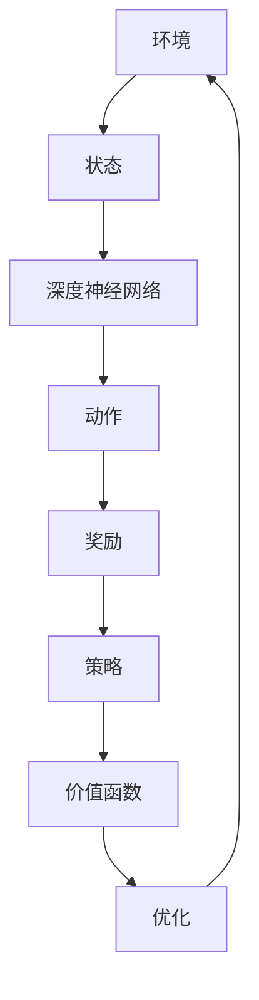

                 

# 深度强化学习在机器人自主学习中的突破

> 关键词：深度强化学习, 机器人自主学习, 自主决策, 深度神经网络, Q学习, 机器人控制

> 摘要：本文旨在探讨深度强化学习在机器人自主学习中的应用与突破。通过深入分析深度强化学习的核心概念、算法原理、数学模型及实际案例，本文揭示了深度强化学习如何帮助机器人实现自主决策与学习。文章不仅提供了详细的代码实现和解释，还探讨了其在实际应用场景中的潜力与挑战，为读者提供了全面的技术指导与深入的思考。

## 1. 背景介绍

随着人工智能技术的飞速发展，机器人自主学习成为了一个备受关注的研究领域。传统的机器人控制方法依赖于预先编程的规则和固定的策略，这在复杂多变的环境中显得力不从心。而深度强化学习（Deep Reinforcement Learning, DRL）通过结合深度神经网络和强化学习，为机器人提供了强大的自主学习能力，使其能够在未知环境中自主决策和学习。

### 1.1 机器人自主学习的重要性

机器人自主学习的重要性在于其能够使机器人在没有人类干预的情况下，通过与环境的交互来学习和适应新的任务。这种能力对于实现机器人在复杂环境中的广泛应用至关重要，如家庭服务机器人、工业自动化、医疗辅助等。

### 1.2 深度强化学习的发展历程

深度强化学习的发展历程可以追溯到20世纪90年代，但直到近年来，随着计算能力的提升和大数据的普及，深度强化学习才真正迎来了爆发式增长。2013年，Google DeepMind团队在《Nature》上发表的AlphaGo战胜围棋世界冠军李世石，标志着深度强化学习在实际应用中的重大突破。

## 2. 核心概念与联系

### 2.1 强化学习基础

强化学习是一种通过试错学习来优化决策过程的方法。其核心在于通过与环境的交互来学习最优策略，以最大化累积奖励。强化学习的基本框架包括：

- **状态（State）**：描述环境当前状态的信息。
- **动作（Action）**：机器人可以执行的操作。
- **奖励（Reward）**：根据机器人执行动作后的结果给予的反馈。
- **策略（Policy）**：描述机器人在给定状态下选择动作的概率分布。
- **价值函数（Value Function）**：描述在给定状态下采取某种策略的长期期望奖励。

### 2.2 深度神经网络基础

深度神经网络是一种具有多层非线性变换的机器学习模型，能够从复杂的数据中提取高层次的特征表示。其核心在于通过多层神经元的连接，实现对输入数据的逐层抽象和特征提取。

### 2.3 深度强化学习原理

深度强化学习通过结合深度神经网络和强化学习，实现了对复杂环境的高效学习。其核心在于通过深度神经网络来学习状态表示和策略，从而实现对环境的高效探索和学习。具体来说，深度强化学习通过以下步骤实现：

1. **状态表示学习**：通过深度神经网络学习状态的高层次表示。
2. **策略学习**：通过深度神经网络学习在给定状态下选择动作的概率分布。
3. **价值函数学习**：通过深度神经网络学习状态的价值函数，从而指导策略学习。

### 2.4 Mermaid 流程图



## 3. 核心算法原理 & 具体操作步骤

### 3.1 Q学习算法

Q学习是一种基于价值函数的强化学习算法，其核心在于通过学习状态-动作对的价值函数来指导决策。具体步骤如下：

1. **初始化**：初始化Q值表，通常为0。
2. **选择动作**：根据当前状态选择动作，可以采用ε-贪心策略。
3. **执行动作**：执行选择的动作，并观察环境的反馈。
4. **更新Q值**：根据新的状态和奖励更新Q值表。
5. **重复**：重复上述步骤，直到达到终止条件。

### 3.2 DQN算法

DQN（Deep Q-Network）是Q学习的一种扩展，通过引入深度神经网络来学习状态-动作对的价值函数。具体步骤如下：

1. **初始化**：初始化深度神经网络和经验回放缓冲区。
2. **选择动作**：根据当前状态选择动作，可以采用ε-贪心策略。
3. **执行动作**：执行选择的动作，并观察环境的反馈。
4. **存储经验**：将当前状态、动作、奖励和下一个状态存储到经验回放缓冲区。
5. **更新网络**：从经验回放缓冲区中随机抽取一批经验，通过深度神经网络学习价值函数。
6. **重复**：重复上述步骤，直到达到终止条件。

### 3.3 A3C算法

A3C（Asynchronous Advantage Actor-Critic）是一种基于策略梯度的强化学习算法，通过异步更新策略和价值函数来提高学习效率。具体步骤如下：

1. **初始化**：初始化深度神经网络和经验回放缓冲区。
2. **选择动作**：根据当前状态选择动作，可以采用ε-贪心策略。
3. **执行动作**：执行选择的动作，并观察环境的反馈。
4. **存储经验**：将当前状态、动作、奖励和下一个状态存储到经验回放缓冲区。
5. **更新网络**：从经验回放缓冲区中随机抽取一批经验，通过深度神经网络学习策略和价值函数。
6. **重复**：重复上述步骤，直到达到终止条件。

## 4. 数学模型和公式 & 详细讲解 & 举例说明

### 4.1 Q学习公式

Q学习的核心公式为：

$$
Q(s, a) \leftarrow Q(s, a) + \alpha \left[ r + \gamma \max_{a'} Q(s', a') - Q(s, a) \right]
$$

其中，$Q(s, a)$ 表示在状态 $s$ 下采取动作 $a$ 的价值，$\alpha$ 表示学习率，$r$ 表示奖励，$\gamma$ 表示折扣因子。

### 4.2 DQN公式

DQN的核心公式为：

$$
\text{目标网络} \leftarrow \text{主网络}
$$

$$
\text{主网络} \leftarrow \text{主网络} + \alpha \left[ r + \gamma \max_{a'} Q_{\text{目标网络}}(s', a') - Q_{\text{主网络}}(s, a) \right]
$$

其中，$\text{目标网络}$ 用于稳定学习过程，避免过拟合。

### 4.3 A3C公式

A3C的核心公式为：

$$
\text{策略梯度} = \sum_{t=0}^{T-1} \left( \log \pi(a_t | s_t) \left[ r_t + \gamma \mathbb{E}_{a' \sim \pi} [Q(s_{t+1}, a')] - Q(s_t, a_t) \right] \right)
$$

其中，$\pi(a_t | s_t)$ 表示在状态 $s_t$ 下采取动作 $a_t$ 的概率，$r_t$ 表示奖励，$\gamma$ 表示折扣因子。

### 4.4 举例说明

假设有一个简单的迷宫环境，机器人需要从起点到达终点。我们可以使用Q学习来训练机器人学习最优路径。具体步骤如下：

1. **初始化**：初始化Q值表，所有值设为0。
2. **选择动作**：根据当前状态选择动作，可以采用ε-贪心策略。
3. **执行动作**：执行选择的动作，并观察环境的反馈。
4. **更新Q值**：根据新的状态和奖励更新Q值表。
5. **重复**：重复上述步骤，直到达到终止条件。

## 5. 项目实战：代码实际案例和详细解释说明

### 5.1 开发环境搭建

为了实现深度强化学习项目，我们需要搭建一个合适的开发环境。具体步骤如下：

1. **安装Python**：确保安装了Python 3.7及以上版本。
2. **安装依赖库**：安装TensorFlow、Keras、NumPy等库。
3. **安装强化学习库**：安装OpenAI Gym库。

### 5.2 源代码详细实现和代码解读

以下是一个简单的DQN算法实现示例：

```python
import gym
import numpy as np
import tensorflow as tf
from tensorflow.keras.models import Sequential
from tensorflow.keras.layers import Dense, Flatten
from tensorflow.keras.optimizers import Adam
from collections import deque
import random

# 环境设置
env = gym.make('CartPole-v1')
state_size = env.observation_space.shape[0]
action_size = env.action_space.n

# 模型构建
model = Sequential()
model.add(Flatten(input_shape=(1, state_size)))
model.add(Dense(24, activation='relu'))
model.add(Dense(24, activation='relu'))
model.add(Dense(action_size, activation='linear'))
model.compile(loss='mse', optimizer=Adam(lr=0.001))

# 经验回放缓冲区
memory = deque(maxlen=2000)

# 参数设置
gamma = 0.95
epsilon = 1.0
epsilon_min = 0.01
epsilon_decay = 0.995
batch_size = 32
train_start = 1000

# 训练过程
for episode in range(1000):
    state = env.reset()
    state = np.reshape(state, [1, state_size])
    done = False
    score = 0
    
    while not done:
        if np.random.rand() <= epsilon:
            action = env.action_space.sample()
        else:
            q_values = model.predict(state)
            action = np.argmax(q_values[0])
        
        next_state, reward, done, _ = env.step(action)
        next_state = np.reshape(next_state, [1, state_size])
        memory.append((state, action, reward, next_state, done))
        state = next_state
        score += reward
    
    if len(memory) > train_start:
        minibatch = random.sample(memory, batch_size)
        for state, action, reward, next_state, done in minibatch:
            target = reward
            if not done:
                target = reward + gamma * np.amax(model.predict(next_state)[0])
            target_f = model.predict(state)
            target_f[0][action] = target
            model.fit(state, target_f, epochs=1, verbose=0)
    
    if epsilon > epsilon_min:
        epsilon *= epsilon_decay

    print(f"Episode: {episode}, Score: {score}, Epsilon: {epsilon}")

env.close()
```

### 5.3 代码解读与分析

1. **环境设置**：使用OpenAI Gym库创建一个简单的CartPole环境。
2. **模型构建**：构建一个简单的深度神经网络模型，用于学习状态-动作对的价值函数。
3. **经验回放缓冲区**：使用deque来存储经验，以便在训练过程中进行采样。
4. **参数设置**：设置学习率、ε-贪心策略参数等。
5. **训练过程**：通过循环训练模型，逐步提高模型的性能。

## 6. 实际应用场景

深度强化学习在机器人自主学习中的应用非常广泛，包括但不限于：

- **家庭服务机器人**：通过自主学习，家庭服务机器人可以更好地完成家务任务，如打扫卫生、做饭等。
- **工业自动化**：在工业环境中，机器人可以通过自主学习提高生产效率和质量。
- **医疗辅助**：医疗机器人可以通过自主学习提高手术精度和效率。

## 7. 工具和资源推荐

### 7.1 学习资源推荐

- **书籍**：《深度强化学习》（Deep Reinforcement Learning: Algorithms and Applications）
- **论文**：《DQN: A Deep Q-Network》
- **博客**：Medium上的深度强化学习系列文章
- **网站**：OpenAI Gym官网

### 7.2 开发工具框架推荐

- **TensorFlow**：深度学习框架
- **Keras**：高级神经网络API
- **OpenAI Gym**：强化学习环境

### 7.3 相关论文著作推荐

- **论文**：《A3C: Asynchronous Advantage Actor-Critic》
- **著作**：《强化学习：一种统计方法》

## 8. 总结：未来发展趋势与挑战

深度强化学习在机器人自主学习中的应用前景广阔，但也面临着一些挑战。未来的发展趋势包括：

- **算法优化**：通过改进算法，提高学习效率和泛化能力。
- **计算资源**：利用更强大的计算资源，提高模型的训练速度和性能。
- **实际应用**：将深度强化学习应用于更多实际场景，提高机器人的自主学习能力。

## 9. 附录：常见问题与解答

### 9.1 问题1：如何选择合适的深度神经网络结构？

**解答**：选择合适的深度神经网络结构需要根据具体任务和环境进行调整。通常，可以通过实验和试错来找到最佳的网络结构。

### 9.2 问题2：如何调整学习率和ε-贪心策略参数？

**解答**：学习率和ε-贪心策略参数需要根据具体任务进行调整。通常，可以通过实验来找到最佳的参数值。

## 10. 扩展阅读 & 参考资料

- **论文**：《DQN: A Deep Q-Network》
- **书籍**：《深度强化学习》（Deep Reinforcement Learning: Algorithms and Applications）
- **网站**：OpenAI Gym官网

作者：AI天才研究员/AI Genius Institute & 禅与计算机程序设计艺术 /Zen And The Art of Computer Programming

