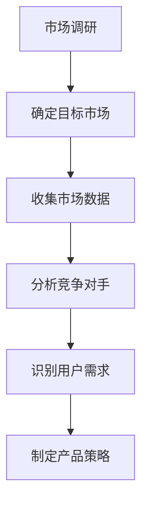
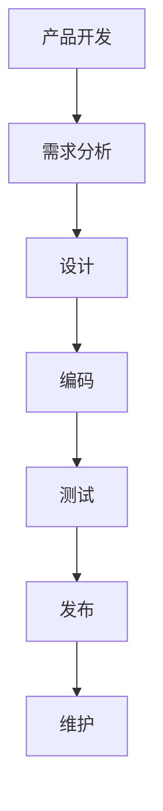
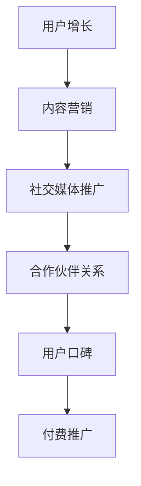
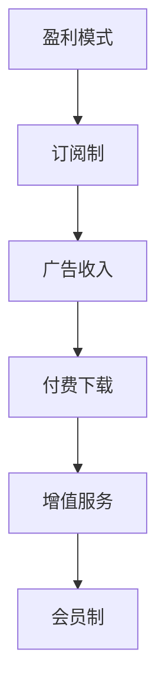

                 

# 独立开发者的商业化之路：从想法到盈利

> 关键词：独立开发者、商业化、创业、技术变现、商业模式、产品开发、市场分析、用户增长、盈利模式

> 摘要：本文旨在为独立开发者提供一套从想法到盈利的系统化路径。通过深入分析独立开发者面临的挑战、核心概念、技术实现、实战案例以及实际应用场景，帮助开发者构建可持续发展的商业模式。文章将涵盖从市场调研到产品开发、再到用户增长和盈利模式的全过程，旨在为独立开发者提供全面的指导和支持。

## 1. 背景介绍

独立开发者在当今技术快速发展的时代中扮演着越来越重要的角色。他们不仅能够快速响应市场需求，还能通过创新和独特的技术解决方案满足用户需求。然而，从一个想法到实现盈利的过程充满了挑战。本文将从以下几个方面进行详细探讨：

- **独立开发者的挑战**：独立开发者面临的市场不确定性、技术挑战、资源限制等问题。
- **成功的独立开发者案例**：分析成功独立开发者的经验和策略。
- **商业化的重要性**：独立开发者如何通过商业化实现可持续发展。

## 2. 核心概念与联系

### 2.1 市场调研与需求分析

#### 2.1.1 市场调研流程

市场调研是独立开发者成功的关键步骤之一。通过调研，开发者可以了解目标市场的需求、竞争对手的情况以及潜在用户的行为模式。



### 2.2 产品开发与技术实现

#### 2.2.1 产品开发流程

产品开发是一个系统化的过程，包括需求分析、设计、编码、测试和发布等阶段。



### 2.3 用户增长与盈利模式

#### 2.3.1 用户增长策略

用户增长是独立开发者实现盈利的重要手段。通过有效的用户增长策略，开发者可以快速扩大用户基础，提高产品的市场占有率。



#### 2.3.2 盈利模式

盈利模式是独立开发者实现商业化的关键。常见的盈利模式包括订阅制、广告收入、付费下载、增值服务等。



## 3. 核心算法原理 & 具体操作步骤

### 3.1 市场调研的具体操作步骤

1. **确定目标市场**：明确目标用户群体，了解他们的需求和痛点。
2. **收集市场数据**：通过问卷调查、在线论坛、社交媒体等方式收集数据。
3. **分析竞争对手**：研究竞争对手的产品、价格、市场占有率等信息。
4. **识别用户需求**：通过数据分析和用户访谈，识别用户的真实需求。
5. **制定产品策略**：根据市场调研结果，制定产品开发策略。

### 3.2 产品开发的具体操作步骤

1. **需求分析**：明确产品的功能需求和非功能需求。
2. **设计**：进行产品设计，包括界面设计、交互设计等。
3. **编码**：选择合适的编程语言和技术栈进行编码。
4. **测试**：进行单元测试、集成测试和系统测试，确保产品质量。
5. **发布**：选择合适的发布平台，进行产品发布。
6. **维护**：持续优化产品，解决用户反馈的问题。

### 3.3 用户增长的具体操作步骤

1. **内容营销**：通过撰写博客、制作视频等方式提供有价值的内容。
2. **社交媒体推广**：利用社交媒体平台进行推广，增加曝光度。
3. **合作伙伴关系**：与其他开发者或企业建立合作关系，共同推广产品。
4. **用户口碑**：鼓励用户分享使用体验，提高产品的口碑。
5. **付费推广**：通过付费广告等方式增加用户流量。

### 3.4 盈利模式的具体操作步骤

1. **订阅制**：提供付费订阅服务，用户可以按月或按年支付费用。
2. **广告收入**：通过展示广告获得收入，适用于流量较大的产品。
3. **付费下载**：用户需要付费才能下载产品。
4. **增值服务**：提供额外的服务或功能，用户需要额外付费。
5. **会员制**：提供会员服务，会员可以享受更多的特权和优惠。

## 4. 数学模型和公式 & 详细讲解 & 举例说明

### 4.1 市场调研中的统计模型

在市场调研中，常用的统计模型包括描述性统计、推断性统计和回归分析等。

- **描述性统计**：用于描述数据的基本特征，如均值、中位数、标准差等。
- **推断性统计**：用于从样本数据推断总体特征，如置信区间、假设检验等。
- **回归分析**：用于分析变量之间的关系，如线性回归、多元回归等。

### 4.2 产品开发中的优化算法

在产品开发中，常用的优化算法包括贪心算法、动态规划、遗传算法等。

- **贪心算法**：通过每次选择局部最优解来达到全局最优解。
- **动态规划**：通过将问题分解为子问题来解决复杂问题。
- **遗传算法**：通过模拟自然选择和遗传机制来优化问题。

### 4.3 用户增长中的用户行为模型

在用户增长中，常用的用户行为模型包括用户生命周期模型、用户留存模型等。

- **用户生命周期模型**：描述用户从首次使用到最终流失的整个过程。
- **用户留存模型**：分析用户在特定时间段内的留存率，预测用户流失情况。

### 4.4 盈利模式中的收益模型

在盈利模式中，常用的收益模型包括成本收益模型、边际收益模型等。

- **成本收益模型**：通过计算成本和收益来评估项目的可行性。
- **边际收益模型**：通过分析边际收益来优化盈利策略。

## 5. 项目实战：代码实际案例和详细解释说明

### 5.1 开发环境搭建

1. **选择编程语言**：根据项目需求选择合适的编程语言，如Python、JavaScript等。
2. **安装开发工具**：安装集成开发环境（IDE），如Visual Studio Code、PyCharm等。
3. **配置开发环境**：设置开发环境，包括安装必要的库和框架。

### 5.2 源代码详细实现和代码解读

```python
# 示例代码：简单的用户注册功能
def register_user(username, password):
    # 检查用户名是否已存在
    if user_exists(username):
        return "用户名已存在"
    # 存储用户信息
    store_user(username, password)
    return "注册成功"

def user_exists(username):
    # 检查用户名是否已存在
    return username in users

def store_user(username, password):
    # 存储用户信息
    users[username] = password

users = {}
```

### 5.3 代码解读与分析

- **函数定义**：`register_user`函数用于注册新用户。
- **检查用户名**：`user_exists`函数检查用户名是否已存在。
- **存储用户信息**：`store_user`函数存储用户信息。
- **用户字典**：`users`字典用于存储用户信息。

## 6. 实际应用场景

### 6.1 市场调研的实际案例

- **案例1**：通过在线问卷调查了解用户需求。
- **案例2**：通过社交媒体平台收集用户反馈。
- **案例3**：通过竞品分析了解竞争对手的优势和劣势。

### 6.2 产品开发的实际案例

- **案例1**：开发一款移动应用，提供在线购物功能。
- **案例2**：开发一款在线教育平台，提供课程和学习资源。
- **案例3**：开发一款社交应用，提供即时通讯和社交功能。

### 6.3 用户增长的实际案例

- **案例1**：通过内容营销推广产品，提高品牌知名度。
- **案例2**：通过社交媒体推广产品，增加用户流量。
- **案例3**：通过合作伙伴关系推广产品，扩大用户基础。

### 6.4 盈利模式的实际案例

- **案例1**：通过订阅制提供付费服务，增加收入。
- **案例2**：通过广告收入增加收入，提高产品曝光度。
- **案例3**：通过付费下载提供增值服务，增加收入。

## 7. 工具和资源推荐

### 7.1 学习资源推荐

- **书籍**：《精益创业》、《硅谷创业》、《产品思维》
- **论文**：《市场调研方法》、《产品开发流程》、《用户增长策略》
- **博客**：TechCrunch、Medium、GitHub
- **网站**：Stack Overflow、GitHub、Product Hunt

### 7.2 开发工具框架推荐

- **编程语言**：Python、JavaScript、Java
- **开发工具**：Visual Studio Code、PyCharm、IntelliJ IDEA
- **框架**：Django、React、Vue.js

### 7.3 相关论文著作推荐

- **论文**：《市场调研方法》、《产品开发流程》、《用户增长策略》
- **著作**：《精益创业》、《硅谷创业》、《产品思维》

## 8. 总结：未来发展趋势与挑战

### 8.1 未来发展趋势

- **技术进步**：人工智能、大数据、云计算等技术的发展将为独立开发者提供更多机会。
- **市场需求**：个性化需求、定制化服务将成为市场主流。
- **商业模式**：订阅制、会员制等新型商业模式将更加普及。

### 8.2 挑战

- **市场竞争**：市场竞争加剧，独立开发者需要不断创新和优化产品。
- **资源限制**：资源限制是独立开发者面临的挑战之一，需要合理分配资源。
- **技术挑战**：技术挑战是独立开发者需要面对的问题，需要不断学习和提升。

## 9. 附录：常见问题与解答

### 9.1 常见问题

- **Q1**：如何进行有效的市场调研？
- **Q2**：如何选择合适的编程语言和技术栈？
- **Q3**：如何提高用户留存率？

### 9.2 解答

- **A1**：通过在线问卷调查、社交媒体平台和竞品分析进行市场调研。
- **A2**：根据项目需求选择合适的编程语言和技术栈。
- **A3**：通过提供高质量的内容和服务，提高用户留存率。

## 10. 扩展阅读 & 参考资料

- **书籍**：《精益创业》、《硅谷创业》、《产品思维》
- **论文**：《市场调研方法》、《产品开发流程》、《用户增长策略》
- **博客**：TechCrunch、Medium、GitHub
- **网站**：Stack Overflow、GitHub、Product Hunt

---

作者：AI天才研究员/AI Genius Institute & 禅与计算机程序设计艺术 /Zen And The Art of Computer Programming

