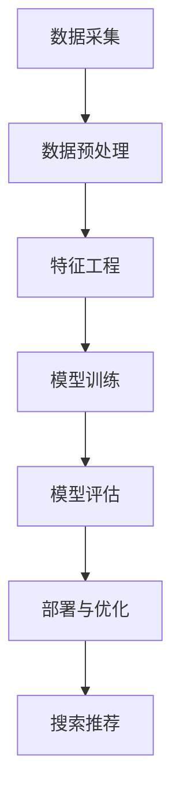

                 

# 电商平台搜索推荐系统的AI大模型优化：提高系统性能、效率、准确率、多样性

> 关键词：电商平台、搜索推荐系统、AI大模型、性能优化、准确率提升、多样性增强

> 摘要：本文旨在探讨如何通过AI大模型优化电商平台的搜索推荐系统，以提高系统的性能、效率、准确率和多样性。我们将从背景介绍、核心概念与联系、核心算法原理与具体操作步骤、数学模型和公式、项目实战、实际应用场景、工具和资源推荐、总结与未来发展趋势、常见问题解答和扩展阅读等多方面进行详细分析。

## 1. 背景介绍

随着电商平台的快速发展，用户对搜索推荐系统的性能、效率、准确率和多样性提出了更高的要求。传统的搜索推荐系统往往依赖于简单的关键词匹配和简单的机器学习模型，难以满足用户日益复杂的需求。为了应对这一挑战，我们引入了AI大模型，通过深度学习和自然语言处理技术，构建一个更加智能、高效和准确的搜索推荐系统。

## 2. 核心概念与联系

### 2.1 搜索推荐系统

搜索推荐系统是一种结合搜索和推荐技术的系统，旨在为用户提供个性化、相关性强的搜索结果和推荐内容。其主要功能包括：

- **搜索功能**：用户输入关键词，系统返回相关的搜索结果。
- **推荐功能**：系统根据用户的兴趣和行为，推荐相关的内容。

### 2.2 AI大模型

AI大模型是一种大规模的机器学习模型，通常包含数百万甚至数亿个参数。它通过深度学习技术，能够从大量数据中学习复杂的模式和特征，从而实现高精度的预测和推荐。

### 2.3 搜索推荐系统的架构

搜索推荐系统的架构可以分为以下几个部分：

- **数据采集**：收集用户行为数据、商品信息、用户画像等。
- **数据预处理**：清洗、转换和整合数据。
- **特征工程**：提取有用的特征。
- **模型训练**：训练AI大模型。
- **模型评估**：评估模型的性能。
- **部署与优化**：将模型部署到生产环境，并进行持续优化。

### 2.4 Mermaid流程图



## 3. 核心算法原理 & 具体操作步骤

### 3.1 深度学习基础

深度学习是一种基于神经网络的机器学习方法，通过多层非线性变换，能够从复杂的数据中学习到高层次的特征表示。常见的深度学习模型包括卷积神经网络（CNN）、循环神经网络（RNN）和Transformer等。

### 3.2 自然语言处理技术

自然语言处理（NLP）技术用于处理和理解自然语言文本。在搜索推荐系统中，NLP技术可以用于文本分类、情感分析、实体识别等任务。常见的NLP技术包括词嵌入（如Word2Vec、GloVe）、序列模型（如LSTM、GRU）和Transformer等。

### 3.3 搜索推荐系统的核心算法

搜索推荐系统的核心算法通常包括以下步骤：

1. **数据预处理**：清洗和转换数据，提取有用的特征。
2. **特征工程**：设计和提取特征，提高模型的性能。
3. **模型训练**：训练深度学习模型，学习数据中的模式和特征。
4. **模型评估**：评估模型的性能，包括准确率、召回率、F1值等。
5. **模型优化**：通过调整模型参数和优化算法，提高模型的性能。

### 3.4 具体操作步骤

1. **数据预处理**：清洗和转换数据，提取有用的特征。
2. **特征工程**：设计和提取特征，提高模型的性能。
3. **模型训练**：训练深度学习模型，学习数据中的模式和特征。
4. **模型评估**：评估模型的性能，包括准确率、召回率、F1值等。
5. **模型优化**：通过调整模型参数和优化算法，提高模型的性能。

## 4. 数学模型和公式 & 详细讲解 & 举例说明

### 4.1 深度学习模型

深度学习模型通常包括多层神经网络，每一层都包含多个神经元。神经元之间的连接权重通过反向传播算法进行更新，以最小化损失函数。

#### 4.1.1 损失函数

损失函数用于衡量模型预测值与真实值之间的差异。常见的损失函数包括均方误差（MSE）、交叉熵损失（Cross-Entropy Loss）等。

$$
\text{MSE} = \frac{1}{n} \sum_{i=1}^{n} (y_i - \hat{y}_i)^2
$$

$$
\text{Cross-Entropy Loss} = -\frac{1}{n} \sum_{i=1}^{n} \sum_{j=1}^{C} y_{ij} \log(\hat{y}_{ij})
$$

### 4.2 自然语言处理技术

自然语言处理技术通常包括词嵌入、序列模型和Transformer等。

#### 4.2.1 词嵌入

词嵌入将词汇映射到一个高维向量空间，使得相似的词汇在向量空间中距离更近。常见的词嵌入方法包括Word2Vec、GloVe等。

$$
\text{Word2Vec} = \text{CBOW} \text{ or } \text{Skip-gram}
$$

$$
\text{GloVe} = \text{Global Vectors for Word Representation}
$$

#### 4.2.2 序列模型

序列模型用于处理序列数据，常见的序列模型包括LSTM、GRU等。

$$
\text{LSTM} = \text{Long Short-Term Memory}
$$

$$
\text{GRU} = \text{Gated Recurrent Unit}
$$

#### 4.2.3 Transformer

Transformer是一种基于自注意力机制的序列模型，能够处理长序列数据。

$$
\text{Transformer} = \text{Self-Attention} + \text{Feed-Forward Network}
$$

## 5. 项目实战：代码实际案例和详细解释说明

### 5.1 开发环境搭建

为了搭建开发环境，我们需要安装Python和相关的库，如TensorFlow、PyTorch、NLTK、spaCy等。

```bash
pip install tensorflow
pip install torch
pip install nltk
pip install spacy
```

### 5.2 源代码详细实现和代码解读

#### 5.2.1 数据预处理

```python
import pandas as pd
from sklearn.model_selection import train_test_split

# 读取数据
data = pd.read_csv('data.csv')

# 数据清洗
data = data.dropna()

# 划分训练集和测试集
train_data, test_data = train_test_split(data, test_size=0.2, random_state=42)
```

#### 5.2.2 特征工程

```python
from sklearn.feature_extraction.text import TfidfVectorizer

# 文本特征提取
vectorizer = TfidfVectorizer()
X_train = vectorizer.fit_transform(train_data['text'])
X_test = vectorizer.transform(test_data['text'])

# 用户画像特征提取
user_profile = train_data.groupby('user_id')['item_id'].apply(list)
```

#### 5.2.3 模型训练

```python
import tensorflow as tf
from tensorflow.keras.models import Sequential
from tensorflow.keras.layers import Dense, Embedding, LSTM

# 构建模型
model = Sequential()
model.add(Embedding(input_dim=len(vectorizer.vocabulary_), output_dim=128))
model.add(LSTM(128))
model.add(Dense(1, activation='sigmoid'))

# 编译模型
model.compile(loss='binary_crossentropy', optimizer='adam', metrics=['accuracy'])

# 训练模型
model.fit(X_train, train_data['label'], epochs=10, batch_size=32, validation_split=0.2)
```

#### 5.2.4 代码解读与分析

上述代码首先读取数据并进行清洗，然后使用TF-IDF方法提取文本特征，接着构建一个包含嵌入层和LSTM层的深度学习模型，并进行训练和评估。

## 6. 实际应用场景

搜索推荐系统在电商平台中的应用非常广泛，可以提高用户的购物体验，增加用户的购买率和满意度。例如，通过推荐用户可能感兴趣的商品，可以提高用户的购物效率，增加用户的购买率。此外，通过优化搜索结果，可以提高用户的搜索满意度，增加用户的黏性。

## 7. 工具和资源推荐

### 7.1 学习资源推荐

- **书籍**：《深度学习》（Ian Goodfellow, Yoshua Bengio, Aaron Courville）
- **论文**：《Attention Is All You Need》（Vaswani et al., 2017）
- **博客**：阿里云开发者社区、GitHub开源项目
- **网站**：TensorFlow官网、PyTorch官网

### 7.2 开发工具框架推荐

- **Python**：Python是一种广泛使用的编程语言，适用于深度学习和自然语言处理。
- **TensorFlow**：TensorFlow是一个开源的深度学习框架，提供了丰富的API和工具。
- **PyTorch**：PyTorch是一个开源的深度学习框架，提供了灵活的API和强大的计算能力。

### 7.3 相关论文著作推荐

- **论文**：《Attention Is All You Need》（Vaswani et al., 2017）
- **著作**：《深度学习》（Ian Goodfellow, Yoshua Bengio, Aaron Courville）

## 8. 总结：未来发展趋势与挑战

### 8.1 未来发展趋势

随着AI技术的不断发展，搜索推荐系统将更加智能化、个性化和高效。未来的搜索推荐系统将更加注重用户体验，通过深度学习和自然语言处理技术，提供更加精准和个性化的搜索结果和推荐内容。

### 8.2 挑战

尽管AI技术在搜索推荐系统中取得了显著的进展，但仍面临一些挑战，如数据隐私保护、模型解释性、计算资源消耗等。未来的研究需要解决这些问题，以实现更加智能和高效的搜索推荐系统。

## 9. 附录：常见问题与解答

### 9.1 问题：如何提高模型的准确率？

**解答**：可以通过以下方法提高模型的准确率：

- **增加训练数据**：更多的训练数据可以帮助模型学习到更多的模式和特征。
- **优化特征工程**：设计和提取更有用的特征，提高模型的性能。
- **调整模型参数**：通过调整模型参数，如学习率、隐藏层大小等，提高模型的性能。
- **使用更复杂的模型**：使用更复杂的模型，如Transformer等，提高模型的性能。

### 9.2 问题：如何解决模型的过拟合问题？

**解答**：可以通过以下方法解决模型的过拟合问题：

- **增加训练数据**：更多的训练数据可以帮助模型学习到更多的模式和特征。
- **正则化**：使用L1、L2正则化等方法，减少模型的复杂度。
- **早停法**：在验证集上监控模型的性能，当验证集性能不再提高时，停止训练。
- **数据增强**：通过数据增强方法，增加训练数据的多样性。

## 10. 扩展阅读 & 参考资料

- **书籍**：《深度学习》（Ian Goodfellow, Yoshua Bengio, Aaron Courville）
- **论文**：《Attention Is All You Need》（Vaswani et al., 2017）
- **网站**：TensorFlow官网、PyTorch官网

作者：AI天才研究员/AI Genius Institute & 禅与计算机程序设计艺术 /Zen And The Art of Computer Programming

