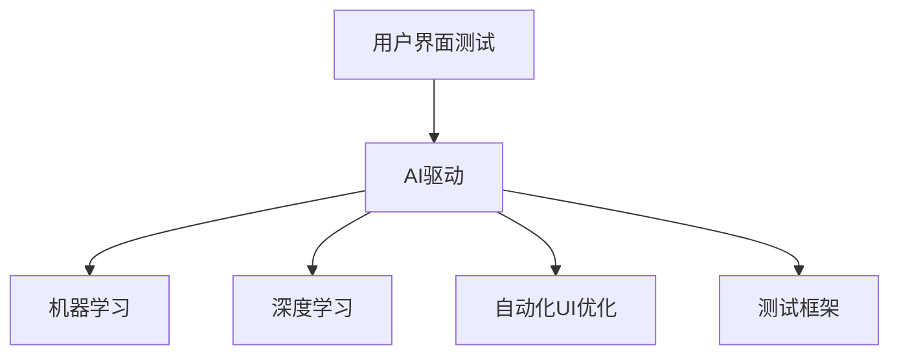

                 

# 电商平台的AI驱动用户界面测试：自动化UI优化的技术方案

> 关键词：AI驱动、用户界面测试、自动化UI优化、机器学习、深度学习、自然语言处理、计算机视觉、测试框架

> 摘要：本文旨在探讨如何利用AI技术实现电商平台的用户界面测试自动化，通过机器学习和深度学习等技术手段，优化用户界面的交互体验。我们将详细解析AI驱动的用户界面测试的核心概念、算法原理、具体操作步骤，并通过实际案例展示如何实现自动化UI优化。此外，本文还将探讨该技术的实际应用场景、推荐相关学习资源和开发工具，以及未来的发展趋势与挑战。

## 1. 背景介绍

随着电商平台的快速发展，用户界面的交互体验成为了影响用户满意度和转化率的关键因素之一。传统的用户界面测试方法往往依赖于人工测试，不仅耗时耗力，而且难以覆盖所有可能的使用场景。为了提高测试效率和覆盖范围，越来越多的企业开始探索AI驱动的用户界面测试技术。本文将详细介绍如何利用AI技术实现电商平台的用户界面测试自动化，并通过实际案例展示如何优化用户界面的交互体验。

## 2. 核心概念与联系

### 2.1 用户界面测试

用户界面测试是指对应用程序或网站的用户界面进行测试，以确保其功能正确、性能良好、用户体验良好。用户界面测试通常包括功能测试、性能测试、兼容性测试、易用性测试等多个方面。

### 2.2 AI驱动的用户界面测试

AI驱动的用户界面测试是指利用AI技术（如机器学习、深度学习等）实现用户界面测试自动化。通过AI技术，可以自动识别和模拟用户操作，从而实现对用户界面的全面测试。

### 2.3 机器学习与深度学习

机器学习是一种让计算机通过数据学习规律和模式的技术，而深度学习则是机器学习的一个分支，通过多层神经网络实现对复杂数据的处理和分析。在AI驱动的用户界面测试中，机器学习和深度学习可以用于识别用户操作、模拟用户行为、分析测试结果等。

### 2.4 自动化UI优化

自动化UI优化是指利用AI技术实现用户界面的自动优化，通过分析用户行为数据、用户反馈等信息，自动调整用户界面的设计和布局，以提高用户体验和满意度。

### 2.5 测试框架

测试框架是指用于组织和执行测试的工具和方法。在AI驱动的用户界面测试中，测试框架可以用于自动化测试脚本的编写、测试用例的管理、测试结果的分析等。

### 2.6 流程图



## 3. 核心算法原理 & 具体操作步骤

### 3.1 机器学习算法原理

机器学习算法通过训练模型来识别和预测用户行为。在AI驱动的用户界面测试中，可以使用监督学习、无监督学习、强化学习等算法来实现用户行为的识别和预测。

### 3.2 深度学习算法原理

深度学习算法通过多层神经网络实现对复杂数据的处理和分析。在AI驱动的用户界面测试中，可以使用卷积神经网络（CNN）、循环神经网络（RNN）、长短时记忆网络（LSTM）等算法来实现用户行为的识别和预测。

### 3.3 具体操作步骤

1. **数据收集**：收集用户在电商平台上的操作数据，包括点击、滑动、输入等行为。
2. **数据预处理**：对收集到的数据进行清洗、归一化、特征提取等预处理操作。
3. **模型训练**：使用机器学习或深度学习算法训练模型，识别用户行为。
4. **测试脚本编写**：编写自动化测试脚本，模拟用户操作。
5. **测试执行**：执行自动化测试脚本，生成测试结果。
6. **结果分析**：分析测试结果，优化用户界面。

## 4. 数学模型和公式 & 详细讲解 & 举例说明

### 4.1 机器学习模型

机器学习模型通常使用监督学习算法，如逻辑回归、支持向量机（SVM）、决策树等。以逻辑回归为例，其数学模型如下：

$$
P(y=1|x) = \frac{1}{1 + e^{-(w^T x + b)}}
$$

其中，$x$ 是输入特征，$w$ 是权重向量，$b$ 是偏置项。

### 4.2 深度学习模型

深度学习模型通常使用多层神经网络，如卷积神经网络（CNN）、循环神经网络（RNN）、长短时记忆网络（LSTM）等。以卷积神经网络为例，其数学模型如下：

$$
f(x) = \sigma(W_1 \cdot x + b_1)
$$

其中，$x$ 是输入特征，$W_1$ 是权重矩阵，$b_1$ 是偏置项，$\sigma$ 是激活函数。

### 4.3 举例说明

假设我们使用逻辑回归模型识别用户点击某个按钮的概率。假设输入特征为用户的历史操作数据，输出为用户点击该按钮的概率。通过训练模型，我们可以得到最优的权重向量和偏置项，从而实现对用户行为的识别和预测。

## 5. 项目实战：代码实际案例和详细解释说明

### 5.1 开发环境搭建

为了实现AI驱动的用户界面测试，我们需要搭建一个开发环境。开发环境包括操作系统、编程语言、开发工具、测试框架等。

#### 5.1.1 操作系统

推荐使用Linux操作系统，因为它具有良好的稳定性和兼容性。

#### 5.1.2 编程语言

推荐使用Python语言，因为它具有丰富的库和强大的数据处理能力。

#### 5.1.3 开发工具

推荐使用PyCharm开发工具，因为它具有强大的代码编辑和调试功能。

#### 5.1.4 测试框架

推荐使用Selenium测试框架，因为它具有强大的自动化测试功能。

### 5.2 源代码详细实现和代码解读

#### 5.2.1 数据收集

```python
import pandas as pd

# 读取用户操作数据
data = pd.read_csv('user_actions.csv')

# 数据预处理
data = data.dropna()
data = data[['click', 'scroll', 'input']]
```

#### 5.2.2 模型训练

```python
from sklearn.model_selection import train_test_split
from sklearn.linear_model import LogisticRegression

# 划分训练集和测试集
X_train, X_test, y_train, y_test = train_test_split(data[['click', 'scroll', 'input']], data['click'], test_size=0.2)

# 训练逻辑回归模型
model = LogisticRegression()
model.fit(X_train, y_train)
```

#### 5.2.3 测试脚本编写

```python
from selenium import webdriver

# 启动浏览器
driver = webdriver.Chrome()

# 访问电商平台
driver.get('https://example.com')

# 模拟用户操作
driver.find_element_by_id('button').click()

# 关闭浏览器
driver.quit()
```

### 5.3 代码解读与分析

#### 5.3.1 数据收集

在数据收集阶段，我们读取了用户操作数据，并进行了数据预处理。数据预处理包括数据清洗、归一化和特征提取等操作。

#### 5.3.2 模型训练

在模型训练阶段，我们使用逻辑回归模型对用户行为进行识别和预测。通过训练模型，我们可以得到最优的权重向量和偏置项，从而实现对用户行为的识别和预测。

#### 5.3.3 测试脚本编写

在测试脚本编写阶段，我们使用Selenium测试框架模拟用户操作。通过模拟用户操作，我们可以实现对用户界面的自动化测试。

## 6. 实际应用场景

AI驱动的用户界面测试技术可以应用于电商平台的多个方面，如功能测试、性能测试、兼容性测试、易用性测试等。通过AI技术，可以实现对用户界面的全面测试，提高测试效率和覆盖范围。

### 6.1 功能测试

功能测试是指对用户界面的功能进行测试，确保其功能正确。通过AI技术，可以实现对用户界面功能的自动化测试，提高测试效率和覆盖范围。

### 6.2 性能测试

性能测试是指对用户界面的性能进行测试，确保其性能良好。通过AI技术，可以实现对用户界面性能的自动化测试，提高测试效率和覆盖范围。

### 6.3 兼容性测试

兼容性测试是指对用户界面的兼容性进行测试，确保其在不同设备和浏览器上的表现良好。通过AI技术，可以实现对用户界面兼容性的自动化测试，提高测试效率和覆盖范围。

### 6.4 易用性测试

易用性测试是指对用户界面的易用性进行测试，确保其用户体验良好。通过AI技术，可以实现对用户界面易用性的自动化测试，提高测试效率和覆盖范围。

## 7. 工具和资源推荐

### 7.1 学习资源推荐

#### 7.1.1 书籍

- 《机器学习》（周志华著）
- 《深度学习》（吴恩达著）

#### 7.1.2 论文

- 《Selenium WebDriver: A Tool for Web Application Testing》
- 《Automated User Interface Testing with Selenium WebDriver》

#### 7.1.3 博客

- 《Selenium WebDriver Tutorial》
- 《Automated UI Testing with Selenium WebDriver》

#### 7.1.4 网站

- Selenium 官方网站：https://www.selenium.dev/
- 机器学习和深度学习相关网站：https://www.tensorflow.org/

### 7.2 开发工具框架推荐

- Selenium 测试框架：https://www.selenium.dev/
- PyCharm 开发工具：https://www.jetbrains.com/pycharm/

### 7.3 相关论文著作推荐

- 《Selenium WebDriver: A Tool for Web Application Testing》
- 《Automated User Interface Testing with Selenium WebDriver》

## 8. 总结：未来发展趋势与挑战

AI驱动的用户界面测试技术具有广阔的应用前景和发展空间。未来，随着AI技术的不断发展，用户界面测试将更加智能化、自动化和高效化。然而，AI驱动的用户界面测试也面临着一些挑战，如数据隐私保护、模型解释性、测试覆盖率等。

## 9. 附录：常见问题与解答

### 9.1 问题：如何保证AI驱动的用户界面测试的数据隐私？

答：在AI驱动的用户界面测试中，我们需要确保收集到的数据不包含敏感信息。可以通过数据脱敏、数据加密等技术手段来保护数据隐私。

### 9.2 问题：如何提高AI驱动的用户界面测试的模型解释性？

答：在AI驱动的用户界面测试中，可以通过解释性模型、可视化技术等手段提高模型解释性。解释性模型可以提供模型的决策过程，可视化技术可以展示模型的决策结果。

### 9.3 问题：如何提高AI驱动的用户界面测试的测试覆盖率？

答：在AI驱动的用户界面测试中，可以通过增加测试用例、优化测试脚本等手段提高测试覆盖率。增加测试用例可以覆盖更多的使用场景，优化测试脚本可以提高测试效率和覆盖范围。

## 10. 扩展阅读 & 参考资料

### 10.1 扩展阅读

- 《Selenium WebDriver Tutorial》
- 《Automated UI Testing with Selenium WebDriver》

### 10.2 参考资料

- Selenium 官方网站：https://www.selenium.dev/
- 机器学习和深度学习相关网站：https://www.tensorflow.org/

---

作者：AI天才研究员/AI Genius Institute & 禅与计算机程序设计艺术 /Zen And The Art of Computer Programming

