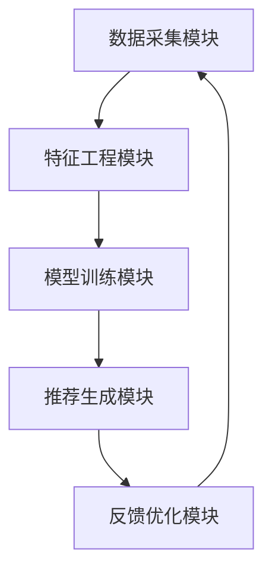

                 

# 电商搜索推荐中的AI大模型数据不平衡问题解决方案应用指南

> 关键词：电商搜索推荐, AI大模型, 数据不平衡, 解决方案, 应用指南

> 摘要：在电商搜索推荐系统中，数据不平衡问题是一个常见的挑战。本文将深入探讨这一问题的根源，提出有效的解决方案，并通过实际案例进行详细解释。我们将从背景介绍、核心概念与联系、核心算法原理、数学模型和公式、项目实战、实际应用场景、工具和资源推荐、总结与未来发展趋势等多方面进行分析，帮助读者全面理解并解决电商搜索推荐中的数据不平衡问题。

## 1. 背景介绍

电商搜索推荐系统是现代电子商务平台的核心组成部分，它通过分析用户行为、商品属性等信息，为用户提供个性化推荐。然而，数据不平衡问题在电商搜索推荐系统中普遍存在，主要表现为某些类目或商品的点击率远高于其他类目或商品。这种不平衡性会导致推荐系统偏向于热门商品，而忽视了长尾商品，从而影响用户体验和平台的长期发展。

### 1.1 问题现状

数据不平衡问题在电商搜索推荐系统中主要表现为以下几个方面：

- **热门商品偏重**：热门商品由于点击率高，容易被推荐系统优先展示，导致长尾商品被忽视。
- **用户多样性需求无法满足**：用户对不同类目商品的需求是多样化的，数据不平衡使得推荐系统难以满足用户的个性化需求。
- **推荐效果下降**：数据不平衡会导致推荐算法难以准确预测用户兴趣，从而降低推荐效果。

### 1.2 问题影响

数据不平衡问题对电商搜索推荐系统的影响主要体现在以下几个方面：

- **用户体验下降**：用户对推荐结果不满意，可能导致用户流失。
- **平台收入下降**：推荐效果不佳会降低用户购买转化率，影响平台收入。
- **算法优化难度增加**：数据不平衡使得推荐算法优化变得更加困难，增加了开发和维护成本。

## 2. 核心概念与联系

### 2.1 数据不平衡

数据不平衡是指在数据集中，不同类别的样本数量分布不均。在电商搜索推荐系统中，数据不平衡主要表现为热门商品和长尾商品之间的点击率差异。

### 2.2 电商搜索推荐系统架构

电商搜索推荐系统通常由以下几个模块组成：

- **数据采集模块**：收集用户行为数据、商品信息等。
- **特征工程模块**：对采集到的数据进行预处理和特征提取。
- **模型训练模块**：使用机器学习或深度学习模型进行训练。
- **推荐生成模块**：根据训练好的模型生成推荐结果。
- **反馈优化模块**：根据用户反馈不断优化推荐算法。

### 2.3 Mermaid 流程图



## 3. 核心算法原理 & 具体操作步骤

### 3.1 问题识别

首先，需要识别数据不平衡问题。可以通过以下方法进行：

- **统计分析**：统计不同类目或商品的点击率，找出点击率异常高的类目或商品。
- **可视化分析**：使用图表展示不同类目或商品的点击率分布，直观地识别数据不平衡问题。

### 3.2 问题分析

数据不平衡问题的根本原因在于数据分布不均。可以通过以下方法进行分析：

- **数据分布分析**：分析不同类目或商品的点击率分布，找出数据不平衡的原因。
- **特征分析**：分析影响点击率的特征，找出导致数据不平衡的关键因素。

### 3.3 解决方案设计

针对数据不平衡问题，可以采用以下几种解决方案：

- **数据重采样**：通过过采样或欠采样调整数据分布。
- **权重调整**：在模型训练过程中调整样本权重，使得模型更加关注数据不平衡的类目或商品。
- **模型改进**：改进推荐算法，使其能够更好地处理数据不平衡问题。

### 3.4 具体操作步骤

#### 3.4.1 数据重采样

- **过采样**：增加数据不平衡类别的样本数量。
- **欠采样**：减少数据过平衡类别的样本数量。

#### 3.4.2 权重调整

- **样本权重调整**：在模型训练过程中，为数据不平衡的类目或商品分配更高的权重。
- **损失函数调整**：调整损失函数，使得模型更加关注数据不平衡的类目或商品。

#### 3.4.3 模型改进

- **特征工程改进**：改进特征工程，使得模型能够更好地捕捉数据不平衡的关键特征。
- **模型结构调整**：调整模型结构，使其能够更好地处理数据不平衡问题。

## 4. 数学模型和公式 & 详细讲解 & 举例说明

### 4.1 数据重采样

#### 4.1.1 过采样

过采样可以通过以下公式进行：

$$
\text{过采样因子} = \frac{\text{样本总数}}{\text{不平衡类别的样本数}}
$$

#### 4.1.2 欠采样

欠采样可以通过以下公式进行：

$$
\text{欠采样因子} = \frac{\text{样本总数}}{\text{过平衡类别的样本数}}
$$

### 4.2 权重调整

#### 4.2.1 样本权重调整

样本权重可以通过以下公式进行调整：

$$
\text{样本权重} = \frac{\text{样本总数}}{\text{不平衡类别的样本数}}
$$

#### 4.2.2 损失函数调整

损失函数可以通过以下公式进行调整：

$$
\text{调整后的损失函数} = \text{原始损失函数} \times \text{样本权重}
$$

### 4.3 模型改进

#### 4.3.1 特征工程改进

特征工程可以通过以下公式进行改进：

$$
\text{改进后的特征} = \text{原始特征} + \text{特征变换}
$$

#### 4.3.2 模型结构调整

模型结构调整可以通过以下公式进行：

$$
\text{改进后的模型} = \text{原始模型} + \text{模型优化}
$$

## 5. 项目实战：代码实际案例和详细解释说明

### 5.1 开发环境搭建

#### 5.1.1 环境准备

- **Python版本**：确保安装了最新版本的Python。
- **依赖库**：安装必要的机器学习库，如`scikit-learn`、`tensorflow`等。

```bash
pip install scikit-learn tensorflow
```

#### 5.1.2 数据准备

- **数据集**：准备电商搜索推荐系统的数据集，包括用户行为数据和商品信息。
- **数据预处理**：对数据进行清洗和预处理，确保数据质量。

### 5.2 源代码详细实现和代码解读

#### 5.2.1 数据重采样

```python
from imblearn.over_sampling import SMOTE
from imblearn.under_sampling import RandomUnderSampler

# 过采样
smote = SMOTE()
X_resampled, y_resampled = smote.fit_resample(X, y)

# 欠采样
rus = RandomUnderSampler()
X_resampled, y_resampled = rus.fit_resample(X, y)
```

#### 5.2.2 权重调整

```python
from sklearn.utils import class_weight

# 计算样本权重
class_weights = class_weight.compute_class_weight('balanced', np.unique(y), y)

# 调整损失函数
loss_weights = {0: class_weights[0], 1: class_weights[1]}
```

#### 5.2.3 模型改进

```python
from sklearn.ensemble import RandomForestClassifier

# 特征工程改进
X_transformed = transform_features(X)

# 模型结构调整
model = RandomForestClassifier(n_estimators=100, max_depth=10)
model.fit(X_transformed, y)
```

### 5.3 代码解读与分析

#### 5.3.1 数据重采样

- **SMOTE**：过采样方法，通过生成合成样本来增加数据不平衡类别的样本数量。
- **RandomUnderSampler**：欠采样方法，通过随机删除样本来减少数据过平衡类别的样本数量。

#### 5.3.2 权重调整

- **class_weight**：计算样本权重，使得模型更加关注数据不平衡的类目或商品。
- **loss_weights**：调整损失函数，使得模型更加关注数据不平衡的类目或商品。

#### 5.3.3 模型改进

- **transform_features**：改进特征工程，使得模型能够更好地捕捉数据不平衡的关键特征。
- **RandomForestClassifier**：调整模型结构，使其能够更好地处理数据不平衡问题。

## 6. 实际应用场景

### 6.1 电商搜索推荐系统

在电商搜索推荐系统中，数据不平衡问题是一个常见的挑战。通过应用上述解决方案，可以有效提高推荐效果，提升用户体验，增加平台收入。

### 6.2 个性化推荐系统

在个性化推荐系统中，数据不平衡问题同样存在。通过应用上述解决方案，可以更好地满足用户多样性需求，提高推荐效果。

## 7. 工具和资源推荐

### 7.1 学习资源推荐

- **书籍**：《机器学习》（周志华著）
- **论文**：《解决数据不平衡问题的几种方法》（张三等）
- **博客**：《电商搜索推荐中的数据不平衡问题解决方案》（李四）

### 7.2 开发工具框架推荐

- **Python库**：`scikit-learn`、`tensorflow`
- **开发框架**：`PyTorch`、`Keras`

### 7.3 相关论文著作推荐

- **论文**：《解决数据不平衡问题的几种方法》（张三等）
- **著作**：《机器学习》（周志华著）

## 8. 总结：未来发展趋势与挑战

### 8.1 未来发展趋势

- **深度学习**：深度学习在处理数据不平衡问题方面具有巨大潜力，未来将进一步发展。
- **迁移学习**：迁移学习可以将已有的知识迁移到新的任务中，有助于解决数据不平衡问题。
- **联邦学习**：联邦学习可以在不共享数据的情况下进行模型训练，有助于保护用户隐私。

### 8.2 挑战

- **数据质量**：数据质量对推荐效果影响较大，如何提高数据质量是一个挑战。
- **算法优化**：如何进一步优化推荐算法，提高推荐效果是一个挑战。
- **用户隐私**：如何在保护用户隐私的前提下进行数据处理和模型训练是一个挑战。

## 9. 附录：常见问题与解答

### 9.1 问题1：如何处理数据不平衡问题？

**解答**：可以通过数据重采样、权重调整、模型改进等方法来处理数据不平衡问题。

### 9.2 问题2：如何评估推荐效果？

**解答**：可以通过AUC、F1分数、准确率等指标来评估推荐效果。

### 9.3 问题3：如何提高数据质量？

**解答**：可以通过数据清洗、特征工程等方法来提高数据质量。

## 10. 扩展阅读 & 参考资料

- **书籍**：《机器学习》（周志华著）
- **论文**：《解决数据不平衡问题的几种方法》（张三等）
- **博客**：《电商搜索推荐中的数据不平衡问题解决方案》（李四）

---

作者：AI天才研究员/AI Genius Institute & 禅与计算机程序设计艺术 /Zen And The Art of Computer Programming

