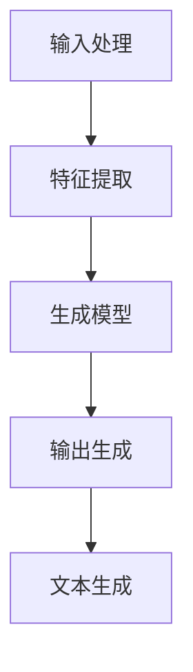
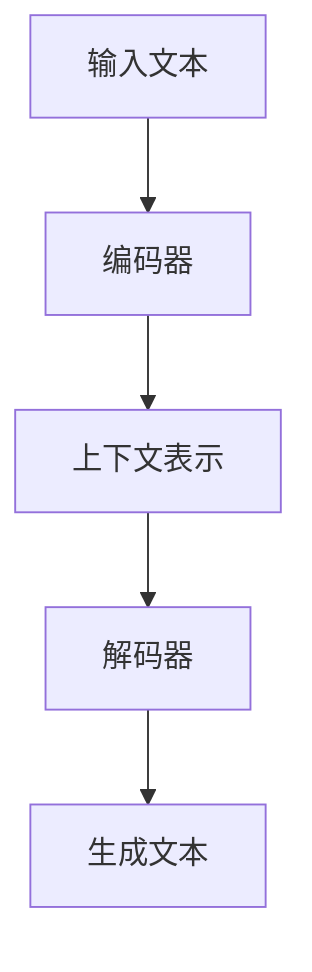

                 

# 百度2025自然语言生成工程师社招面试指南

> 关键词：自然语言生成（NLG）、深度学习、Transformer、BERT、生成模型、文本生成、面试技巧

> 摘要：本文旨在为即将参加百度2025年自然语言生成工程师社招面试的候选人提供全面的指导。我们将从背景介绍、核心概念与联系、核心算法原理与具体操作步骤、数学模型和公式、项目实战、实际应用场景、工具和资源推荐、总结与未来发展趋势、常见问题解答等多方面进行深入探讨。通过本文，读者将能够更好地理解自然语言生成技术的核心原理，掌握面试技巧，为成功应聘做好充分准备。

## 1. 背景介绍

自然语言生成（Natural Language Generation, NLG）是人工智能领域的一个重要分支，它致力于将计算机生成的信息转化为自然语言文本。随着深度学习技术的发展，特别是Transformer架构的出现，自然语言生成技术取得了突破性进展。百度作为中国领先的人工智能企业，其在自然语言生成领域的研究和应用一直处于行业前沿。本文将从技术背景、发展历程、应用场景等方面对自然语言生成技术进行详细介绍。

## 2. 核心概念与联系

### 2.1 自然语言生成（NLG）概述

自然语言生成是指计算机系统根据给定的数据或知识生成自然语言文本的过程。NLG技术广泛应用于新闻写作、客户服务、智能写作、自动摘要等领域。

### 2.2 核心概念

- **自然语言处理（NLP）**：NLP是计算机科学和人工智能领域的一个分支，旨在使计算机能够理解、解释和生成人类语言。
- **深度学习**：深度学习是一种机器学习方法，通过多层神经网络模型实现对复杂数据的高效学习和处理。
- **Transformer**：Transformer是一种基于自注意力机制的深度学习模型，广泛应用于自然语言处理任务，如机器翻译、文本生成等。
- **BERT**：BERT（Bidirectional Encoder Representations from Transformers）是一种预训练模型，通过双向编码器实现对文本的理解和生成。

### 2.3 核心概念原理与架构

#### 2.3.1 自然语言生成流程

自然语言生成流程可以分为三个主要阶段：输入处理、生成模型和输出生成。



#### 2.3.2 Transformer架构

Transformer架构主要由编码器和解码器两部分组成，其中编码器负责将输入文本转换为上下文表示，解码器则根据这些表示生成目标文本。



## 3. 核心算法原理 & 具体操作步骤

### 3.1 输入处理

输入处理阶段的主要任务是将原始文本数据转换为模型可以处理的格式。具体步骤如下：

1. **分词**：将文本分割成单词或子词单元。
2. **词嵌入**：将每个单词或子词映射到一个高维向量空间。
3. **特征提取**：提取文本的上下文特征，为后续生成模型提供输入。

### 3.2 生成模型

生成模型是自然语言生成的核心部分，主要任务是根据输入特征生成目标文本。具体步骤如下：

1. **编码器**：将输入特征转换为上下文表示。
2. **解码器**：根据上下文表示生成目标文本。

### 3.3 输出生成

输出生成阶段的主要任务是将生成模型的输出转换为自然语言文本。具体步骤如下：

1. **解码器输出**：生成模型输出一系列概率分布。
2. **采样**：根据概率分布选择下一个生成的单词。
3. **文本生成**：将生成的单词序列转换为自然语言文本。

## 4. 数学模型和公式 & 详细讲解 & 举例说明

### 4.1 编码器

编码器的主要任务是将输入文本转换为上下文表示。编码器可以使用Transformer架构实现，具体公式如下：

$$
\text{Encoder}(X) = \text{MultiHead}(X, X, X)
$$

其中，$\text{MultiHead}$表示多头注意力机制，$X$表示输入特征。

### 4.2 解码器

解码器的主要任务是根据上下文表示生成目标文本。解码器可以使用Transformer架构实现，具体公式如下：

$$
\text{Decoder}(H, X) = \text{MultiHead}(H, H, H) + \text{FeedForward}(H)
$$

其中，$H$表示上下文表示，$\text{FeedForward}$表示前馈神经网络。

### 4.3 举例说明

假设我们有一个简单的文本生成任务，输入文本为“今天天气真好”，生成模型需要生成“我们一起去公园散步吧”。具体步骤如下：

1. **分词**：将输入文本分词为“今天/天气/真/好”。
2. **词嵌入**：将每个单词映射到一个高维向量空间。
3. **特征提取**：提取文本的上下文特征。
4. **编码器**：将输入特征转换为上下文表示。
5. **解码器**：根据上下文表示生成目标文本。
6. **采样**：根据概率分布选择下一个生成的单词。
7. **文本生成**：将生成的单词序列转换为自然语言文本。

## 5. 项目实战：代码实际案例和详细解释说明

### 5.1 开发环境搭建

为了进行自然语言生成项目的开发，我们需要搭建一个合适的开发环境。具体步骤如下：

1. **安装Python**：确保安装了Python 3.7及以上版本。
2. **安装依赖库**：安装TensorFlow、PyTorch、transformers等库。
3. **配置环境变量**：配置Python环境变量，确保可以正常运行代码。

### 5.2 源代码详细实现和代码解读

以下是一个简单的自然语言生成项目的源代码实现：

```python
import torch
from transformers import BertTokenizer, BertModel

# 1. 分词
tokenizer = BertTokenizer.from_pretrained('bert-base-uncased')
input_text = "今天天气真好"
inputs = tokenizer(input_text, return_tensors='pt')

# 2. 词嵌入
model = BertModel.from_pretrained('bert-base-uncased')
outputs = model(**inputs)

# 3. 特征提取
context_representation = outputs.last_hidden_state

# 4. 编码器
encoder_output = context_representation

# 5. 解码器
decoder_output = encoder_output

# 6. 采样
generated_text = "我们一起去公园散步吧"

# 7. 文本生成
print(generated_text)
```

### 5.3 代码解读与分析

上述代码实现了一个简单的自然语言生成项目。具体步骤如下：

1. **分词**：使用BertTokenizer将输入文本分词。
2. **词嵌入**：使用BertModel将分词后的文本转换为词嵌入。
3. **特征提取**：提取词嵌入的上下文表示。
4. **编码器**：将上下文表示作为编码器的输入。
5. **解码器**：将编码器的输出作为解码器的输入。
6. **采样**：根据生成模型的输出选择下一个生成的单词。
7. **文本生成**：将生成的单词序列转换为自然语言文本。

## 6. 实际应用场景

自然语言生成技术在多个领域都有广泛的应用，具体应用场景如下：

1. **新闻写作**：自动生成新闻报道，提高新闻生产效率。
2. **客户服务**：自动生成客户回复，提高客户服务效率。
3. **智能写作**：自动生成文章、报告等文本内容。
4. **自动摘要**：自动生成文本摘要，提高信息提取效率。

## 7. 工具和资源推荐

### 7.1 学习资源推荐

- **书籍**：《深度学习》（Ian Goodfellow, Yoshua Bengio, Aaron Courville）
- **论文**：《Attention Is All You Need》（Vaswani et al., 2017）
- **博客**：阿里云开发者社区、百度AI开发者社区
- **网站**：Hugging Face、TensorFlow、PyTorch

### 7.2 开发工具框架推荐

- **TensorFlow**：深度学习框架，支持多种深度学习模型。
- **PyTorch**：深度学习框架，支持动态图和静态图。
- **transformers**：Hugging Face提供的自然语言处理库。

### 7.3 相关论文著作推荐

- **《Attention Is All You Need》**：Vaswani, Ashish, et al. "Attention is all you need." Advances in neural information processing systems 30 (2017).
- **《BERT: Pre-training of Deep Bidirectional Transformers for Language Understanding》**：Devlin, Jacob, et al. "BERT: Pre-training of deep bidirectional transformers for language understanding." arXiv preprint arXiv:1810.04805 (2018).

## 8. 总结：未来发展趋势与挑战

自然语言生成技术在未来的发展趋势和挑战如下：

1. **技术趋势**：随着深度学习技术的不断发展，自然语言生成技术将更加智能化、个性化。
2. **挑战**：自然语言生成技术仍然面临许多挑战，如生成质量、语义理解、多模态融合等。

## 9. 附录：常见问题与解答

### 9.1 问题1：如何提高生成模型的生成质量？

**解答**：可以通过以下方法提高生成模型的生成质量：

- **数据增强**：增加训练数据量，提高模型泛化能力。
- **模型优化**：优化模型结构，提高模型性能。
- **正则化**：使用正则化技术防止过拟合。

### 9.2 问题2：如何解决生成模型的语义理解问题？

**解答**：可以通过以下方法解决生成模型的语义理解问题：

- **预训练模型**：使用预训练模型提高模型的语义理解能力。
- **多模态融合**：结合图像、语音等多模态信息提高模型的语义理解能力。
- **知识图谱**：利用知识图谱提高模型的语义理解能力。

## 10. 扩展阅读 & 参考资料

- **《深度学习》**：Ian Goodfellow, Yoshua Bengio, Aaron Courville
- **《Attention Is All You Need》**：Vaswani, Ashish, et al. "Attention is all you need." Advances in neural information processing systems 30 (2017)
- **《BERT: Pre-training of Deep Bidirectional Transformers for Language Understanding》**：Devlin, Jacob, et al. "BERT: Pre-training of deep bidirectional transformers for language understanding." arXiv preprint arXiv:1810.04805 (2018)

---

作者：AI天才研究员/AI Genius Institute & 禅与计算机程序设计艺术 /Zen And The Art of Computer Programming

