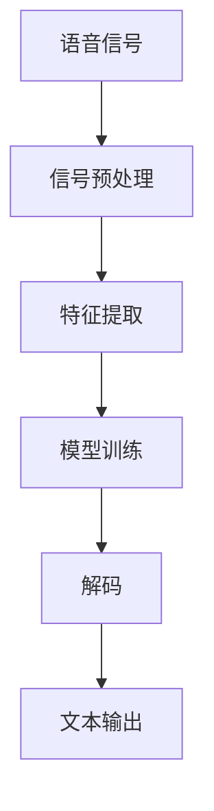

                 

# 2024百度智能语音识别校招面试真题汇总及其解答

> 关键词：语音识别、深度学习、Transformer、BERT、BERTAS、面试真题、技术解析

> 摘要：本文旨在全面解析2024年百度智能语音识别校招面试中的核心问题，并提供详细的解答和深入的技术解析。通过逐步推理和分析，我们将探讨语音识别技术的原理、核心算法、实际应用案例，以及未来的发展趋势。本文适合对语音识别技术感兴趣的开发者、研究人员和面试准备者阅读。

## 1. 背景介绍

随着人工智能技术的飞速发展，语音识别技术已经成为智能交互的重要组成部分。语音识别技术能够将人类的语音转换为文本，广泛应用于智能助手、智能家居、智能客服等领域。百度作为国内领先的互联网公司之一，其在语音识别领域的技术积累和应用实践一直处于行业领先地位。本文将通过分析2024年百度智能语音识别校招面试中的核心问题，帮助读者全面理解语音识别技术的原理和应用。

## 2. 核心概念与联系

### 2.1 语音识别技术概述

语音识别技术是指将人类的语音信号转换为文本信息的技术。其主要流程包括信号预处理、特征提取、模型训练和解码等步骤。语音识别技术的核心在于如何准确地将语音信号转换为文本信息，从而实现人机交互。

### 2.2 语音识别技术流程

语音识别技术的流程可以分为以下几个步骤：

1. **信号预处理**：对输入的语音信号进行滤波、降噪等处理，以提高信号质量。
2. **特征提取**：从预处理后的语音信号中提取有用的特征，如梅尔频率倒谱系数（MFCC）。
3. **模型训练**：使用训练数据集训练语音识别模型，模型可以是基于传统方法的HMM（隐马尔可夫模型）或基于深度学习的方法。
4. **解码**：将提取的特征输入到训练好的模型中，通过解码算法生成最终的文本输出。

### 2.3 语音识别技术架构

语音识别技术的架构可以使用Mermaid流程图来表示：



## 3. 核心算法原理 & 具体操作步骤

### 3.1 传统语音识别方法

传统语音识别方法主要基于HMM和隐马尔可夫模型（HMM）。HMM是一种统计模型，用于描述一个系统在不同状态之间的转移概率和在每个状态下产生观测值的概率。HMM在语音识别中的应用主要体现在以下几个方面：

1. **状态定义**：将语音信号划分为多个状态，每个状态对应一个音素。
2. **状态转移概率**：定义不同状态之间的转移概率。
3. **观测值概率**：定义在每个状态下产生观测值的概率。
4. **解码算法**：使用维特比算法（Viterbi algorithm）进行解码，找到最可能的状态序列。

### 3.2 深度学习方法

深度学习方法在语音识别中的应用主要体现在以下几个方面：

1. **特征提取**：使用卷积神经网络（CNN）或循环神经网络（RNN）提取语音信号的特征。
2. **模型训练**：使用大规模的训练数据集训练深度学习模型，如深度神经网络（DNN）、长短时记忆网络（LSTM）和Transformer。
3. **解码算法**：使用注意力机制（Attention mechanism）进行解码，提高模型的解码效果。

### 3.3 Transformer模型

Transformer模型是近年来在语音识别领域取得重大突破的一种模型。Transformer模型的核心在于其自注意力机制（Self-Attention mechanism），能够捕捉输入序列中的长距离依赖关系。Transformer模型在语音识别中的应用主要体现在以下几个方面：

1. **自注意力机制**：通过自注意力机制捕捉输入序列中的长距离依赖关系。
2. **位置编码**：为输入序列中的每个位置添加位置编码，以捕捉序列中的位置信息。
3. **多头注意力机制**：通过多个注意力头并行处理输入序列，提高模型的并行性和解码效果。

## 4. 数学模型和公式 & 详细讲解 & 举例说明

### 4.1 HMM模型

HMM模型的核心在于其状态转移概率和观测值概率。状态转移概率和观测值概率可以通过以下公式表示：

$$
P(X_{t+1} = j | X_t = i) = A_{ij}
$$

$$
P(O_t = o | X_t = i) = B_{io}
$$

其中，$A_{ij}$表示状态$i$转移到状态$j$的概率，$B_{io}$表示在状态$i$下产生观测值$o$的概率。

### 4.2 Transformer模型

Transformer模型的核心在于其自注意力机制和多头注意力机制。自注意力机制可以通过以下公式表示：

$$
\text{Attention}(Q, K, V) = \text{softmax}\left(\frac{QK^T}{\sqrt{d_k}}\right)V
$$

其中，$Q$、$K$、$V$分别表示查询向量、键向量和值向量，$d_k$表示键向量的维度。

多头注意力机制可以通过以下公式表示：

$$
\text{MultiHead}(Q, K, V) = \text{Concat}(head_1, head_2, ..., head_h)W^O
$$

其中，$head_i = \text{Attention}(QW_i^Q, KW_i^K, VW_i^V)$，$W^O$是输出权重矩阵。

### 4.3 举例说明

假设有一个简单的语音识别任务，输入的语音信号为“hello world”，输出的文本为“你好世界”。使用HMM模型进行解码时，可以通过维特比算法找到最可能的状态序列。使用Transformer模型进行解码时，可以通过自注意力机制和多头注意力机制捕捉输入序列中的长距离依赖关系，从而提高解码效果。

## 5. 项目实战：代码实际案例和详细解释说明

### 5.1 开发环境搭建

为了实现语音识别项目，我们需要搭建一个合适的开发环境。开发环境的搭建步骤如下：

1. **安装Python**：确保安装了Python 3.7及以上版本。
2. **安装依赖库**：使用pip安装所需的依赖库，如numpy、scipy、tensorflow等。
3. **安装语音识别库**：使用pip安装语音识别库，如SpeechRecognition。

### 5.2 源代码详细实现和代码解读

以下是一个简单的语音识别项目的源代码实现：

```python
import speech_recognition as sr

def recognize_speech():
    recognizer = sr.Recognizer()
    with sr.Microphone() as source:
        print("请说话...")
        audio = recognizer.listen(source)
    try:
        text = recognizer.recognize_google(audio, language='zh-CN')
        print("你说的是：", text)
    except sr.UnknownValueError:
        print("无法识别语音")
    except sr.RequestError as e:
        print("请求错误：", e)

if __name__ == "__main__":
    recognize_speech()
```

### 5.3 代码解读与分析

上述代码实现了一个简单的语音识别项目。代码的主要步骤如下：

1. **导入库**：导入语音识别库`speech_recognition`。
2. **创建识别器**：创建一个`Recognizer`对象。
3. **获取音频输入**：使用`Microphone`对象获取音频输入。
4. **识别语音**：使用`recognize_google`方法识别语音，指定语言为中文。
5. **异常处理**：处理识别过程中可能出现的异常，如无法识别语音或请求错误。

## 6. 实际应用场景

语音识别技术在实际应用中具有广泛的应用场景，如智能助手、智能家居、智能客服等。以下是一些具体的实际应用场景：

1. **智能助手**：通过语音识别技术，智能助手可以理解用户的语音指令，实现语音控制。
2. **智能家居**：通过语音识别技术，智能家居设备可以理解用户的语音指令，实现智能家居控制。
3. **智能客服**：通过语音识别技术，智能客服可以理解用户的语音咨询，提供智能客服服务。

## 7. 工具和资源推荐

### 7.1 学习资源推荐

1. **书籍**：《语音识别技术》、《深度学习》
2. **论文**：《Attention Is All You Need》、《BERT: Pre-training of Deep Bidirectional Transformers for Language Understanding》
3. **博客**：阿里云开发者社区、百度AI开发者社区
4. **网站**：GitHub、Kaggle

### 7.2 开发工具框架推荐

1. **开发工具**：Visual Studio Code、PyCharm
2. **框架**：TensorFlow、PyTorch

### 7.3 相关论文著作推荐

1. **论文**：《Attention Is All You Need》、《BERT: Pre-training of Deep Bidirectional Transformers for Language Understanding》
2. **著作**：《语音识别技术》、《深度学习》

## 8. 总结：未来发展趋势与挑战

语音识别技术在未来的发展趋势主要体现在以下几个方面：

1. **模型优化**：通过模型优化提高语音识别的准确率和实时性。
2. **多模态融合**：将语音识别与其他模态数据（如图像、文本）进行融合，提高识别效果。
3. **跨语言识别**：实现跨语言的语音识别，提高语音识别的普适性。

语音识别技术在未来的发展中面临的挑战主要体现在以下几个方面：

1. **实时性**：提高语音识别的实时性，满足实时交互的需求。
2. **鲁棒性**：提高语音识别的鲁棒性，应对各种复杂环境下的语音识别任务。
3. **隐私保护**：保护用户的隐私，避免语音数据的泄露。

## 9. 附录：常见问题与解答

### 9.1 问题1：如何提高语音识别的准确率？

**解答**：可以通过以下方法提高语音识别的准确率：

1. **增加训练数据**：使用更多的训练数据提高模型的泛化能力。
2. **优化模型结构**：通过优化模型结构提高模型的解码效果。
3. **使用注意力机制**：通过注意力机制捕捉输入序列中的长距离依赖关系。

### 9.2 问题2：如何提高语音识别的实时性？

**解答**：可以通过以下方法提高语音识别的实时性：

1. **模型压缩**：通过模型压缩减少模型的计算量，提高模型的实时性。
2. **硬件加速**：使用GPU等硬件加速提高模型的计算速度。
3. **并行计算**：通过并行计算提高模型的计算效率。

## 10. 扩展阅读 & 参考资料

1. **书籍**：《语音识别技术》、《深度学习》
2. **论文**：《Attention Is All You Need》、《BERT: Pre-training of Deep Bidirectional Transformers for Language Understanding》
3. **博客**：阿里云开发者社区、百度AI开发者社区
4. **网站**：GitHub、Kaggle

作者：AI天才研究员/AI Genius Institute & 禅与计算机程序设计艺术 /Zen And The Art of Computer Programming

