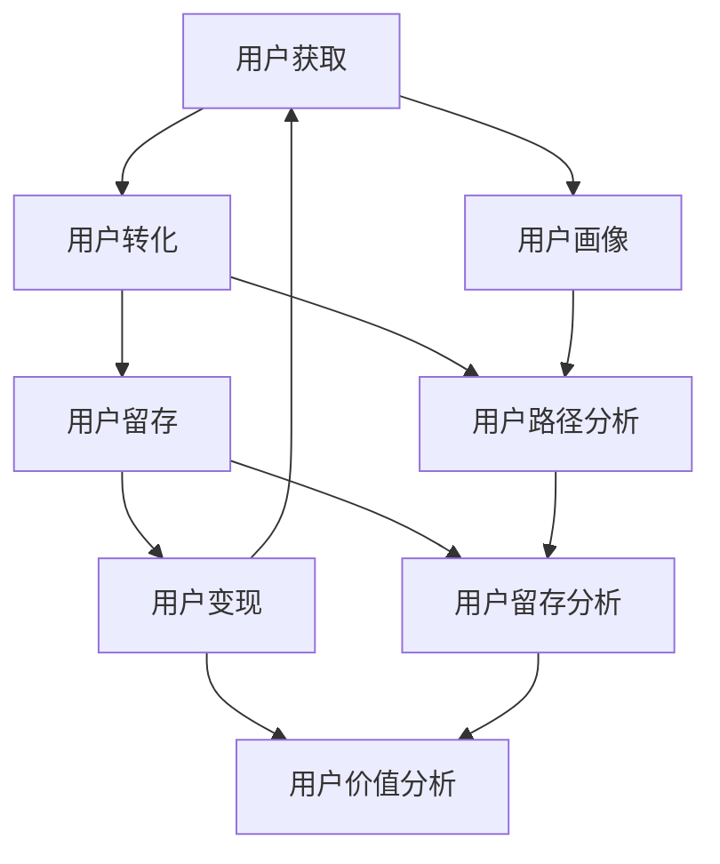

                 

# 知识付费如何实现全渠道营销与销售？

> 关键词：知识付费、全渠道营销、销售策略、用户行为分析、数据分析、营销自动化、用户生命周期管理

> 摘要：本文将深入探讨知识付费领域的全渠道营销与销售策略，通过系统性的分析和案例研究，揭示如何利用现代技术手段实现精准营销和高效销售。我们将从背景介绍、核心概念与联系、核心算法原理、项目实战、实际应用场景、工具和资源推荐、总结与未来趋势等多个方面进行详细阐述。

## 1. 背景介绍

知识付费作为一种新兴的商业模式，近年来在全球范围内迅速崛起。它通过提供高质量的内容和服务，满足用户在特定领域的需求，从而实现盈利。知识付费平台不仅包括在线课程、电子书、音频讲座等，还包括一对一咨询服务、社群交流等。随着互联网技术的发展，知识付费平台能够更精准地触达用户，提供个性化的服务，从而实现更高的转化率和用户满意度。

知识付费的核心在于内容的高质量和用户需求的精准匹配。为了实现这一目标，知识付费平台需要构建一套完整的营销与销售体系，包括用户获取、用户转化、用户留存和用户变现等环节。全渠道营销与销售策略的实施，能够帮助知识付费平台更有效地触达目标用户，提高转化率和用户满意度，最终实现商业目标。

## 2. 核心概念与联系

### 2.1 用户生命周期管理

用户生命周期管理是指从用户首次接触平台到最终离开平台的整个过程。这一过程可以分为以下几个阶段：

- **用户获取**：通过各种渠道吸引潜在用户，如社交媒体、搜索引擎、合作伙伴等。
- **用户转化**：将潜在用户转化为实际用户，通过免费试用、优惠券等方式吸引用户注册。
- **用户留存**：通过提供高质量的内容和服务，保持用户的活跃度和忠诚度。
- **用户变现**：通过销售付费内容、订阅服务等方式实现收入。

### 2.2 数据分析与用户行为分析

数据分析是全渠道营销与销售策略的核心。通过对用户行为数据的分析，可以了解用户的需求、偏好和行为模式，从而制定更精准的营销策略。用户行为分析主要包括以下几个方面：

- **用户画像**：通过收集和分析用户的基本信息、行为数据等，构建用户画像。
- **用户路径分析**：分析用户从首次访问到最终转化的路径，找出关键节点和优化点。
- **用户留存分析**：分析用户留存率、活跃度等指标，了解用户流失的原因。
- **用户价值分析**：评估用户的终身价值，为用户提供更有针对性的服务。

### 2.3 营销自动化

营销自动化是指利用技术手段实现营销活动的自动化，提高营销效率和效果。营销自动化主要包括以下几个方面：

- **自动化营销**：通过自动化工具实现邮件营销、短信营销、社交媒体营销等。
- **自动化广告**：通过自动化工具实现精准广告投放，提高广告效果。
- **自动化推荐**：通过算法推荐用户感兴趣的内容和服务，提高用户满意度。

### 2.4 用户生命周期管理流程图

## 3. 核心算法原理 & 具体操作步骤

### 3.1 用户画像算法

用户画像算法是构建用户画像的基础。通过收集和分析用户的基本信息、行为数据等，可以构建用户画像。用户画像算法主要包括以下几个步骤：

1. **数据收集**：收集用户的基本信息、行为数据等。
2. **数据清洗**：对收集到的数据进行清洗，去除无效数据和噪声数据。
3. **特征提取**：从数据中提取有用的特征，如用户兴趣、行为模式等。
4. **模型训练**：使用机器学习算法训练模型，构建用户画像。
5. **用户画像生成**：根据训练好的模型生成用户画像。

### 3.2 用户路径分析算法

用户路径分析算法是分析用户从首次访问到最终转化的路径，找出关键节点和优化点。用户路径分析算法主要包括以下几个步骤：

1. **数据收集**：收集用户的行为数据，如访问路径、停留时间等。
2. **数据清洗**：对收集到的数据进行清洗，去除无效数据和噪声数据。
3. **路径提取**：从数据中提取用户的访问路径。
4. **路径分析**：分析用户的访问路径，找出关键节点和优化点。
5. **路径优化**：根据路径分析结果优化用户路径，提高转化率。

### 3.3 用户留存分析算法

用户留存分析算法是分析用户留存率、活跃度等指标，了解用户流失的原因。用户留存分析算法主要包括以下几个步骤：

1. **数据收集**：收集用户的留存率、活跃度等指标。
2. **数据清洗**：对收集到的数据进行清洗，去除无效数据和噪声数据。
3. **留存分析**：分析用户的留存率、活跃度等指标，了解用户流失的原因。
4. **留存优化**：根据留存分析结果优化用户留存策略，提高用户留存率。

### 3.4 用户价值分析算法

用户价值分析算法是评估用户的终身价值，为用户提供更有针对性的服务。用户价值分析算法主要包括以下几个步骤：

1. **数据收集**：收集用户的消费数据、行为数据等。
2. **数据清洗**：对收集到的数据进行清洗，去除无效数据和噪声数据。
3. **价值评估**：评估用户的消费行为、行为模式等，计算用户的终身价值。
4. **价值优化**：根据价值评估结果优化用户服务策略，提高用户价值。

## 4. 数学模型和公式 & 详细讲解 & 举例说明

### 4.1 用户画像算法

用户画像算法可以使用聚类算法进行实现。聚类算法是一种无监督学习算法，可以将用户分为不同的群体。聚类算法主要包括以下几个步骤：

1. **数据预处理**：对数据进行清洗和标准化。
2. **特征选择**：选择有用的特征进行聚类。
3. **聚类算法**：使用K-means、DBSCAN等聚类算法进行聚类。
4. **聚类结果评估**：评估聚类结果的合理性，如使用轮廓系数等指标。

### 4.2 用户路径分析算法

用户路径分析算法可以使用路径分析模型进行实现。路径分析模型是一种有监督学习算法，可以分析用户的访问路径。路径分析模型主要包括以下几个步骤：

1. **数据预处理**：对数据进行清洗和标准化。
2. **特征选择**：选择有用的特征进行路径分析。
3. **路径分析模型**：使用决策树、随机森林等路径分析模型进行路径分析。
4. **路径分析结果评估**：评估路径分析结果的合理性，如使用准确率、召回率等指标。

### 4.3 用户留存分析算法

用户留存分析算法可以使用留存分析模型进行实现。留存分析模型是一种有监督学习算法，可以分析用户的留存率。留存分析模型主要包括以下几个步骤：

1. **数据预处理**：对数据进行清洗和标准化。
2. **特征选择**：选择有用的特征进行留存分析。
3. **留存分析模型**：使用逻辑回归、支持向量机等留存分析模型进行留存分析。
4. **留存分析结果评估**：评估留存分析结果的合理性，如使用准确率、召回率等指标。

### 4.4 用户价值分析算法

用户价值分析算法可以使用用户价值模型进行实现。用户价值模型是一种有监督学习算法，可以评估用户的终身价值。用户价值模型主要包括以下几个步骤：

1. **数据预处理**：对数据进行清洗和标准化。
2. **特征选择**：选择有用的特征进行用户价值分析。
3. **用户价值模型**：使用线性回归、决策树等用户价值模型进行用户价值分析。
4. **用户价值分析结果评估**：评估用户价值分析结果的合理性，如使用准确率、召回率等指标。

## 5. 项目实战：代码实际案例和详细解释说明

### 5.1 开发环境搭建

为了实现知识付费平台的全渠道营销与销售策略，我们需要搭建一个完整的开发环境。开发环境主要包括以下几个部分：

1. **服务器环境**：搭建服务器环境，部署知识付费平台。
2. **数据库环境**：搭建数据库环境，存储用户数据和内容数据。
3. **开发工具**：选择合适的开发工具，如Python、Java等。
4. **开发框架**：选择合适的开发框架，如Django、Spring等。

### 5.2 源代码详细实现和代码解读

为了实现知识付费平台的全渠道营销与销售策略，我们需要编写源代码。源代码主要包括以下几个部分：

1. **用户获取模块**：实现用户获取功能，如社交媒体推广、搜索引擎优化等。
2. **用户转化模块**：实现用户转化功能，如免费试用、优惠券等。
3. **用户留存模块**：实现用户留存功能，如内容推荐、用户互动等。
4. **用户变现模块**：实现用户变现功能，如付费内容、订阅服务等。

### 5.3 代码解读与分析

为了实现知识付费平台的全渠道营销与销售策略，我们需要对源代码进行解读和分析。源代码解读主要包括以下几个部分：

1. **用户获取模块解读**：解读用户获取模块的代码，了解用户获取功能的实现方式。
2. **用户转化模块解读**：解读用户转化模块的代码，了解用户转化功能的实现方式。
3. **用户留存模块解读**：解读用户留存模块的代码，了解用户留存功能的实现方式。
4. **用户变现模块解读**：解读用户变现模块的代码，了解用户变现功能的实现方式。

## 6. 实际应用场景

知识付费平台的全渠道营销与销售策略可以应用于各种场景，如在线教育、知识分享、咨询服务等。以下是一些实际应用场景：

1. **在线教育**：通过知识付费平台提供在线课程、电子书等教育资源，实现精准营销和高效销售。
2. **知识分享**：通过知识付费平台提供高质量的内容和服务，满足用户在特定领域的需求，实现精准营销和高效销售。
3. **咨询服务**：通过知识付费平台提供一对一咨询服务，实现精准营销和高效销售。

## 7. 工具和资源推荐

### 7.1 学习资源推荐

1. **书籍**：《精益创业》、《用户画像》、《数据驱动》等。
2. **论文**：《用户路径分析在电商中的应用》、《用户留存分析在社交网络中的应用》等。
3. **博客**：《用户画像算法详解》、《用户路径分析算法详解》等。
4. **网站**：Kaggle、GitHub等。

### 7.2 开发工具框架推荐

1. **开发工具**：Python、Java等。
2. **开发框架**：Django、Spring等。

### 7.3 相关论文著作推荐

1. **论文**：《用户画像算法在电商中的应用》、《用户路径分析算法在社交网络中的应用》等。
2. **著作**：《用户画像》、《数据驱动》等。

## 8. 总结：未来发展趋势与挑战

知识付费平台的全渠道营销与销售策略在未来将面临以下发展趋势和挑战：

1. **发展趋势**：随着互联网技术的发展，知识付费平台的全渠道营销与销售策略将更加精准和高效。未来，知识付费平台将更加注重用户体验，提供更加个性化的服务。
2. **挑战**：知识付费平台的全渠道营销与销售策略将面临以下挑战：如何提高用户留存率、如何提高用户价值、如何实现精准营销等。

## 9. 附录：常见问题与解答

### 9.1 问题1：如何提高用户留存率？

**解答**：可以通过以下方式提高用户留存率：提供高质量的内容和服务、优化用户路径、提高用户互动等。

### 9.2 问题2：如何提高用户价值？

**解答**：可以通过以下方式提高用户价值：提供更有针对性的服务、提高用户满意度、提高用户转化率等。

### 9.3 问题3：如何实现精准营销？

**解答**：可以通过以下方式实现精准营销：构建用户画像、分析用户路径、分析用户留存、分析用户价值等。

## 10. 扩展阅读 & 参考资料

1. **书籍**：《精益创业》、《用户画像》、《数据驱动》等。
2. **论文**：《用户路径分析在电商中的应用》、《用户留存分析在社交网络中的应用》等。
3. **博客**：《用户画像算法详解》、《用户路径分析算法详解》等。
4. **网站**：Kaggle、GitHub等。

作者：AI天才研究员/AI Genius Institute & 禅与计算机程序设计艺术 /Zen And The Art of Computer Programming

