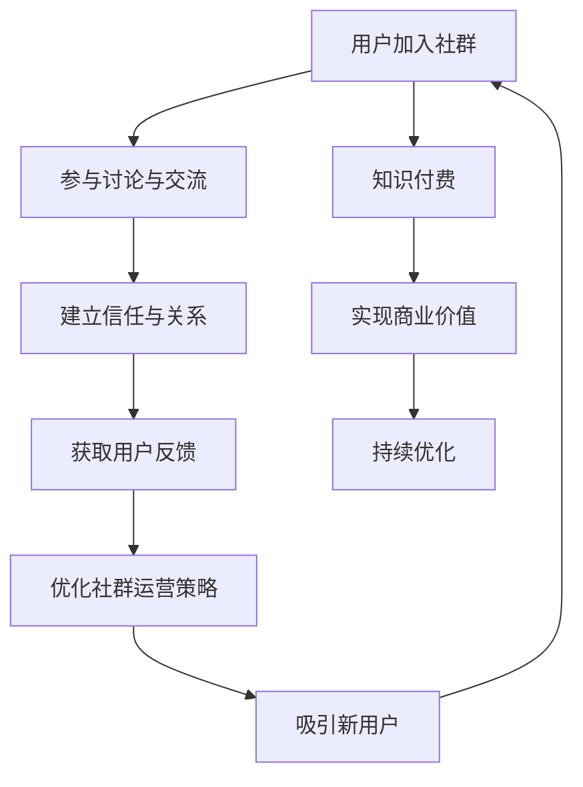

                 

# 知识付费：程序员的社群运营思维

> 关键词：社群运营、知识付费、程序员、用户增长、内容策略、社区管理、用户互动

> 摘要：在数字化时代，知识付费已成为一种重要的商业模式，尤其对于程序员群体而言，社群运营是实现知识变现的关键。本文将从社群运营的核心概念出发，探讨知识付费的原理与实践，通过具体案例分析，为程序员提供一套系统化的社群运营策略，帮助他们在知识付费领域取得成功。

## 1. 背景介绍

随着互联网技术的飞速发展，知识付费已经成为一种重要的商业模式。特别是在程序员群体中，社群运营成为了实现知识变现的关键手段。社群运营不仅能够帮助程序员建立个人品牌，还能促进知识的传播与交流，最终实现商业价值。本文将从社群运营的核心概念出发，探讨知识付费的原理与实践，通过具体案例分析，为程序员提供一套系统化的社群运营策略。

## 2. 核心概念与联系

### 2.1 社群运营的核心概念

社群运营是指通过一系列策略和方法，建立并维护一个具有共同兴趣和目标的用户群体，以实现商业价值的过程。对于程序员而言，社群运营的核心在于构建一个高质量的知识分享平台，吸引并留住用户，最终实现知识变现。

### 2.2 社群运营与知识付费的关系

社群运营与知识付费之间存在着密切的联系。社群运营为知识付费提供了用户基础，而知识付费则是社群运营的核心目标。通过社群运营，程序员可以吸引更多的用户加入社群，从而为知识付费提供更多的潜在客户。同时，知识付费也为社群运营提供了持续的动力，通过知识付费的收入，可以进一步优化社群运营策略，提升用户体验。

### 2.3 社群运营的Mermaid流程图



## 3. 核心算法原理 & 具体操作步骤

### 3.1 社群运营的核心算法

社群运营的核心算法主要包括用户增长算法、内容推荐算法和用户互动算法。这些算法共同作用，确保社群的持续增长和活跃度。

#### 3.1.1 用户增长算法

用户增长算法的核心在于通过多种渠道吸引新用户加入社群。具体操作步骤如下：

1. **社交媒体推广**：利用微博、微信公众号、知乎等社交媒体平台进行推广，吸引潜在用户。
2. **内容营销**：通过撰写高质量的技术文章和博客，吸引用户关注并加入社群。
3. **口碑传播**：鼓励现有用户分享社群的价值，通过口碑传播吸引更多用户。

#### 3.1.2 内容推荐算法

内容推荐算法的核心在于通过算法推荐用户感兴趣的内容，提高用户参与度。具体操作步骤如下：

1. **数据分析**：收集用户行为数据，分析用户的兴趣偏好。
2. **个性化推荐**：根据用户的兴趣偏好，推荐相关的内容。
3. **反馈优化**：通过用户反馈不断优化推荐算法，提高推荐的准确性和用户满意度。

#### 3.1.3 用户互动算法

用户互动算法的核心在于通过多种方式促进用户之间的互动，提高社群的活跃度。具体操作步骤如下：

1. **话题讨论**：定期组织话题讨论，鼓励用户参与讨论。
2. **问答环节**：设置问答环节，让用户提问并解答问题。
3. **活动策划**：策划线上线下活动，增强用户之间的互动。

## 4. 数学模型和公式 & 详细讲解 & 举例说明

### 4.1 用户增长模型

用户增长模型的核心在于通过多种渠道吸引新用户加入社群。具体数学模型如下：

$$
\text{用户增长率} = \frac{\text{新增用户数} - \text{流失用户数}}{\text{现有用户数}}
$$

### 4.2 内容推荐模型

内容推荐模型的核心在于通过算法推荐用户感兴趣的内容。具体数学模型如下：

$$
\text{推荐概率} = \frac{\text{用户兴趣度} \times \text{内容相关度}}{\text{总兴趣度}}
$$

### 4.3 用户互动模型

用户互动模型的核心在于通过多种方式促进用户之间的互动。具体数学模型如下：

$$
\text{互动率} = \frac{\text{互动次数}}{\text{用户总数} \times \text{天数}}
$$

## 5. 项目实战：代码实际案例和详细解释说明

### 5.1 开发环境搭建

为了实现社群运营，我们需要搭建一个稳定的开发环境。具体步骤如下：

1. **选择开发工具**：选择合适的开发工具，如Django、Flask等。
2. **搭建服务器**：选择合适的服务器，如阿里云、腾讯云等。
3. **配置数据库**：选择合适的数据库，如MySQL、MongoDB等。

### 5.2 源代码详细实现和代码解读

以下是一个简单的社群运营系统的源代码实现：

```python
# models.py
from django.db import models

class User(models.Model):
    username = models.CharField(max_length=100)
    email = models.EmailField(unique=True)
    join_date = models.DateTimeField(auto_now_add=True)

class Post(models.Model):
    title = models.CharField(max_length=200)
    content = models.TextField()
    author = models.ForeignKey(User, on_delete=models.CASCADE)
    created_at = models.DateTimeField(auto_now_add=True)

# views.py
from django.shortcuts import render
from .models import Post

def home(request):
    posts = Post.objects.all().order_by('-created_at')
    return render(request, 'home.html', {'posts': posts})

# urls.py
from django.urls import path
from . import views

urlpatterns = [
    path('', views.home, name='home'),
]
```

### 5.3 代码解读与分析

以上代码实现了一个简单的社群运营系统，主要包括用户模型和帖子模型。用户模型记录了用户的用户名、邮箱和加入日期，帖子模型记录了帖子的标题、内容、作者和创建日期。通过这些模型，我们可以实现用户管理和帖子管理的功能。

## 6. 实际应用场景

### 6.1 技术分享社群

技术分享社群是社群运营的一种常见应用场景。通过定期组织技术分享活动，吸引用户加入社群，分享技术知识，提高用户的参与度和活跃度。

### 6.2 项目合作社群

项目合作社群是另一种常见的应用场景。通过组织项目合作活动，吸引用户加入社群，共同完成项目，提高用户的参与度和活跃度。

### 6.3 技术培训社群

技术培训社群是另一种常见的应用场景。通过组织技术培训活动，吸引用户加入社群，提高用户的技能水平，提高用户的参与度和活跃度。

## 7. 工具和资源推荐

### 7.1 学习资源推荐

1. **书籍**：《社群运营实战》、《社群营销》
2. **论文**：《社群运营的理论与实践》、《社群运营的用户增长策略》
3. **博客**：知乎、CSDN、掘金
4. **网站**：GitHub、Stack Overflow

### 7.2 开发工具框架推荐

1. **开发工具**：Django、Flask
2. **服务器**：阿里云、腾讯云
3. **数据库**：MySQL、MongoDB

### 7.3 相关论文著作推荐

1. **论文**：《社群运营的用户增长策略》、《社群运营的用户互动策略》
2. **著作**：《社群运营实战》、《社群营销》

## 8. 总结：未来发展趋势与挑战

### 8.1 未来发展趋势

1. **智能化**：通过人工智能技术，实现更精准的内容推荐和用户互动。
2. **个性化**：通过大数据分析，实现更个性化的用户服务。
3. **多元化**：通过多元化的内容和活动，吸引更多用户加入社群。

### 8.2 未来挑战

1. **用户流失**：如何保持用户的活跃度，防止用户流失。
2. **内容质量**：如何保证内容的质量，提高用户的满意度。
3. **技术更新**：如何跟上技术更新的步伐，保持社群的竞争力。

## 9. 附录：常见问题与解答

### 9.1 问题1：如何吸引更多的用户加入社群？

**解答**：可以通过社交媒体推广、内容营销和口碑传播等多种方式吸引用户加入社群。

### 9.2 问题2：如何保证内容的质量？

**解答**：可以通过设置内容审核机制，邀请专家进行评审，提高内容的质量。

### 9.3 问题3：如何保持用户的活跃度？

**解答**：可以通过定期组织活动，提供高质量的内容，提高用户的参与度。

## 10. 扩展阅读 & 参考资料

1. **书籍**：《社群运营实战》、《社群营销》
2. **论文**：《社群运营的用户增长策略》、《社群运营的用户互动策略》
3. **网站**：GitHub、Stack Overflow

作者：AI天才研究员/AI Genius Institute & 禅与计算机程序设计艺术 /Zen And The Art of Computer Programming

