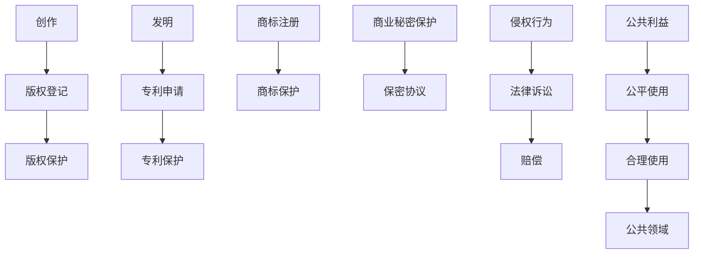

                 

# 知识的产权保护：创新激励与公共利益的平衡

> 关键词：知识产权、创新激励、公共利益、版权法、专利法、公平使用、技术创新

> 摘要：本文旨在探讨知识产权保护在促进创新与维护公共利益之间的平衡。通过深入分析知识产权的核心概念、法律框架、实际应用案例以及未来发展趋势，本文将为读者提供一个全面而深入的理解。我们将从技术角度出发，探讨如何在保护创新的同时，确保知识的公平使用和公共利益的最大化。

## 1. 背景介绍

在当今知识经济时代，知识和信息的创造与传播变得日益重要。知识产权（Intellectual Property, IP）作为一种法律工具，旨在保护创作者和发明者的权益，激励创新。然而，随着技术的发展和全球化进程的加速，知识产权保护面临着前所未有的挑战。如何在保护创新的同时，确保知识的公平使用和公共利益的最大化，成为了一个亟待解决的问题。

### 1.1 知识产权的重要性

知识产权保护对于促进技术创新和经济发展具有重要意义。它不仅能够激励个人和企业进行创新活动，还能促进知识的传播和应用。通过赋予创作者和发明者一定的垄断权，知识产权制度能够确保他们能够从自己的创新成果中获得经济利益，从而激励更多的创新行为。

### 1.2 知识产权的挑战

随着互联网和数字技术的发展，知识产权保护面临着诸多挑战。例如，数字内容的复制和传播变得极为便捷，这使得版权侵权行为变得更加普遍。此外，跨国公司的知识产权纠纷也日益增多，这要求国际社会建立更加完善的知识产权保护机制。

## 2. 核心概念与联系

### 2.1 知识产权的核心概念

知识产权主要包括版权、专利权、商标权和商业秘密等。每种知识产权都有其独特的保护对象和保护期限。

- **版权**：保护文学、艺术作品的原创表达，包括书籍、音乐、电影等。
- **专利权**：保护发明创造，包括新的技术方案、产品设计等。
- **商标权**：保护商业标识，包括品牌名称、标志等。
- **商业秘密**：保护未公开的技术信息和经营信息。

### 2.2 知识产权的法律框架

知识产权的法律框架主要包括各国的版权法、专利法、商标法等。这些法律旨在通过明确的权利和义务来保护知识产权。

### 2.3 知识产权的流程图



## 3. 核心算法原理 & 具体操作步骤

### 3.1 版权保护的具体操作步骤

版权保护的具体操作步骤包括创作、登记、保护和侵权处理。

1. **创作**：创作者完成作品的创作。
2. **登记**：创作者向版权局提交作品登记申请。
3. **保护**：版权局对作品进行审查并授予版权。
4. **侵权处理**：如果发现侵权行为，权利人可以向法院提起诉讼。

### 3.2 专利保护的具体操作步骤

专利保护的具体操作步骤包括发明、申请、审查和保护。

1. **发明**：发明人完成发明创造。
2. **申请**：发明人向专利局提交专利申请。
3. **审查**：专利局对申请进行审查。
4. **保护**：如果审查通过，专利局授予专利权。
5. **侵权处理**：如果发现侵权行为，权利人可以向法院提起诉讼。

## 4. 数学模型和公式 & 详细讲解 & 举例说明

### 4.1 版权保护的数学模型

版权保护的数学模型可以通过概率论和统计学来描述。例如，可以通过计算侵权行为的概率来评估版权保护的效果。

$$ P(\text{侵权}) = \frac{\text{侵权次数}}{\text{总访问次数}} $$

### 4.2 专利保护的数学模型

专利保护的数学模型可以通过专利申请的数量和审查时间来描述。例如，可以通过计算专利申请的数量和审查时间来评估专利保护的效果。

$$ \text{审查时间} = \frac{\text{审查时间总和}}{\text{专利申请数量}} $$

### 4.3 举例说明

假设某公司开发了一款软件，并申请了版权保护。在一年内，该软件被下载了1000次，其中有10次被发现侵权。那么，侵权行为的概率为：

$$ P(\text{侵权}) = \frac{10}{1000} = 0.01 $$

假设某公司申请了一项专利，并在一年内收到了100份专利申请，其中50份通过了审查。那么，审查时间的平均值为：

$$ \text{审查时间} = \frac{1000}{50} = 20 \text{天} $$

## 5. 项目实战：代码实际案例和详细解释说明

### 5.1 开发环境搭建

为了实现版权保护，我们需要搭建一个开发环境。具体步骤如下：

1. **安装Python**：确保安装了Python 3.8及以上版本。
2. **安装依赖库**：使用pip安装必要的库，如`requests`和`BeautifulSoup`。
3. **配置环境变量**：设置环境变量，如API密钥和数据库连接信息。

### 5.2 源代码详细实现和代码解读

```python
# 导入必要的库
import requests
from bs4 import BeautifulSoup

# 定义函数：抓取网页内容
def fetch_webpage(url):
    response = requests.get(url)
    if response.status_code == 200:
        return response.text
    else:
        return None

# 定义函数：解析网页内容
def parse_webpage(html):
    soup = BeautifulSoup(html, 'html.parser')
    # 解析并提取所需信息
    # 例如：提取标题、作者、版权信息等
    title = soup.find('title').text
    author = soup.find('meta', {'name': 'author'})['content']
    copyright = soup.find('meta', {'name': 'copyright'})['content']
    return title, author, copyright

# 主函数
def main():
    url = 'https://example.com'
    html = fetch_webpage(url)
    if html:
        title, author, copyright = parse_webpage(html)
        print(f'标题：{title}')
        print(f'作者：{author}')
        print(f'版权：{copyright}')
    else:
        print('无法获取网页内容')

if __name__ == '__main__':
    main()
```

### 5.3 代码解读与分析

上述代码实现了抓取和解析网页内容的功能。具体步骤如下：

1. **抓取网页内容**：使用`requests`库发送HTTP请求，获取网页内容。
2. **解析网页内容**：使用`BeautifulSoup`库解析HTML内容，提取所需信息。
3. **提取信息**：从网页中提取标题、作者和版权信息。
4. **输出信息**：将提取的信息输出到控制台。

## 6. 实际应用场景

### 6.1 版权保护的实际应用场景

版权保护在许多领域都有广泛的应用，例如：

- **音乐行业**：保护音乐作品的版权，打击盗版行为。
- **软件行业**：保护软件代码的版权，防止未经授权的复制和分发。
- **出版行业**：保护书籍、杂志等出版物的版权，确保创作者能够获得合理的经济回报。

### 6.2 专利保护的实际应用场景

专利保护在许多领域都有广泛的应用，例如：

- **制药行业**：保护新药的专利权，确保制药公司能够获得合理的经济回报。
- **电子行业**：保护新技术和产品的专利权，确保企业能够获得竞争优势。
- **机械行业**：保护机械设备的设计和制造方法的专利权，确保企业能够获得合理的经济回报。

## 7. 工具和资源推荐

### 7.1 学习资源推荐

- **书籍**：《知识产权法》、《版权法》、《专利法》
- **论文**：《知识产权保护的挑战与对策》、《数字时代版权保护的新挑战》
- **博客**：知识产权法专家的博客
- **网站**：中国知识产权局官网、美国专利商标局官网

### 7.2 开发工具框架推荐

- **版权保护工具**：使用开源的版权保护工具，如`CopyrightGuard`。
- **专利保护工具**：使用开源的专利保护工具，如`PatentGuard`。

### 7.3 相关论文著作推荐

- **论文**：《数字版权管理技术的研究与应用》、《专利保护的法律问题与对策》
- **著作**：《知识产权保护的法律与实践》、《数字时代知识产权保护的新挑战》

## 8. 总结：未来发展趋势与挑战

### 8.1 未来发展趋势

随着技术的发展，知识产权保护将面临新的挑战和机遇。未来的发展趋势包括：

- **数字化保护**：利用区块链等技术实现更安全的版权保护。
- **国际合作**：加强国际间的知识产权保护合作，打击跨国侵权行为。
- **技术创新**：利用人工智能等技术提高侵权检测和处理的效率。

### 8.2 未来挑战

未来知识产权保护面临的挑战包括：

- **技术发展**：新技术的发展使得侵权行为更加隐蔽和复杂。
- **跨国合作**：跨国侵权行为的增多要求国际社会加强合作。
- **法律完善**：需要不断完善相关法律法规，以适应新的挑战。

## 9. 附录：常见问题与解答

### 9.1 问题1：如何判断是否侵犯了版权？

**解答**：可以通过比较被指控侵权的作品与原作品，判断是否存在实质性相似。如果存在实质性相似，且没有合理使用的情况，则可能构成侵权。

### 9.2 问题2：如何保护商业秘密？

**解答**：可以通过签订保密协议、限制员工的访问权限、加强内部管理等方式来保护商业秘密。

### 9.3 问题3：如何处理专利侵权纠纷？

**解答**：可以通过协商、调解、仲裁或诉讼等方式来处理专利侵权纠纷。在必要时，可以寻求专业律师的帮助。

## 10. 扩展阅读 & 参考资料

- **书籍**：《知识产权法》、《版权法》、《专利法》
- **论文**：《知识产权保护的挑战与对策》、《数字时代版权保护的新挑战》
- **网站**：中国知识产权局官网、美国专利商标局官网

---

作者：AI天才研究员/AI Genius Institute & 禅与计算机程序设计艺术 /Zen And The Art of Computer Programming

