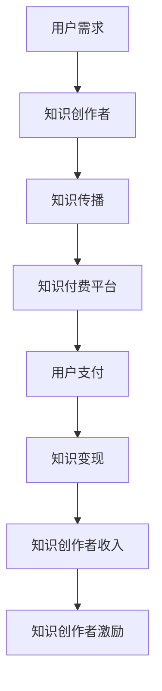

                 

# 知识经济时代下的知识付费 创新商业模式运营

> 关键词：知识经济、知识付费、商业模式、创新、运营

> 摘要：本文旨在探讨知识经济时代下知识付费的创新商业模式及其运营策略。通过深入分析知识付费的核心概念、算法原理、数学模型、实际案例，以及应用场景，本文将为读者提供一个全面而系统的视角，帮助理解和实践知识付费的商业模式。文章将从背景介绍、核心概念与联系、核心算法原理与具体操作步骤、数学模型与公式、项目实战、实际应用场景、工具和资源推荐、总结与未来发展趋势、常见问题与解答、扩展阅读与参考资料等多方面进行详细阐述。

## 1. 背景介绍

### 1.1 知识经济的兴起
知识经济是指以知识为基础的经济形态，其核心在于知识的创造、传播和应用。随着互联网技术的发展，知识的传播速度和范围达到了前所未有的水平，知识经济逐渐成为全球经济的重要组成部分。知识经济时代的特点是信息爆炸、知识更新迅速、知识价值日益凸显。

### 1.2 知识付费的兴起
知识付费是指通过付费方式获取知识的一种商业模式。随着互联网的普及和移动支付技术的发展，知识付费逐渐成为知识经济时代的重要组成部分。知识付费平台如知乎、喜马拉雅、得到等，为用户提供了一个获取高质量知识的渠道。知识付费不仅满足了用户对知识的需求，也为知识创作者提供了收入来源。

### 1.3 知识付费的商业模式
知识付费的商业模式主要包括订阅制、付费问答、付费课程、付费电子书等。这些模式各有特点，满足了不同用户的需求。订阅制通过定期付费获取知识内容；付费问答则通过用户提问和专家解答获取知识；付费课程和付费电子书则通过系统化的知识传授获取收入。

## 2. 核心概念与联系

### 2.1 知识付费的核心概念
- **知识价值**：知识的价值在于其能够解决用户的问题、满足用户的需求。
- **知识传播**：知识传播是指通过各种渠道将知识传递给用户的过程。
- **知识变现**：知识变现是指通过知识付费平台将知识转化为经济价值的过程。

### 2.2 知识付费的商业模式流程图


## 3. 核心算法原理 & 具体操作步骤

### 3.1 知识付费推荐算法
知识付费推荐算法的核心在于通过用户行为数据和知识内容特征，为用户推荐合适的知识内容。推荐算法主要包括协同过滤、基于内容的推荐、深度学习推荐等。

#### 3.1.1 协同过滤推荐算法
协同过滤推荐算法通过分析用户的历史行为数据，找到与当前用户兴趣相似的其他用户，推荐这些用户喜欢的知识内容。

#### 3.1.2 基于内容的推荐算法
基于内容的推荐算法通过分析知识内容的特征，为用户推荐与其兴趣相似的知识内容。

#### 3.1.3 深度学习推荐算法
深度学习推荐算法通过构建神经网络模型，学习用户行为数据和知识内容特征之间的关系，实现精准推荐。

### 3.2 知识付费定价策略
知识付费定价策略主要包括成本定价、价值定价、竞争定价等。

#### 3.2.1 成本定价
成本定价是指根据知识内容的制作成本来确定价格。例如，付费课程的定价可以根据讲师的时长、课程的制作成本等因素来确定。

#### 3.2.2 价值定价
价值定价是指根据知识内容的价值来确定价格。例如，付费课程的定价可以根据课程解决用户问题的能力、课程的市场价值等因素来确定。

#### 3.2.3 竞争定价
竞争定价是指根据市场上同类知识内容的价格来确定价格。例如，付费课程的定价可以根据市场上同类课程的价格来确定。

## 4. 数学模型和公式 & 详细讲解 & 举例说明

### 4.1 协同过滤推荐算法
协同过滤推荐算法的核心公式为：
$$
\hat{r}_{ui} = \frac{\sum_{j \in N_i} \frac{r_{uj} - \mu_u}{|N_i|}}{\sum_{j \in N_i} \frac{1}{|N_i|}}
$$
其中，$\hat{r}_{ui}$ 表示用户 $u$ 对物品 $i$ 的预测评分，$r_{uj}$ 表示用户 $u$ 对物品 $j$ 的实际评分，$\mu_u$ 表示用户 $u$ 的平均评分，$N_i$ 表示用户 $u$ 评分过的物品集合。

### 4.2 基于内容的推荐算法
基于内容的推荐算法的核心公式为：
$$
\hat{r}_{ui} = \frac{\sum_{j \in N_i} \frac{c_{ij} - \mu_i}{|N_i|}}{\sum_{j \in N_i} \frac{1}{|N_i|}}
$$
其中，$\hat{r}_{ui}$ 表示用户 $u$ 对物品 $i$ 的预测评分，$c_{ij}$ 表示物品 $i$ 和物品 $j$ 的相似度，$\mu_i$ 表示物品 $i$ 的平均评分，$N_i$ 表示用户 $u$ 评分过的物品集合。

### 4.3 深度学习推荐算法
深度学习推荐算法的核心公式为：
$$
\hat{r}_{ui} = \sigma(\mathbf{W}_1 \mathbf{x}_u + \mathbf{W}_2 \mathbf{x}_i + \mathbf{b})
$$
其中，$\hat{r}_{ui}$ 表示用户 $u$ 对物品 $i$ 的预测评分，$\sigma$ 表示激活函数，$\mathbf{W}_1$ 和 $\mathbf{W}_2$ 表示权重矩阵，$\mathbf{x}_u$ 和 $\mathbf{x}_i$ 表示用户 $u$ 和物品 $i$ 的特征向量，$\mathbf{b}$ 表示偏置项。

## 5. 项目实战：代码实际案例和详细解释说明

### 5.1 开发环境搭建
#### 5.1.1 环境准备
- 安装Python 3.8及以上版本
- 安装TensorFlow 2.0及以上版本
- 安装NumPy、Pandas等常用库

#### 5.1.2 数据准备
- 下载电影评分数据集（如MovieLens）
- 数据预处理，包括数据清洗、特征提取等

### 5.2 源代码详细实现和代码解读
```python
import numpy as np
import pandas as pd
from tensorflow.keras.layers import Embedding, Dense, Flatten
from tensorflow.keras.models import Model
from tensorflow.keras.optimizers import Adam

# 读取数据
data = pd.read_csv('ratings.csv')

# 数据预处理
user_ids = data['userId'].values
item_ids = data['movieId'].values
ratings = data['rating'].values

# 构建模型
embedding_dim = 50
user_input = Input(shape=(1,))
user_embedding = Embedding(input_dim=max(user_ids) + 1, output_dim=embedding_dim)(user_input)
user_vec = Flatten()(user_embedding)

item_input = Input(shape=(1,))
item_embedding = Embedding(input_dim=max(item_ids) + 1, output_dim=embedding_dim)(item_input)
item_vec = Flatten()(item_embedding)

product = Multiply()([user_vec, item_vec])
output = Dense(1, activation='sigmoid')(product)

model = Model(inputs=[user_input, item_input], outputs=output)
model.compile(optimizer=Adam(), loss='mean_squared_error')

# 训练模型
model.fit([user_ids, item_ids], ratings, epochs=10, batch_size=128)
```

### 5.3 代码解读与分析
- **数据准备**：读取电影评分数据集，并进行数据预处理。
- **模型构建**：构建基于深度学习的协同过滤推荐模型，包括用户嵌入层、物品嵌入层、乘法层和输出层。
- **模型训练**：使用均方误差损失函数和Adam优化器训练模型。

## 6. 实际应用场景

### 6.1 知识付费平台
知识付费平台如知乎、喜马拉雅、得到等，通过推荐算法为用户提供个性化知识内容，提高用户满意度和平台活跃度。

### 6.2 企业培训
企业可以通过知识付费平台为员工提供在线培训课程，提高员工的专业技能和工作效率。

### 6.3 个人成长
个人可以通过知识付费平台获取高质量的知识内容，提高个人素养和职业技能。

## 7. 工具和资源推荐

### 7.1 学习资源推荐
- 书籍：《推荐系统实践》、《深度学习》
- 论文：《基于深度学习的推荐系统》、《协同过滤推荐算法综述》
- 博客：知乎、CSDN、掘金
- 网站：TensorFlow官网、Kaggle

### 7.2 开发工具框架推荐
- Python：NumPy、Pandas、TensorFlow
- 数据集：MovieLens、Netflix Prize

### 7.3 相关论文著作推荐
- 《推荐系统实践》：深入讲解推荐系统的原理和实践
- 《深度学习》：全面介绍深度学习的基本概念和应用
- 《基于深度学习的推荐系统》：详细探讨基于深度学习的推荐系统

## 8. 总结：未来发展趋势与挑战

### 8.1 未来发展趋势
- 知识付费平台将更加注重个性化推荐，提高用户体验。
- 知识付费平台将更加注重知识内容的质量和多样性，提高用户满意度。
- 知识付费平台将更加注重知识内容的创新和实用性，提高用户价值。

### 8.2 挑战
- 如何平衡知识付费平台的商业利益和用户需求。
- 如何提高知识付费平台的用户黏性和活跃度。
- 如何提高知识付费平台的知识内容质量和多样性。

## 9. 附录：常见问题与解答

### 9.1 问题：如何提高知识付费平台的用户黏性和活跃度？
- 答案：可以通过个性化推荐、社交互动、社区建设等方式提高用户黏性和活跃度。

### 9.2 问题：如何提高知识付费平台的知识内容质量和多样性？
- 答案：可以通过引入更多高质量的知识创作者、丰富知识内容类型等方式提高知识内容质量和多样性。

## 10. 扩展阅读 & 参考资料

- 《推荐系统实践》：深入讲解推荐系统的原理和实践
- 《深度学习》：全面介绍深度学习的基本概念和应用
- 《基于深度学习的推荐系统》：详细探讨基于深度学习的推荐系统
- 《协同过滤推荐算法综述》：全面介绍协同过滤推荐算法

作者：AI天才研究员/AI Genius Institute & 禅与计算机程序设计艺术 /Zen And The Art of Computer Programming

