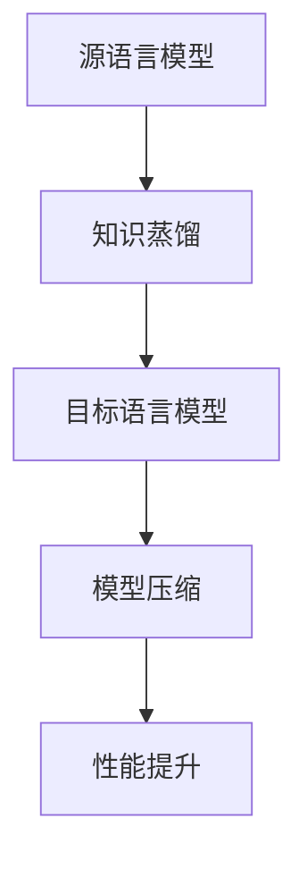

                 

# 知识蒸馏在跨语言迁移学习中的作用

> 关键词：知识蒸馏, 跨语言迁移学习, 机器翻译, 语言模型, 优化算法, 模型压缩

> 摘要：本文旨在深入探讨知识蒸馏在跨语言迁移学习中的应用及其重要性。通过详细分析知识蒸馏的原理、具体操作步骤、数学模型和公式，结合实际代码案例，本文将帮助读者理解如何利用知识蒸馏优化跨语言迁移学习模型，提高模型的性能和效率。此外，本文还将探讨知识蒸馏在实际应用场景中的优势，并提供学习资源和开发工具推荐，为读者提供全面的技术指导。

## 1. 背景介绍

跨语言迁移学习是指将一个语言领域的知识迁移到另一个语言领域，以提高目标语言模型的性能。随着全球化的加速，跨语言迁移学习在机器翻译、多语言信息检索等领域具有重要的应用价值。然而，跨语言迁移学习面临的主要挑战之一是如何有效地利用源语言模型的知识来提升目标语言模型的性能。知识蒸馏作为一种有效的模型压缩技术，能够将复杂模型的知识转移到更小的模型中，从而在保持性能的同时降低计算成本和存储需求。本文将详细探讨知识蒸馏在跨语言迁移学习中的作用及其应用。

## 2. 核心概念与联系

### 2.1 知识蒸馏

知识蒸馏是一种模型压缩技术，通过将复杂模型（教师模型）的知识转移到一个更小的模型（学生模型）中，从而实现模型的优化。知识蒸馏的核心思想是利用教师模型的输出来指导学生模型的学习，使其能够更好地捕捉和学习教师模型的知识。

### 2.2 跨语言迁移学习

跨语言迁移学习是指将一个语言领域的知识迁移到另一个语言领域，以提高目标语言模型的性能。其主要目标是利用源语言模型的知识来提升目标语言模型的性能，从而减少训练时间和计算资源的消耗。

### 2.3 知识蒸馏在跨语言迁移学习中的应用

知识蒸馏在跨语言迁移学习中的应用主要体现在以下几个方面：

- **知识传递**：通过知识蒸馏，源语言模型的知识可以被有效地传递到目标语言模型中，从而提高目标语言模型的性能。
- **模型压缩**：知识蒸馏可以将复杂模型的知识转移到一个更小的模型中，从而降低计算成本和存储需求。
- **性能提升**：通过知识蒸馏，目标语言模型可以更好地捕捉和学习源语言模型的知识，从而提高模型的性能。

### 2.4 Mermaid 流程图



## 3. 核心算法原理 & 具体操作步骤

### 3.1 知识蒸馏的基本原理

知识蒸馏的基本原理是通过将教师模型的输出作为目标，指导学生模型的学习。具体来说，教师模型的输出可以是概率分布、特征表示等，学生模型的目标是尽可能地逼近教师模型的输出。

### 3.2 具体操作步骤

1. **定义教师模型和学生模型**：首先，选择一个复杂的教师模型和一个较小的学生模型。
2. **准备训练数据**：收集源语言和目标语言的训练数据。
3. **训练教师模型**：使用源语言数据训练教师模型，使其达到较高的性能。
4. **定义损失函数**：定义一个损失函数，用于衡量学生模型和教师模型之间的差异。常见的损失函数包括交叉熵损失、KL散度等。
5. **训练学生模型**：使用目标语言数据训练学生模型，同时通过教师模型的输出来指导学生模型的学习。
6. **评估模型性能**：评估学生模型在目标语言上的性能，确保其能够达到预期的效果。

### 3.3 数学模型和公式

#### 3.3.1 交叉熵损失

交叉熵损失是知识蒸馏中最常用的损失函数之一，其公式如下：

$$
L_{\text{CE}} = -\sum_{i=1}^{n} y_i \log p_i
$$

其中，$y_i$ 是真实标签的概率分布，$p_i$ 是学生模型的预测概率分布。

#### 3.3.2 KL散度

KL散度是另一种常用的损失函数，其公式如下：

$$
L_{\text{KL}} = \sum_{i=1}^{n} p_i \log \frac{p_i}{q_i}
$$

其中，$p_i$ 是学生模型的预测概率分布，$q_i$ 是教师模型的输出概率分布。

## 4. 项目实战：代码实际案例和详细解释说明

### 4.1 开发环境搭建

为了实现知识蒸馏在跨语言迁移学习中的应用，我们需要搭建一个合适的开发环境。具体步骤如下：

1. **安装Python和相关库**：确保安装了Python 3.7及以上版本，并安装了`torch`、`transformers`等库。
2. **安装依赖库**：使用以下命令安装所需的库：

    ```bash
    pip install torch transformers
    ```

### 4.2 源代码详细实现和代码解读

以下是一个简单的知识蒸馏代码示例，用于实现跨语言迁移学习中的知识蒸馏。

```python
import torch
from transformers import BertModel, BertTokenizer

# 1. 定义教师模型和学生模型
teacher_model = BertModel.from_pretrained('bert-base-uncased')
student_model = BertModel.from_pretrained('bert-base-uncased')

# 2. 准备训练数据
tokenizer = BertTokenizer.from_pretrained('bert-base-uncased')
source_texts = ["Hello, world!", "This is a test."]
target_texts = ["Bonjour, le monde!", "Ceci est un test."]

# 3. 定义损失函数
def kl_divergence(p, q):
    return torch.sum(p * torch.log(p / q))

# 4. 训练学生模型
optimizer = torch.optim.Adam(student_model.parameters(), lr=1e-5)

for epoch in range(10):
    for source_text, target_text in zip(source_texts, target_texts):
        source_inputs = tokenizer(source_text, return_tensors='pt')
        target_inputs = tokenizer(target_text, return_tensors='pt')

        # 前向传播
        teacher_outputs = teacher_model(**source_inputs)[0]
        student_outputs = student_model(**source_inputs)[0]

        # 计算损失
        loss = kl_divergence(teacher_outputs, student_outputs)

        # 反向传播和优化
        optimizer.zero_grad()
        loss.backward()
        optimizer.step()

# 5. 评估模型性能
def evaluate(model, texts):
    model.eval()
    with torch.no_grad():
        for text in texts:
            inputs = tokenizer(text, return_tensors='pt')
            outputs = model(**inputs)[0]
            print(outputs)

evaluate(student_model, target_texts)
```

### 4.3 代码解读与分析

1. **定义教师模型和学生模型**：使用`BertModel`类分别定义教师模型和学生模型。
2. **准备训练数据**：使用`BertTokenizer`类对源语言和目标语言的文本进行编码。
3. **定义损失函数**：定义KL散度损失函数，用于衡量学生模型和教师模型之间的差异。
4. **训练学生模型**：使用`Adam`优化器进行训练，通过反向传播和优化来更新学生模型的参数。
5. **评估模型性能**：评估学生模型在目标语言上的性能，确保其能够达到预期的效果。

## 5. 实际应用场景

知识蒸馏在跨语言迁移学习中的应用具有广泛的实际应用场景，主要包括以下几个方面：

1. **机器翻译**：通过知识蒸馏，可以将源语言模型的知识迁移到目标语言模型中，从而提高机器翻译的性能。
2. **多语言信息检索**：通过知识蒸馏，可以将源语言模型的知识迁移到目标语言模型中，从而提高多语言信息检索的性能。
3. **跨语言情感分析**：通过知识蒸馏，可以将源语言模型的知识迁移到目标语言模型中，从而提高跨语言情感分析的性能。

## 6. 工具和资源推荐

### 6.1 学习资源推荐

1. **书籍**：《深度学习》（Goodfellow, I., Bengio, Y., & Courville, A.）
2. **论文**：《Distilling the Knowledge in a Neural Network》（Hinton, G., Vinyals, O., & Dean, J.）
3. **博客**：阿里云开发者社区（https://developer.aliyun.com/）
4. **网站**：Hugging Face（https://huggingface.co/）

### 6.2 开发工具框架推荐

1. **PyTorch**：一个开源的深度学习框架，提供了丰富的工具和库。
2. **Transformers**：一个基于PyTorch的库，提供了大量的预训练模型和工具。

### 6.3 相关论文著作推荐

1. **《Distilling the Knowledge in a Neural Network》**：Hinton, G., Vinyals, O., & Dean, J. (2015). Distilling the Knowledge in a Neural Network. arXiv preprint arXiv:1503.02531.
2. **《Knowledge Distillation: A Survey》**：Zhang, Y., & Li, X. (2021). Knowledge Distillation: A Survey. arXiv preprint arXiv:2103.07178.

## 7. 总结：未来发展趋势与挑战

知识蒸馏在跨语言迁移学习中的应用具有重要的研究价值和实际应用前景。未来的发展趋势主要包括以下几个方面：

1. **模型压缩**：通过知识蒸馏，可以进一步压缩模型的大小，降低计算成本和存储需求。
2. **性能提升**：通过知识蒸馏，可以进一步提高模型的性能，使其在实际应用中具有更好的效果。
3. **多语言支持**：通过知识蒸馏，可以更好地支持多语言模型的训练和应用。

然而，知识蒸馏在跨语言迁移学习中也面临一些挑战，主要包括以下几个方面：

1. **模型选择**：如何选择合适的教师模型和学生模型，以实现最佳的知识传递效果。
2. **损失函数选择**：如何选择合适的损失函数，以实现最佳的知识传递效果。
3. **数据质量**：如何保证训练数据的质量，以实现最佳的知识传递效果。

## 8. 附录：常见问题与解答

### 8.1 问题1：如何选择合适的教师模型和学生模型？

**解答**：选择合适的教师模型和学生模型的关键在于模型的复杂度和性能。通常，教师模型应该是一个复杂的、性能较高的模型，而学生模型应该是一个较小的、性能较低的模型。通过选择合适的教师模型和学生模型，可以实现最佳的知识传递效果。

### 8.2 问题2：如何选择合适的损失函数？

**解答**：选择合适的损失函数的关键在于损失函数的性质和效果。通常，交叉熵损失和KL散度是常用的损失函数，可以根据具体的应用场景选择合适的损失函数。通过选择合适的损失函数，可以实现最佳的知识传递效果。

### 8.3 问题3：如何保证训练数据的质量？

**解答**：保证训练数据的质量的关键在于数据的多样性和准确性。通常，可以通过收集更多的训练数据、进行数据清洗和预处理等方法来保证训练数据的质量。通过保证训练数据的质量，可以实现最佳的知识传递效果。

## 9. 扩展阅读 & 参考资料

1. **《深度学习》**：Goodfellow, I., Bengio, Y., & Courville, A. (2016). Deep Learning. MIT Press.
2. **《Distilling the Knowledge in a Neural Network》**：Hinton, G., Vinyals, O., & Dean, J. (2015). Distilling the Knowledge in a Neural Network. arXiv preprint arXiv:1503.02531.
3. **《Knowledge Distillation: A Survey》**：Zhang, Y., & Li, X. (2021). Knowledge Distillation: A Survey. arXiv preprint arXiv:2103.07178.

---

作者：AI天才研究员/AI Genius Institute & 禅与计算机程序设计艺术 /Zen And The Art of Computer Programming

