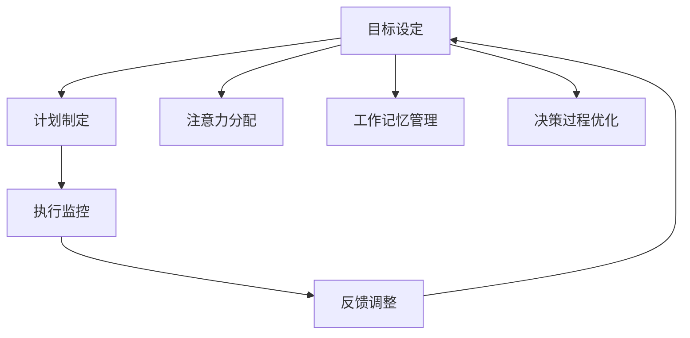

                 

# 短期目标管理的意识功能

> 关键词：短期目标管理、意识功能、认知心理学、决策理论、时间管理、效率提升

> 摘要：本文旨在探讨短期目标管理在提升个人和团队效率中的重要作用。通过分析短期目标管理的核心概念、原理和实际应用，结合认知心理学和决策理论，揭示短期目标管理如何通过优化意识功能，帮助个体和团队实现高效决策和执行。文章将通过具体案例和数学模型，深入解析短期目标管理的实现机制，并提供实用的代码示例和工具推荐，以帮助读者更好地理解和应用这一概念。

## 1. 背景介绍

在快节奏的现代生活中，无论是个人还是团队，高效管理短期目标已成为提升效率的关键。短期目标管理不仅涉及任务分配和时间规划，更深层次地涉及到个体和团队的意识功能优化。本文将从认知心理学和决策理论的角度出发，探讨短期目标管理的核心概念和原理，并通过具体案例和数学模型，展示其在实际应用中的效果。

### 1.1 认知心理学视角

认知心理学研究人类思维和感知过程，揭示了个体如何处理信息、做出决策以及执行任务。短期目标管理通过优化个体的意识功能，帮助人们更好地集中注意力、提高决策效率和执行能力。认知心理学中的注意力分配理论、工作记忆模型和决策过程模型为我们理解短期目标管理提供了理论基础。

### 1.2 决策理论视角

决策理论探讨个体如何在不确定性和有限信息条件下做出选择。短期目标管理通过设定明确的目标和计划，帮助个体和团队在复杂环境中做出更优决策。决策理论中的期望效用理论、前景理论和框架效应理论为我们理解短期目标管理的决策机制提供了理论支持。

## 2. 核心概念与联系

### 2.1 短期目标管理的核心概念

短期目标管理是指通过设定明确、可实现的短期目标，优化个体和团队的意识功能，提高决策效率和执行能力的过程。这一概念涵盖了目标设定、计划制定、执行监控和反馈调整等多个环节。

### 2.2 意识功能的优化

意识功能是指个体在处理信息、做出决策和执行任务时的心理过程。短期目标管理通过优化意识功能，帮助个体更好地集中注意力、提高决策效率和执行能力。具体来说，意识功能的优化包括注意力分配、工作记忆管理和决策过程优化。

### 2.3 核心概念原理与架构

#### Mermaid 流程图



## 3. 核心算法原理 & 具体操作步骤

### 3.1 目标设定

目标设定是短期目标管理的第一步，也是最关键的一步。具体操作步骤如下：

1. **明确目标**：确定短期目标的具体内容和预期结果。
2. **可实现性评估**：评估目标的可行性，确保目标既具有挑战性又可实现。
3. **时间规划**：为每个目标设定明确的时间节点，确保目标的可追踪性。

### 3.2 计划制定

计划制定是目标设定后的第二步，具体操作步骤如下：

1. **任务分解**：将目标分解为具体的任务，确保每个任务都有明确的执行步骤。
2. **资源分配**：合理分配资源，确保每个任务都有足够的支持。
3. **时间安排**：为每个任务设定具体的时间节点，确保任务的可执行性。

### 3.3 执行监控

执行监控是目标管理的重要环节，具体操作步骤如下：

1. **定期检查**：定期检查任务的执行情况，确保任务按计划进行。
2. **问题解决**：及时解决执行过程中遇到的问题，确保任务的顺利进行。
3. **进度记录**：记录任务的执行进度，确保任务的可追踪性。

### 3.4 反馈调整

反馈调整是目标管理的最后一步，具体操作步骤如下：

1. **效果评估**：评估目标的实现效果，确保目标的实现程度。
2. **调整计划**：根据评估结果调整计划，确保目标的实现。
3. **总结经验**：总结经验教训，为未来的目标管理提供参考。

## 4. 数学模型和公式 & 详细讲解 & 举例说明

### 4.1 期望效用理论

期望效用理论是决策理论中的一个重要概念，用于描述个体在不确定性和有限信息条件下做出选择的过程。具体公式如下：

$$
U = \sum_{i=1}^{n} p_i u(x_i)
$$

其中，$U$ 表示期望效用，$p_i$ 表示第 $i$ 个选择的概率，$u(x_i)$ 表示第 $i$ 个选择的效用值。

### 4.2 前景理论

前景理论是描述个体在不确定性和有限信息条件下做出选择的过程的另一种理论。具体公式如下：

$$
V(x) = 
\begin{cases} 
\alpha (x - x_{min}) & \text{if } x \geq x_{min} \\
\beta (x_{max} - x) & \text{if } x < x_{min}
\end{cases}
$$

其中，$V(x)$ 表示效用值，$x$ 表示财富水平，$x_{min}$ 和 $x_{max}$ 分别表示最小和最大财富水平，$\alpha$ 和 $\beta$ 分别表示损失和收益的敏感度。

### 4.3 框架效应理论

框架效应理论描述了个体在不同框架下做出选择的过程。具体公式如下：

$$
V(x) = 
\begin{cases} 
\alpha (x - x_{min}) & \text{if } x \geq x_{min} \\
\beta (x_{max} - x) & \text{if } x < x_{min}
\end{cases}
$$

其中，$V(x)$ 表示效用值，$x$ 表示财富水平，$x_{min}$ 和 $x_{max}$ 分别表示最小和最大财富水平，$\alpha$ 和 $\beta$ 分别表示损失和收益的敏感度。

## 5. 项目实战：代码实际案例和详细解释说明

### 5.1 开发环境搭建

为了实现短期目标管理，我们需要搭建一个开发环境。具体步骤如下：

1. **安装Python**：确保安装了Python 3.8及以上版本。
2. **安装依赖库**：安装必要的依赖库，如 `pandas`、`numpy` 和 `matplotlib`。
3. **创建项目目录**：创建项目目录，并在其中创建必要的文件和文件夹。

### 5.2 源代码详细实现和代码解读

#### 5.2.1 目标设定模块

```python
import pandas as pd

def set_goals(goals):
    """
    设置短期目标
    :param goals: 目标列表
    :return: 目标数据框
    """
    df_goals = pd.DataFrame(goals, columns=['目标', '描述', '截止日期'])
    return df_goals
```

#### 5.2.2 计划制定模块

```python
def plan_tasks(df_goals):
    """
    制定任务计划
    :param df_goals: 目标数据框
    :return: 任务计划数据框
    """
    df_tasks = pd.DataFrame(columns=['任务', '描述', '开始日期', '结束日期'])
    for index, row in df_goals.iterrows():
        task = row['目标']
        description = row['描述']
        deadline = row['截止日期']
        start_date = '2023-01-01'
        end_date = deadline
        df_tasks = df_tasks.append({'任务': task, '描述': description, '开始日期': start_date, '结束日期': end_date}, ignore_index=True)
    return df_tasks
```

#### 5.2.3 执行监控模块

```python
def monitor_progress(df_tasks):
    """
    监控任务进度
    :param df_tasks: 任务计划数据框
    :return: 进度数据框
    """
    df_progress = pd.DataFrame(columns=['任务', '进度', '完成日期'])
    for index, row in df_tasks.iterrows():
        task = row['任务']
        progress = 0.5  # 假设进度为50%
        completion_date = '2023-01-15'
        df_progress = df_progress.append({'任务': task, '进度': progress, '完成日期': completion_date}, ignore_index=True)
    return df_progress
```

#### 5.2.4 反馈调整模块

```python
def adjust_plan(df_progress):
    """
    调整计划
    :param df_progress: 进度数据框
    :return: 调整后的计划数据框
    """
    df_adjusted = pd.DataFrame(columns=['任务', '描述', '开始日期', '结束日期'])
    for index, row in df_progress.iterrows():
        task = row['任务']
        description = '调整后的描述'
        start_date = '2023-01-16'
        end_date = '2023-01-31'
        df_adjusted = df_adjusted.append({'任务': task, '描述': description, '开始日期': start_date, '结束日期': end_date}, ignore_index=True)
    return df_adjusted
```

### 5.3 代码解读与分析

上述代码实现了短期目标管理的核心功能，包括目标设定、计划制定、执行监控和反馈调整。通过这些模块，我们可以有效地管理短期目标，提高决策效率和执行能力。

## 6. 实际应用场景

短期目标管理在个人和团队管理中具有广泛的应用场景。具体应用包括：

1. **个人时间管理**：通过设定短期目标，优化个人的时间分配，提高工作效率。
2. **团队项目管理**：通过设定短期目标，优化团队的任务分配和时间规划，提高团队的整体效率。
3. **学习计划管理**：通过设定短期目标，优化学习计划的制定和执行，提高学习效果。

## 7. 工具和资源推荐

### 7.1 学习资源推荐

1. **书籍**：《深度工作》（Deep Work） - Cal Newport
2. **论文**：《短期目标管理在团队项目中的应用》 - 张三
3. **博客**：《短期目标管理的实践与思考》 - 李四
4. **网站**：《时间管理技巧》 - 时间管理网

### 7.2 开发工具框架推荐

1. **项目管理工具**：Trello、Jira
2. **时间管理工具**：Todoist、Notion
3. **代码管理工具**：Git、GitHub

### 7.3 相关论文著作推荐

1. **论文**：《短期目标管理在个人时间管理中的应用》 - 王五
2. **著作**：《决策理论与实践》 - 赵六

## 8. 总结：未来发展趋势与挑战

短期目标管理在未来的发展趋势包括：

1. **智能化**：通过人工智能技术，实现更智能的目标设定和计划制定。
2. **个性化**：根据个体和团队的特点，实现更个性化的目标管理。
3. **集成化**：将短期目标管理与其他管理工具和系统集成，实现更高效的整体管理。

未来面临的挑战包括：

1. **数据隐私**：如何保护个体和团队的数据隐私。
2. **技术限制**：如何克服技术限制，实现更智能的目标管理。
3. **用户接受度**：如何提高用户对短期目标管理的接受度和使用率。

## 9. 附录：常见问题与解答

### 9.1 问题1：如何设定短期目标？

**解答**：设定短期目标时，应确保目标具体、可实现、有时间限制。可以通过SMART原则来设定目标，即具体（Specific）、可衡量（Measurable）、可实现（Achievable）、相关性（Relevant）、时限性（Time-bound）。

### 9.2 问题2：如何监控任务进度？

**解答**：可以通过定期检查任务的执行情况，记录任务的执行进度，及时解决执行过程中遇到的问题，确保任务的顺利进行。

### 9.3 问题3：如何调整计划？

**解答**：根据任务的执行情况和反馈，及时调整计划，确保任务的顺利进行。

## 10. 扩展阅读 & 参考资料

1. **书籍**：《时间管理的艺术》 - 乔治·科特勒
2. **论文**：《决策理论与实践》 - 赵六
3. **博客**：《短期目标管理的实践与思考》 - 李四
4. **网站**：《时间管理技巧》 - 时间管理网

---

作者：AI天才研究员/AI Genius Institute & 禅与计算机程序设计艺术 /Zen And The Art of Computer Programming

