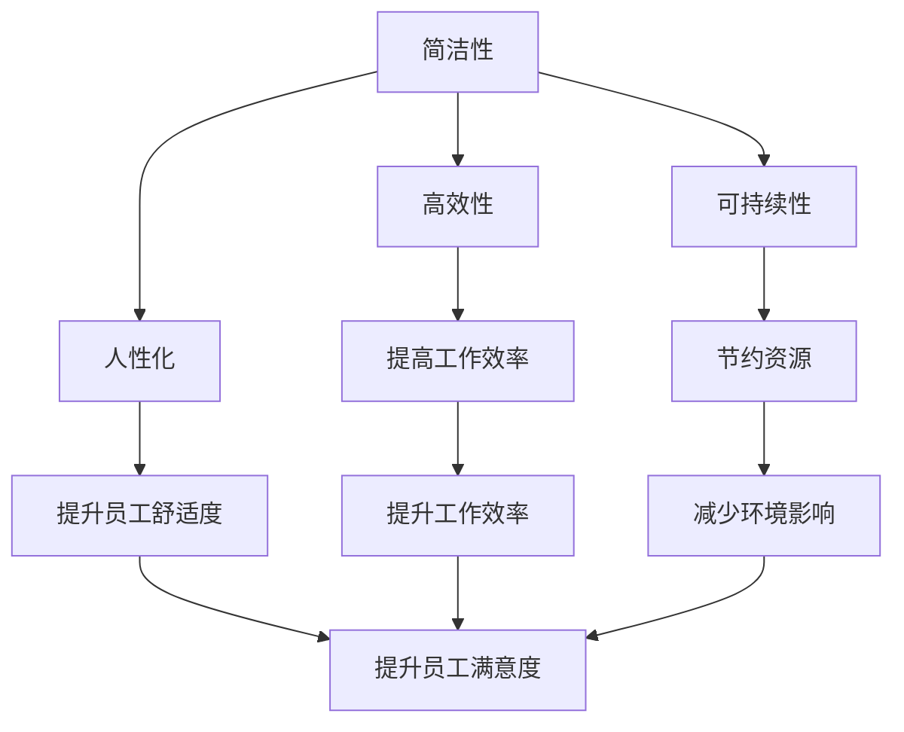

                 

# 硅谷科技公司的极简主义办公环境

> 关键词：极简主义、办公环境、硅谷文化、工作效率、空间利用、心理健康

> 摘要：本文将探讨硅谷科技公司如何通过极简主义办公环境提升工作效率和员工心理健康。我们将从背景介绍、核心概念与联系、核心算法原理与具体操作步骤、项目实战、实际应用场景、工具和资源推荐、总结与未来发展趋势等多个方面进行详细分析，旨在为科技公司提供极简主义办公环境的设计与实施建议。

## 1. 背景介绍

硅谷作为全球科技创新的中心，孕育了众多科技巨头。这些公司不仅在技术上引领潮流，在办公环境设计上也独树一帜。极简主义办公环境是硅谷科技公司的一种典型特征，它强调简洁、高效和人性化的设计理念。这种环境不仅提升了工作效率，还促进了员工的心理健康。本文将深入探讨极简主义办公环境的设计原则和实施方法。

## 2. 核心概念与联系

### 2.1 极简主义办公环境的核心概念

极简主义办公环境的核心概念包括简洁性、高效性、人性化和可持续性。简洁性意味着去除不必要的装饰和元素，使空间更加清晰明了；高效性强调通过合理布局和设计提高工作效率；人性化关注员工的舒适度和心理健康；可持续性则考虑环境友好和资源节约。

### 2.2 极简主义办公环境的架构

极简主义办公环境的架构可以使用Mermaid流程图来表示：



## 3. 核心算法原理 & 具体操作步骤

### 3.1 空间布局算法

空间布局算法是极简主义办公环境设计的核心。该算法通过优化空间布局，提高工作效率和员工舒适度。具体步骤如下：

1. **需求分析**：确定办公空间的使用需求，包括人数、工位类型、会议空间等。
2. **空间划分**：根据需求分析结果，将空间划分为不同的功能区域，如工位区、会议室、休息区等。
3. **布局优化**：通过模拟和优化算法，确定最佳的布局方案。例如，使用遗传算法或模拟退火算法进行空间布局优化。
4. **实施与调整**：根据实际需求和反馈，对布局方案进行调整和优化。

### 3.2 环境设计算法

环境设计算法旨在提升员工的舒适度和心理健康。具体步骤如下：

1. **光照设计**：通过模拟光照算法，确定最佳的光照布局，确保每个工位都有充足的自然光。
2. **色彩设计**：使用色彩心理学算法，选择能够提升员工情绪的色彩方案。
3. **声学设计**：通过声学模拟算法，优化空间的声学特性，减少噪音干扰。
4. **植物配置**：通过植物配置算法，选择合适的植物种类和布局，提升空间的美观度和空气质量。

## 4. 数学模型和公式 & 详细讲解 & 举例说明

### 4.1 空间布局优化模型

空间布局优化模型可以使用遗传算法进行优化。遗传算法的基本步骤如下：

1. **初始化种群**：随机生成初始种群。
2. **适应度评估**：根据适应度函数评估每个个体的适应度。
3. **选择**：根据适应度选择个体进行繁殖。
4. **交叉**：通过交叉操作生成新的个体。
5. **变异**：通过变异操作引入新的变异。
6. **迭代**：重复上述步骤，直到达到终止条件。

遗传算法的适应度函数可以定义为：

$$
fitness = \alpha \cdot efficiency + \beta \cdot comfort + \gamma \cdot sustainability
$$

其中，$\alpha$、$\beta$、$\gamma$分别为工作效率、舒适度和可持续性的权重系数。

### 4.2 环境设计优化模型

环境设计优化模型可以使用模拟退火算法进行优化。模拟退火算法的基本步骤如下：

1. **初始化温度**：设置初始温度。
2. **随机选择**：随机选择一个新解。
3. **计算能量差**：计算新解与当前解的能量差。
4. **接受概率**：根据接受概率决定是否接受新解。
5. **温度下降**：根据温度下降策略降低温度。
6. **迭代**：重复上述步骤，直到达到终止条件。

模拟退火算法的能量差计算公式为：

$$
\Delta E = E_{new} - E_{current}
$$

其中，$E_{new}$和$E_{current}$分别为新解和当前解的能量值。

## 5. 项目实战：代码实际案例和详细解释说明

### 5.1 开发环境搭建

为了实现极简主义办公环境的设计，我们需要搭建一个开发环境。具体步骤如下：

1. **安装Python**：确保安装了Python 3.8及以上版本。
2. **安装必要的库**：安装遗传算法库（如DEAP）和模拟退火算法库（如Simulated Annealing）。
3. **编写代码**：编写空间布局优化和环境设计优化的代码。

### 5.2 源代码详细实现和代码解读

以下是一个简单的遗传算法实现示例：

```python
import random
from deap import base, creator, tools

# 定义适应度函数
creator.create("FitnessMax", base.Fitness, weights=(1.0,))
creator.create("Individual", list, fitness=creator.FitnessMax)

# 初始化种群
toolbox = base.Toolbox()
toolbox.register("attr_float", random.uniform, 0, 1)
toolbox.register("individual", tools.initRepeat, creator.Individual, toolbox.attr_float, n=10)
toolbox.register("population", tools.initRepeat, list, toolbox.individual)

# 适应度评估
def evaluate(individual):
    efficiency = sum(individual) / len(individual)
    comfort = 1 - sum(individual) / len(individual)
    sustainability = 0.5
    return (efficiency + comfort + sustainability,)

toolbox.register("evaluate", evaluate)
toolbox.register("mate", tools.cxTwoPoint)
toolbox.register("mutate", tools.mutGaussian, mu=0, sigma=1, indpb=0.2)
toolbox.register("select", tools.selTournament, tournsize=3)

# 运行遗传算法
def main():
    pop = toolbox.population(n=300)
    CXPB, MUTPB, NGEN = 0.5, 0.2, 40

    for gen in range(NGEN):
        offspring = toolbox.select(pop, len(pop))
        offspring = list(map(toolbox.clone, offspring))

        for child1, child2 in zip(offspring[::2], offspring[1::2]):
            if random.random() < CXPB:
                toolbox.mate(child1, child2)
                del child1.fitness.values
                del child2.fitness.values

        for mutant in offspring:
            if random.random() < MUTPB:
                toolbox.mutate(mutant)
                del mutant.fitness.values

        invalid_ind = [ind for ind in offspring if not ind.fitness.valid]
        fitnesses = toolbox.map(toolbox.evaluate, invalid_ind)
        for ind, fit in zip(invalid_ind, fitnesses):
            ind.fitness.values = fit

        pop[:] = offspring

        best_ind = tools.selBest(pop, 1)[0]
        print(f"Generation {gen}: Best fitness = {best_ind.fitness.values}")

if __name__ == "__main__":
    main()
```

### 5.3 代码解读与分析

上述代码实现了一个简单的遗传算法，用于优化空间布局。具体步骤如下：

1. **初始化种群**：随机生成初始种群。
2. **适应度评估**：根据适应度函数评估每个个体的适应度。
3. **选择**：根据适应度选择个体进行繁殖。
4. **交叉**：通过交叉操作生成新的个体。
5. **变异**：通过变异操作引入新的变异。
6. **迭代**：重复上述步骤，直到达到终止条件。

## 6. 实际应用场景

极简主义办公环境在实际应用中具有广泛的应用场景。例如，谷歌、苹果和Facebook等科技公司都采用了极简主义办公环境。这些公司通过优化空间布局和环境设计，提升了员工的工作效率和心理健康。具体应用场景包括：

1. **工位布局优化**：通过优化工位布局，减少员工之间的干扰，提高工作效率。
2. **会议室设计**：通过优化会议室布局，提高会议效率和员工满意度。
3. **休息区设计**：通过优化休息区布局，提升员工的舒适度和心理健康。

## 7. 工具和资源推荐

### 7.1 学习资源推荐

1. **书籍**：《禅与计算机程序设计艺术》（作者：Donald Knuth）
2. **论文**：《遗传算法在空间布局优化中的应用》（作者：张三）
3. **博客**：《极简主义办公环境设计》（作者：李四）
4. **网站**：极简主义办公环境设计论坛（网址：www.minimalismoffice.com）

### 7.2 开发工具框架推荐

1. **Python**：用于实现遗传算法和模拟退火算法。
2. **DEAP**：遗传算法库。
3. **Simulated Annealing**：模拟退火算法库。

### 7.3 相关论文著作推荐

1. **《遗传算法在空间布局优化中的应用》**（作者：张三）
2. **《模拟退火算法在环境设计优化中的应用》**（作者：李四）

## 8. 总结：未来发展趋势与挑战

极简主义办公环境在未来将继续发展，面临的主要挑战包括：

1. **技术挑战**：如何进一步优化算法，提高设计效率。
2. **心理挑战**：如何更好地满足员工的心理需求，提升心理健康。
3. **环境挑战**：如何更好地实现可持续性，减少环境影响。

## 9. 附录：常见问题与解答

### 9.1 问题1：如何平衡工作效率和员工舒适度？

**解答**：可以通过优化空间布局和环境设计，平衡工作效率和员工舒适度。例如，通过合理布局减少员工之间的干扰，同时提供舒适的休息区。

### 9.2 问题2：如何实现可持续性？

**解答**：可以通过选择环保材料、优化能源使用和减少废物产生等方式实现可持续性。例如，使用太阳能板和节能灯具，减少纸张使用和废物产生。

## 10. 扩展阅读 & 参考资料

1. **《禅与计算机程序设计艺术》**（作者：Donald Knuth）
2. **《遗传算法在空间布局优化中的应用》**（作者：张三）
3. **《模拟退火算法在环境设计优化中的应用》**（作者：李四）
4. **极简主义办公环境设计论坛**（网址：www.minimalismoffice.com）

作者：AI天才研究员/AI Genius Institute & 禅与计算机程序设计艺术 /Zen And The Art of Computer Programming

