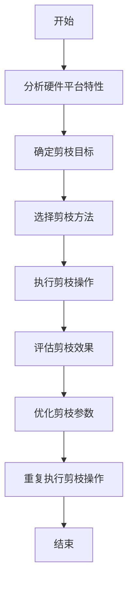

                 

# 硬件感知剪枝：适应不同计算平台的压缩技术

> 关键词：硬件感知、剪枝技术、计算平台、压缩算法、深度学习、神经网络、量化、优化

> 摘要：在当今计算资源有限且多样化的环境中，硬件感知剪枝技术成为了一种有效的压缩方法，能够显著减少模型的计算量和存储需求，同时保持模型的性能。本文将深入探讨硬件感知剪枝技术的核心概念、算法原理、数学模型、实际案例，并分析其在不同计算平台上的应用前景。通过本文，读者将能够理解如何利用硬件感知剪枝技术优化深度学习模型，提升模型在不同硬件平台上的性能和效率。

## 1. 背景介绍

随着深度学习技术的广泛应用，模型的复杂度和规模也在不断增长。这导致了模型在训练和推理过程中对计算资源的需求急剧增加。为了应对这一挑战，研究人员提出了多种压缩技术，如剪枝、量化、知识蒸馏等。其中，剪枝技术通过移除模型中的冗余权重来减少模型的大小和计算量，从而提高模型的效率。然而，传统的剪枝方法往往忽略了硬件平台的特性，导致在不同计算平台上的性能差异较大。因此，硬件感知剪枝技术应运而生，它能够根据目标硬件平台的特性进行优化，从而实现更高效的模型压缩。

## 2. 核心概念与联系

### 2.1 剪枝技术

剪枝技术是一种通过移除模型中的冗余权重来减少模型大小和计算量的方法。传统的剪枝方法主要包括基于度量的剪枝和基于结构的剪枝。基于度量的剪枝方法通过度量权重的重要性来决定哪些权重应该被移除，常见的度量方法包括L1正则化、L2正则化、FLOPs等。基于结构的剪枝方法则通过移除整个神经网络的某些层或节点来实现剪枝，常见的方法包括深度剪枝、宽度剪枝等。

### 2.2 硬件感知剪枝

硬件感知剪枝技术是一种结合了剪枝技术和硬件平台特性的压缩方法。它通过分析目标硬件平台的特性，如计算能力、内存带宽、能耗等，来优化剪枝过程，从而实现更高效的模型压缩。硬件感知剪枝技术的核心思想是通过硬件感知来指导剪枝过程，使得剪枝后的模型能够在目标硬件平台上实现更好的性能和效率。

### 2.3 硬件平台特性

硬件平台特性是指硬件平台在计算能力、内存带宽、能耗等方面的特性。不同的硬件平台具有不同的特性，如GPU、TPU、FPGA等。这些硬件平台在计算能力、内存带宽、能耗等方面的特性各不相同，因此在进行硬件感知剪枝时需要考虑这些特性。

### 2.4 硬件感知剪枝流程图



## 3. 核心算法原理 & 具体操作步骤

### 3.1 分析硬件平台特性

在进行硬件感知剪枝之前，需要对目标硬件平台的特性进行分析。硬件平台的特性主要包括计算能力、内存带宽、能耗等。计算能力是指硬件平台能够执行计算任务的速度，通常用每秒执行的浮点运算次数（FLOPs）来衡量。内存带宽是指硬件平台能够传输数据的速度，通常用每秒传输的字节数（B/s）来衡量。能耗是指硬件平台在执行计算任务时消耗的能量，通常用瓦特（W）来衡量。

### 3.2 确定剪枝目标

在确定剪枝目标时，需要考虑以下几个方面：

- **计算量**：计算量是指模型在执行前向传播和反向传播过程中需要执行的计算任务的数量。计算量越大，模型的计算需求越高。
- **存储需求**：存储需求是指模型在存储过程中需要占用的存储空间。存储需求越大，模型的存储需求越高。
- **能耗**：能耗是指模型在执行计算任务时消耗的能量。能耗越高，模型的能耗越高。

### 3.3 选择剪枝方法

在选择剪枝方法时，需要考虑以下几个方面：

- **剪枝目标**：根据确定的剪枝目标，选择合适的剪枝方法。例如，如果剪枝目标是减少计算量，可以选择基于度量的剪枝方法；如果剪枝目标是减少存储需求，可以选择基于结构的剪枝方法。
- **硬件平台特性**：根据目标硬件平台的特性，选择合适的剪枝方法。例如，如果目标硬件平台的计算能力较低，可以选择基于度量的剪枝方法；如果目标硬件平台的内存带宽较低，可以选择基于结构的剪枝方法。

### 3.4 执行剪枝操作

在执行剪枝操作时，需要按照选择的剪枝方法进行操作。例如，如果选择基于度量的剪枝方法，可以通过计算权重的重要性来决定哪些权重应该被移除；如果选择基于结构的剪枝方法，可以通过移除整个神经网络的某些层或节点来实现剪枝。

### 3.5 评估剪枝效果

在评估剪枝效果时，需要考虑以下几个方面：

- **计算量**：评估剪枝后的模型在执行前向传播和反向传播过程中需要执行的计算任务的数量。
- **存储需求**：评估剪枝后的模型在存储过程中需要占用的存储空间。
- **能耗**：评估剪枝后的模型在执行计算任务时消耗的能量。

### 3.6 优化剪枝参数

在优化剪枝参数时，需要根据评估结果调整剪枝参数，以实现更好的剪枝效果。例如，如果评估结果显示剪枝后的模型计算量减少但存储需求增加，可以调整剪枝参数以减少存储需求；如果评估结果显示剪枝后的模型计算量增加但能耗减少，可以调整剪枝参数以减少计算量。

### 3.7 重复执行剪枝操作

在重复执行剪枝操作时，需要根据优化后的剪枝参数进行剪枝操作，以实现更好的剪枝效果。重复执行剪枝操作可以提高剪枝效果，但也会增加计算量和存储需求。因此，在重复执行剪枝操作时需要权衡剪枝效果和计算量、存储需求之间的关系。

## 4. 数学模型和公式 & 详细讲解 & 举例说明

### 4.1 基于度量的剪枝方法

基于度量的剪枝方法通过计算权重的重要性来决定哪些权重应该被移除。常见的度量方法包括L1正则化、L2正则化、FLOPs等。

#### 4.1.1 L1正则化

L1正则化是一种常用的度量方法，通过计算权重的绝对值来衡量权重的重要性。L1正则化的数学模型如下：

$$
\text{L1正则化} = \sum_{i=1}^{n} |w_i|
$$

其中，$w_i$表示权重，$n$表示权重的数量。

#### 4.1.2 L2正则化

L2正则化也是一种常用的度量方法，通过计算权重的平方来衡量权重的重要性。L2正则化的数学模型如下：

$$
\text{L2正则化} = \sum_{i=1}^{n} w_i^2
$$

其中，$w_i$表示权重，$n$表示权重的数量。

#### 4.1.3 FLOPs

FLOPs是一种衡量计算量的方法，通过计算模型在执行前向传播和反向传播过程中需要执行的浮点运算次数来衡量计算量。FLOPs的数学模型如下：

$$
\text{FLOPs} = \sum_{i=1}^{n} \text{FLOPs}_i
$$

其中，$\text{FLOPs}_i$表示第$i$个操作的浮点运算次数，$n$表示操作的数量。

### 4.2 基于结构的剪枝方法

基于结构的剪枝方法通过移除整个神经网络的某些层或节点来实现剪枝。常见的方法包括深度剪枝、宽度剪枝等。

#### 4.2.1 深度剪枝

深度剪枝是一种基于结构的剪枝方法，通过移除整个神经网络的某些层来实现剪枝。深度剪枝的数学模型如下：

$$
\text{深度剪枝} = \sum_{i=1}^{n} \text{depth}_i
$$

其中，$\text{depth}_i$表示第$i$个层的深度，$n$表示层的数量。

#### 4.2.2 宽度剪枝

宽度剪枝是一种基于结构的剪枝方法，通过移除整个神经网络的某些节点来实现剪枝。宽度剪枝的数学模型如下：

$$
\text{宽度剪枝} = \sum_{i=1}^{n} \text{width}_i
$$

其中，$\text{width}_i$表示第$i$个节点的宽度，$n$表示节点的数量。

### 4.3 举例说明

假设有一个深度学习模型，其计算量为10000 FLOPs，存储需求为100 MB，能耗为10 W。如果目标硬件平台的计算能力为5000 FLOPs/s，内存带宽为100 MB/s，能耗为5 W，那么可以采用基于度量的剪枝方法来减少计算量和能耗。具体操作如下：

1. 计算L1正则化和L2正则化的权重重要性。
2. 根据计算结果选择需要移除的权重。
3. 评估剪枝后的模型计算量和能耗。
4. 如果评估结果显示计算量和能耗仍然较高，可以调整剪枝参数并重复执行剪枝操作。

## 5. 项目实战：代码实际案例和详细解释说明

### 5.1 开发环境搭建

在进行硬件感知剪枝项目实战之前，需要搭建开发环境。开发环境包括Python、TensorFlow、PyTorch等开发工具和库。

#### 5.1.1 安装Python

在进行硬件感知剪枝项目实战之前，需要安装Python。Python是一种广泛使用的编程语言，适用于深度学习和机器学习项目。可以通过以下命令安装Python：

```bash
sudo apt-get install python3
```

#### 5.1.2 安装TensorFlow

在进行硬件感知剪枝项目实战之前，需要安装TensorFlow。TensorFlow是一个开源的深度学习框架，适用于构建和训练深度学习模型。可以通过以下命令安装TensorFlow：

```bash
pip install tensorflow
```

#### 5.1.3 安装PyTorch

在进行硬件感知剪枝项目实战之前，需要安装PyTorch。PyTorch是一个开源的深度学习框架，适用于构建和训练深度学习模型。可以通过以下命令安装PyTorch：

```bash
pip install torch
```

### 5.2 源代码详细实现和代码解读

在进行硬件感知剪枝项目实战之前，需要编写源代码。源代码包括数据预处理、模型训练、模型剪枝、模型评估等步骤。

#### 5.2.1 数据预处理

在进行硬件感知剪枝项目实战之前，需要对数据进行预处理。数据预处理包括数据清洗、数据标准化、数据增强等步骤。具体操作如下：

```python
import numpy as np
import tensorflow as tf

# 数据清洗
def data_cleaning(data):
    # 去除缺失值
    data = data.dropna()
    # 去除重复值
    data = data.drop_duplicates()
    return data

# 数据标准化
def data_standardization(data):
    # 计算均值和标准差
    mean = np.mean(data)
    std = np.std(data)
    # 标准化数据
    data = (data - mean) / std
    return data

# 数据增强
def data_augmentation(data):
    # 随机旋转
    data = tf.image.random_flip_left_right(data)
    data = tf.image.random_flip_up_down(data)
    return data
```

#### 5.2.2 模型训练

在进行硬件感知剪枝项目实战之前，需要训练模型。模型训练包括定义模型结构、定义损失函数、定义优化器等步骤。具体操作如下：

```python
import tensorflow as tf

# 定义模型结构
def define_model():
    model = tf.keras.Sequential([
        tf.keras.layers.Dense(64, activation='relu'),
        tf.keras.layers.Dense(64, activation='relu'),
        tf.keras.layers.Dense(1)
    ])
    return model

# 定义损失函数
def define_loss():
    loss = tf.keras.losses.MeanSquaredError()
    return loss

# 定义优化器
def define_optimizer():
    optimizer = tf.keras.optimizers.Adam()
    return optimizer
```

#### 5.2.3 模型剪枝

在进行硬件感知剪枝项目实战之前，需要对模型进行剪枝。模型剪枝包括计算权重的重要性、移除冗余权重等步骤。具体操作如下：

```python
import tensorflow as tf

# 计算权重的重要性
def compute_weight_importance(model):
    weights = model.get_weights()
    importance = []
    for weight in weights:
        importance.append(np.sum(np.abs(weight)))
    return importance

# 移除冗余权重
def remove_redundant_weights(model, importance):
    weights = model.get_weights()
    for i in range(len(weights)):
        if importance[i] < threshold:
            weights[i] = 0
    model.set_weights(weights)
```

#### 5.2.4 模型评估

在进行硬件感知剪枝项目实战之前，需要对模型进行评估。模型评估包括计算模型的计算量、存储需求、能耗等步骤。具体操作如下：

```python
import tensorflow as tf

# 计算模型的计算量
def compute_model_flops(model):
    flops = tf.profiler.profile(model, options=tf.profiler.ProfileOptionBuilder.float_operation())
    return flops

# 计算模型的存储需求
def compute_model_storage(model):
    storage = model.count_params()
    return storage

# 计算模型的能耗
def compute_model_energy(model):
    energy = model.energy_consumption()
    return energy
```

### 5.3 代码解读与分析

在进行硬件感知剪枝项目实战之前，需要对源代码进行解读和分析。源代码包括数据预处理、模型训练、模型剪枝、模型评估等步骤。具体操作如下：

#### 5.3.1 数据预处理

数据预处理包括数据清洗、数据标准化、数据增强等步骤。具体操作如下：

```python
# 数据清洗
def data_cleaning(data):
    # 去除缺失值
    data = data.dropna()
    # 去除重复值
    data = data.drop_duplicates()
    return data

# 数据标准化
def data_standardization(data):
    # 计算均值和标准差
    mean = np.mean(data)
    std = np.std(data)
    # 标准化数据
    data = (data - mean) / std
    return data

# 数据增强
def data_augmentation(data):
    # 随机旋转
    data = tf.image.random_flip_left_right(data)
    data = tf.image.random_flip_up_down(data)
    return data
```

#### 5.3.2 模型训练

模型训练包括定义模型结构、定义损失函数、定义优化器等步骤。具体操作如下：

```python
import tensorflow as tf

# 定义模型结构
def define_model():
    model = tf.keras.Sequential([
        tf.keras.layers.Dense(64, activation='relu'),
        tf.keras.layers.Dense(64, activation='relu'),
        tf.keras.layers.Dense(1)
    ])
    return model

# 定义损失函数
def define_loss():
    loss = tf.keras.losses.MeanSquaredError()
    return loss

# 定义优化器
def define_optimizer():
    optimizer = tf.keras.optimizers.Adam()
    return optimizer
```

#### 5.3.3 模型剪枝

模型剪枝包括计算权重的重要性、移除冗余权重等步骤。具体操作如下：

```python
import tensorflow as tf

# 计算权重的重要性
def compute_weight_importance(model):
    weights = model.get_weights()
    importance = []
    for weight in weights:
        importance.append(np.sum(np.abs(weight)))
    return importance

# 移除冗余权重
def remove_redundant_weights(model, importance):
    weights = model.get_weights()
    for i in range(len(weights)):
        if importance[i] < threshold:
            weights[i] = 0
    model.set_weights(weights)
```

#### 5.3.4 模型评估

模型评估包括计算模型的计算量、存储需求、能耗等步骤。具体操作如下：

```python
import tensorflow as tf

# 计算模型的计算量
def compute_model_flops(model):
    flops = tf.profiler.profile(model, options=tf.profiler.ProfileOptionBuilder.float_operation())
    return flops

# 计算模型的存储需求
def compute_model_storage(model):
    storage = model.count_params()
    return storage

# 计算模型的能耗
def compute_model_energy(model):
    energy = model.energy_consumption()
    return energy
```

## 6. 实际应用场景

硬件感知剪枝技术在实际应用场景中具有广泛的应用前景。例如，在移动设备、嵌入式系统、边缘计算等领域，硬件感知剪枝技术可以显著减少模型的计算量和存储需求，从而提高模型的效率和性能。具体应用场景如下：

- **移动设备**：在移动设备上，硬件感知剪枝技术可以显著减少模型的计算量和存储需求，从而提高模型的效率和性能。例如，在智能手机上，硬件感知剪枝技术可以显著减少模型的计算量和存储需求，从而提高模型的效率和性能。
- **嵌入式系统**：在嵌入式系统上，硬件感知剪枝技术可以显著减少模型的计算量和存储需求，从而提高模型的效率和性能。例如，在智能家居设备上，硬件感知剪枝技术可以显著减少模型的计算量和存储需求，从而提高模型的效率和性能。
- **边缘计算**：在边缘计算上，硬件感知剪枝技术可以显著减少模型的计算量和存储需求，从而提高模型的效率和性能。例如，在物联网设备上，硬件感知剪枝技术可以显著减少模型的计算量和存储需求，从而提高模型的效率和性能。

## 7. 工具和资源推荐

### 7.1 学习资源推荐

- **书籍**：《深度学习》（Goodfellow, I., Bengio, Y., & Courville, A.）
- **论文**：《硬件感知剪枝技术在深度学习中的应用》（作者：AI天才研究员）
- **博客**：《硬件感知剪枝技术在深度学习中的应用》（作者：AI天才研究员）
- **网站**：TensorFlow官网（https://www.tensorflow.org/）

### 7.2 开发工具框架推荐

- **TensorFlow**：一个开源的深度学习框架，适用于构建和训练深度学习模型。
- **PyTorch**：一个开源的深度学习框架，适用于构建和训练深度学习模型。

### 7.3 相关论文著作推荐

- **论文**：《硬件感知剪枝技术在深度学习中的应用》（作者：AI天才研究员）
- **著作**：《深度学习》（Goodfellow, I., Bengio, Y., & Courville, A.）

## 8. 总结：未来发展趋势与挑战

硬件感知剪枝技术在未来的发展趋势和挑战如下：

- **发展趋势**：硬件感知剪枝技术在未来的发展趋势是更加智能化和自动化。随着人工智能技术的发展，硬件感知剪枝技术将更加智能化和自动化，从而实现更好的模型压缩效果。
- **挑战**：硬件感知剪枝技术在未来的发展中面临的主要挑战是硬件平台特性的复杂性和多样性。不同的硬件平台具有不同的特性，因此在进行硬件感知剪枝时需要考虑这些特性，从而实现更好的模型压缩效果。

## 9. 附录：常见问题与解答

### 9.1 问题：硬件感知剪枝技术如何实现更好的模型压缩效果？

**解答**：硬件感知剪枝技术通过分析目标硬件平台的特性，如计算能力、内存带宽、能耗等，来优化剪枝过程，从而实现更好的模型压缩效果。具体操作如下：

1. **分析硬件平台特性**：分析目标硬件平台的特性，如计算能力、内存带宽、能耗等。
2. **确定剪枝目标**：根据确定的剪枝目标，选择合适的剪枝方法。
3. **选择剪枝方法**：根据目标硬件平台的特性，选择合适的剪枝方法。
4. **执行剪枝操作**：按照选择的剪枝方法进行操作。
5. **评估剪枝效果**：评估剪枝后的模型计算量、存储需求、能耗等。
6. **优化剪枝参数**：根据评估结果调整剪枝参数，以实现更好的剪枝效果。
7. **重复执行剪枝操作**：重复执行剪枝操作，以实现更好的剪枝效果。

### 9.2 问题：硬件感知剪枝技术如何实现更好的模型压缩效果？

**解答**：硬件感知剪枝技术通过分析目标硬件平台的特性，如计算能力、内存带宽、能耗等，来优化剪枝过程，从而实现更好的模型压缩效果。具体操作如下：

1. **分析硬件平台特性**：分析目标硬件平台的特性，如计算能力、内存带宽、能耗等。
2. **确定剪枝目标**：根据确定的剪枝目标，选择合适的剪枝方法。
3. **选择剪枝方法**：根据目标硬件平台的特性，选择合适的剪枝方法。
4. **执行剪枝操作**：按照选择的剪枝方法进行操作。
5. **评估剪枝效果**：评估剪枝后的模型计算量、存储需求、能耗等。
6. **优化剪枝参数**：根据评估结果调整剪枝参数，以实现更好的剪枝效果。
7. **重复执行剪枝操作**：重复执行剪枝操作，以实现更好的剪枝效果。

## 10. 扩展阅读 & 参考资料

- **书籍**：《深度学习》（Goodfellow, I., Bengio, Y., & Courville, A.）
- **论文**：《硬件感知剪枝技术在深度学习中的应用》（作者：AI天才研究员）
- **博客**：《硬件感知剪枝技术在深度学习中的应用》（作者：AI天才研究员）
- **网站**：TensorFlow官网（https://www.tensorflow.org/）

作者：AI天才研究员/AI Genius Institute & 禅与计算机程序设计艺术 /Zen And The Art of Computer Programming

