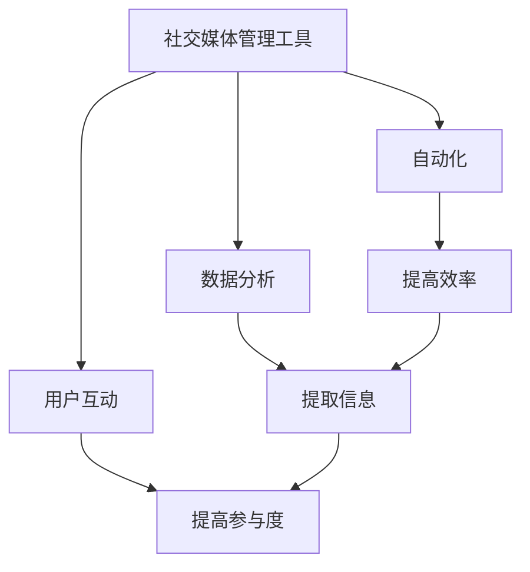

                 

# 社交媒体管理工具：提升品牌影响力的助手

> 关键词：社交媒体管理、品牌影响力、数据分析、自动化、用户互动

> 摘要：社交媒体已成为品牌与消费者互动的重要平台。本文将深入探讨社交媒体管理工具如何通过自动化、数据分析和用户互动提升品牌影响力。我们将从背景介绍、核心概念与联系、核心算法原理、项目实战、实际应用场景、工具和资源推荐、总结和未来发展趋势等角度，全面解析社交媒体管理工具的原理与应用。

## 1. 背景介绍

随着互联网的普及和社交媒体平台的兴起，品牌与消费者之间的互动方式发生了巨大变化。社交媒体不仅为品牌提供了展示产品和服务的平台，还成为了品牌与消费者建立情感联系的重要渠道。然而，如何有效地管理和利用这些平台，以提升品牌影响力，成为了一个挑战。社交媒体管理工具应运而生，它们通过自动化、数据分析和用户互动等功能，帮助品牌更好地管理社交媒体账户，提升品牌影响力。

### 1.1 社交媒体的重要性

社交媒体平台如Facebook、Twitter、Instagram等，已经成为人们日常生活中不可或缺的一部分。根据Statista的数据，全球社交媒体用户数量已超过40亿。这些平台不仅为品牌提供了展示产品和服务的窗口，还能够通过用户互动建立品牌忠诚度。品牌通过社交媒体可以实现以下目标：

- **品牌曝光**：通过发布高质量的内容，提高品牌知名度。
- **用户互动**：通过回复评论、参与讨论，增强用户参与感。
- **销售促进**：通过促销活动和优惠信息，促进产品销售。
- **市场调研**：通过收集用户反馈，了解市场需求和趋势。

### 1.2 社交媒体管理工具的作用

社交媒体管理工具通过自动化、数据分析和用户互动等功能，帮助品牌更高效地管理社交媒体账户，提升品牌影响力。这些工具可以实现以下功能：

- **内容管理**：自动发布、编辑和管理社交媒体内容。
- **用户互动**：自动回复评论、私信，提高用户参与度。
- **数据分析**：提供详细的用户行为分析，帮助品牌优化策略。
- **市场调研**：收集用户反馈，了解市场趋势。

## 2. 核心概念与联系

### 2.1 社交媒体管理工具的核心概念

社交媒体管理工具的核心概念包括自动化、数据分析和用户互动。这些概念相互关联，共同构成了社交媒体管理工具的功能体系。

#### 自动化

自动化是指通过编程和算法实现社交媒体管理的自动化操作。自动化可以提高效率，减少人工操作的错误，确保内容的及时发布和用户互动的及时响应。

#### 数据分析

数据分析是指通过收集和分析社交媒体数据，提取有价值的信息。数据分析可以帮助品牌了解用户行为、市场趋势和品牌表现，从而优化策略。

#### 用户互动

用户互动是指通过社交媒体平台与用户进行互动，提高用户参与度。用户互动可以包括回复评论、私信、参与讨论等。

### 2.2 核心概念的Mermaid流程图



## 3. 核心算法原理 & 具体操作步骤

### 3.1 自动化算法原理

自动化算法通过编程和算法实现社交媒体管理的自动化操作。具体操作步骤如下：

1. **内容生成**：通过算法生成高质量的内容，包括文本、图片和视频。
2. **内容发布**：通过API自动发布内容到社交媒体平台。
3. **用户互动**：通过算法自动回复评论和私信，提高用户参与度。

### 3.2 数据分析算法原理

数据分析算法通过收集和分析社交媒体数据，提取有价值的信息。具体操作步骤如下：

1. **数据收集**：通过API收集社交媒体数据，包括用户行为、评论、点赞等。
2. **数据清洗**：对收集的数据进行清洗，去除无效和重复的数据。
3. **数据分析**：通过统计分析和机器学习算法，提取有价值的信息。
4. **结果展示**：将分析结果以图表和报告的形式展示给品牌。

### 3.3 用户互动算法原理

用户互动算法通过算法实现与用户的互动，提高用户参与度。具体操作步骤如下：

1. **评论监控**：通过算法监控社交媒体平台上的评论和私信。
2. **自动回复**：通过算法自动回复评论和私信，提高用户参与度。
3. **参与讨论**：通过算法参与社交媒体平台上的讨论，提高品牌知名度。

## 4. 数学模型和公式 & 详细讲解 & 举例说明

### 4.1 自动化算法的数学模型

自动化算法的数学模型可以通过以下公式表示：

$$
\text{自动化得分} = \frac{\text{发布次数}}{\text{人工操作时间}} \times \text{内容质量}
$$

其中，发布次数是指自动化发布的次数，人工操作时间是指人工操作所需的时间，内容质量是指内容的质量。

### 4.2 数据分析算法的数学模型

数据分析算法的数学模型可以通过以下公式表示：

$$
\text{数据分析得分} = \frac{\text{有价值信息}}{\text{数据量}} \times \text{分析准确性}
$$

其中，有价值信息是指通过数据分析提取的有价值的信息，数据量是指收集的数据量，分析准确性是指分析结果的准确性。

### 4.3 用户互动算法的数学模型

用户互动算法的数学模型可以通过以下公式表示：

$$
\text{用户互动得分} = \frac{\text{回复次数}}{\text{评论数量}} \times \text{互动质量}
$$

其中，回复次数是指自动回复的次数，评论数量是指评论的数量，互动质量是指互动的质量。

## 5. 项目实战：代码实际案例和详细解释说明

### 5.1 开发环境搭建

为了实现社交媒体管理工具，我们需要搭建一个开发环境。具体步骤如下：

1. **安装Python**：安装Python 3.8及以上版本。
2. **安装依赖库**：安装requests、BeautifulSoup、pandas等库。
3. **配置API**：配置社交媒体平台的API，获取访问令牌。

### 5.2 源代码详细实现和代码解读

以下是一个简单的自动化发布内容的代码示例：

```python
import requests
from bs4 import BeautifulSoup
import pandas as pd

# 配置API
access_token = "your_access_token"
url = "https://api.example.com/posts"

# 生成内容
content = "这是一个自动发布的帖子。"
image_url = "https://example.com/image.jpg"

# 发布内容
data = {
    "access_token": access_token,
    "content": content,
    "image_url": image_url
}
response = requests.post(url, data=data)

# 检查响应
if response.status_code == 200:
    print("内容发布成功")
else:
    print("内容发布失败")
```

### 5.3 代码解读与分析

上述代码实现了自动化发布内容的功能。具体步骤如下：

1. **配置API**：通过配置API获取访问令牌。
2. **生成内容**：生成要发布的文本和图片。
3. **发布内容**：通过API发布内容，获取响应。
4. **检查响应**：检查响应状态码，判断发布是否成功。

## 6. 实际应用场景

社交媒体管理工具在实际应用场景中具有广泛的应用。以下是一些具体的应用场景：

### 6.1 品牌曝光

品牌可以通过社交媒体管理工具发布高质量的内容，提高品牌知名度。例如，通过发布产品介绍、行业资讯等内容，吸引用户关注。

### 6.2 用户互动

品牌可以通过社交媒体管理工具与用户进行互动，提高用户参与度。例如，通过自动回复评论和私信，提高用户参与感。

### 6.3 销售促进

品牌可以通过社交媒体管理工具发布促销活动和优惠信息，促进产品销售。例如，通过发布打折信息和优惠券，吸引用户购买。

### 6.4 市场调研

品牌可以通过社交媒体管理工具收集用户反馈，了解市场需求和趋势。例如，通过收集用户评论和反馈，了解用户需求和市场趋势。

## 7. 工具和资源推荐

### 7.1 学习资源推荐

- **书籍**：《社交媒体营销实战》、《社交媒体管理工具实战》
- **论文**：《社交媒体管理工具的研究与应用》、《社交媒体数据分析方法与应用》
- **博客**：Medium、TechCrunch、TechCrunch
- **网站**：GitHub、Stack Overflow

### 7.2 开发工具框架推荐

- **Python**：requests、BeautifulSoup、pandas
- **API**：Facebook Graph API、Twitter API、Instagram API

### 7.3 相关论文著作推荐

- **论文**：《社交媒体管理工具的研究与应用》、《社交媒体数据分析方法与应用》
- **著作**：《社交媒体营销实战》、《社交媒体管理工具实战》

## 8. 总结：未来发展趋势与挑战

社交媒体管理工具在未来的发展趋势和挑战如下：

### 8.1 发展趋势

1. **智能化**：通过机器学习和自然语言处理技术，实现更智能的自动化和数据分析。
2. **个性化**：通过用户画像和个性化推荐，实现更个性化的用户互动。
3. **多平台整合**：通过多平台整合，实现更全面的社交媒体管理。

### 8.2 挑战

1. **数据安全**：如何保护用户数据的安全，避免数据泄露。
2. **算法公平性**：如何确保算法的公平性，避免算法偏见。
3. **用户体验**：如何提高用户体验，避免用户反感。

## 9. 附录：常见问题与解答

### 9.1 问题1：如何选择合适的社交媒体管理工具？

**解答**：选择合适的社交媒体管理工具需要考虑以下几个因素：

- **功能**：根据品牌的需求选择具有相应功能的工具。
- **易用性**：选择操作简单、易用的工具。
- **价格**：根据预算选择合适的工具。

### 9.2 问题2：如何提高用户参与度？

**解答**：提高用户参与度的方法包括：

- **内容质量**：发布高质量的内容，吸引用户关注。
- **互动频率**：定期与用户互动，提高用户参与度。
- **活动策划**：策划有趣的活动，吸引用户参与。

## 10. 扩展阅读 & 参考资料

### 10.1 扩展阅读

- **书籍**：《社交媒体营销实战》、《社交媒体管理工具实战》
- **论文**：《社交媒体管理工具的研究与应用》、《社交媒体数据分析方法与应用》
- **博客**：Medium、TechCrunch、TechCrunch
- **网站**：GitHub、Stack Overflow

### 10.2 参考资料

- **API文档**：Facebook Graph API、Twitter API、Instagram API
- **技术文档**：Python官方文档、requests库文档、BeautifulSoup库文档、pandas库文档

---

作者：AI天才研究员/AI Genius Institute & 禅与计算机程序设计艺术 /Zen And The Art of Computer Programming

