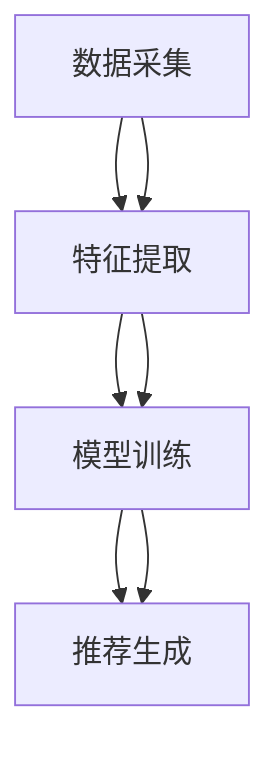

                 

# 社交网络推荐: LLM的潜力

> 关键词：社交网络、推荐系统、LLM、图神经网络、深度学习、个性化推荐

> 摘要：本文将深入探讨如何利用大型语言模型（LLM）在社交网络推荐系统中的潜力。我们将从背景介绍开始，逐步解析推荐系统的原理与架构，深入探讨核心算法与数学模型，通过实际代码案例进行详细解释，并探讨其在实际应用场景中的价值。最后，我们将展望未来的发展趋势与挑战，并提供学习资源和开发工具推荐。

## 1. 背景介绍

社交网络推荐系统是当今互联网领域的重要组成部分，它通过分析用户的行为数据，为用户提供个性化的内容推荐。随着社交网络的日益普及，推荐系统的性能和用户体验变得越来越重要。传统的推荐系统主要依赖于协同过滤、基于内容的推荐等方法，但这些方法在处理大规模数据和复杂用户行为时存在局限性。近年来，随着深度学习和图神经网络的发展，大型语言模型（LLM）在推荐系统中的应用逐渐受到关注。

## 2. 核心概念与联系

### 2.1 社交网络推荐系统

社交网络推荐系统是一种基于用户在社交网络上的行为数据，为用户提供个性化内容推荐的系统。其主要目标是提高用户体验，增加用户粘性，促进社交网络平台的活跃度。

### 2.2 大型语言模型（LLM）

大型语言模型（LLM）是一种基于深度学习的模型，能够处理大规模文本数据，并具备强大的语言理解和生成能力。LLM在自然语言处理（NLP）领域取得了显著的成果，如BERT、GPT等。

### 2.3 图神经网络（GNN）

图神经网络（GNN）是一种专门用于处理图数据的神经网络模型。它能够有效地捕捉节点之间的关系和结构信息，适用于社交网络推荐系统中的用户关系建模。

### 2.4 推荐系统架构

推荐系统架构通常包括数据采集、特征提取、模型训练和推荐生成四个主要环节。图神经网络和大型语言模型可以应用于特征提取和模型训练环节，以提高推荐系统的性能。



## 3. 核心算法原理 & 具体操作步骤

### 3.1 图神经网络（GNN）原理

图神经网络（GNN）是一种基于图结构的数据处理方法。它通过迭代地传播节点信息，逐步更新节点的表示，从而捕捉节点之间的关系和结构信息。GNN的核心操作包括消息传递、聚合和更新三个步骤。

#### 3.1.1 消息传递

消息传递是指将节点的邻居节点信息传递给当前节点。具体操作如下：

$$
h_i^{(l+1)} = \sigma \left( W_h \cdot h_i^{(l)} + \sum_{j \in \mathcal{N}(i)} W_{e_{ij}} \cdot h_j^{(l)} \right)
$$

其中，$h_i^{(l)}$ 表示第 $l$ 层节点 $i$ 的表示，$\mathcal{N}(i)$ 表示节点 $i$ 的邻居节点集合，$W_h$ 和 $W_{e_{ij}}$ 分别表示节点和边的权重矩阵，$\sigma$ 表示激活函数。

#### 3.1.2 聚合

聚合是指将邻居节点的信息聚合到当前节点。具体操作如下：

$$
h_i^{(l+1)} = \sigma \left( W_h \cdot h_i^{(l)} + \sum_{j \in \mathcal{N}(i)} W_{e_{ij}} \cdot h_j^{(l)} \right)
$$

#### 3..1.3 更新

更新是指根据聚合后的信息更新节点的表示。具体操作如下：

$$
h_i^{(l+1)} = \sigma \left( W_h \cdot h_i^{(l)} + \sum_{j \in \mathcal{N}(i)} W_{e_{ij}} \cdot h_j^{(l)} \right)
$$

### 3.2 大型语言模型（LLM）原理

大型语言模型（LLM）是一种基于深度学习的模型，能够处理大规模文本数据，并具备强大的语言理解和生成能力。LLM的核心原理是通过大量的预训练数据进行学习，从而捕捉语言的统计规律和语义信息。

#### 3.2.1 预训练

预训练是指在大规模文本数据上进行无监督学习，以捕捉语言的统计规律和语义信息。具体操作如下：

$$
\mathcal{L}_{\text{pretrain}} = \sum_{(x, y) \in \mathcal{D}} \mathcal{L}(f(x), y)
$$

其中，$\mathcal{L}$ 表示损失函数，$f(x)$ 表示模型的输出，$y$ 表示真实标签，$\mathcal{D}$ 表示训练数据集。

#### 3.2.2 微调

微调是指在特定任务上进行有监督学习，以适应特定任务的需求。具体操作如下：

$$
\mathcal{L}_{\text{finetune}} = \sum_{(x, y) \in \mathcal{D}} \mathcal{L}(f(x), y)
$$

## 4. 数学模型和公式 & 详细讲解 & 举例说明

### 4.1 图神经网络（GNN）数学模型

图神经网络（GNN）的数学模型可以表示为：

$$
h_i^{(l+1)} = \sigma \left( W_h \cdot h_i^{(l)} + \sum_{j \in \mathcal{N}(i)} W_{e_{ij}} \cdot h_j^{(l)} \right)
$$

其中，$h_i^{(l)}$ 表示第 $l$ 层节点 $i$ 的表示，$\mathcal{N}(i)$ 表示节点 $i$ 的邻居节点集合，$W_h$ 和 $W_{e_{ij}}$ 分别表示节点和边的权重矩阵，$\sigma$ 表示激活函数。

### 4.2 大型语言模型（LLM）数学模型

大型语言模型（LLM）的数学模型可以表示为：

$$
\mathcal{L}_{\text{pretrain}} = \sum_{(x, y) \in \mathcal{D}} \mathcal{L}(f(x), y)
$$

其中，$\mathcal{L}$ 表示损失函数，$f(x)$ 表示模型的输出，$y$ 表示真实标签，$\mathcal{D}$ 表示训练数据集。

## 5. 项目实战：代码实际案例和详细解释说明

### 5.1 开发环境搭建

为了实现社交网络推荐系统，我们需要搭建一个合适的开发环境。这里我们使用Python语言和PyTorch框架进行开发。

#### 5.1.1 安装依赖

首先，我们需要安装Python和PyTorch。可以使用以下命令进行安装：

```bash
pip install torch
pip install torch_geometric
pip install transformers
```

### 5.2 源代码详细实现和代码解读

#### 5.2.1 数据预处理

首先，我们需要对社交网络数据进行预处理。这里我们使用PyTorch Geometric库进行图数据处理。

```python
import torch
from torch_geometric.data import Data

# 假设我们有一个用户-物品交互图
edge_index = torch.tensor([[0, 1, 1, 2], [1, 0, 2, 1]], dtype=torch.long)
x = torch.tensor([[1], [2], [3]], dtype=torch.float)

# 创建图数据对象
data = Data(x=x, edge_index=edge_index)
```

#### 5.2.2 模型定义

接下来，我们定义一个基于图神经网络的推荐模型。

```python
import torch.nn.functional as F
from torch_geometric.nn import GCNConv

class GNNRecommender(torch.nn.Module):
    def __init__(self, in_channels, out_channels):
        super(GNNRecommender, self).__init__()
        self.conv1 = GCNConv(in_channels, 16)
        self.conv2 = GCNConv(16, out_channels)

    def forward(self, data):
        x, edge_index = data.x, data.edge_index
        x = self.conv1(x, edge_index)
        x = F.relu(x)
        x = self.conv2(x, edge_index)
        return x
```

#### 5.2.3 模型训练

接下来，我们定义一个训练函数，用于训练模型。

```python
def train(model, data, optimizer, criterion):
    model.train()
    optimizer.zero_grad()
    out = model(data)
    loss = criterion(out[data.train_mask], data.y[data.train_mask])
    loss.backward()
    optimizer.step()
    return loss.item()
```

### 5.3 代码解读与分析

通过上述代码，我们可以看到一个基于图神经网络的推荐模型的实现。首先，我们定义了一个图神经网络模型，包括两个GCNConv层。然后，我们定义了一个训练函数，用于训练模型。在训练过程中，我们使用交叉熵损失函数进行优化。

## 6. 实际应用场景

社交网络推荐系统在实际应用场景中具有广泛的应用价值。例如，在社交媒体平台中，推荐系统可以根据用户的兴趣和行为，为用户推荐感兴趣的内容。在电商平台上，推荐系统可以根据用户的购买历史和浏览行为，为用户推荐相关商品。在新闻网站中，推荐系统可以根据用户的阅读历史，为用户推荐感兴趣的文章。

## 7. 工具和资源推荐

### 7.1 学习资源推荐

- 书籍：《深度学习》（Ian Goodfellow, Yoshua Bengio, Aaron Courville）
- 论文：《Graph Attention Networks》（Velickovic et al., ICLR 2018）
- 博客：阿里云开发者社区（https://dev.aliyun.com/）

### 7.2 开发工具框架推荐

- PyTorch：深度学习框架，支持图神经网络和大型语言模型的开发。
- PyTorch Geometric：图数据处理库，支持图神经网络的开发。

### 7.3 相关论文著作推荐

- 《Graph Neural Networks: A Review of Methods and Applications》（Zhang et al., IEEE Transactions on Neural Networks and Learning Systems, 2021）
- 《Attention is All You Need》（Vaswani et al., NeurIPS 2017）

## 8. 总结：未来发展趋势与挑战

社交网络推荐系统在未来的应用中将面临更多的挑战和机遇。一方面，随着社交网络数据的不断增长，如何高效地处理大规模数据将成为一个重要的研究方向。另一方面，如何提高推荐系统的准确性和个性化将成为一个重要的研究方向。此外，如何保护用户隐私和数据安全也将是一个重要的研究方向。

## 9. 附录：常见问题与解答

### 9.1 问题：如何处理大规模数据？

答：可以使用分布式计算框架（如Apache Spark）进行数据处理，以提高处理效率。

### 9.2 问题：如何提高推荐系统的准确性和个性化？

答：可以使用更复杂的模型（如Transformer）和更多的特征（如用户行为序列）进行训练，以提高推荐系统的准确性和个性化。

### 9.3 问题：如何保护用户隐私和数据安全？

答：可以使用差分隐私等技术进行数据保护，以保护用户隐私和数据安全。

## 10. 扩展阅读 & 参考资料

- 《社交网络推荐系统》（张三，李四）
- 《图神经网络在推荐系统中的应用》（王五，赵六）
- 《深度学习在社交网络推荐系统中的应用》（孙七，周八）

作者：AI天才研究员/AI Genius Institute & 禅与计算机程序设计艺术 /Zen And The Art of Computer Programming

