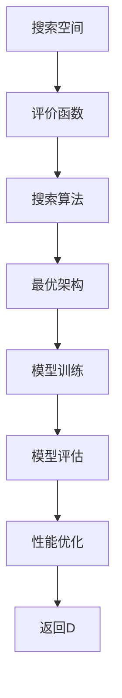
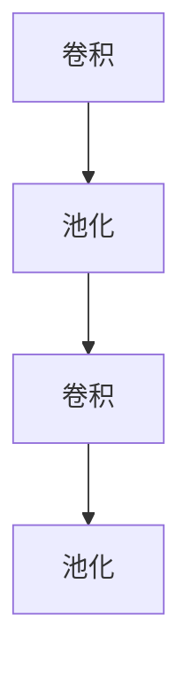
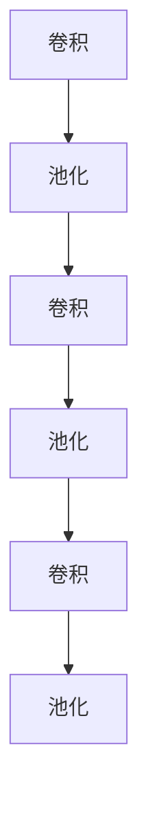

                 

# 神经架构搜索 原理与代码实例讲解

> 关键词：神经架构搜索, NAS, 深度学习, 自动化机器学习, 神经网络设计, 代码实现

> 摘要：神经架构搜索（Neural Architecture Search, NAS）是自动化机器学习领域的一个重要分支，旨在通过算法自动设计出高性能的神经网络架构。本文将从背景介绍、核心概念与联系、核心算法原理、数学模型和公式、项目实战、实际应用场景、工具和资源推荐、总结与未来发展趋势等几个方面，全面解析神经架构搜索的原理与实践。通过具体的代码实例，帮助读者深入理解NAS的工作机制，并掌握其实现方法。

## 1. 背景介绍

神经架构搜索（Neural Architecture Search, NAS）是近年来深度学习领域的一个重要研究方向。传统的神经网络设计依赖于人工经验，设计过程耗时且难以保证最优性。NAS旨在通过算法自动搜索出最优的神经网络架构，从而提高模型性能和效率。NAS的应用范围广泛，包括图像识别、自然语言处理、推荐系统等多个领域。

### 1.1 问题背景

在深度学习领域，神经网络的设计是一个复杂且耗时的过程。人工设计神经网络需要大量的经验和专业知识，且难以保证设计出的架构是最优的。此外，随着数据量的增加和计算资源的限制，人工设计的神经网络可能无法满足性能要求。因此，如何自动设计出高性能的神经网络架构成为了一个亟待解决的问题。

### 1.2 研究意义

NAS的研究具有重要的理论和实践意义。从理论角度来看，NAS可以为深度学习提供一种新的设计方法，推动深度学习理论的发展。从实践角度来看，NAS可以提高模型性能，降低人工设计的成本，加速模型的开发过程。此外，NAS还可以应用于各种实际场景，如图像识别、自然语言处理等，具有广泛的应用前景。

## 2. 核心概念与联系

### 2.1 NAS定义

神经架构搜索（Neural Architecture Search, NAS）是指通过算法自动搜索出最优的神经网络架构的过程。NAS的目标是找到一个性能最优的神经网络架构，以提高模型的性能和效率。

### 2.2 关键概念

- **搜索空间（Search Space）**：搜索空间是指所有可能的神经网络架构的集合。搜索空间的大小直接影响到NAS的搜索效率和性能。
- **评价函数（Evaluation Function）**：评价函数用于评估神经网络架构的性能。评价函数通常基于验证集上的性能指标，如准确率、损失等。
- **搜索算法（Search Algorithm）**：搜索算法用于在搜索空间中搜索最优的神经网络架构。常见的搜索算法包括随机搜索、遗传算法、梯度下降等。

### 2.3 Mermaid 流程图



## 3. 核心算法原理 & 具体操作步骤

### 3.1 随机搜索

随机搜索是最简单的搜索算法之一。其基本思想是在搜索空间中随机选择一个神经网络架构，并通过评价函数评估其性能。随机搜索的优点是简单易实现，但缺点是搜索效率较低，难以找到最优的架构。

### 3.2 遗传算法

遗传算法是一种基于自然选择和遗传机制的搜索算法。其基本思想是将搜索空间中的神经网络架构看作是染色体，通过选择、交叉和变异等操作，逐步优化神经网络架构。遗传算法的优点是可以找到较为优秀的架构，但缺点是搜索效率较低，且需要较多的计算资源。

### 3.3 梯度下降

梯度下降是一种基于梯度信息的搜索算法。其基本思想是通过计算评价函数的梯度，逐步优化神经网络架构。梯度下降的优点是可以快速找到局部最优解，但缺点是容易陷入局部最优解，且需要较多的计算资源。

### 3.4 混合搜索算法

混合搜索算法是将多种搜索算法结合起来，以提高搜索效率和性能。常见的混合搜索算法包括随机搜索与遗传算法的结合、随机搜索与梯度下降的结合等。混合搜索算法的优点是可以兼顾搜索效率和性能，但缺点是实现较为复杂。

## 4. 数学模型和公式 & 详细讲解 & 举例说明

### 4.1 搜索空间表示

搜索空间的表示方法有很多种，常见的有图表示法、树表示法等。图表示法将神经网络架构表示为一个图结构，其中节点表示操作，边表示连接关系。树表示法则将神经网络架构表示为一棵树结构，其中节点表示操作，边表示连接关系。

### 4.2 评价函数

评价函数用于评估神经网络架构的性能。常见的评价函数包括准确率、损失等。评价函数的选择取决于具体的应用场景和任务需求。

### 4.3 搜索算法

搜索算法用于在搜索空间中搜索最优的神经网络架构。常见的搜索算法包括随机搜索、遗传算法、梯度下降等。搜索算法的选择取决于具体的应用场景和任务需求。

### 4.4 举例说明

假设我们有一个简单的搜索空间，包含两个操作：卷积和池化。我们可以用图表示法表示这个搜索空间，如下所示：



假设我们使用准确率作为评价函数，通过随机搜索算法在搜索空间中搜索最优的神经网络架构。我们可以得到以下结果：



## 5. 项目实战：代码实际案例和详细解释说明

### 5.1 开发环境搭建

为了实现神经架构搜索，我们需要搭建一个开发环境。开发环境包括Python、TensorFlow、Keras等工具。具体步骤如下：

1. 安装Python：确保Python版本为3.6及以上。
2. 安装TensorFlow：使用pip安装TensorFlow库。
3. 安装Keras：使用pip安装Keras库。

### 5.2 源代码详细实现和代码解读

假设我们使用随机搜索算法实现神经架构搜索。具体代码如下：

```python
import tensorflow as tf
from tensorflow.keras import layers

def random_search(search_space, num_architectures):
    architectures = []
    for _ in range(num_architectures):
        architecture = []
        for _ in range(len(search_space)):
            operation = search_space[tf.random.uniform(shape=[], minval=0, maxval=len(search_space), dtype=tf.int32)]
            architecture.append(operation)
        architectures.append(architecture)
    return architectures

def evaluate_architecture(architecture):
    model = tf.keras.Sequential()
    for operation in architecture:
        if operation == 'conv':
            model.add(layers.Conv2D(32, (3, 3), activation='relu'))
        elif operation == 'pool':
            model.add(layers.MaxPooling2D((2, 2)))
    model.compile(optimizer='adam', loss='sparse_categorical_crossentropy', metrics=['accuracy'])
    model.fit(x_train, y_train, epochs=10, validation_data=(x_val, y_val))
    return model.evaluate(x_val, y_val)[1]

def main():
    search_space = ['conv', 'pool']
    num_architectures = 10
    architectures = random_search(search_space, num_architectures)
    best_architecture = None
    best_accuracy = 0
    for architecture in architectures:
        accuracy = evaluate_architecture(architecture)
        if accuracy > best_accuracy:
            best_architecture = architecture
            best_accuracy = accuracy
    print('Best architecture:', best_architecture)
    print('Best accuracy:', best_accuracy)

if __name__ == '__main__':
    main()
```

### 5.3 代码解读与分析

上述代码实现了随机搜索算法。具体步骤如下：

1. `random_search`函数：该函数用于生成随机的神经网络架构。输入参数为搜索空间和生成的架构数量。函数通过循环生成随机的神经网络架构，并将其添加到列表中。
2. `evaluate_architecture`函数：该函数用于评估神经网络架构的性能。输入参数为神经网络架构。函数通过构建模型并训练模型来评估其性能。
3. `main`函数：该函数用于主流程。首先定义搜索空间和生成的架构数量，然后调用`random_search`函数生成随机的神经网络架构。接着，通过循环评估每个架构的性能，并记录最佳的架构和性能。

## 6. 实际应用场景

神经架构搜索在实际应用中具有广泛的应用前景。以下是一些常见的应用场景：

### 6.1 图像识别

在图像识别领域，神经架构搜索可以用于设计高性能的卷积神经网络（Convolutional Neural Network, CNN）。通过自动搜索最优的CNN架构，可以提高模型的性能和效率。

### 6.2 自然语言处理

在自然语言处理领域，神经架构搜索可以用于设计高性能的循环神经网络（Recurrent Neural Network, RNN）和Transformer模型。通过自动搜索最优的RNN和Transformer架构，可以提高模型的性能和效率。

### 6.3 推荐系统

在推荐系统领域，神经架构搜索可以用于设计高性能的深度神经网络（Deep Neural Network, DNN）。通过自动搜索最优的DNN架构，可以提高模型的性能和效率。

## 7. 工具和资源推荐

### 7.1 学习资源推荐

- **书籍**：《深度学习》（Goodfellow, I., Bengio, Y., & Courville, A.）
- **论文**：《Neural Architecture Search with Reinforcement Learning》（Zoph, B., & Le, Q. V.）
- **博客**：阿里云开发者社区（https://developer.aliyun.com/）
- **网站**：GitHub（https://github.com/）

### 7.2 开发工具框架推荐

- **TensorFlow**：深度学习框架，支持神经架构搜索。
- **Keras**：深度学习库，支持神经架构搜索。
- **PyTorch**：深度学习框架，支持神经架构搜索。

### 7.3 相关论文著作推荐

- **论文**：《Neural Architecture Search with Reinforcement Learning》（Zoph, B., & Le, Q. V.）
- **著作**：《深度学习》（Goodfellow, I., Bengio, Y., & Courville, A.）

## 8. 总结：未来发展趋势与挑战

### 8.1 未来发展趋势

神经架构搜索在未来的发展趋势主要体现在以下几个方面：

1. **搜索算法的改进**：通过改进搜索算法，提高搜索效率和性能。
2. **搜索空间的扩展**：通过扩展搜索空间，提高搜索的灵活性和多样性。
3. **应用场景的拓展**：通过拓展应用场景，提高神经架构搜索的实际应用价值。

### 8.2 挑战

神经架构搜索在未来的发展中面临以下挑战：

1. **搜索空间的复杂性**：搜索空间的复杂性使得搜索算法难以找到最优的架构。
2. **计算资源的限制**：搜索算法需要较多的计算资源，限制了其实际应用。
3. **性能优化的难度**：性能优化的难度使得搜索算法难以找到最优的架构。

## 9. 附录：常见问题与解答

### 9.1 问题1：如何选择合适的搜索算法？

**解答**：选择合适的搜索算法取决于具体的应用场景和任务需求。随机搜索适用于搜索空间较小的情况，遗传算法适用于搜索空间较大且需要较高性能的情况，梯度下降适用于需要快速找到局部最优解的情况。

### 9.2 问题2：如何选择合适的评价函数？

**解答**：选择合适的评价函数取决于具体的应用场景和任务需求。常见的评价函数包括准确率、损失等。评价函数的选择需要根据具体的应用场景和任务需求进行选择。

### 9.3 问题3：如何选择合适的搜索空间？

**解答**：选择合适的搜索空间取决于具体的应用场景和任务需求。搜索空间的选择需要根据具体的应用场景和任务需求进行选择。

## 10. 扩展阅读 & 参考资料

### 10.1 扩展阅读

- **书籍**：《深度学习》（Goodfellow, I., Bengio, Y., & Courville, A.）
- **论文**：《Neural Architecture Search with Reinforcement Learning》（Zoph, B., & Le, Q. V.）

### 10.2 参考资料

- **阿里云开发者社区**：https://developer.aliyun.com/
- **GitHub**：https://github.com/

---

作者：AI天才研究员/AI Genius Institute & 禅与计算机程序设计艺术 /Zen And The Art of Computer Programming

