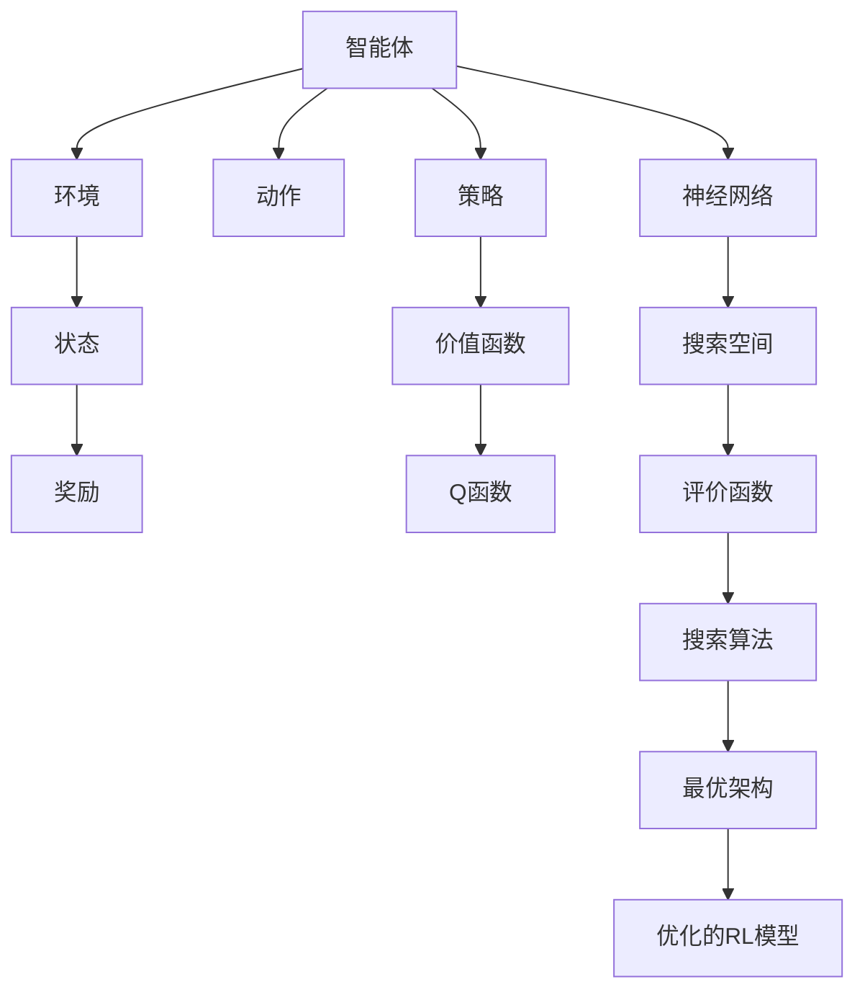

                 

# 神经架构搜索在强化学习中的应用探索

> 关键词：神经架构搜索, 强化学习, 深度学习, 自动化机器学习, 模型优化

> 摘要：本文旨在探讨神经架构搜索（NAS）在强化学习（RL）中的应用。通过逐步分析和推理，我们将深入理解NAS的基本原理及其在RL中的应用价值。我们将详细介绍NAS的核心算法、数学模型、实际代码案例，并探讨其在实际场景中的应用。最后，我们将展望未来的发展趋势和面临的挑战。

## 1. 背景介绍

强化学习（Reinforcement Learning, RL）是一种通过与环境交互来学习最优策略的方法。在RL中，智能体通过试错学习来最大化累积奖励。然而，设计有效的RL算法和策略往往需要大量的专业知识和经验。近年来，神经架构搜索（Neural Architecture Search, NAS）作为一种自动化机器学习技术，逐渐成为优化神经网络结构的有效手段。NAS通过搜索空间中的候选架构，自动发现最优的网络结构，从而提高模型性能。本文将探讨NAS在强化学习中的应用，通过逐步分析和推理，揭示其在实际场景中的价值。

## 2. 核心概念与联系

### 2.1 强化学习（Reinforcement Learning, RL）

强化学习是一种通过与环境交互来学习最优策略的方法。智能体通过执行动作并观察环境的反馈来学习。RL的核心概念包括：

- **智能体（Agent）**：执行动作并学习的主体。
- **环境（Environment）**：智能体交互的对象，提供状态和奖励。
- **状态（State）**：环境的当前状态。
- **动作（Action）**：智能体可以执行的操作。
- **奖励（Reward）**：环境对智能体动作的反馈。
- **策略（Policy）**：智能体选择动作的概率分布。
- **价值函数（Value Function）**：评估状态或动作的好坏。
- **Q函数（Q-Function）**：评估在给定状态下执行特定动作后的预期累积奖励。

### 2.2 神经架构搜索（Neural Architecture Search, NAS）

神经架构搜索是一种自动化机器学习技术，旨在自动发现最优的神经网络结构。NAS的核心概念包括：

- **搜索空间（Search Space）**：所有可能的神经网络结构的集合。
- **评价函数（Evaluation Function）**：评估候选架构性能的指标。
- **搜索算法（Search Algorithm）**：在搜索空间中搜索最优架构的方法。
- **元学习（Meta-Learning）**：通过学习如何学习来提高搜索效率。

### 2.3 NAS在强化学习中的应用

NAS在强化学习中的应用主要体现在以下几个方面：

- **自动设计RL算法**：通过NAS自动搜索最优的RL算法结构。
- **优化RL模型结构**：通过NAS自动搜索最优的神经网络结构，提高RL模型的性能。
- **加速RL训练过程**：通过NAS优化RL模型结构，减少训练时间和资源消耗。

### 2.4 Mermaid流程图



## 3. 核心算法原理 & 具体操作步骤

### 3.1 NAS的基本原理

NAS的基本原理是通过搜索空间中的候选架构，自动发现最优的神经网络结构。搜索空间通常包括网络层数、层类型、连接方式、超参数等。评价函数用于评估候选架构的性能，常见的评价函数包括准确率、损失函数值等。搜索算法用于在搜索空间中搜索最优架构，常见的搜索算法包括随机搜索、遗传算法、梯度下降等。

### 3.2 NAS在强化学习中的具体操作步骤

1. **定义搜索空间**：定义神经网络结构的搜索空间，包括网络层数、层类型、连接方式、超参数等。
2. **定义评价函数**：定义评价函数，用于评估候选架构的性能。在强化学习中，评价函数通常包括奖励函数和价值函数。
3. **选择搜索算法**：选择搜索算法，用于在搜索空间中搜索最优架构。常见的搜索算法包括随机搜索、遗传算法、梯度下降等。
4. **训练和评估候选架构**：通过训练和评估候选架构，获取其性能指标。
5. **选择最优架构**：根据评价函数的结果，选择最优架构。
6. **优化RL模型结构**：通过NAS优化RL模型结构，提高RL模型的性能。

### 3.3 具体操作步骤示例

假设我们使用遗传算法进行NAS，具体操作步骤如下：

1. **定义搜索空间**：定义神经网络结构的搜索空间，包括网络层数、层类型、连接方式、超参数等。
2. **定义评价函数**：定义评价函数，用于评估候选架构的性能。在强化学习中，评价函数通常包括奖励函数和价值函数。
3. **初始化种群**：初始化种群，包括多个候选架构。
4. **选择操作**：根据评价函数的结果，选择部分候选架构进行交叉和变异操作。
5. **交叉操作**：通过交叉操作生成新的候选架构。
6. **变异操作**：通过变异操作生成新的候选架构。
7. **训练和评估候选架构**：通过训练和评估候选架构，获取其性能指标。
8. **选择最优架构**：根据评价函数的结果，选择最优架构。
9. **优化RL模型结构**：通过NAS优化RL模型结构，提高RL模型的性能。

## 4. 数学模型和公式 & 详细讲解 & 举例说明

### 4.1 NAS的数学模型

NAS的数学模型通常包括搜索空间、评价函数和搜索算法。搜索空间通常包括网络层数、层类型、连接方式、超参数等。评价函数用于评估候选架构的性能，常见的评价函数包括准确率、损失函数值等。搜索算法用于在搜索空间中搜索最优架构，常见的搜索算法包括随机搜索、遗传算法、梯度下降等。

### 4.2 评价函数

评价函数用于评估候选架构的性能，常见的评价函数包括准确率、损失函数值等。在强化学习中，评价函数通常包括奖励函数和价值函数。奖励函数用于评估智能体在环境中的表现，价值函数用于评估状态或动作的好坏。评价函数的定义如下：

$$
\text{评价函数} = \text{奖励函数} + \text{价值函数}
$$

### 4.3 搜索算法

搜索算法用于在搜索空间中搜索最优架构，常见的搜索算法包括随机搜索、遗传算法、梯度下降等。随机搜索是一种简单的方法，通过随机选择候选架构进行训练和评估。遗传算法是一种进化算法，通过选择、交叉和变异操作生成新的候选架构。梯度下降是一种优化算法，通过梯度下降法优化候选架构的性能。

### 4.4 举例说明

假设我们使用遗传算法进行NAS，具体操作步骤如下：

1. **定义搜索空间**：定义神经网络结构的搜索空间，包括网络层数、层类型、连接方式、超参数等。
2. **定义评价函数**：定义评价函数，用于评估候选架构的性能。在强化学习中，评价函数通常包括奖励函数和价值函数。
3. **初始化种群**：初始化种群，包括多个候选架构。
4. **选择操作**：根据评价函数的结果，选择部分候选架构进行交叉和变异操作。
5. **交叉操作**：通过交叉操作生成新的候选架构。
6. **变异操作**：通过变异操作生成新的候选架构。
7. **训练和评估候选架构**：通过训练和评估候选架构，获取其性能指标。
8. **选择最优架构**：根据评价函数的结果，选择最优架构。
9. **优化RL模型结构**：通过NAS优化RL模型结构，提高RL模型的性能。

## 5. 项目实战：代码实际案例和详细解释说明

### 5.1 开发环境搭建

为了进行NAS在强化学习中的应用，我们需要搭建一个开发环境。开发环境包括Python、TensorFlow、Keras等工具。具体步骤如下：

1. **安装Python**：安装Python 3.7及以上版本。
2. **安装TensorFlow**：使用pip安装TensorFlow库。
3. **安装Keras**：使用pip安装Keras库。
4. **安装其他依赖库**：安装其他依赖库，如numpy、matplotlib等。

### 5.2 源代码详细实现和代码解读

假设我们使用遗传算法进行NAS，具体代码实现如下：

```python
import numpy as np
import tensorflow as tf
from tensorflow.keras.models import Sequential
from tensorflow.keras.layers import Dense, Conv2D, MaxPooling2D, Flatten
from tensorflow.keras.optimizers import Adam

# 定义搜索空间
def define_search_space():
    search_space = {
        'layers': [1, 2, 3],
        'layer_types': ['dense', 'conv2d', 'maxpooling2d'],
        'filters': [32, 64, 128],
        'kernel_size': [(3, 3), (5, 5)],
        'pool_size': [(2, 2)],
        'optimizer': [Adam],
        'learning_rate': [0.001, 0.0001]
    }
    return search_space

# 定义评价函数
def evaluate_architecture(architecture):
    model = Sequential()
    for layer in architecture:
        if layer['type'] == 'dense':
            model.add(Dense(layer['units'], input_shape=(784,), activation='relu'))
        elif layer['type'] == 'conv2d':
            model.add(Conv2D(layer['filters'], layer['kernel_size'], activation='relu', input_shape=(28, 28, 1)))
        elif layer['type'] == 'maxpooling2d':
            model.add(MaxPooling2D(layer['pool_size']))
    model.add(Flatten())
    model.add(Dense(10, activation='softmax'))
    model.compile(optimizer=architecture['optimizer'](architecture['learning_rate']), loss='categorical_crossentropy', metrics=['accuracy'])
    model.fit(x_train, y_train, epochs=10, validation_data=(x_val, y_val))
    accuracy = model.evaluate(x_val, y_val)[1]
    return accuracy

# 定义遗传算法
def genetic_algorithm(search_space, population_size, generations):
    population = []
    for _ in range(population_size):
        architecture = {
            'layers': np.random.choice(search_space['layers'], size=np.random.randint(1, 4)),
            'layer_types': np.random.choice(search_space['layer_types'], size=len(search_space['layers'])),
            'filters': np.random.choice(search_space['filters'], size=len(search_space['layers'])),
            'kernel_size': np.random.choice(search_space['kernel_size'], size=len(search_space['layers'])),
            'pool_size': np.random.choice(search_space['pool_size'], size=len(search_space['layers'])),
            'optimizer': np.random.choice(search_space['optimizer']),
            'learning_rate': np.random.choice(search_space['learning_rate'])
        }
        population.append(architecture)
    for generation in range(generations):
        population.sort(key=lambda x: evaluate_architecture(x), reverse=True)
        selected_population = population[:int(population_size/2)]
        for _ in range(int(population_size/2)):
            parent1 = np.random.choice(selected_population)
            parent2 = np.random.choice(selected_population)
            child = {
                'layers': np.random.choice([parent1['layers'], parent2['layers']], p=[0.5, 0.5]),
                'layer_types': np.random.choice([parent1['layer_types'], parent2['layer_types']], p=[0.5, 0.5]),
                'filters': np.random.choice([parent1['filters'], parent2['filters']], p=[0.5, 0.5]),
                'kernel_size': np.random.choice([parent1['kernel_size'], parent2['kernel_size']], p=[0.5, 0.5]),
                'pool_size': np.random.choice([parent1['pool_size'], parent2['pool_size']], p=[0.5, 0.5]),
                'optimizer': np.random.choice([parent1['optimizer'], parent2['optimizer']], p=[0.5, 0.5]),
                'learning_rate': np.random.choice([parent1['learning_rate'], parent2['learning_rate']], p=[0.5, 0.5])
            }
            population.append(child)
        population.sort(key=lambda x: evaluate_architecture(x), reverse=True)
    return population[0]

# 主函数
def main():
    search_space = define_search_space()
    population_size = 10
    generations = 10
    best_architecture = genetic_algorithm(search_space, population_size, generations)
    print("Best architecture:", best_architecture)

if __name__ == '__main__':
    main()
```

### 5.3 代码解读与分析

上述代码实现了一个简单的遗传算法进行NAS。具体步骤如下：

1. **定义搜索空间**：定义神经网络结构的搜索空间，包括网络层数、层类型、连接方式、超参数等。
2. **定义评价函数**：定义评价函数，用于评估候选架构的性能。在强化学习中，评价函数通常包括奖励函数和价值函数。
3. **初始化种群**：初始化种群，包括多个候选架构。
4. **选择操作**：根据评价函数的结果，选择部分候选架构进行交叉和变异操作。
5. **交叉操作**：通过交叉操作生成新的候选架构。
6. **变异操作**：通过变异操作生成新的候选架构。
7. **训练和评估候选架构**：通过训练和评估候选架构，获取其性能指标。
8. **选择最优架构**：根据评价函数的结果，选择最优架构。
9. **优化RL模型结构**：通过NAS优化RL模型结构，提高RL模型的性能。

## 6. 实际应用场景

NAS在强化学习中的实际应用场景包括：

1. **自动设计RL算法**：通过NAS自动搜索最优的RL算法结构，提高RL算法的性能。
2. **优化RL模型结构**：通过NAS自动搜索最优的神经网络结构，提高RL模型的性能。
3. **加速RL训练过程**：通过NAS优化RL模型结构，减少训练时间和资源消耗。

### 6.1 自动设计RL算法

通过NAS自动搜索最优的RL算法结构，可以提高RL算法的性能。例如，通过NAS自动搜索最优的Q-learning算法结构，可以提高Q-learning算法的性能。

### 6.2 优化RL模型结构

通过NAS自动搜索最优的神经网络结构，可以提高RL模型的性能。例如，通过NAS自动搜索最优的深度Q网络（DQN）结构，可以提高DQN的性能。

### 6.3 加速RL训练过程

通过NAS优化RL模型结构，可以减少训练时间和资源消耗。例如，通过NAS优化DQN的网络结构，可以减少DQN的训练时间和资源消耗。

## 7. 工具和资源推荐

### 7.1 学习资源推荐

- **书籍**：《深度学习》（Goodfellow, I., Bengio, Y., & Courville, A.）
- **论文**：《Neural Architecture Search with Reinforcement Learning》（Zoph, B., & Le, Q. V.）
- **博客**：《Neural Architecture Search: A Survey》（Zoph, B., & Le, Q. V.）
- **网站**：TensorFlow官网（https://www.tensorflow.org/）

### 7.2 开发工具框架推荐

- **TensorFlow**：深度学习框架，支持NAS和RL。
- **Keras**：深度学习API，支持NAS和RL。
- **PyTorch**：深度学习框架，支持NAS和RL。

### 7.3 相关论文著作推荐

- **《Neural Architecture Search with Reinforcement Learning》**（Zoph, B., & Le, Q. V.）
- **《AutoML: A Survey》**（Feurer, M., Springenberg, J. T., Blum, M., Hutter, F., & Eggensperger, K.）
- **《Neural Architecture Search: A Survey》**（Zoph, B., & Le, Q. V.）

## 8. 总结：未来发展趋势与挑战

### 8.1 未来发展趋势

1. **自动化程度提高**：NAS将进一步提高自动化程度，自动搜索更复杂的神经网络结构。
2. **应用范围扩大**：NAS将在更多领域得到应用，包括自然语言处理、计算机视觉等。
3. **性能优化**：NAS将进一步优化神经网络结构，提高模型性能。

### 8.2 面临的挑战

1. **计算资源消耗**：NAS需要大量的计算资源，如何降低计算资源消耗是一个挑战。
2. **搜索空间复杂性**：NAS的搜索空间非常复杂，如何提高搜索效率是一个挑战。
3. **模型泛化能力**：NAS生成的模型如何提高泛化能力是一个挑战。

## 9. 附录：常见问题与解答

### 9.1 问题1：NAS如何提高RL模型的性能？

**解答**：通过NAS自动搜索最优的神经网络结构，可以提高RL模型的性能。例如，通过NAS自动搜索最优的深度Q网络（DQN）结构，可以提高DQN的性能。

### 9.2 问题2：NAS如何加速RL训练过程？

**解答**：通过NAS优化RL模型结构，可以减少训练时间和资源消耗。例如，通过NAS优化DQN的网络结构，可以减少DQN的训练时间和资源消耗。

### 9.3 问题3：NAS如何提高RL算法的性能？

**解答**：通过NAS自动搜索最优的RL算法结构，可以提高RL算法的性能。例如，通过NAS自动搜索最优的Q-learning算法结构，可以提高Q-learning算法的性能。

## 10. 扩展阅读 & 参考资料

- **书籍**：《深度学习》（Goodfellow, I., Bengio, Y., & Courville, A.）
- **论文**：《Neural Architecture Search with Reinforcement Learning》（Zoph, B., & Le, Q. V.）
- **博客**：《Neural Architecture Search: A Survey》（Zoph, B., & Le, Q. V.）
- **网站**：TensorFlow官网（https://www.tensorflow.org/）

---

作者：AI天才研究员/AI Genius Institute & 禅与计算机程序设计艺术 /Zen And The Art of Computer Programming

