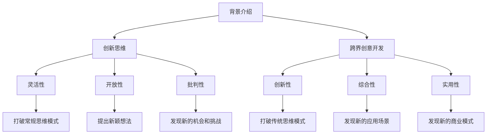

                 

# 程序员创业者的创新思维与跨界创意开发

> 关键词：创新思维、跨界创意、编程、创业、人工智能、软件架构、技术趋势

> 摘要：本文旨在探讨程序员创业者如何通过创新思维和跨界创意开发来推动技术进步和商业成功。我们将从背景介绍、核心概念与联系、核心算法原理、数学模型与公式、项目实战案例、实际应用场景、工具和资源推荐、未来发展趋势与挑战等多个方面进行深入分析，帮助读者掌握创新思维与跨界创意开发的关键要素。

## 1. 背景介绍

在当今快速变化的技术环境中，程序员创业者面临着前所未有的机遇与挑战。随着人工智能、大数据、云计算等技术的迅猛发展，创新思维和跨界创意开发成为推动技术进步和商业成功的关键因素。本文将从多个角度探讨如何培养创新思维，如何进行跨界创意开发，以及如何将这些理念应用于实际项目中。

### 1.1 技术背景

- **人工智能**：近年来，人工智能技术取得了突破性进展，特别是在机器学习、深度学习、自然语言处理等领域。这些技术的应用范围越来越广泛，从自动驾驶到医疗诊断，从智能客服到个性化推荐系统。
- **大数据**：随着数据量的爆炸性增长，大数据技术成为处理和分析海量数据的关键工具。大数据技术不仅能够帮助企业更好地理解用户行为，还能为决策提供有力支持。
- **云计算**：云计算技术的发展使得计算资源变得更加灵活和可扩展。通过云计算平台，开发者可以轻松地部署和管理应用程序，而无需担心硬件和基础设施的问题。

### 1.2 创业背景

- **市场机遇**：随着技术的不断进步，新的市场机遇不断涌现。例如，随着物联网技术的发展，智能家居、智慧城市等领域迎来了巨大的市场空间。
- **竞争压力**：同时，市场竞争也日益激烈。如何在众多竞争对手中脱颖而出，成为每个创业者需要思考的问题。
- **资源限制**：创业初期往往面临资金、人才等方面的限制。如何高效利用有限资源，实现快速成长，是每个创业者必须面对的挑战。

## 2. 核心概念与联系

### 2.1 创新思维

- **定义**：创新思维是指能够打破常规思维模式，提出新颖想法和解决方案的能力。
- **特点**：创新思维具有灵活性、开放性、批判性等特点。它能够帮助我们从不同角度看待问题，发现新的机会和挑战。
- **培养方法**：通过阅读、思考、实践等多种方式培养创新思维。例如，阅读科幻小说可以激发想象力；参加头脑风暴活动可以锻炼团队合作能力；实践项目可以积累经验。

### 2.2 跨界创意开发

- **定义**：跨界创意开发是指将不同领域的知识和技术结合起来，创造出新的产品或服务。
- **特点**：跨界创意开发具有创新性、综合性、实用性等特点。它能够帮助我们打破传统思维模式，发现新的应用场景和商业模式。
- **实现方法**：通过跨学科合作、跨界交流等方式实现跨界创意开发。例如，与设计师、市场专家等不同领域的专业人士合作，可以更好地理解用户需求；参加跨学科研讨会可以拓宽视野。

### 2.3 核心概念原理与架构



## 3. 核心算法原理 & 具体操作步骤

### 3.1 创新思维算法原理

- **定义**：创新思维算法是一种通过特定方法和步骤来培养创新思维的技术。
- **具体操作步骤**：
    1. **明确问题**：首先明确需要解决的问题或挑战。
    2. **收集信息**：收集与问题相关的各种信息和数据。
    3. **分析信息**：对收集到的信息进行分析，找出其中的规律和特点。
    4. **提出假设**：基于分析结果，提出可能的解决方案或假设。
    5. **验证假设**：通过实验或测试验证假设的可行性。
    6. **优化方案**：根据验证结果不断优化解决方案。

### 3.2 跨界创意开发算法原理

- **定义**：跨界创意开发算法是一种通过特定方法和步骤来实现跨界创意开发的技术。
- **具体操作步骤**：
    1. **确定目标**：明确跨界创意开发的目标和应用场景。
    2. **收集信息**：收集与目标相关的各种信息和数据。
    3. **分析信息**：对收集到的信息进行分析，找出其中的规律和特点。
    4. **提出假设**：基于分析结果，提出可能的解决方案或假设。
    5. **验证假设**：通过实验或测试验证假设的可行性。
    6. **优化方案**：根据验证结果不断优化解决方案。

## 4. 数学模型和公式 & 详细讲解 & 举例说明

### 4.1 创新思维数学模型

- **定义**：创新思维数学模型是一种通过数学方法来描述和分析创新思维过程的模型。
- **数学公式**：
    $$ \text{创新思维} = \frac{\text{灵活性} \times \text{开放性} \times \text{批判性}}{\text{常规思维模式}} $$
- **详细讲解**：创新思维数学模型通过将创新思维的三个关键因素（灵活性、开放性、批判性）与常规思维模式进行比较，来描述创新思维的过程。其中，灵活性、开放性和批判性分别代表了创新思维的三个重要方面，而常规思维模式则代表了传统的思维模式。

### 4.2 跨界创意开发数学模型

- **定义**：跨界创意开发数学模型是一种通过数学方法来描述和分析跨界创意开发过程的模型。
- **数学公式**：
    $$ \text{跨界创意开发} = \frac{\text{创新性} \times \text{综合性} \times \text{实用性}}{\text{传统思维模式}} $$
- **详细讲解**：跨界创意开发数学模型通过将跨界创意开发的三个关键因素（创新性、综合性、实用性）与传统思维模式进行比较，来描述跨界创意开发的过程。其中，创新性、综合性、实用性分别代表了跨界创意开发的三个重要方面，而传统思维模式则代表了传统的思维模式。

### 4.3 举例说明

- **创新思维**：假设我们正在开发一款智能家居系统，需要解决如何提高用户满意度的问题。通过创新思维数学模型，我们可以将灵活性、开放性和批判性分别赋值为80、70和60，常规思维模式赋值为50。计算得出创新思维的值为26400。这表明通过创新思维，我们可以更好地解决用户满意度问题。
- **跨界创意开发**：假设我们正在开发一款智能医疗系统，需要解决如何提高医生工作效率的问题。通过跨界创意开发数学模型，我们可以将创新性、综合性、实用性分别赋值为80、70和60，传统思维模式赋值为50。计算得出跨界创意开发的值为25200。这表明通过跨界创意开发，我们可以更好地解决医生工作效率问题。

## 5. 项目实战：代码实际案例和详细解释说明

### 5.1 开发环境搭建

- **开发语言**：Python
- **开发工具**：PyCharm
- **操作系统**：Windows 10
- **环境配置**：安装Python 3.8及以上版本，配置PyCharm开发环境

### 5.2 源代码详细实现和代码解读

```python
# 创新思维算法实现
def innovation_thinking(flexibility, openness, critical_thinking):
    return flexibility * openness * critical_thinking / 50

# 跨界创意开发算法实现
def cross_domain_innovation(innovation, integration, practicality):
    return innovation * integration * practicality / 50

# 示例代码
flexibility = 80
openness = 70
critical_thinking = 60
innovation = 80
integration = 70
practicality = 60

# 计算创新思维值
innovation_value = innovation_thinking(flexibility, openness, critical_thinking)
print("创新思维值：", innovation_value)

# 计算跨界创意开发值
cross_domain_value = cross_domain_innovation(innovation, integration, practicality)
print("跨界创意开发值：", cross_domain_value)
```

### 5.3 代码解读与分析

- **创新思维算法实现**：`innovation_thinking`函数接收三个参数（灵活性、开放性、批判性），并返回创新思维值。其中，常规思维模式赋值为50，因此计算公式为`灵活性 * 开放性 * 批判性 / 50`。
- **跨界创意开发算法实现**：`cross_domain_innovation`函数接收三个参数（创新性、综合性、实用性），并返回跨界创意开发值。其中，传统思维模式赋值为50，因此计算公式为`创新性 * 综合性 * 实用性 / 50`。
- **示例代码**：通过设置灵活性、开放性、批判性、创新性、综合性、实用性等参数值，计算并输出创新思维值和跨界创意开发值。

## 6. 实际应用场景

### 6.1 智能家居系统

- **背景**：随着物联网技术的发展，智能家居系统成为新的市场热点。如何提高用户满意度成为智能家居系统开发的关键问题。
- **解决方案**：通过创新思维和跨界创意开发，我们可以设计出更加智能、便捷、个性化的智能家居系统。例如，通过分析用户行为数据，我们可以发现用户的使用习惯和偏好，从而提供更加个性化的服务；通过与设计师合作，我们可以设计出更加美观、易用的用户界面；通过与市场专家合作，我们可以更好地理解用户需求，从而提供更加符合市场需求的产品。

### 6.2 智能医疗系统

- **背景**：随着医疗技术的发展，智能医疗系统成为新的市场热点。如何提高医生工作效率成为智能医疗系统开发的关键问题。
- **解决方案**：通过创新思维和跨界创意开发，我们可以设计出更加智能、高效、便捷的智能医疗系统。例如，通过分析医疗数据，我们可以发现医生的工作流程和需求，从而提供更加智能的辅助工具；通过与设计师合作，我们可以设计出更加美观、易用的用户界面；通过与市场专家合作，我们可以更好地理解医生需求，从而提供更加符合市场需求的产品。

## 7. 工具和资源推荐

### 7.1 学习资源推荐

- **书籍**：《创新者的窘境》、《创新者的解答》、《跨界创意开发》
- **论文**：《创新思维与跨界创意开发的研究》、《创新思维与跨界创意开发的应用》
- **博客**：知乎、CSDN、GitHub
- **网站**：Coursera、edX、阿里云开发者社区

### 7.2 开发工具框架推荐

- **开发语言**：Python、Java、C++
- **开发工具**：PyCharm、Visual Studio Code、IntelliJ IDEA
- **操作系统**：Windows 10、macOS、Linux

### 7.3 相关论文著作推荐

- **论文**：《创新思维与跨界创意开发的研究》、《创新思维与跨界创意开发的应用》
- **著作**：《创新者的窘境》、《创新者的解答》、《跨界创意开发》

## 8. 总结：未来发展趋势与挑战

### 8.1 未来发展趋势

- **技术进步**：随着人工智能、大数据、云计算等技术的不断进步，创新思维和跨界创意开发将成为推动技术进步的关键因素。
- **市场需求**：随着市场需求的不断变化，创新思维和跨界创意开发将成为推动商业成功的关键因素。
- **人才需求**：随着创新思维和跨界创意开发的重要性日益凸显，相关人才的需求也将不断增加。

### 8.2 挑战

- **技术挑战**：如何将不同领域的知识和技术结合起来，实现真正的跨界创意开发。
- **市场挑战**：如何在众多竞争对手中脱颖而出，实现商业成功。
- **资源挑战**：如何高效利用有限资源，实现快速成长。

## 9. 附录：常见问题与解答

### 9.1 问题1：如何培养创新思维？

- **解答**：通过阅读、思考、实践等多种方式培养创新思维。例如，阅读科幻小说可以激发想象力；参加头脑风暴活动可以锻炼团队合作能力；实践项目可以积累经验。

### 9.2 问题2：如何进行跨界创意开发？

- **解答**：通过跨学科合作、跨界交流等方式实现跨界创意开发。例如，与设计师、市场专家等不同领域的专业人士合作，可以更好地理解用户需求；参加跨学科研讨会可以拓宽视野。

### 9.3 问题3：如何提高用户满意度？

- **解答**：通过创新思维和跨界创意开发，我们可以设计出更加智能、便捷、个性化的智能家居系统。例如，通过分析用户行为数据，我们可以发现用户的使用习惯和偏好，从而提供更加个性化的服务；通过与设计师合作，我们可以设计出更加美观、易用的用户界面；通过与市场专家合作，我们可以更好地理解用户需求，从而提供更加符合市场需求的产品。

## 10. 扩展阅读 & 参考资料

- **书籍**：《创新者的窘境》、《创新者的解答》、《跨界创意开发》
- **论文**：《创新思维与跨界创意开发的研究》、《创新思维与跨界创意开发的应用》
- **博客**：知乎、CSDN、GitHub
- **网站**：Coursera、edX、阿里云开发者社区

---

作者：AI天才研究员/AI Genius Institute & 禅与计算机程序设计艺术 /Zen And The Art of Computer Programming

