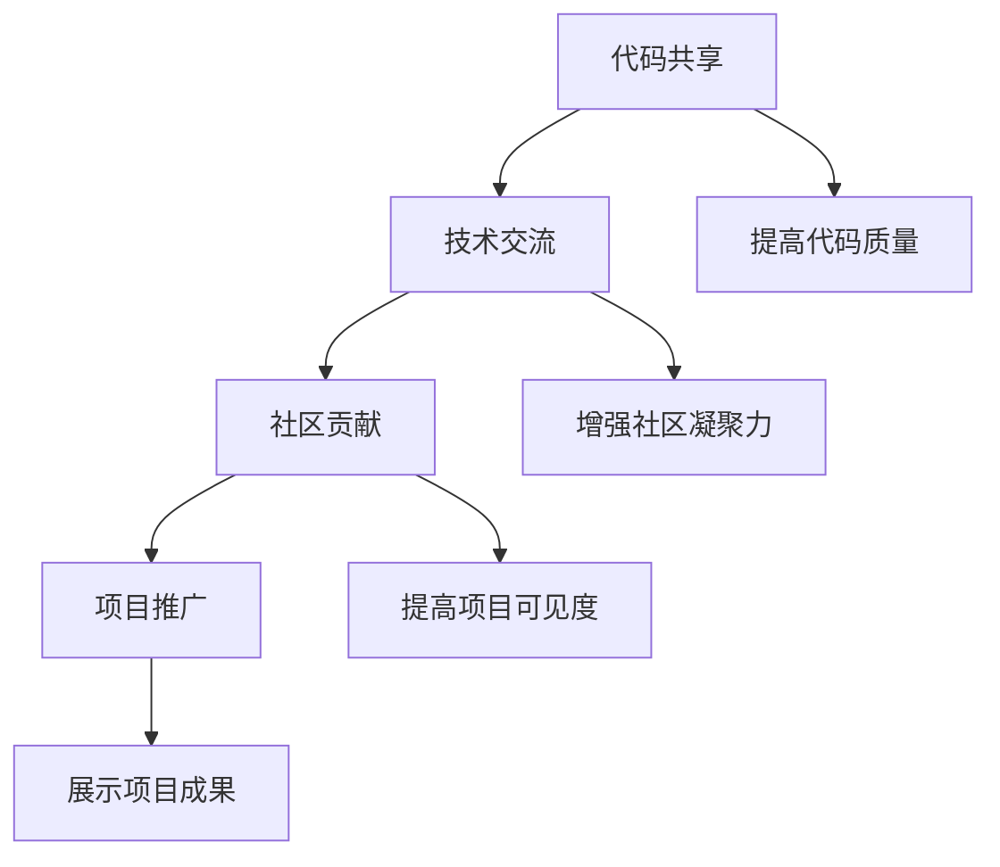

                 

# 程序员如何利用开源社区加速产品开发和推广

> 关键词：开源社区, 产品开发, 代码共享, 技术交流, 社区贡献, 项目推广, 开源文化

> 摘要：开源社区是程序员的宝贵资源，它不仅提供了丰富的代码库和工具，还促进了技术交流和协作。本文将深入探讨程序员如何利用开源社区加速产品开发和推广，从背景介绍、核心概念与联系、核心算法原理与具体操作步骤、项目实战案例、实际应用场景、工具和资源推荐，到未来发展趋势与挑战，为程序员提供全面的指导。

## 1. 背景介绍

开源社区是一个由全球程序员共同维护和发展的平台，它不仅提供了大量的代码库和工具，还促进了技术交流和协作。开源社区的核心理念是共享和协作，这使得程序员能够快速获取和使用高质量的代码，从而加速产品开发和推广。开源社区的繁荣发展得益于其独特的文化和机制，包括代码共享、技术交流、社区贡献和项目推广等。

## 2. 核心概念与联系

### 2.1 开源社区的核心概念

- **代码共享**：开源社区鼓励程序员共享自己的代码，这不仅促进了技术交流，还提高了代码的质量和可靠性。
- **技术交流**：开源社区提供了丰富的技术交流平台，包括论坛、邮件列表、社交媒体等，程序员可以在这里分享经验、解决问题和获取帮助。
- **社区贡献**：开源社区鼓励程序员贡献自己的代码和知识，这不仅提高了社区的质量，还增强了社区的凝聚力。
- **项目推广**：开源社区提供了多种项目推广渠道，包括博客、社交媒体、技术会议等，程序员可以在这里展示自己的项目和成果。

### 2.2 核心概念的Mermaid流程图

## 3. 核心算法原理 & 具体操作步骤

### 3.1 代码共享的原理

代码共享的核心原理是通过共享代码库和工具，程序员可以快速获取和使用高质量的代码，从而加速产品开发和推广。代码共享的实现方式包括：

- **版本控制系统**：使用Git等版本控制系统管理代码，确保代码的版本管理和协作。
- **代码托管平台**：使用GitHub、GitLab等代码托管平台，方便程序员管理和分享代码。
- **代码审查机制**：通过代码审查机制，确保代码的质量和可靠性。

### 3.2 技术交流的具体操作步骤

技术交流的具体操作步骤包括：

- **参与论坛和邮件列表**：加入开源社区的论坛和邮件列表，积极参与讨论和技术交流。
- **分享经验和技术**：分享自己的经验和技术，帮助其他程序员解决问题。
- **寻求帮助和反馈**：在遇到问题时，及时寻求帮助和反馈，提高解决问题的效率。

### 3.3 社区贡献的具体操作步骤

社区贡献的具体操作步骤包括：

- **学习和理解代码**：学习和理解开源项目的代码，了解其架构和设计。
- **提出改进意见**：提出改进意见和建议，帮助开源项目改进和优化。
- **提交代码和文档**：提交代码和文档，为开源项目做出贡献。

### 3.4 项目推广的具体操作步骤

项目推广的具体操作步骤包括：

- **撰写博客和技术文章**：撰写博客和技术文章，展示项目的特性和优势。
- **参与技术会议和活动**：参与技术会议和活动，展示项目的成果和应用。
- **利用社交媒体和博客平台**：利用社交媒体和博客平台，扩大项目的影响力和知名度。

## 4. 数学模型和公式 & 详细讲解 & 举例说明

### 4.1 代码共享的数学模型

代码共享的数学模型可以表示为：

$$
\text{代码共享} = \text{代码库} + \text{版本控制系统} + \text{代码托管平台}
$$

其中，代码库是代码共享的基础，版本控制系统和代码托管平台是代码共享的关键工具。

### 4.2 技术交流的数学模型

技术交流的数学模型可以表示为：

$$
\text{技术交流} = \text{论坛} + \text{邮件列表} + \text{社交媒体}
$$

其中，论坛、邮件列表和社交媒体是技术交流的主要平台。

### 4.3 社区贡献的数学模型

社区贡献的数学模型可以表示为：

$$
\text{社区贡献} = \text{学习和理解代码} + \text{提出改进意见} + \text{提交代码和文档}
$$

其中，学习和理解代码、提出改进意见和提交代码和文档是社区贡献的关键步骤。

### 4.4 项目推广的数学模型

项目推广的数学模型可以表示为：

$$
\text{项目推广} = \text{撰写博客和技术文章} + \text{参与技术会议和活动} + \text{利用社交媒体和博客平台}
$$

其中，撰写博客和技术文章、参与技术会议和活动以及利用社交媒体和博客平台是项目推广的关键步骤。

## 5. 项目实战：代码实际案例和详细解释说明

### 5.1 开发环境搭建

开发环境搭建的具体步骤包括：

1. **安装Git**：安装Git版本控制系统，确保代码的版本管理和协作。
2. **创建GitHub账号**：创建GitHub账号，方便管理和分享代码。
3. **克隆代码库**：使用Git命令克隆代码库，获取代码和文档。
4. **配置开发环境**：配置开发环境，确保代码的编译和运行。

### 5.2 源代码详细实现和代码解读

源代码详细实现的具体步骤包括：

1. **编写代码**：编写代码，实现项目的功能和特性。
2. **编写文档**：编写文档，记录代码的功能和使用方法。
3. **提交代码**：提交代码和文档，为开源项目做出贡献。

代码解读的具体步骤包括：

1. **阅读代码**：阅读代码，理解代码的功能和实现方式。
2. **分析代码**：分析代码，找出代码的优点和不足。
3. **改进代码**：改进代码，提高代码的质量和可靠性。

### 5.3 代码解读与分析

代码解读与分析的具体步骤包括：

1. **阅读代码**：阅读代码，理解代码的功能和实现方式。
2. **分析代码**：分析代码，找出代码的优点和不足。
3. **改进代码**：改进代码，提高代码的质量和可靠性。

## 6. 实际应用场景

### 6.1 代码共享的应用场景

代码共享的应用场景包括：

- **快速获取和使用高质量的代码**：通过代码共享，程序员可以快速获取和使用高质量的代码，从而加速产品开发和推广。
- **提高代码质量和可靠性**：通过代码共享，程序员可以提高代码的质量和可靠性，从而提高产品的质量和稳定性。

### 6.2 技术交流的应用场景

技术交流的应用场景包括：

- **分享经验和技术**：通过技术交流，程序员可以分享经验和技术，帮助其他程序员解决问题。
- **获取帮助和反馈**：通过技术交流，程序员可以获取帮助和反馈，提高解决问题的效率。

### 6.3 社区贡献的应用场景

社区贡献的应用场景包括：

- **提高社区质量**：通过社区贡献，程序员可以提高社区的质量，从而提高社区的凝聚力和影响力。
- **展示项目成果**：通过社区贡献，程序员可以展示项目的成果和应用，从而提高项目的知名度和影响力。

### 6.4 项目推广的应用场景

项目推广的应用场景包括：

- **扩大项目影响力**：通过项目推广，程序员可以扩大项目的影响力和知名度，从而提高项目的关注度和用户量。
- **展示项目成果**：通过项目推广，程序员可以展示项目的成果和应用，从而提高项目的知名度和影响力。

## 7. 工具和资源推荐

### 7.1 学习资源推荐

- **书籍**：《代码大全》、《重构：改善既有代码的设计》、《设计模式：可复用面向对象软件的基础》
- **论文**：《开源软件的贡献者动机研究》、《开源软件的社区结构分析》
- **博客**：GitHub官方博客、Stack Overflow、Medium
- **网站**：GitHub、GitLab、Stack Overflow

### 7.2 开发工具框架推荐

- **版本控制系统**：Git、SVN
- **代码托管平台**：GitHub、GitLab、Bitbucket
- **代码审查工具**：Phabricator、Gerrit
- **代码分析工具**：SonarQube、Coverity

### 7.3 相关论文著作推荐

- **论文**：《开源软件的贡献者动机研究》、《开源软件的社区结构分析》
- **著作**：《代码大全》、《重构：改善既有代码的设计》、《设计模式：可复用面向对象软件的基础》

## 8. 总结：未来发展趋势与挑战

### 8.1 未来发展趋势

开源社区的发展趋势包括：

- **代码共享的普及**：代码共享将成为程序员的必备技能，代码共享的普及将加速产品开发和推广。
- **技术交流的繁荣**：技术交流将成为程序员的重要活动，技术交流的繁荣将促进技术进步和创新。
- **社区贡献的增加**：社区贡献将成为程序员的重要贡献方式，社区贡献的增加将提高社区的质量和影响力。
- **项目推广的多样化**：项目推广将更加多样化，包括博客、社交媒体、技术会议等，项目推广的多样化将提高项目的知名度和影响力。

### 8.2 挑战

开源社区面临的挑战包括：

- **代码质量的保证**：代码质量的保证是开源社区面临的挑战之一，如何保证代码的质量和可靠性是一个重要的问题。
- **社区管理的挑战**：社区管理是开源社区面临的挑战之一，如何管理社区的规模和质量是一个重要的问题。
- **项目推广的挑战**：项目推广是开源社区面临的挑战之一，如何扩大项目的影响力和知名度是一个重要的问题。

## 9. 附录：常见问题与解答

### 9.1 问题1：如何提高代码的质量和可靠性？

**解答**：提高代码的质量和可靠性的方法包括：

- **编写高质量的代码**：编写高质量的代码，确保代码的可读性和可维护性。
- **进行代码审查**：进行代码审查，确保代码的质量和可靠性。
- **使用代码分析工具**：使用代码分析工具，发现代码的缺陷和问题。

### 9.2 问题2：如何管理社区的规模和质量？

**解答**：管理社区的规模和质量的方法包括：

- **制定社区规则**：制定社区规则，确保社区的秩序和规范。
- **进行社区管理**：进行社区管理，确保社区的规模和质量。
- **进行社区培训**：进行社区培训，提高社区成员的素质和能力。

### 9.3 问题3：如何扩大项目的影响力和知名度？

**解答**：扩大项目的影响力和知名度的方法包括：

- **撰写博客和技术文章**：撰写博客和技术文章，展示项目的特性和优势。
- **参与技术会议和活动**：参与技术会议和活动，展示项目的成果和应用。
- **利用社交媒体和博客平台**：利用社交媒体和博客平台，扩大项目的影响力和知名度。

## 10. 扩展阅读 & 参考资料

### 10.1 扩展阅读

- **书籍**：《代码大全》、《重构：改善既有代码的设计》、《设计模式：可复用面向对象软件的基础》
- **论文**：《开源软件的贡献者动机研究》、《开源软件的社区结构分析》
- **博客**：GitHub官方博客、Stack Overflow、Medium
- **网站**：GitHub、GitLab、Stack Overflow

### 10.2 参考资料

- **书籍**：《代码大全》、《重构：改善既有代码的设计》、《设计模式：可复用面向对象软件的基础》
- **论文**：《开源软件的贡献者动机研究》、《开源软件的社区结构分析》
- **博客**：GitHub官方博客、Stack Overflow、Medium
- **网站**：GitHub、GitLab、Stack Overflow

---

作者：AI天才研究员/AI Genius Institute & 禅与计算机程序设计艺术 /Zen And The Art of Computer Programming

