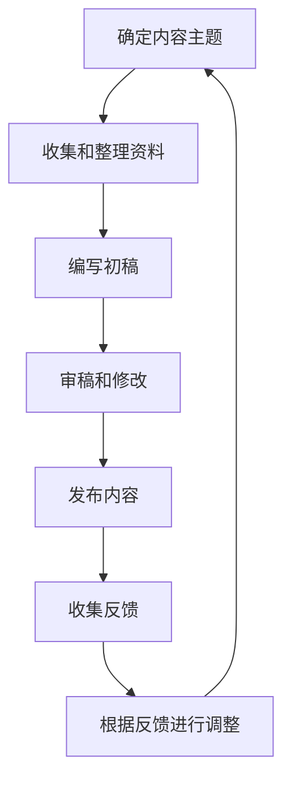

                 

# 程序员如何进行知识付费的内容更新

> 关键词：知识付费、内容更新、程序员、技术博客、知识分享、持续学习、内容创作

> 摘要：在当今快速变化的技术领域，程序员需要不断更新自己的知识库以保持竞争力。本文将探讨如何进行知识付费的内容更新，包括如何选择合适的内容主题、如何构建高质量的内容、如何利用技术工具进行内容创作和发布，以及如何通过持续学习和反馈机制来提升内容质量。通过本文，程序员可以更好地掌握知识付费内容更新的技巧，从而在技术社区中建立自己的影响力。

## 1. 背景介绍

随着互联网技术的快速发展，程序员面临着前所未有的挑战和机遇。一方面，新技术层出不穷，程序员需要不断学习新的知识和技术；另一方面，技术社区的规模不断扩大，程序员可以通过分享自己的知识和经验来获得认可和收益。知识付费作为一种新兴的商业模式，为程序员提供了新的机会。通过撰写高质量的技术博客、撰写书籍、开设在线课程等方式，程序员可以将自己的知识和经验转化为经济收益，同时也帮助他人解决问题，实现双赢。

## 2. 核心概念与联系

### 2.1 知识付费的概念

知识付费是指通过提供高质量的知识内容来获取经济收益的一种商业模式。这种模式的核心在于内容的质量和价值，只有提供有价值的知识内容，才能吸引并留住付费用户。

### 2.2 内容更新的重要性

内容更新是指定期更新和维护已有的知识内容，以确保其时效性和准确性。对于程序员来说，内容更新的重要性体现在以下几个方面：

- **保持竞争力**：技术领域变化迅速，不更新内容会导致知识过时，影响竞争力。
- **增强用户粘性**：定期更新内容可以吸引用户持续关注，提高用户粘性。
- **提升影响力**：高质量的内容更新可以提升个人或团队的影响力，吸引更多用户和合作伙伴。

### 2.3 内容更新的流程图

## 3. 核心算法原理 & 具体操作步骤

### 3.1 确定内容主题

确定内容主题是内容更新的第一步。程序员需要根据自己的专长和市场需求来选择合适的内容主题。具体操作步骤如下：

1. **分析市场需求**：通过调研和分析，了解当前技术领域的热门话题和用户需求。
2. **评估个人专长**：根据自己的技术专长和兴趣，选择自己擅长且有研究深度的内容主题。
3. **确定目标受众**：明确目标受众，以便更好地满足他们的需求。

### 3.2 收集和整理资料

收集和整理资料是内容更新的重要环节。具体操作步骤如下：

1. **查找权威资料**：通过阅读专业书籍、学术论文、官方文档等权威资料，获取最新的技术信息。
2. **整理资料**：将收集到的资料进行分类整理，确保资料的完整性和准确性。
3. **筛选和提炼**：根据内容主题，筛选出与主题相关的资料，并提炼出关键信息。

### 3.3 编写初稿

编写初稿是内容更新的核心环节。具体操作步骤如下：

1. **制定大纲**：根据内容主题和资料整理情况，制定详细的大纲，确保内容结构清晰。
2. **撰写初稿**：按照大纲进行撰写，注意语言表达的准确性和逻辑性。
3. **初步审稿**：完成初稿后，进行初步审稿，检查内容的完整性和准确性。

### 3.4 审稿和修改

审稿和修改是确保内容质量的重要环节。具体操作步骤如下：

1. **邀请同行审稿**：邀请同行或专家进行审稿，获取专业意见。
2. **修改和完善**：根据审稿意见进行修改和完善，确保内容的准确性和完整性。
3. **再次审稿**：完成修改后，再次进行审稿，确保内容无误。

### 3.5 发布内容

发布内容是内容更新的最后一步。具体操作步骤如下：

1. **选择发布平台**：根据内容类型和目标受众，选择合适的发布平台，如博客、社交媒体、在线课程平台等。
2. **优化内容格式**：根据发布平台的要求，优化内容格式，如添加图片、代码示例等。
3. **发布内容**：完成优化后，发布内容，并设置合理的访问权限。

## 4. 数学模型和公式 & 详细讲解 & 举例说明

### 4.1 内容质量评估模型

为了评估内容的质量，可以建立一个内容质量评估模型。具体公式如下：

$$
Q = \frac{V + C + A}{3}
$$

其中：
- $Q$ 表示内容质量评分。
- $V$ 表示内容的价值，取值范围为 0 到 100。
- $C$ 表示内容的清晰度，取值范围为 0 到 100。
- $A$ 表示内容的准确性，取值范围为 0 到 100。

### 4.2 举例说明

假设某篇技术博客的内容价值评分为 85，清晰度评分为 90，准确性评分为 95，则该篇博客的内容质量评分为：

$$
Q = \frac{85 + 90 + 95}{3} = 90
$$

## 5. 项目实战：代码实际案例和详细解释说明

### 5.1 开发环境搭建

为了进行知识付费的内容更新，程序员需要搭建一个合适的开发环境。具体步骤如下：

1. **选择开发工具**：根据个人喜好和需求，选择合适的开发工具，如代码编辑器、版本控制系统等。
2. **配置开发环境**：根据开发工具的要求，配置开发环境，确保开发工具能够正常运行。
3. **安装必要的软件**：根据内容更新的需求，安装必要的软件，如博客平台的客户端、在线课程平台的客户端等。

### 5.2 源代码详细实现和代码解读

以撰写技术博客为例，具体实现步骤如下：

1. **创建博客文章**：在博客平台上创建新的博客文章，填写文章标题、摘要等信息。
2. **编写博客内容**：根据内容主题和资料整理情况，编写博客内容。注意使用清晰的标题、段落和代码示例，提高可读性。
3. **添加图片和代码示例**：根据需要，添加相关的图片和代码示例，增强内容的直观性和实用性。

### 5.3 代码解读与分析

以一篇技术博客为例，进行代码解读和分析。假设博客内容涉及 Python 编程语言，具体步骤如下：

1. **阅读代码**：阅读博客中的代码示例，理解代码的功能和实现方式。
2. **分析代码逻辑**：分析代码的逻辑结构，理解代码的执行流程。
3. **总结代码要点**：总结代码的关键要点，帮助读者更好地理解和应用代码。

## 6. 实际应用场景

知识付费的内容更新在实际应用场景中具有广泛的应用。具体应用场景包括：

- **技术博客**：通过撰写技术博客，分享自己的技术经验和知识，吸引读者关注并获取经济收益。
- **在线课程**：通过开设在线课程，教授特定的技术知识，吸引学员付费学习。
- **技术书籍**：通过撰写技术书籍，系统地介绍特定的技术领域，吸引读者购买并获取经济收益。

## 7. 工具和资源推荐

### 7.1 学习资源推荐

- **书籍**：《程序员修炼之道》、《代码大全》、《重构：改善既有代码的设计》等。
- **论文**：《软件工程原理》、《计算机网络》等。
- **博客**：Medium、CSDN、GitHub 等。
- **网站**：Stack Overflow、GitHub、GitHub Education 等。

### 7.2 开发工具框架推荐

- **代码编辑器**：Visual Studio Code、Sublime Text、Atom 等。
- **版本控制系统**：Git、GitHub、GitLab 等。
- **博客平台**：Medium、CSDN、GitHub Blog 等。
- **在线课程平台**：Coursera、Udemy、edX 等。

### 7.3 相关论文著作推荐

- **书籍**：《程序员修炼之道》、《重构：改善既有代码的设计》、《代码大全》等。
- **论文**：《软件工程原理》、《计算机网络》等。

## 8. 总结：未来发展趋势与挑战

### 8.1 未来发展趋势

随着技术的不断发展，知识付费的内容更新将呈现出以下几个发展趋势：

- **内容形式多样化**：除了传统的文字内容，视频、音频等形式的内容将更加丰富。
- **个性化推荐**：通过大数据和人工智能技术，实现个性化内容推荐，提高用户体验。
- **互动性增强**：通过在线问答、直播等形式，增强内容的互动性和实时性。

### 8.2 面临的挑战

知识付费的内容更新也面临着一些挑战：

- **内容更新难度**：技术领域变化迅速，内容更新难度较大。
- **用户粘性问题**：如何保持用户粘性，提高用户活跃度是一个挑战。
- **版权保护问题**：如何保护自己的知识产权，防止内容被盗用是一个挑战。

## 9. 附录：常见问题与解答

### 9.1 问题：如何选择合适的内容主题？

**解答**：选择内容主题时，可以参考以下几个方面：

- **市场需求**：通过调研和分析，了解当前技术领域的热门话题和用户需求。
- **个人专长**：根据自己的技术专长和兴趣，选择自己擅长且有研究深度的内容主题。
- **目标受众**：明确目标受众，以便更好地满足他们的需求。

### 9.2 问题：如何提高内容质量？

**解答**：提高内容质量可以从以下几个方面入手：

- **收集权威资料**：通过阅读专业书籍、学术论文、官方文档等权威资料，获取最新的技术信息。
- **整理资料**：将收集到的资料进行分类整理，确保资料的完整性和准确性。
- **筛选和提炼**：根据内容主题，筛选出与主题相关的资料，并提炼出关键信息。
- **审稿和修改**：邀请同行或专家进行审稿，获取专业意见，并根据意见进行修改和完善。

## 10. 扩展阅读 & 参考资料

- **书籍**：《程序员修炼之道》、《重构：改善既有代码的设计》、《代码大全》等。
- **论文**：《软件工程原理》、《计算机网络》等。
- **网站**：Medium、CSDN、GitHub 等。
- **博客**：Medium、CSDN、GitHub Blog 等。
- **在线课程平台**：Coursera、Udemy、edX 等。

---

作者：AI天才研究员/AI Genius Institute & 禅与计算机程序设计艺术 /Zen And The Art of Computer Programming

