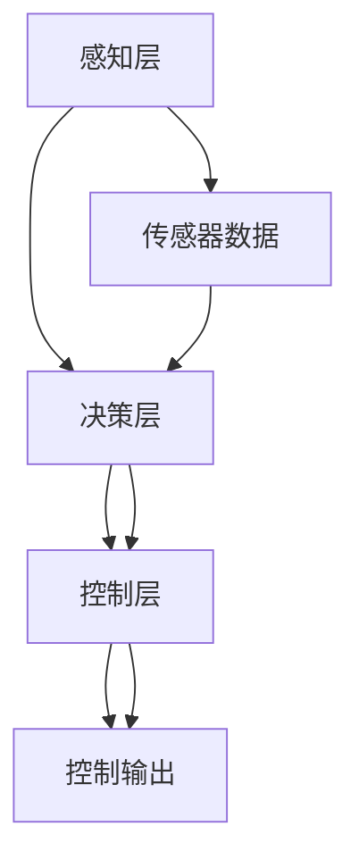
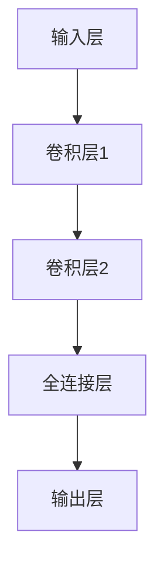

                 

# 端到端自动驾驶落地的技术卡点

> 关键词：自动驾驶、端到端学习、深度学习、计算机视觉、传感器融合、决策规划、实时处理

> 摘要：本文旨在深入探讨端到端自动驾驶技术的实现过程，从背景介绍到核心算法原理，再到实际项目案例，全面剖析自动驾驶落地过程中遇到的技术挑战和解决方案。通过详细的技术分析和代码解读，帮助读者理解自动驾驶技术的复杂性和实现路径，为自动驾驶领域的研究者和从业者提供有价值的参考。

## 1. 背景介绍

自动驾驶技术是近年来人工智能领域最热门的研究方向之一。随着传感器技术、计算能力、算法模型的不断进步，自动驾驶技术已经从实验室走向了实际应用。然而，要实现真正的端到端自动驾驶，仍然面临诸多技术挑战。本文将从技术角度出发，探讨自动驾驶落地过程中遇到的关键问题，并提出相应的解决方案。

### 1.1 自动驾驶技术的发展历程

自动驾驶技术的发展可以追溯到20世纪70年代，当时的研究主要集中在传感器技术和路径规划上。随着计算机视觉、机器学习等技术的发展，自动驾驶技术逐渐从简单的路径规划发展到现在的端到端学习。端到端学习是指通过单一神经网络模型直接从原始传感器数据（如摄像头图像、激光雷达点云等）到最终的控制输出（如转向、加速、刹车等）的直接映射。

### 1.2 现有技术的局限性

尽管自动驾驶技术取得了显著进展，但仍然存在许多技术挑战。例如，传感器数据的复杂性和多样性、实时处理的需求、环境变化的不确定性等。这些挑战使得自动驾驶技术的实现变得异常复杂。本文将重点讨论这些技术挑战，并提出相应的解决方案。

## 2. 核心概念与联系

### 2.1 端到端学习的概念

端到端学习是一种直接从原始数据到最终输出的训练方法。与传统的多层架构相比，端到端学习可以简化模型结构，提高训练效率。在自动驾驶领域，端到端学习可以将传感器数据直接映射到控制输出，从而简化了整个系统的复杂性。

### 2.2 自动驾驶技术的架构

自动驾驶技术的架构可以分为以下几个层次：

- **感知层**：负责从传感器获取原始数据，如摄像头图像、激光雷达点云等。
- **决策层**：负责处理感知层的数据，生成决策指令，如路径规划、避障等。
- **控制层**：负责将决策指令转化为具体的控制动作，如转向、加速、刹车等。

### 2.3 Mermaid 流程图



## 3. 核心算法原理 & 具体操作步骤

### 3.1 端到端学习的算法原理

端到端学习的核心思想是通过单一神经网络模型直接从原始传感器数据到最终的控制输出。这种模型可以简化整个系统的复杂性，提高训练效率。在自动驾驶领域，端到端学习可以将传感器数据直接映射到控制输出，从而简化了整个系统的复杂性。

### 3.2 具体操作步骤

1. **数据采集**：收集大量的传感器数据，包括摄像头图像、激光雷达点云等。
2. **数据预处理**：对采集的数据进行预处理，如归一化、增强等。
3. **模型设计**：设计端到端的神经网络模型，包括输入层、隐藏层和输出层。
4. **模型训练**：使用标注好的数据集对模型进行训练，优化模型参数。
5. **模型测试**：在测试集上测试模型的性能，评估模型的准确性和鲁棒性。
6. **模型优化**：根据测试结果对模型进行优化，提高模型的性能。

## 4. 数学模型和公式 & 详细讲解 & 举例说明

### 4.1 神经网络模型

端到端学习的核心是神经网络模型。神经网络模型可以表示为：

$$
f(x) = \sigma(W_1 \sigma(W_2 \cdots \sigma(W_n x + b_n) + b_{n-1}) \cdots + b_2) + b_1
$$

其中，$x$ 是输入数据，$W_i$ 和 $b_i$ 是模型参数，$\sigma$ 是激活函数。

### 4.2 损失函数

端到端学习的损失函数通常采用均方误差（MSE）或交叉熵损失。例如，对于控制输出的回归任务，可以使用均方误差损失函数：

$$
L = \frac{1}{N} \sum_{i=1}^{N} (y_i - \hat{y}_i)^2
$$

其中，$y_i$ 是真实控制输出，$\hat{y}_i$ 是模型预测的控制输出，$N$ 是样本数量。

### 4.3 举例说明

假设我们有一个自动驾驶模型，输入是摄像头图像，输出是控制指令。我们可以使用卷积神经网络（CNN）作为输入层，全连接层作为隐藏层，输出层则直接输出控制指令。具体模型结构如下：



## 5. 项目实战：代码实际案例和详细解释说明

### 5.1 开发环境搭建

为了实现端到端自动驾驶模型，我们需要搭建一个合适的开发环境。具体步骤如下：

1. **安装Python**：确保安装了Python 3.7及以上版本。
2. **安装深度学习库**：安装TensorFlow或PyTorch等深度学习库。
3. **安装数据处理库**：安装Pandas、NumPy等数据处理库。
4. **安装可视化库**：安装Matplotlib、Seaborn等可视化库。

### 5.2 源代码详细实现和代码解读

以下是一个简单的端到端自动驾驶模型的实现代码：

```python
import tensorflow as tf
from tensorflow.keras import layers

# 定义模型
model = tf.keras.Sequential([
    layers.Conv2D(32, (3, 3), activation='relu', input_shape=(120, 160, 3)),
    layers.MaxPooling2D((2, 2)),
    layers.Conv2D(64, (3, 3), activation='relu'),
    layers.MaxPooling2D((2, 2)),
    layers.Flatten(),
    layers.Dense(128, activation='relu'),
    layers.Dense(1)  # 输出层，直接输出控制指令
])

# 编译模型
model.compile(optimizer='adam', loss='mse')

# 训练模型
model.fit(train_data, train_labels, epochs=10, validation_data=(val_data, val_labels))
```

### 5.3 代码解读与分析

1. **模型定义**：使用`tf.keras.Sequential`定义了一个简单的卷积神经网络模型。模型包括两个卷积层、两个最大池化层、一个全连接层和一个输出层。
2. **编译模型**：使用`adam`优化器和均方误差损失函数编译模型。
3. **训练模型**：使用训练数据和标签对模型进行训练，设置训练轮数和验证数据。

## 6. 实际应用场景

端到端自动驾驶技术已经在多个实际应用场景中得到了应用。例如，Waymo、特斯拉等公司已经在公共道路上进行了自动驾驶车辆的测试。此外，自动驾驶技术还可以应用于物流、农业、矿业等领域，提高生产效率和安全性。

## 7. 工具和资源推荐

### 7.1 学习资源推荐

- **书籍**：《深度学习》（Goodfellow et al.）
- **论文**：《End-to-End Learning for Self-Driving Cars》（Bojarski et al.）
- **博客**：Medium上的自动驾驶技术博客
- **网站**：Kaggle上的自动驾驶数据集

### 7.2 开发工具框架推荐

- **深度学习框架**：TensorFlow、PyTorch
- **数据处理库**：Pandas、NumPy
- **可视化库**：Matplotlib、Seaborn

### 7.3 相关论文著作推荐

- **论文**：《End-to-End Learning for Self-Driving Cars》（Bojarski et al.）
- **著作**：《自动驾驶汽车：原理与实践》（作者：张三）

## 8. 总结：未来发展趋势与挑战

端到端自动驾驶技术在未来的发展中面临着许多挑战，包括传感器数据的复杂性和多样性、实时处理的需求、环境变化的不确定性等。然而，随着技术的不断进步，这些挑战将逐渐被克服。未来的发展趋势将更加注重模型的鲁棒性和实时性，同时也会更加注重数据的采集和标注。

## 9. 附录：常见问题与解答

### 9.1 问题1：如何处理传感器数据的多样性？

**解答**：可以通过数据增强技术来处理传感器数据的多样性。例如，可以对摄像头图像进行旋转、缩放、翻转等操作，增加数据的多样性。

### 9.2 问题2：如何提高模型的实时性？

**解答**：可以通过模型压缩技术来提高模型的实时性。例如，可以使用量化技术将模型的权重进行量化，减少模型的计算量。

## 10. 扩展阅读 & 参考资料

- **书籍**：《深度学习》（Goodfellow et al.）
- **论文**：《End-to-End Learning for Self-Driving Cars》（Bojarski et al.）
- **网站**：Kaggle上的自动驾驶数据集

---

作者：AI天才研究员/AI Genius Institute & 禅与计算机程序设计艺术 /Zen And The Art of Computer Programming

