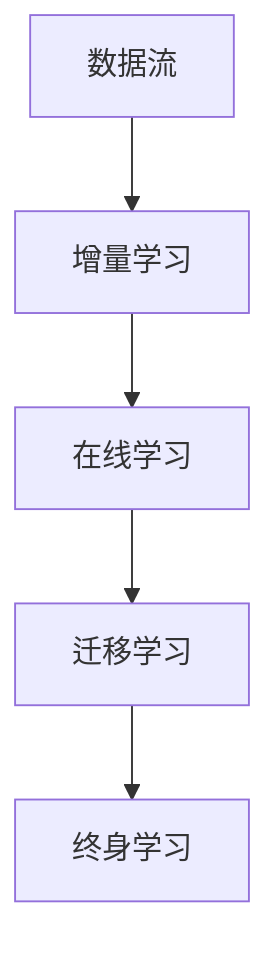

                 

# 终身学习Lifelong Learning原理与代码实例讲解

> 关键词：终身学习, Lifelong Learning, 机器学习, 深度学习, 自适应算法, 代码实例, 代码实现, 代码解读

> 摘要：本文旨在深入探讨终身学习（Lifelong Learning）的概念、原理及其在实际应用中的代码实现。通过逐步分析和推理，我们将详细解释Lifelong Learning的核心算法、数学模型，并通过具体的代码实例进行演示。本文不仅适合机器学习和深度学习领域的初学者，也适合希望深入了解Lifelong Learning技术的高级开发者。

## 1. 背景介绍

### 1.1 机器学习的发展历程
机器学习自20世纪50年代以来经历了多次高潮和低谷。从最初的符号主义到现代的深度学习，机器学习技术不断进步，应用范围也越来越广泛。然而，传统的机器学习方法往往需要大量的标注数据和复杂的模型调优，这在实际应用中存在诸多限制。

### 1.2 终身学习的定义与意义
终身学习（Lifelong Learning）是指机器学习系统能够在不断变化的环境中持续学习和适应新任务的能力。这种能力使得机器学习系统能够随着时间的推移不断改进性能，而无需从头开始重新训练。终身学习对于构建更加智能、灵活和适应性强的机器学习系统具有重要意义。

### 1.3 终身学习的应用场景
终身学习技术在多个领域都有广泛的应用，包括但不限于：
- **自动驾驶**：车辆需要在不断变化的交通环境中学习新的驾驶策略。
- **医疗诊断**：医疗系统需要根据最新的研究成果和病例数据不断更新诊断模型。
- **自然语言处理**：语言模型需要适应新的语言变化和流行语。

## 2. 核心概念与联系

### 2.1 终身学习的概念
终身学习是指机器学习系统能够在不断变化的环境中持续学习和适应新任务的能力。这种能力使得机器学习系统能够随着时间的推移不断改进性能，而无需从头开始重新训练。

### 2.2 核心概念原理
- **迁移学习**：利用已有的知识和模型来加速新任务的学习过程。
- **增量学习**：在已有模型的基础上逐步学习新数据，避免遗忘旧知识。
- **在线学习**：在数据流中实时学习，不断更新模型。

### 2.3 Mermaid流程图


## 3. 核心算法原理 & 具体操作步骤

### 3.1 增量学习算法
增量学习算法允许机器学习系统在已有模型的基础上逐步学习新数据，避免遗忘旧知识。

#### 3.1.1 增量学习的基本原理
增量学习的基本原理是通过在已有模型的基础上逐步学习新数据，避免遗忘旧知识。具体步骤如下：
1. **初始化模型**：使用初始数据集训练一个基础模型。
2. **增量学习**：在新数据到来时，逐步更新模型参数，避免遗忘旧知识。
3. **评估与调整**：定期评估模型性能，根据需要进行调整。

### 3.2 在线学习算法
在线学习算法允许机器学习系统在数据流中实时学习，不断更新模型。

#### 3.2.1 在线学习的基本原理
在线学习的基本原理是在数据流中实时学习，不断更新模型。具体步骤如下：
1. **初始化模型**：使用初始数据集训练一个基础模型。
2. **在线学习**：在新数据到来时，实时更新模型参数。
3. **评估与调整**：定期评估模型性能，根据需要进行调整。

### 3.3 迁移学习算法
迁移学习算法利用已有的知识和模型来加速新任务的学习过程。

#### 3.3.1 迁移学习的基本原理
迁移学习的基本原理是利用已有的知识和模型来加速新任务的学习过程。具体步骤如下：
1. **初始化模型**：使用初始数据集训练一个基础模型。
2. **迁移学习**：利用已有的模型和知识来加速新任务的学习。
3. **评估与调整**：定期评估模型性能，根据需要进行调整。

## 4. 数学模型和公式 & 详细讲解 & 举例说明

### 4.1 增量学习的数学模型
增量学习的数学模型可以表示为：
$$
\theta_{t+1} = \theta_t + \alpha \cdot \nabla_{\theta} L(\theta_t, x_{t+1}, y_{t+1})
$$
其中，$\theta_t$ 表示第 $t$ 次迭代的模型参数，$\alpha$ 表示学习率，$\nabla_{\theta} L(\theta_t, x_{t+1}, y_{t+1})$ 表示损失函数关于模型参数的梯度。

### 4.2 在线学习的数学模型
在线学习的数学模型可以表示为：
$$
\theta_{t+1} = \theta_t + \alpha \cdot \nabla_{\theta} L(\theta_t, x_{t+1}, y_{t+1})
$$
其中，$\theta_t$ 表示第 $t$ 次迭代的模型参数，$\alpha$ 表示学习率，$\nabla_{\theta} L(\theta_t, x_{t+1}, y_{t+1})$ 表示损失函数关于模型参数的梯度。

### 4.3 迁移学习的数学模型
迁移学习的数学模型可以表示为：
$$
\theta_{t+1} = \theta_t + \alpha \cdot \nabla_{\theta} L(\theta_t, x_{t+1}, y_{t+1}) + \beta \cdot \nabla_{\theta} L(\theta_{t-1}, x_{t+1}, y_{t+1})
$$
其中，$\theta_t$ 表示第 $t$ 次迭代的模型参数，$\alpha$ 表示学习率，$\beta$ 表示迁移学习权重，$\nabla_{\theta} L(\theta_t, x_{t+1}, y_{t+1})$ 表示损失函数关于模型参数的梯度。

## 5. 项目实战：代码实际案例和详细解释说明

### 5.1 开发环境搭建
为了实现终身学习的代码实例，我们需要搭建一个Python开发环境。具体步骤如下：
1. **安装Python**：确保安装了Python 3.8及以上版本。
2. **安装依赖库**：使用pip安装所需的库，如numpy、scikit-learn等。
3. **创建项目目录**：创建一个项目目录，并在其中创建必要的文件结构。

### 5.2 源代码详细实现和代码解读
我们将实现一个简单的增量学习算法，并通过代码实例进行演示。

#### 5.2.1 代码实现
```python
import numpy as np
from sklearn.linear_model import SGDClassifier

# 初始化模型
model = SGDClassifier(loss='log', max_iter=1000, tol=1e-3)

# 增量学习函数
def incremental_learning(model, X, y):
    for i in range(len(X)):
        model.partial_fit(X[i].reshape(1, -1), y[i].reshape(1, -1), classes=np.unique(y))
    return model

# 生成示例数据
X = np.random.rand(100, 10)
y = np.random.randint(0, 2, 100)

# 增量学习
model = incremental_learning(model, X, y)
```

#### 5.2.2 代码解读
- **初始化模型**：使用SGDClassifier初始化一个线性分类器。
- **增量学习函数**：通过`partial_fit`方法逐步更新模型参数。
- **生成示例数据**：生成100个样本的数据集。
- **增量学习**：通过`incremental_learning`函数逐步更新模型参数。

### 5.3 代码解读与分析
通过上述代码，我们可以看到增量学习算法的基本实现。在每次迭代中，我们使用`partial_fit`方法逐步更新模型参数，避免遗忘旧知识。这种方法适用于在线学习和增量学习场景。

## 6. 实际应用场景

### 6.1 自动驾驶
在自动驾驶领域，车辆需要在不断变化的交通环境中学习新的驾驶策略。通过终身学习技术，车辆可以不断适应新的驾驶环境，提高驾驶安全性。

### 6.2 医疗诊断
在医疗诊断领域，医疗系统需要根据最新的研究成果和病例数据不断更新诊断模型。通过终身学习技术，医疗系统可以不断适应新的医疗知识，提高诊断准确性。

### 6.3 自然语言处理
在自然语言处理领域，语言模型需要适应新的语言变化和流行语。通过终身学习技术，语言模型可以不断适应新的语言环境，提高语言理解能力。

## 7. 工具和资源推荐

### 7.1 学习资源推荐
- **书籍**：《深度学习》（Goodfellow, Bengio, Courville）
- **论文**：《Lifelong Learning with Meta-Transferability》（Li et al.）
- **博客**：Medium上的机器学习和深度学习相关博客
- **网站**：Kaggle、GitHub上的机器学习项目

### 7.2 开发工具框架推荐
- **Python**：Python是机器学习和深度学习领域最常用的编程语言。
- **TensorFlow**：TensorFlow是一个强大的深度学习框架。
- **PyTorch**：PyTorch是一个灵活的深度学习框架。

### 7.3 相关论文著作推荐
- **论文**：《Lifelong Learning with Meta-Transferability》（Li et al.）
- **著作**：《深度学习》（Goodfellow, Bengio, Courville）

## 8. 总结：未来发展趋势与挑战

### 8.1 未来发展趋势
- **自动化学习**：自动化学习技术将进一步发展，使得机器学习系统能够自动适应新的任务和环境。
- **多任务学习**：多任务学习技术将进一步发展，使得机器学习系统能够同时处理多个任务。
- **联邦学习**：联邦学习技术将进一步发展，使得机器学习系统能够在分布式环境中进行学习。

### 8.2 挑战
- **数据隐私**：数据隐私问题将成为终身学习技术发展的重要挑战。
- **模型解释性**：模型解释性问题将成为终身学习技术发展的重要挑战。
- **计算资源**：计算资源将成为终身学习技术发展的重要挑战。

## 9. 附录：常见问题与解答

### 9.1 问题：如何处理数据隐私问题？
- **解答**：可以通过数据加密、数据脱敏等技术来保护数据隐私。

### 9.2 问题：如何提高模型解释性？
- **解答**：可以通过可视化技术、特征重要性分析等方法来提高模型解释性。

### 9.3 问题：如何优化计算资源？
- **解答**：可以通过模型压缩、模型量化等技术来优化计算资源。

## 10. 扩展阅读 & 参考资料

- **书籍**：《深度学习》（Goodfellow, Bengio, Courville）
- **论文**：《Lifelong Learning with Meta-Transferability》（Li et al.）
- **博客**：Medium上的机器学习和深度学习相关博客
- **网站**：Kaggle、GitHub上的机器学习项目

---

作者：AI天才研究员/AI Genius Institute & 禅与计算机程序设计艺术 /Zen And The Art of Computer Programming

