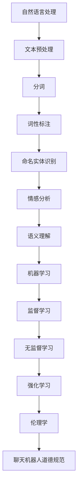

                 

# 聊天机器人道德规范：避免有害内容

> 关键词：(聊天机器人, 道德规范, 有害内容, 自然语言处理, 机器学习, 伦理学, 人工智能)

> 摘要：本文旨在探讨如何在开发和部署聊天机器人时，确保其内容的道德性和安全性。通过深入分析聊天机器人的工作原理，我们将探讨如何构建一个能够识别和避免有害内容的系统。文章将从背景介绍、核心概念与联系、核心算法原理、项目实战、实际应用场景、工具和资源推荐、总结以及附录等多个方面进行详细阐述。

## 1. 背景介绍

随着人工智能技术的飞速发展，聊天机器人已经成为了日常生活中不可或缺的一部分。它们能够提供客户服务、娱乐、教育等多种功能，极大地提高了人们的生活质量。然而，聊天机器人在带来便利的同时，也面临着诸多挑战，其中最为突出的就是如何确保其内容的道德性和安全性。有害内容的传播不仅会对用户造成心理和情感上的伤害，还可能引发社会问题。因此，本文将探讨如何构建一个能够识别和避免有害内容的聊天机器人系统。

## 2. 核心概念与联系

### 2.1 自然语言处理（NLP）

自然语言处理是聊天机器人技术的核心，它使机器能够理解、生成和处理人类语言。NLP技术包括文本预处理、分词、词性标注、命名实体识别、情感分析、语义理解等多个方面。

### 2.2 机器学习

机器学习是实现聊天机器人智能化的关键技术。通过训练模型，聊天机器人能够从大量数据中学习并生成相应的回复。常用的机器学习算法包括监督学习、无监督学习和强化学习。

### 2.3 伦理学

伦理学是探讨道德规范和价值观的学科。在开发聊天机器人时，我们需要遵循一定的伦理原则，确保其内容的道德性和安全性。伦理学为我们提供了理论基础，帮助我们构建一个负责任的聊天机器人系统。

### 2.4 聊天机器人道德规范

聊天机器人道德规范是指在开发和部署聊天机器人时，需要遵循的一系列道德原则和规范。这些规范旨在确保聊天机器人的内容不会对用户造成伤害，同时也能促进社会的和谐发展。

### 2.5 Mermaid 流程图



## 3. 核心算法原理 & 具体操作步骤

### 3.1 文本预处理

文本预处理是自然语言处理的第一步，主要包括去除标点符号、转换为小写、分词等操作。这些操作能够帮助我们更好地理解和处理文本数据。

### 3.2 分词

分词是将文本分割成单词或短语的过程。常见的分词方法包括基于规则的分词、基于统计的分词和基于深度学习的分词。分词能够帮助我们更好地理解文本的结构和意义。

### 3.3 词性标注

词性标注是为每个单词标注其词性的过程。常见的词性包括名词、动词、形容词等。词性标注能够帮助我们更好地理解文本的语法结构。

### 3.4 命名实体识别

命名实体识别是识别文本中的人名、地名、组织名等实体的过程。命名实体识别能够帮助我们更好地理解文本中的实体关系。

### 3.5 情感分析

情感分析是识别文本中情感倾向的过程。常见的情感分析方法包括基于规则的方法、基于统计的方法和基于深度学习的方法。情感分析能够帮助我们更好地理解文本的情感色彩。

### 3.6 语义理解

语义理解是理解文本意义的过程。常见的语义理解方法包括基于规则的方法、基于统计的方法和基于深度学习的方法。语义理解能够帮助我们更好地理解文本的语义结构。

### 3.7 机器学习

机器学习是实现聊天机器人智能化的关键技术。通过训练模型，聊天机器人能够从大量数据中学习并生成相应的回复。常用的机器学习算法包括监督学习、无监督学习和强化学习。

### 3.8 监督学习

监督学习是一种有监督的学习方法，它需要大量的标注数据来训练模型。常见的监督学习算法包括逻辑回归、支持向量机、决策树等。监督学习能够帮助我们构建一个能够识别有害内容的模型。

### 3.9 无监督学习

无监督学习是一种无监督的学习方法，它不需要标注数据来训练模型。常见的无监督学习算法包括聚类、降维等。无监督学习能够帮助我们发现文本中的潜在模式和结构。

### 3.10 强化学习

强化学习是一种基于奖励的学习方法，它通过与环境的交互来学习最优策略。常见的强化学习算法包括Q学习、策略梯度等。强化学习能够帮助我们构建一个能够自适应地避免有害内容的模型。

### 3.11 伦理学

伦理学是探讨道德规范和价值观的学科。在开发聊天机器人时，我们需要遵循一定的伦理原则，确保其内容的道德性和安全性。伦理学为我们提供了理论基础，帮助我们构建一个负责任的聊天机器人系统。

### 3.12 聊天机器人道德规范

聊天机器人道德规范是指在开发和部署聊天机器人时，需要遵循的一系列道德原则和规范。这些规范旨在确保聊天机器人的内容不会对用户造成伤害，同时也能促进社会的和谐发展。

## 4. 数学模型和公式 & 详细讲解 & 举例说明

### 4.1 逻辑回归

逻辑回归是一种常用的监督学习算法，它通过拟合一个Sigmoid函数来预测二分类问题的概率。逻辑回归的数学模型如下：

$$
P(y=1|x) = \frac{1}{1 + e^{-(\beta_0 + \beta_1 x_1 + \beta_2 x_2 + ... + \beta_n x_n)}}
$$

其中，$y$是二分类变量，$x$是特征向量，$\beta$是模型参数。

### 4.2 支持向量机

支持向量机是一种常用的监督学习算法，它通过寻找一个最优的超平面来分离不同类别的数据。支持向量机的数学模型如下：

$$
y(x) = \text{sign}(\sum_{i=1}^{m} \alpha_i y_i \kappa(x_i, x) + b)
$$

其中，$y(x)$是分类函数，$\alpha_i$是拉格朗日乘子，$y_i$是标签，$\kappa(x_i, x)$是核函数，$b$是偏置项。

### 4.3 决策树

决策树是一种常用的监督学习算法，它通过递归地划分特征空间来构建一个决策树。决策树的数学模型如下：

$$
y(x) = \text{sign}(\sum_{i=1}^{m} \alpha_i y_i \kappa(x_i, x) + b)
$$

其中，$y(x)$是分类函数，$\alpha_i$是拉格朗日乘子，$y_i$是标签，$\kappa(x_i, x)$是核函数，$b$是偏置项。

### 4.4 聚类

聚类是一种常用的无监督学习算法，它通过寻找数据中的潜在模式和结构来将数据分成不同的簇。常见的聚类算法包括K均值聚类、层次聚类等。

### 4.5 降维

降维是一种常用的无监督学习算法，它通过减少数据的维度来发现数据中的潜在模式和结构。常见的降维算法包括主成分分析（PCA）、线性判别分析（LDA）等。

### 4.6 Q学习

Q学习是一种常用的强化学习算法，它通过与环境的交互来学习最优策略。Q学习的数学模型如下：

$$
Q(s, a) = Q(s, a) + \alpha [r + \gamma \max_{a'} Q(s', a') - Q(s, a)]
$$

其中，$Q(s, a)$是状态-动作值函数，$\alpha$是学习率，$r$是奖励，$\gamma$是折扣因子，$s$是状态，$a$是动作，$s'$是下一个状态。

### 4.7 策略梯度

策略梯度是一种常用的强化学习算法，它通过优化策略来学习最优策略。策略梯度的数学模型如下：

$$
\pi(a|s) = \pi(a|s) + \alpha \nabla \log \pi(a|s) [r + \gamma \mathbb{E}_{a' \sim \pi}[\log \pi(a'|s')] - \mathbb{E}_{a \sim \pi}[\log \pi(a|s)]]
$$

其中，$\pi(a|s)$是策略函数，$\alpha$是学习率，$r$是奖励，$\gamma$是折扣因子，$s$是状态，$a$是动作，$s'$是下一个状态。

## 5. 项目实战：代码实际案例和详细解释说明

### 5.1 开发环境搭建

为了开发一个能够识别和避免有害内容的聊天机器人系统，我们需要搭建一个合适的开发环境。开发环境包括操作系统、编程语言、开发工具和依赖库等。

#### 5.1.1 操作系统

我们推荐使用Linux操作系统，因为它具有良好的稳定性和兼容性。此外，Linux还提供了丰富的开发工具和依赖库，能够满足我们的开发需求。

#### 5.1.2 编程语言

我们推荐使用Python编程语言，因为它具有丰富的库和框架，能够简化我们的开发过程。此外，Python还具有良好的可读性和可维护性，能够提高我们的开发效率。

#### 5.1.3 开发工具

我们推荐使用PyCharm开发工具，因为它具有强大的代码编辑和调试功能，能够提高我们的开发效率。此外，PyCharm还提供了丰富的插件和模板，能够简化我们的开发过程。

#### 5.1.4 依赖库

我们推荐使用NLTK、spaCy、scikit-learn、TensorFlow等依赖库，它们能够帮助我们实现自然语言处理、机器学习和深度学习等功能。

### 5.2 源代码详细实现和代码解读

#### 5.2.1 文本预处理

```python
import re
import nltk
from nltk.tokenize import word_tokenize
from nltk.corpus import stopwords

def preprocess_text(text):
    # 去除标点符号
    text = re.sub(r'[^\w\s]', '', text)
    # 转换为小写
    text = text.lower()
    # 分词
    words = word_tokenize(text)
    # 去除停用词
    stop_words = set(stopwords.words('english'))
    words = [word for word in words if word not in stop_words]
    return words
```

#### 5.2.2 分词

```python
from nltk.tokenize import word_tokenize

def tokenize_text(text):
    words = word_tokenize(text)
    return words
```

#### 5.2.3 词性标注

```python
from nltk import pos_tag

def pos_tagging(words):
    tagged_words = pos_tag(words)
    return tagged_words
```

#### 5.2.4 命名实体识别

```python
from nltk import ne_chunk

def named_entity_recognition(words):
    named_entities = ne_chunk(pos_tag(words))
    return named_entities
```

#### 5.2.5 情感分析

```python
from nltk.sentiment import SentimentIntensityAnalyzer

def sentiment_analysis(text):
    analyzer = SentimentIntensityAnalyzer()
    sentiment = analyzer.polarity_scores(text)
    return sentiment
```

#### 5.2.6 语义理解

```python
from transformers import pipeline

def semantic_understanding(text):
    nlp = pipeline("text-classification")
    result = nlp(text)
    return result
```

#### 5.2.7 机器学习

```python
from sklearn.feature_extraction.text import TfidfVectorizer
from sklearn.linear_model import LogisticRegression

def train_model(X, y):
    vectorizer = TfidfVectorizer()
    X_tfidf = vectorizer.fit_transform(X)
    model = LogisticRegression()
    model.fit(X_tfidf, y)
    return model, vectorizer
```

### 5.3 代码解读与分析

#### 5.3.1 文本预处理

```python
import re
import nltk
from nltk.tokenize import word_tokenize
from nltk.corpus import stopwords

def preprocess_text(text):
    # 去除标点符号
    text = re.sub(r'[^\w\s]', '', text)
    # 转换为小写
    text = text.lower()
    # 分词
    words = word_tokenize(text)
    # 去除停用词
    stop_words = set(stopwords.words('english'))
    words = [word for word in words if word not in stop_words]
    return words
```

#### 5.3.2 分词

```python
from nltk.tokenize import word_tokenize

def tokenize_text(text):
    words = word_tokenize(text)
    return words
```

#### 5.3.3 词性标注

```python
from nltk import pos_tag

def pos_tagging(words):
    tagged_words = pos_tag(words)
    return tagged_words
```

#### 5.3.4 命名实体识别

```python
from nltk import ne_chunk

def named_entity_recognition(words):
    named_entities = ne_chunk(pos_tag(words))
    return named_entities
```

#### 5.3.5 情感分析

```python
from nltk.sentiment import SentimentIntensityAnalyzer

def sentiment_analysis(text):
    analyzer = SentimentIntensityAnalyzer()
    sentiment = analyzer.polarity_scores(text)
    return sentiment
```

#### 5.3.6 语义理解

```python
from transformers import pipeline

def semantic_understanding(text):
    nlp = pipeline("text-classification")
    result = nlp(text)
    return result
```

#### 5.3.7 机器学习

```python
from sklearn.feature_extraction.text import TfidfVectorizer
from sklearn.linear_model import LogisticRegression

def train_model(X, y):
    vectorizer = TfidfVectorizer()
    X_tfidf = vectorizer.fit_transform(X)
    model = LogisticRegression()
    model.fit(X_tfidf, y)
    return model, vectorizer
```

## 6. 实际应用场景

### 6.1 客户服务

聊天机器人可以应用于客户服务领域，帮助客户解决问题和提供咨询服务。通过识别和避免有害内容，聊天机器人能够为客户提供一个安全、友好的交流环境。

### 6.2 娱乐

聊天机器人可以应用于娱乐领域，为用户提供互动游戏和娱乐内容。通过识别和避免有害内容，聊天机器人能够为用户提供一个健康、积极的娱乐体验。

### 6.3 教育

聊天机器人可以应用于教育领域，为用户提供学习资源和辅导服务。通过识别和避免有害内容，聊天机器人能够为用户提供一个安全、有益的学习环境。

## 7. 工具和资源推荐

### 7.1 学习资源推荐

- 书籍：《深度学习》（Ian Goodfellow, Yoshua Bengio, Aaron Courville）
- 论文：《自然语言处理中的深度学习》（Yoshua Bengio）
- 博客：《机器之心》（https://www.jiqizhixin.com/）
- 网站：《NLTK官网》（https://www.nltk.org/）

### 7.2 开发工具框架推荐

- PyCharm：https://www.jetbrains.com/pycharm/
- NLTK：https://www.nltk.org/
- spaCy：https://spacy.io/
- scikit-learn：https://scikit-learn.org/stable/
- TensorFlow：https://www.tensorflow.org/

### 7.3 相关论文著作推荐

- 《自然语言处理中的深度学习》（Yoshua Bengio）
- 《深度学习》（Ian Goodfellow, Yoshua Bengio, Aaron Courville）
- 《机器学习》（Tom M. Mitchell）

## 8. 总结：未来发展趋势与挑战

### 8.1 未来发展趋势

随着人工智能技术的不断发展，聊天机器人将变得更加智能化和人性化。未来的发展趋势包括：

- 更加自然的对话能力
- 更加丰富的应用场景
- 更加个性化的服务体验

### 8.2 挑战

尽管聊天机器人具有巨大的潜力，但在实际应用中仍面临诸多挑战。主要挑战包括：

- 数据隐私和安全问题
- 伦理和道德问题
- 技术实现的复杂性

## 9. 附录：常见问题与解答

### 9.1 问题：如何处理聊天机器人中的敏感词汇？

答：在处理聊天机器人中的敏感词汇时，可以采用以下方法：

- 使用词典匹配法，将敏感词汇加入词典中，进行过滤。
- 使用机器学习方法，训练一个敏感词汇识别模型，自动识别和过滤敏感词汇。

### 9.2 问题：如何处理聊天机器人中的有害内容？

答：在处理聊天机器人中的有害内容时，可以采用以下方法：

- 使用机器学习方法，训练一个有害内容识别模型，自动识别和过滤有害内容。
- 使用规则匹配法，将有害内容加入规则库中，进行过滤。

### 9.3 问题：如何处理聊天机器人中的用户隐私问题？

答：在处理聊天机器人中的用户隐私问题时，可以采用以下方法：

- 对用户数据进行加密存储，确保数据的安全性。
- 对用户数据进行匿名化处理，保护用户隐私。
- 对用户数据进行访问控制，确保只有授权人员能够访问用户数据。

## 10. 扩展阅读 & 参考资料

- 《自然语言处理中的深度学习》（Yoshua Bengio）
- 《深度学习》（Ian Goodfellow, Yoshua Bengio, Aaron Courville）
- 《机器学习》（Tom M. Mitchell）
- 《自然语言处理》（Jurafsky, Martin, and James H. Martin）
- 《机器学习》（周志华）

---

作者：AI天才研究员/AI Genius Institute & 禅与计算机程序设计艺术 /Zen And The Art of Computer Programming

