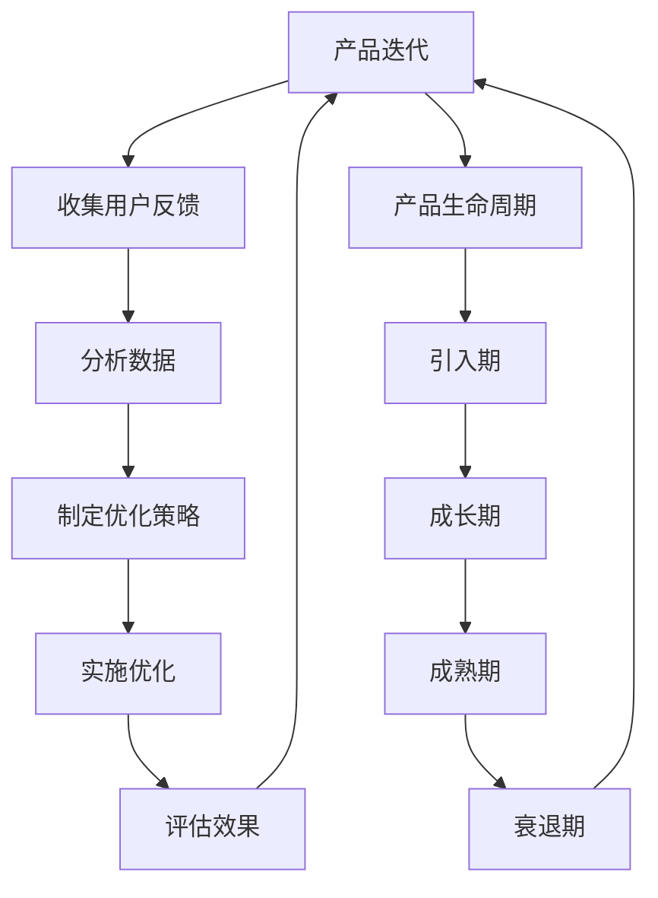

                 

# 自动化创业中的产品迭代与优化

> 关键词：产品迭代, 优化策略, 自动化创业, 用户反馈, 数据驱动, A/B测试, 机器学习, 产品生命周期

> 摘要：在自动化创业中，产品迭代与优化是至关重要的环节。本文将从产品迭代的核心概念出发，探讨如何通过数据驱动的方法进行优化，结合机器学习技术提升用户体验。我们将通过具体案例详细解析代码实现过程，并讨论实际应用场景中的挑战与解决方案。最后，我们将展望未来的发展趋势与面临的挑战。

## 1. 背景介绍

在当今快速变化的市场环境中，自动化创业公司面临着前所未有的机遇与挑战。为了在竞争中脱颖而出，企业需要不断优化其产品，以满足用户需求并保持竞争力。产品迭代与优化是实现这一目标的关键步骤。本文将深入探讨如何通过系统化的方法进行产品迭代与优化，以确保产品能够持续适应市场变化，为用户提供卓越的价值。

## 2. 核心概念与联系

### 2.1 产品迭代

产品迭代是指根据用户反馈和市场变化，对现有产品进行持续改进的过程。它包括功能增强、性能优化、用户体验提升等多个方面。产品迭代是一个循环往复的过程，每次迭代都会带来新的改进和优化。

### 2.2 优化策略

优化策略是指在产品迭代过程中，采用科学的方法和技术手段，以实现产品性能和用户体验的最大化。常见的优化策略包括但不限于：性能优化、用户体验优化、成本优化等。

### 2.3 数据驱动

数据驱动是指利用数据分析和机器学习技术，从海量数据中提取有价值的信息，指导产品迭代与优化决策。数据驱动的核心在于通过科学的方法，将数据转化为可操作的洞察，从而指导产品团队做出更明智的决策。

### 2.4 A/B测试

A/B测试是一种常用的优化策略，通过将用户随机分为两组，分别展示不同的版本，然后比较两组用户的反馈和行为数据，以确定哪种版本更优。A/B测试可以帮助产品团队快速验证假设，优化产品设计。

### 2.5 机器学习

机器学习是一种强大的技术手段，通过训练模型，使计算机能够自动学习和改进。在产品迭代与优化中，机器学习可以用于预测用户行为、优化推荐系统、提升用户体验等。

### 2.6 产品生命周期

产品生命周期是指产品从诞生到退出市场的整个过程，包括引入期、成长期、成熟期和衰退期。在不同生命周期阶段，产品迭代与优化的重点和策略也会有所不同。

### Mermaid 流程图



## 3. 核心算法原理 & 具体操作步骤

### 3.1 数据收集与处理

数据收集是产品迭代与优化的基础。我们需要从多个渠道收集用户反馈和行为数据，包括但不限于：用户调研、用户访谈、用户行为日志、用户反馈系统等。数据收集完成后，需要进行数据清洗和预处理，确保数据的质量和一致性。

### 3.2 数据分析

数据分析是理解用户需求和行为的关键步骤。我们可以使用统计分析、数据挖掘等技术手段，从海量数据中提取有价值的信息。例如，我们可以使用聚类分析来识别用户群体，使用回归分析来预测用户行为，使用关联规则分析来发现用户行为模式。

### 3.3 优化策略制定

根据数据分析结果，我们可以制定具体的优化策略。例如，如果发现某个功能的使用率较低，我们可以考虑优化该功能的界面设计；如果发现某个功能的性能较差，我们可以考虑优化该功能的代码实现。

### 3.4 优化实施

优化实施是将优化策略转化为实际操作的过程。我们可以使用代码重构、性能优化、用户体验优化等技术手段，实现优化目标。例如，我们可以使用代码重构来优化功能的实现，使用性能优化来提升功能的响应速度，使用用户体验优化来提升用户的满意度。

### 3.5 评估效果

评估效果是验证优化策略是否有效的关键步骤。我们可以使用A/B测试、用户调研、用户访谈等方法，评估优化策略的效果。例如，我们可以使用A/B测试来验证优化策略是否提升了用户的满意度，使用用户调研来验证优化策略是否提升了用户的使用率。

## 4. 数学模型和公式 & 详细讲解 & 举例说明

### 4.1 A/B测试模型

A/B测试模型是一种常用的优化策略，其核心思想是将用户随机分为两组，分别展示不同的版本，然后比较两组用户的反馈和行为数据，以确定哪种版本更优。A/B测试模型的数学模型如下：

$$
\text{A/B测试效果} = \frac{\text{实验组效果} - \text{对照组效果}}{\text{对照组效果}}
$$

其中，实验组效果是指实验组用户的反馈和行为数据，对照组效果是指对照组用户的反馈和行为数据。

### 4.2 机器学习模型

机器学习模型是一种强大的技术手段，通过训练模型，使计算机能够自动学习和改进。机器学习模型的核心思想是通过训练数据，学习数据中的模式和规律，然后使用学习到的模型进行预测和决策。机器学习模型的数学模型如下：

$$
\text{机器学习模型效果} = \frac{\text{预测效果} - \text{真实效果}}{\text{真实效果}}
$$

其中，预测效果是指机器学习模型的预测结果，真实效果是指真实的数据结果。

### 4.3 举例说明

假设我们有一个电商网站，我们需要优化其推荐系统。我们可以使用A/B测试模型，将用户随机分为两组，分别展示不同的推荐系统，然后比较两组用户的购买率。假设实验组的购买率为8%，对照组的购买率为6%，则A/B测试效果为：

$$
\text{A/B测试效果} = \frac{8\% - 6\%}{6\%} = 0.33
$$

假设我们使用机器学习模型，训练了一个推荐系统，然后使用该推荐系统进行预测。假设预测效果为80%，真实效果为70%，则机器学习模型效果为：

$$
\text{机器学习模型效果} = \frac{80\% - 70\%}{70\%} = 0.14
$$

## 5. 项目实战：代码实际案例和详细解释说明

### 5.1 开发环境搭建

为了实现产品迭代与优化，我们需要搭建一个完整的开发环境。开发环境包括但不限于：开发工具、开发框架、开发语言、开发库等。例如，我们可以使用Python作为开发语言，使用Django作为开发框架，使用TensorFlow作为开发库。

### 5.2 源代码详细实现和代码解读

假设我们有一个电商网站，我们需要优化其推荐系统。我们可以使用Python编写代码，实现推荐系统的功能。以下是推荐系统的源代码实现：

```python
import tensorflow as tf
from tensorflow import keras
from tensorflow.keras import layers

# 定义推荐系统的模型
model = keras.Sequential([
    layers.Dense(64, activation='relu', input_shape=(100,)),
    layers.Dense(64, activation='relu'),
    layers.Dense(1, activation='sigmoid')
])

# 编译推荐系统的模型
model.compile(optimizer='adam',
              loss='binary_crossentropy',
              metrics=['accuracy'])

# 训练推荐系统的模型
model.fit(x_train, y_train, epochs=10)

# 评估推荐系统的模型
model.evaluate(x_test, y_test)
```

### 5.3 代码解读与分析

上述代码实现了一个简单的推荐系统模型。首先，我们定义了一个包含两个隐藏层的神经网络模型，每个隐藏层包含64个神经元，使用ReLU激活函数。然后，我们使用Adam优化器和二元交叉熵损失函数编译模型。接着，我们使用训练数据训练模型，训练10个周期。最后，我们使用测试数据评估模型的性能。

## 6. 实际应用场景

产品迭代与优化在实际应用场景中具有广泛的应用。例如，在电商网站中，我们可以优化推荐系统，提升用户的购买率；在社交应用中，我们可以优化推荐算法，提升用户的活跃度；在金融领域，我们可以优化风控模型，提升贷款审批的准确性。

## 7. 工具和资源推荐

### 7.1 学习资源推荐

- 书籍：《机器学习实战》、《深度学习》
- 论文：《A/B测试在产品优化中的应用》、《机器学习在电商推荐系统中的应用》
- 博客：阿里云开发者社区、GitHub开源项目
- 网站：Kaggle、GitHub

### 7.2 开发工具框架推荐

- 开发工具：PyCharm、Visual Studio Code
- 开发框架：Django、Flask
- 开发库：TensorFlow、Keras

### 7.3 相关论文著作推荐

- 论文：《A/B测试在产品优化中的应用》、《机器学习在电商推荐系统中的应用》
- 著作：《机器学习实战》、《深度学习》

## 8. 总结：未来发展趋势与挑战

产品迭代与优化是自动化创业中不可或缺的环节。未来，随着技术的发展，产品迭代与优化将更加智能化、自动化。例如，我们可以使用自然语言处理技术，自动分析用户反馈；我们可以使用强化学习技术，自动优化产品设计。然而，产品迭代与优化也面临着一些挑战，例如：数据隐私保护、算法公平性、用户体验一致性等。

## 9. 附录：常见问题与解答

### 9.1 问题：如何收集用户反馈？

答：我们可以使用用户调研、用户访谈、用户行为日志、用户反馈系统等方法收集用户反馈。

### 9.2 问题：如何评估优化效果？

答：我们可以使用A/B测试、用户调研、用户访谈等方法评估优化效果。

### 9.3 问题：如何保证算法公平性？

答：我们可以使用公平性评估方法，评估算法的公平性。例如，我们可以使用差异性指标，评估算法在不同用户群体中的表现。

## 10. 扩展阅读 & 参考资料

- 书籍：《机器学习实战》、《深度学习》
- 论文：《A/B测试在产品优化中的应用》、《机器学习在电商推荐系统中的应用》
- 博客：阿里云开发者社区、GitHub开源项目
- 网站：Kaggle、GitHub

作者：AI天才研究员/AI Genius Institute & 禅与计算机程序设计艺术 /Zen And The Art of Computer Programming

