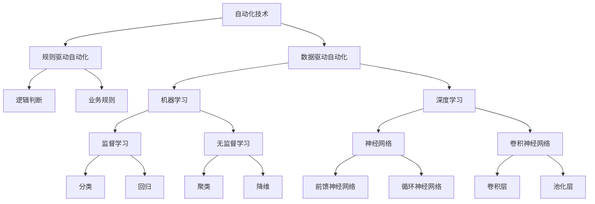

                 

# 自动化的未来：技术与挑战

> 关键词：自动化、人工智能、机器学习、深度学习、自然语言处理、计算机视觉、挑战

> 摘要：本文旨在探讨自动化技术的未来，从技术原理到实际应用，再到面临的挑战。我们将通过逐步分析和推理的方式，深入解析自动化技术的核心概念、算法原理、数学模型、实际案例，并展望未来的发展趋势。本文适合对自动化技术感兴趣的读者，无论是初学者还是专业人士。

## 1. 背景介绍

自动化技术是近年来科技领域最热门的话题之一。随着人工智能、机器学习、深度学习等技术的快速发展，自动化技术的应用范围越来越广泛，从工业生产到日常生活，从医疗健康到金融服务，自动化技术正在改变我们的世界。本文将从技术原理、实际应用和未来挑战三个方面，全面探讨自动化技术的未来。

## 2. 核心概念与联系

### 2.1 自动化技术概述

自动化技术是指通过计算机程序或机器来执行特定任务的技术。自动化技术的核心在于通过算法和模型，让计算机能够自主完成任务，而无需人工干预。自动化技术可以分为两大类：规则驱动自动化和数据驱动自动化。

### 2.2 核心概念原理

#### 2.2.1 规则驱动自动化

规则驱动自动化是指通过预先定义的规则来指导计算机执行任务。这些规则可以是简单的逻辑判断，也可以是复杂的业务规则。规则驱动自动化适用于任务规则明确、变化不大的场景。

#### 2.2.2 数据驱动自动化

数据驱动自动化是指通过机器学习和深度学习等技术，让计算机从大量数据中学习规律，从而自主完成任务。数据驱动自动化适用于任务规则复杂、变化频繁的场景。

### 2.3 核心概念架构

以下是自动化技术的核心概念架构图：



## 3. 核心算法原理 & 具体操作步骤

### 3.1 规则驱动自动化算法原理

规则驱动自动化算法原理主要包括逻辑判断和业务规则。逻辑判断是通过条件语句来实现的，业务规则是通过预先定义的规则来实现的。

#### 3.1.1 逻辑判断

逻辑判断是通过条件语句来实现的。例如，如果某个条件满足，则执行某个操作；否则，执行另一个操作。

#### 3.1.2 业务规则

业务规则是通过预先定义的规则来实现的。例如，如果某个订单金额超过一定阈值，则自动发货；否则，需要人工审核。

### 3.2 数据驱动自动化算法原理

数据驱动自动化算法原理主要包括机器学习和深度学习。机器学习和深度学习是通过从大量数据中学习规律，从而自主完成任务。

#### 3.2.1 机器学习

机器学习是通过从大量数据中学习规律，从而自主完成任务。机器学习主要包括监督学习和无监督学习。

##### 3.2.1.1 监督学习

监督学习是通过已知的输入和输出数据来训练模型，从而预测未知的输出数据。监督学习主要包括分类和回归。

###### 3.2.1.1.1 分类

分类是通过已知的输入和输出数据来训练模型，从而预测未知的输出数据。例如，通过已知的用户行为数据来预测用户是否会购买某个产品。

###### 3.2.1.1.2 回归

回归是通过已知的输入和输出数据来训练模型，从而预测未知的输出数据。例如，通过已知的房价数据来预测某个房屋的售价。

##### 3.2.1.2 无监督学习

无监督学习是通过已知的输入数据来训练模型，从而发现数据中的规律。无监督学习主要包括聚类和降维。

###### 3.2.1.2.1 聚类

聚类是通过已知的输入数据来训练模型，从而发现数据中的规律。例如，通过已知的用户行为数据来发现用户的兴趣爱好。

###### 3.2.1.2.2 降维

降维是通过已知的输入数据来训练模型，从而发现数据中的规律。例如，通过已知的用户行为数据来发现用户的兴趣爱好。

#### 3.2.2 深度学习

深度学习是通过从大量数据中学习规律，从而自主完成任务。深度学习主要包括神经网络、卷积神经网络和循环神经网络。

##### 3.2.2.1 神经网络

神经网络是通过从大量数据中学习规律，从而自主完成任务。神经网络主要包括前馈神经网络和循环神经网络。

###### 3.2.2.1.1 前馈神经网络

前馈神经网络是通过从大量数据中学习规律，从而自主完成任务。前馈神经网络主要包括输入层、隐藏层和输出层。

###### 3.2.2.1.2 循环神经网络

循环神经网络是通过从大量数据中学习规律，从而自主完成任务。循环神经网络主要包括输入层、隐藏层和输出层。

##### 3.2.2.2 卷积神经网络

卷积神经网络是通过从大量数据中学习规律，从而自主完成任务。卷积神经网络主要包括卷积层和池化层。

###### 3.2.2.2.1 卷积层

卷积层是通过从大量数据中学习规律，从而自主完成任务。卷积层主要包括卷积核和激活函数。

###### 3.2.2.2.2 池化层

池化层是通过从大量数据中学习规律，从而自主完成任务。池化层主要包括池化核和激活函数。

## 4. 数学模型和公式 & 详细讲解 & 举例说明

### 4.1 逻辑判断

逻辑判断是通过条件语句来实现的。例如，如果某个条件满足，则执行某个操作；否则，执行另一个操作。

#### 4.1.1 逻辑判断公式

逻辑判断公式可以表示为：

$$
\text{if } \text{condition} \text{ then } \text{action1} \text{ else } \text{action2}
$$

例如，如果某个订单金额超过一定阈值，则自动发货；否则，需要人工审核。

### 4.2 业务规则

业务规则是通过预先定义的规则来实现的。例如，如果某个订单金额超过一定阈值，则自动发货；否则，需要人工审核。

#### 4.2.1 业务规则公式

业务规则公式可以表示为：

$$
\text{if } \text{condition} \text{ then } \text{action1} \text{ else } \text{action2}
$$

例如，如果某个订单金额超过一定阈值，则自动发货；否则，需要人工审核。

### 4.3 监督学习

监督学习是通过已知的输入和输出数据来训练模型，从而预测未知的输出数据。监督学习主要包括分类和回归。

#### 4.3.1 分类

分类是通过已知的输入和输出数据来训练模型，从而预测未知的输出数据。例如，通过已知的用户行为数据来预测用户是否会购买某个产品。

##### 4.3.1.1 分类公式

分类公式可以表示为：

$$
\text{if } \text{input} \text{ then } \text{output1} \text{ else } \text{output2}
$$

例如，通过已知的用户行为数据来预测用户是否会购买某个产品。

#### 4.3.2 回归

回归是通过已知的输入和输出数据来训练模型，从而预测未知的输出数据。例如，通过已知的房价数据来预测某个房屋的售价。

##### 4.3.2.1 回归公式

回归公式可以表示为：

$$
\text{if } \text{input} \text{ then } \text{output}
$$

例如，通过已知的房价数据来预测某个房屋的售价。

### 4.4 无监督学习

无监督学习是通过已知的输入数据来训练模型，从而发现数据中的规律。无监督学习主要包括聚类和降维。

#### 4.4.1 聚类

聚类是通过已知的输入数据来训练模型，从而发现数据中的规律。例如，通过已知的用户行为数据来发现用户的兴趣爱好。

##### 4.4.1.1 聚类公式

聚类公式可以表示为：

$$
\text{if } \text{input} \text{ then } \text{cluster1} \text{ else } \text{cluster2}
$$

例如，通过已知的用户行为数据来发现用户的兴趣爱好。

#### 4.4.2 降维

降维是通过已知的输入数据来训练模型，从而发现数据中的规律。例如，通过已知的用户行为数据来发现用户的兴趣爱好。

##### 4.4.2.1 降维公式

降维公式可以表示为：

$$
\text{if } \text{input} \text{ then } \text{dimension1} \text{ else } \text{dimension2}
$$

例如，通过已知的用户行为数据来发现用户的兴趣爱好。

### 4.5 神经网络

神经网络是通过从大量数据中学习规律，从而自主完成任务。神经网络主要包括输入层、隐藏层和输出层。

#### 4.5.1 神经网络公式

神经网络公式可以表示为：

$$
\text{if } \text{input} \text{ then } \text{hidden} \text{ else } \text{output}
$$

例如，通过已知的用户行为数据来发现用户的兴趣爱好。

### 4.6 卷积神经网络

卷积神经网络是通过从大量数据中学习规律，从而自主完成任务。卷积神经网络主要包括卷积层和池化层。

#### 4.6.1 卷积神经网络公式

卷积神经网络公式可以表示为：

$$
\text{if } \text{input} \text{ then } \text{convolution} \text{ else } \text{pooling}
$$

例如，通过已知的用户行为数据来发现用户的兴趣爱好。

### 4.7 循环神经网络

循环神经网络是通过从大量数据中学习规律，从而自主完成任务。循环神经网络主要包括输入层、隐藏层和输出层。

#### 4.7.1 循环神经网络公式

循环神经网络公式可以表示为：

$$
\text{if } \text{input} \text{ then } \text{hidden} \text{ else } \text{output}
$$

例如，通过已知的用户行为数据来发现用户的兴趣爱好。

## 5. 项目实战：代码实际案例和详细解释说明

### 5.1 开发环境搭建

#### 5.1.1 环境准备

为了进行自动化技术的实战项目，我们需要准备以下环境：

- Python 3.7+
- TensorFlow 2.0+
- Keras 2.3+
- NumPy 1.16+
- Matplotlib 3.1+

#### 5.1.2 安装依赖

我们可以通过以下命令安装所需的依赖：

```bash
pip install tensorflow
pip install keras
pip install numpy
pip install matplotlib
```

### 5.2 源代码详细实现和代码解读

#### 5.2.1 数据集准备

我们使用MNIST数据集作为示例数据集。MNIST数据集包含手写数字的图像数据，每个图像的大小为28x28像素。

```python
import tensorflow as tf
from tensorflow.keras.datasets import mnist
from tensorflow.keras.models import Sequential
from tensorflow.keras.layers import Dense, Flatten
from tensorflow.keras.utils import to_categorical

# 加载数据集
(x_train, y_train), (x_test, y_test) = mnist.load_data()

# 数据预处理
x_train = x_train / 255.0
x_test = x_test / 255.0
y_train = to_categorical(y_train)
y_test = to_categorical(y_test)

# 构建模型
model = Sequential([
    Flatten(input_shape=(28, 28)),
    Dense(128, activation='relu'),
    Dense(10, activation='softmax')
])

# 编译模型
model.compile(optimizer='adam', loss='categorical_crossentropy', metrics=['accuracy'])

# 训练模型
model.fit(x_train, y_train, epochs=10, batch_size=32, validation_data=(x_test, y_test))
```

#### 5.2.2 代码解读

- `mnist.load_data()`：加载MNIST数据集。
- `x_train = x_train / 255.0`：将图像数据归一化到0-1之间。
- `y_train = to_categorical(y_train)`：将标签数据转换为独热编码。
- `model = Sequential([...])`：构建一个顺序模型。
- `Flatten(input_shape=(28, 28))`：将输入数据展平为一维向量。
- `Dense(128, activation='relu')`：添加一个全连接层，包含128个神经元，激活函数为ReLU。
- `Dense(10, activation='softmax')`：添加一个全连接层，包含10个神经元，激活函数为softmax。
- `model.compile(optimizer='adam', loss='categorical_crossentropy', metrics=['accuracy'])`：编译模型，优化器为Adam，损失函数为交叉熵，评估指标为准确率。
- `model.fit(x_train, y_train, epochs=10, batch_size=32, validation_data=(x_test, y_test))`：训练模型，训练10个周期，每个批次包含32个样本，使用测试数据进行验证。

### 5.3 代码解读与分析

通过上述代码，我们可以看到一个简单的神经网络模型的构建过程。首先，我们加载了MNIST数据集，并进行了数据预处理。然后，我们构建了一个顺序模型，包含一个展平层、一个全连接层和一个输出层。最后，我们编译了模型，并使用训练数据进行了训练。

## 6. 实际应用场景

### 6.1 工业自动化

工业自动化是自动化技术的重要应用场景之一。通过自动化技术，可以实现生产线的自动化控制，提高生产效率和产品质量。例如，通过机器视觉技术，可以实现对产品的自动检测和分类；通过机器人技术，可以实现对产品的自动组装和搬运。

### 6.2 金融服务

金融服务是自动化技术的另一个重要应用场景。通过自动化技术，可以实现对金融市场的自动分析和预测，提高投资决策的准确性和效率。例如，通过自然语言处理技术，可以实现对新闻和报告的自动分析；通过机器学习技术，可以实现对股票和债券的自动预测。

### 6.3 医疗健康

医疗健康是自动化技术的另一个重要应用场景。通过自动化技术，可以实现对医疗数据的自动分析和预测，提高医疗服务的质量和效率。例如，通过机器学习技术，可以实现对疾病的自动诊断和预测；通过自然语言处理技术，可以实现对医疗报告的自动分析。

## 7. 工具和资源推荐

### 7.1 学习资源推荐

- 书籍：《深度学习》（Ian Goodfellow, Yoshua Bengio, Aaron Courville）
- 论文：《神经网络与深度学习》（Michael Nielsen）
- 博客：《机器之心》（https://www.jiqizhixin.com/）
- 网站：《TensorFlow官网》（https://www.tensorflow.org/）

### 7.2 开发工具框架推荐

- TensorFlow：https://www.tensorflow.org/
- Keras：https://keras.io/
- PyTorch：https://pytorch.org/

### 7.3 相关论文著作推荐

- 《神经网络与深度学习》（Michael Nielsen）
- 《深度学习》（Ian Goodfellow, Yoshua Bengio, Aaron Courville）

## 8. 总结：未来发展趋势与挑战

### 8.1 未来发展趋势

自动化技术在未来将有以下几个发展趋势：

- 技术融合：自动化技术将与其他技术（如物联网、大数据、云计算等）深度融合，实现更广泛的应用。
- 个性化服务：自动化技术将实现更个性化的服务，满足不同用户的需求。
- 自动化决策：自动化技术将实现更智能的决策，提高决策的准确性和效率。

### 8.2 面临的挑战

自动化技术在未来将面临以下几个挑战：

- 数据安全：自动化技术需要处理大量的数据，如何保证数据的安全性和隐私性是一个重要问题。
- 技术瓶颈：自动化技术在某些领域（如自然语言处理、计算机视觉等）还存在技术瓶颈，需要进一步研究和突破。
- 法律法规：自动化技术的应用将面临法律法规的挑战，需要制定相应的法律法规来规范自动化技术的应用。

## 9. 附录：常见问题与解答

### 9.1 问题1：自动化技术的应用范围有哪些？

自动化技术的应用范围非常广泛，包括工业自动化、金融服务、医疗健康等领域。

### 9.2 问题2：自动化技术的核心技术有哪些？

自动化技术的核心技术包括机器学习、深度学习、自然语言处理、计算机视觉等。

### 9.3 问题3：自动化技术的未来发展趋势是什么？

自动化技术的未来发展趋势包括技术融合、个性化服务、自动化决策等。

### 9.4 问题4：自动化技术面临的挑战有哪些？

自动化技术面临的挑战包括数据安全、技术瓶颈、法律法规等。

## 10. 扩展阅读 & 参考资料

- 书籍：《深度学习》（Ian Goodfellow, Yoshua Bengio, Aaron Courville）
- 论文：《神经网络与深度学习》（Michael Nielsen）
- 博客：《机器之心》（https://www.jiqizhixin.com/）
- 网站：《TensorFlow官网》（https://www.tensorflow.org/）

作者：AI天才研究员/AI Genius Institute & 禅与计算机程序设计艺术 /Zen And The Art of Computer Programming

