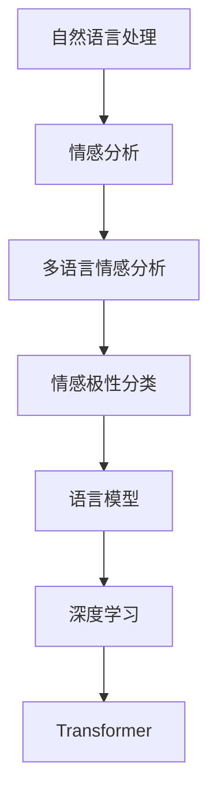

                 

# 自然语言处理在多语言情感分析中的新进展

> 关键词：自然语言处理, 多语言情感分析, 深度学习, Transformer, 情感极性分类, 语言模型

> 摘要：本文旨在探讨自然语言处理在多语言情感分析中的最新进展。我们将从背景介绍出发，深入解析核心概念与联系，详细阐述核心算法原理及具体操作步骤，通过数学模型和公式进行详细讲解，并结合实际代码案例进行深入分析。此外，本文还将探讨多语言情感分析的实际应用场景，推荐相关学习资源和开发工具，最后展望未来发展趋势与挑战。

## 1. 背景介绍

随着全球化进程的加速，多语言环境下的情感分析变得尤为重要。情感分析，也称为意见挖掘或情感计算，是自然语言处理领域的一个重要分支，旨在从文本中自动识别和提取主观信息，如情感极性（正面、负面或中性）。多语言情感分析则进一步扩展了这一领域，使其能够处理不同语言背景下的文本数据，从而更好地服务于全球化的信息处理需求。

### 1.1 为什么需要多语言情感分析

1. **全球化需求**：随着互联网的普及，全球范围内的信息交流日益频繁。不同语言背景下的用户在社交媒体、论坛、评论区等平台上发表的意见和观点，需要被准确地理解和分析。
2. **文化差异**：不同语言和文化背景下的情感表达方式存在差异，单一语言的情感分析模型可能无法准确捕捉这些差异。
3. **商业价值**：企业需要了解不同市场和用户群体的情感倾向，以便制定更有效的市场策略和产品改进计划。
4. **学术研究**：多语言情感分析有助于跨文化研究，揭示不同文化背景下情感表达的共性和差异。

### 1.2 多语言情感分析的挑战

1. **语言多样性**：全球有数千种语言，每种语言都有其独特的语法结构、词汇和文化背景。
2. **数据稀缺性**：对于一些小众语言，高质量的情感标注数据非常稀缺，这给模型训练带来了挑战。
3. **语言迁移**：如何将一个语言的情感分析模型迁移到另一个语言，保持较高的准确率是一个难题。
4. **跨文化理解**：不同文化背景下的情感表达方式存在差异，如何准确理解这些差异是一个挑战。

## 2. 核心概念与联系

### 2.1 自然语言处理（NLP）

自然语言处理是计算机科学和人工智能领域的一个分支，旨在使计算机能够理解、解释和生成人类语言。它涉及多个子领域，包括词法分析、句法分析、语义分析、情感分析等。

### 2.2 情感分析

情感分析是自然语言处理的一个重要应用，旨在从文本中自动识别和提取主观信息，如情感极性（正面、负面或中性）。情感分析可以应用于社交媒体监控、市场调研、客户服务等多个领域。

### 2.3 多语言情感分析

多语言情感分析是指在多种语言环境下进行情感分析的过程。它需要处理不同语言的语法结构、词汇和文化背景，以确保准确性和普适性。

### 2.4 情感极性分类

情感极性分类是情感分析的核心任务之一，旨在将文本划分为正面、负面或中性情感。这通常通过训练机器学习模型来实现，模型需要学习文本中的情感特征，并将其映射到情感极性标签。

### 2.5 语言模型

语言模型是自然语言处理中的一个重要工具，用于预测文本序列的概率分布。在多语言情感分析中，语言模型可以用于生成候选文本，帮助模型更好地理解文本的上下文和语义。

### 2.6 深度学习与Transformer

深度学习是近年来自然语言处理领域的重要进展，通过神经网络模型实现对文本的高层次抽象和表示。Transformer是一种基于自注意力机制的深度学习模型，广泛应用于自然语言处理任务，包括多语言情感分析。

#### Mermaid 流程图



## 3. 核心算法原理 & 具体操作步骤

### 3.1 情感极性分类算法

情感极性分类算法通常采用监督学习方法，通过训练数据集来学习文本与情感极性之间的映射关系。常见的算法包括朴素贝叶斯、支持向量机（SVM）、随机森林等。

### 3.2 语言模型构建

语言模型构建是多语言情感分析中的关键步骤，主要包括以下几个步骤：

1. **数据预处理**：清洗文本数据，去除噪声，进行分词、词干提取等预处理操作。
2. **特征提取**：从文本中提取有用的特征，如词频、TF-IDF、词向量等。
3. **模型训练**：使用训练数据集训练语言模型，学习文本的语义和语法特征。
4. **模型评估**：通过交叉验证等方法评估模型的性能，确保模型的泛化能力。

### 3.3 Transformer模型

Transformer模型是一种基于自注意力机制的深度学习模型，广泛应用于自然语言处理任务。其核心原理包括：

1. **自注意力机制**：Transformer通过自注意力机制捕捉文本中的长距离依赖关系，提高模型的表达能力。
2. **多头注意力**：通过多个注意力头并行处理不同的特征，增强模型的泛化能力。
3. **位置编码**：为每个位置添加位置编码，确保模型能够理解文本的顺序信息。
4. **前馈神经网络**：在每个注意力层之后添加前馈神经网络，进一步增强模型的表达能力。

### 3.4 情感分析流程

情感分析流程可以分为以下几个步骤：

1. **数据收集**：收集多语言的情感标注数据集。
2. **数据预处理**：清洗和预处理文本数据。
3. **特征提取**：从文本中提取有用的特征。
4. **模型训练**：使用训练数据集训练情感分析模型。
5. **模型评估**：通过交叉验证等方法评估模型的性能。
6. **模型应用**：将训练好的模型应用于实际场景，进行情感分析。

## 4. 数学模型和公式 & 详细讲解 & 举例说明

### 4.1 朴素贝叶斯分类器

朴素贝叶斯分类器是一种基于贝叶斯定理的简单概率模型，适用于情感极性分类任务。其基本原理如下：

$$
P(C|X) = \frac{P(X|C)P(C)}{P(X)}
$$

其中，$C$ 表示情感极性标签（正面、负面或中性），$X$ 表示文本特征向量。朴素贝叶斯分类器假设特征之间相互独立，简化了计算过程。

### 4.2 支持向量机（SVM）

支持向量机是一种监督学习算法，适用于情感极性分类任务。其基本原理如下：

$$
\min_{w,b} \frac{1}{2}w^Tw + C\sum_{i=1}^{n}\xi_i
$$

其中，$w$ 表示权重向量，$b$ 表示偏置项，$C$ 是惩罚参数，$\xi_i$ 是松弛变量。SVM通过最大化间隔来找到最优超平面，从而实现分类。

### 4.3 语言模型

语言模型可以表示为一个概率分布，用于预测文本序列的概率。常见的语言模型包括N-gram模型和神经网络语言模型。

#### N-gram模型

N-gram模型是一种基于统计的方法，通过计算相邻词的概率来预测下一个词。其基本原理如下：

$$
P(w_i|w_{i-1}, w_{i-2}, \ldots, w_{i-n+1}) = \frac{count(w_{i-1}, w_{i-2}, \ldots, w_{i-n+1}, w_i)}{count(w_{i-1}, w_{i-2}, \ldots, w_{i-n+1})}
$$

其中，$w_i$ 表示第 $i$ 个词，$n$ 表示N-gram的长度。

#### 神经网络语言模型

神经网络语言模型通过神经网络来预测下一个词的概率。其基本原理如下：

$$
P(w_i|w_{i-1}, w_{i-2}, \ldots, w_{i-n+1}) = \text{softmax}(W\cdot h + b)
$$

其中，$W$ 和 $b$ 分别表示权重矩阵和偏置项，$h$ 表示隐藏层的输出。

### 4.4 Transformer模型

Transformer模型的核心原理包括自注意力机制和多头注意力机制。其基本原理如下：

#### 自注意力机制

自注意力机制通过计算每个词与其他词之间的注意力权重，从而捕捉文本中的长距离依赖关系。其基本原理如下：

$$
\text{Attention}(Q, K, V) = \text{softmax}\left(\frac{QK^T}{\sqrt{d_k}}\right)V
$$

其中，$Q$、$K$ 和 $V$ 分别表示查询、键和值矩阵，$d_k$ 表示键的维度。

#### 多头注意力机制

多头注意力机制通过多个注意力头并行处理不同的特征，增强模型的泛化能力。其基本原理如下：

$$
\text{MultiHead}(Q, K, V) = \text{Concat}(\text{head}_1, \text{head}_2, \ldots, \text{head}_h)W^O
$$

其中，$\text{head}_i = \text{Attention}(QW_i^Q, KW_i^K, VW_i^V)$，$W^O$ 表示输出权重矩阵。

## 5. 项目实战：代码实际案例和详细解释说明

### 5.1 开发环境搭建

为了进行多语言情感分析项目，我们需要搭建一个合适的开发环境。具体步骤如下：

1. **安装Python**：确保安装了最新版本的Python。
2. **安装依赖库**：安装常用的自然语言处理库，如`nltk`、`spaCy`、`transformers`等。
3. **安装数据集**：下载多语言的情感标注数据集，如IMDB、SST-2等。

### 5.2 源代码详细实现和代码解读

以下是一个简单的多语言情感分析项目的代码实现：

```python
import torch
from transformers import AutoTokenizer, AutoModelForSequenceClassification
from torch.utils.data import Dataset, DataLoader
import pandas as pd

# 1. 数据预处理
class SentimentDataset(Dataset):
    def __init__(self, data, tokenizer, max_length=128):
        self.data = data
        self.tokenizer = tokenizer
        self.max_length = max_length

    def __len__(self):
        return len(self.data)

    def __getitem__(self, idx):
        text = self.data.iloc[idx]['text']
        encoding = self.tokenizer(text, truncation=True, padding='max_length', max_length=self.max_length, return_tensors='pt')
        return {'input_ids': encoding['input_ids'].squeeze(), 'attention_mask': encoding['attention_mask'].squeeze(), 'label': self.data.iloc[idx]['label']}

# 2. 加载数据集
data = pd.read_csv('sentiment_data.csv')
tokenizer = AutoTokenizer.from_pretrained('bert-base-multilingual-cased')
dataset = SentimentDataset(data, tokenizer)

# 3. 数据加载器
dataloader = DataLoader(dataset, batch_size=16, shuffle=True)

# 4. 加载预训练模型
model = AutoModelForSequenceClassification.from_pretrained('bert-base-multilingual-cased', num_labels=3)

# 5. 训练模型
optimizer = torch.optim.AdamW(model.parameters(), lr=2e-5)
device = torch.device('cuda' if torch.cuda.is_available() else 'cpu')
model.to(device)

for epoch in range(3):
    for batch in dataloader:
        input_ids = batch['input_ids'].to(device)
        attention_mask = batch['attention_mask'].to(device)
        labels = batch['label'].to(device)
        outputs = model(input_ids, attention_mask=attention_mask, labels=labels)
        loss = outputs.loss
        loss.backward()
        optimizer.step()
        optimizer.zero_grad()

# 6. 评估模型
model.eval()
with torch.no_grad():
    for batch in dataloader:
        input_ids = batch['input_ids'].to(device)
        attention_mask = batch['attention_mask'].to(device)
        labels = batch['label'].to(device)
        outputs = model(input_ids, attention_mask=attention_mask)
        predictions = torch.argmax(outputs.logits, dim=1)
        accuracy = (predictions == labels).sum().item() / len(labels)
        print(f'Accuracy: {accuracy:.4f}')
```

### 5.3 代码解读与分析

1. **数据预处理**：定义了一个`SentimentDataset`类，用于加载和预处理数据。该类继承自`torch.utils.data.Dataset`，实现了`__len__`和`__getitem__`方法。
2. **加载数据集**：从CSV文件中读取数据，并使用`AutoTokenizer`进行分词和编码。
3. **数据加载器**：使用`DataLoader`将数据集划分为批次，方便模型训练。
4. **加载预训练模型**：使用`AutoModelForSequenceClassification`加载预训练的多语言BERT模型。
5. **训练模型**：定义优化器和训练循环，进行模型训练。
6. **评估模型**：在评估模式下，计算模型的准确率。

## 6. 实际应用场景

多语言情感分析在多个领域具有广泛的应用场景，包括：

1. **社交媒体监控**：实时监控社交媒体上的用户评论，了解公众对品牌、产品或事件的情感倾向。
2. **市场调研**：通过分析消费者反馈，了解市场趋势和消费者需求。
3. **客户服务**：通过分析客户反馈，提高服务质量，解决客户问题。
4. **舆情分析**：监控新闻媒体和论坛上的舆论动态，了解公众对特定事件的态度。
5. **产品改进**：通过分析用户反馈，改进产品设计和功能。

## 7. 工具和资源推荐

### 7.1 学习资源推荐

1. **书籍**：《深度学习》（Ian Goodfellow, Yoshua Bengio, Aaron Courville）
2. **论文**：《Attention Is All You Need》（Vaswani et al., 2017）
3. **博客**：Medium上的自然语言处理系列文章
4. **网站**：Hugging Face的Transformers库文档

### 7.2 开发工具框架推荐

1. **Python库**：`nltk`、`spaCy`、`transformers`
2. **框架**：PyTorch、TensorFlow

### 7.3 相关论文著作推荐

1. **论文**：《BERT: Pre-training of Deep Bidirectional Transformers for Language Understanding》（Devlin et al., 2018）
2. **著作**：《情感分析：理论与实践》（张华，2019）

## 8. 总结：未来发展趋势与挑战

### 8.1 未来发展趋势

1. **多模态情感分析**：结合图像、音频等多模态数据进行情感分析，提高情感识别的准确性和鲁棒性。
2. **跨文化情感分析**：进一步研究不同文化背景下的情感表达方式，提高模型的普适性。
3. **实时情感分析**：开发实时情感分析系统，实现对文本的即时情感识别。
4. **情感生成**：通过生成模型自动生成具有特定情感倾向的文本，应用于创意写作等领域。

### 8.2 面临的挑战

1. **数据稀缺性**：对于一些小众语言，高质量的情感标注数据非常稀缺，这给模型训练带来了挑战。
2. **语言迁移**：如何将一个语言的情感分析模型迁移到另一个语言，保持较高的准确率是一个难题。
3. **跨文化理解**：不同文化背景下的情感表达方式存在差异，如何准确理解这些差异是一个挑战。
4. **模型解释性**：如何提高模型的解释性，使其能够更好地理解人类的情感表达，是一个重要的研究方向。

## 9. 附录：常见问题与解答

### 9.1 问题1：如何处理数据稀缺性问题？

**解答**：可以采用数据增强技术，如同义词替换、反义词替换等，增加数据量。此外，可以利用迁移学习，将一个语言的情感分析模型迁移到另一个语言，利用源语言的数据来提升目标语言的情感分析性能。

### 9.2 问题2：如何提高模型的解释性？

**解答**：可以采用注意力机制可视化技术，如Grad-CAM，将注意力权重可视化，帮助理解模型的决策过程。此外，可以采用可解释性模型，如逻辑回归、决策树等，提高模型的解释性。

## 10. 扩展阅读 & 参考资料

1. **书籍**：《深度学习》（Ian Goodfellow, Yoshua Bengio, Aaron Courville）
2. **论文**：《Attention Is All You Need》（Vaswani et al., 2017）
3. **博客**：Medium上的自然语言处理系列文章
4. **网站**：Hugging Face的Transformers库文档

---

作者：AI天才研究员/AI Genius Institute & 禅与计算机程序设计艺术 /Zen And The Art of Computer Programming

