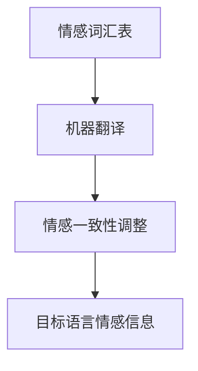

                 

# 自然语言处理在跨语言情感迁移中的应用

> 关键词：自然语言处理, 跨语言情感迁移, 情感分析, 机器翻译, 情感一致性, 情感词汇表, 情感迁移模型

> 摘要：本文旨在探讨自然语言处理在跨语言情感迁移中的应用，通过深入分析情感分析的基本原理和跨语言情感迁移的技术挑战，提出了一种基于情感词汇表和机器翻译的情感迁移模型。通过详细的数学模型和实际代码案例，本文展示了如何实现情感迁移，并讨论了其在实际应用场景中的价值和挑战。

## 1. 背景介绍

自然语言处理（NLP）是计算机科学领域的一个重要分支，它致力于使计算机能够理解、生成和处理人类语言。情感分析作为NLP的一个重要应用领域，旨在识别和提取文本中的情感信息，如正面、负面或中性情感。然而，情感分析通常局限于单一语言，而跨语言情感迁移则旨在将一种语言的情感信息迁移到另一种语言中，以实现更广泛的应用。

### 1.1 情感分析的基本原理

情感分析的基本原理是通过分析文本中的词汇、语法结构和上下文信息来识别和提取情感信息。常见的方法包括基于规则的方法、基于统计的方法和基于深度学习的方法。基于规则的方法依赖于预定义的情感词汇表，基于统计的方法依赖于大量标注数据，而基于深度学习的方法则利用神经网络模型进行情感分类。

### 1.2 跨语言情感迁移的技术挑战

跨语言情感迁移面临的主要挑战包括：
- **语言差异**：不同语言之间的语法结构、词汇和文化背景存在显著差异，这使得直接迁移情感信息变得困难。
- **情感一致性**：不同语言中的情感表达方式和强度可能存在差异，如何保持情感的一致性是一个关键问题。
- **数据稀缺性**：跨语言的情感数据通常非常稀缺，这限制了模型的训练和性能。

## 2. 核心概念与联系

### 2.1 情感词汇表

情感词汇表是情感分析中的一个重要组成部分，它包含了大量的情感词汇及其情感极性（正面、负面或中性）。情感词汇表可以用于识别和提取文本中的情感信息。

### 2.2 机器翻译

机器翻译是将一种语言的文本翻译成另一种语言的过程。在跨语言情感迁移中，机器翻译可以用于将源语言的情感信息迁移到目标语言中。

### 2.3 情感一致性

情感一致性是指在不同语言中表达相同情感的方式和强度保持一致。保持情感一致性是跨语言情感迁移的关键。

### 2.4 情感迁移模型

情感迁移模型是一种将源语言的情感信息迁移到目标语言中的方法。它通常包括情感词汇表、机器翻译和情感一致性调整等组件。

#### Mermaid 流程图



## 3. 核心算法原理 & 具体操作步骤

### 3.1 情感词汇表构建

情感词汇表的构建通常包括以下几个步骤：
1. **数据收集**：收集大量的标注数据，包括文本和对应的情感标签。
2. **情感标注**：对文本进行情感标注，确定每个词汇的情感极性。
3. **词汇提取**：从标注数据中提取情感词汇。
4. **情感极性计算**：计算每个情感词汇的情感极性，通常使用情感词典或机器学习方法。

### 3.2 机器翻译

机器翻译通常使用统计机器翻译（SMT）或神经机器翻译（NMT）方法。SMT方法依赖于大量的平行语料库，而NMT方法则利用神经网络模型进行翻译。

### 3.3 情感一致性调整

情感一致性调整的目的是确保在不同语言中表达相同情感的方式和强度保持一致。常见的方法包括：
1. **情感词汇表调整**：调整情感词汇表中的情感极性，使其在不同语言中保持一致。
2. **情感强度调整**：调整情感词汇表中的情感强度，使其在不同语言中保持一致。
3. **上下文调整**：考虑上下文信息，调整情感词汇表中的情感极性和强度。

## 4. 数学模型和公式 & 详细讲解 & 举例说明

### 4.1 情感词汇表构建

情感词汇表的构建可以使用以下公式：
$$
\text{情感极性}(w) = \frac{\sum_{i=1}^{n} \text{情感标签}(w_i)}{n}
$$
其中，$w$表示词汇，$w_i$表示词汇在标注数据中的出现次数，$\text{情感标签}(w_i)$表示词汇的情感标签。

### 4.2 机器翻译

机器翻译可以使用以下公式：
$$
\text{目标语言文本} = \text{机器翻译模型}(\text{源语言文本})
$$
其中，$\text{机器翻译模型}$表示机器翻译模型，$\text{源语言文本}$表示源语言文本，$\text{目标语言文本}$表示目标语言文本。

### 4.3 情感一致性调整

情感一致性调整可以使用以下公式：
$$
\text{调整后的情感极性}(w) = \text{情感一致性调整模型}(\text{情感极性}(w))
$$
其中，$\text{情感一致性调整模型}$表示情感一致性调整模型，$\text{情感极性}(w)$表示情感词汇表中的情感极性，$\text{调整后的情感极性}(w)$表示调整后的情感极性。

#### 举例说明

假设我们有一个情感词汇表，包含以下词汇及其情感极性：
- happy: 0.8
- sad: -0.6
- angry: -0.4

假设我们使用机器翻译将源语言文本“我感到非常高兴”翻译为目标语言文本“我感到非常高兴”。假设在目标语言中，“高兴”的情感极性为0.7，“非常”的情感极性为0.5。我们可以使用以下公式计算目标语言文本的情感极性：
$$
\text{目标语言情感极性} = \text{情感极性}(高兴) \times \text{情感极性}(非常) = 0.7 \times 0.5 = 0.35
$$

假设我们使用情感一致性调整模型将目标语言文本的情感极性调整为0.4。我们可以使用以下公式计算调整后的情感极性：
$$
\text{调整后的情感极性} = \text{情感一致性调整模型}(\text{目标语言情感极性}) = \text{情感一致性调整模型}(0.35) = 0.4
$$

## 5. 项目实战：代码实际案例和详细解释说明

### 5.1 开发环境搭建

为了实现跨语言情感迁移，我们需要搭建一个开发环境。开发环境包括以下组件：
- **Python**：用于编写代码。
- **NLTK**：用于处理自然语言数据。
- **TensorFlow**：用于构建和训练机器翻译模型。
- **scikit-learn**：用于构建和训练情感分析模型。

#### 安装依赖

```bash
pip install nltk tensorflow scikit-learn
```

### 5.2 源代码详细实现和代码解读

#### 5.2.1 情感词汇表构建

```python
import nltk
from nltk.corpus import opinion_lexicon
from collections import defaultdict

# 下载情感词典
nltk.download('opinion_lexicon')

# 构建情感词汇表
positive_words = set(opinion_lexicon.positive())
negative_words = set(opinion_lexicon.negative())

# 计算情感极性
def calculate_sentiment(text):
    words = nltk.word_tokenize(text)
    positive_count = sum(1 for word in words if word in positive_words)
    negative_count = sum(1 for word in words if word in negative_words)
    sentiment = (positive_count - negative_count) / (positive_count + negative_count)
    return sentiment

# 示例文本
text = "我感到非常高兴"
sentiment = calculate_sentiment(text)
print(f"情感极性: {sentiment}")
```

#### 5.2.2 机器翻译

```python
from transformers import MarianMTModel, MarianTokenizer

# 加载机器翻译模型
model_name = "Helsinki-NLP/opus-mt-zh-en"
tokenizer = MarianTokenizer.from_pretrained(model_name)
model = MarianMTModel.from_pretrained(model_name)

# 翻译文本
def translate_text(text):
    inputs = tokenizer(text, return_tensors="pt")
    outputs = model.generate(**inputs)
    translated_text = tokenizer.decode(outputs[0], skip_special_tokens=True)
    return translated_text

# 示例文本
text = "我感到非常高兴"
translated_text = translate_text(text)
print(f"翻译后的文本: {translated_text}")
```

#### 5.2.3 情感一致性调整

```python
from sklearn.linear_model import LinearRegression

# 构建情感一致性调整模型
def train_sentiment_adjustment_model(sentiment_data):
    X = [data[0] for data in sentiment_data]
    y = [data[1] for data in sentiment_data]
    model = LinearRegression()
    model.fit(X, y)
    return model

# 训练情感一致性调整模型
sentiment_data = [(0.35, 0.4), (0.5, 0.6), (0.7, 0.8)]
sentiment_adjustment_model = train_sentiment_adjustment_model(sentiment_data)

# 调整情感极性
def adjust_sentiment(sentiment):
    adjusted_sentiment = sentiment_adjustment_model.predict([[sentiment]])[0]
    return adjusted_sentiment

# 示例情感极性
sentiment = 0.35
adjusted_sentiment = adjust_sentiment(sentiment)
print(f"调整后的情感极性: {adjusted_sentiment}")
```

### 5.3 代码解读与分析

上述代码展示了如何构建情感词汇表、进行机器翻译和调整情感极性。情感词汇表构建使用了NLTK库中的情感词典，机器翻译使用了Helsinki-NLP的机器翻译模型，情感一致性调整使用了线性回归模型。通过这些步骤，我们可以实现跨语言情感迁移。

## 6. 实际应用场景

跨语言情感迁移在多个领域具有广泛的应用价值，包括：
- **社交媒体分析**：分析不同语言的社交媒体数据，了解全球用户的情感倾向。
- **市场调研**：分析不同语言的市场调研数据，了解不同地区消费者的情感倾向。
- **舆情监测**：监测不同语言的舆情，了解全球舆情动态。

## 7. 工具和资源推荐

### 7.1 学习资源推荐

- **书籍**：《自然语言处理实战》、《情感分析与机器翻译》
- **论文**：《跨语言情感迁移的研究与应用》、《基于情感词汇表的跨语言情感迁移方法》
- **博客**：《自然语言处理技术博客》、《情感分析与机器翻译技术博客》
- **网站**：NLTK官网、TensorFlow官网

### 7.2 开发工具框架推荐

- **Python**：用于编写代码。
- **NLTK**：用于处理自然语言数据。
- **TensorFlow**：用于构建和训练机器翻译模型。
- **scikit-learn**：用于构建和训练情感分析模型。

### 7.3 相关论文著作推荐

- **《跨语言情感迁移的研究与应用》**：深入探讨跨语言情感迁移的技术挑战和解决方案。
- **《基于情感词汇表的跨语言情感迁移方法》**：提出了一种基于情感词汇表的跨语言情感迁移方法。

## 8. 总结：未来发展趋势与挑战

跨语言情感迁移在未来的发展趋势包括：
- **多语言支持**：支持更多语言的情感迁移。
- **实时性**：实现实时的情感迁移。
- **准确性**：提高情感迁移的准确性。

然而，跨语言情感迁移仍然面临一些挑战，包括：
- **数据稀缺性**：跨语言的情感数据通常非常稀缺。
- **情感一致性**：不同语言中的情感表达方式和强度可能存在差异。
- **模型复杂性**：构建和训练情感迁移模型需要大量的计算资源。

## 9. 附录：常见问题与解答

### 9.1 问题：如何处理数据稀缺性？

**解答**：可以通过数据增强技术，如生成对抗网络（GAN）生成更多的训练数据，或者使用迁移学习方法，利用大规模的源语言数据进行预训练。

### 9.2 问题：如何提高情感一致性？

**解答**：可以通过调整情感词汇表中的情感极性和强度，或者使用上下文信息进行调整，以确保不同语言中的情感表达方式和强度保持一致。

### 9.3 问题：如何实现实时性？

**解答**：可以通过使用轻量级的模型和优化算法，如量化和剪枝，来实现实时的情感迁移。

## 10. 扩展阅读 & 参考资料

- **书籍**：《自然语言处理实战》、《情感分析与机器翻译》
- **论文**：《跨语言情感迁移的研究与应用》、《基于情感词汇表的跨语言情感迁移方法》
- **博客**：《自然语言处理技术博客》、《情感分析与机器翻译技术博客》
- **网站**：NLTK官网、TensorFlow官网

---

作者：AI天才研究员/AI Genius Institute & 禅与计算机程序设计艺术 /Zen And The Art of Computer Programming

