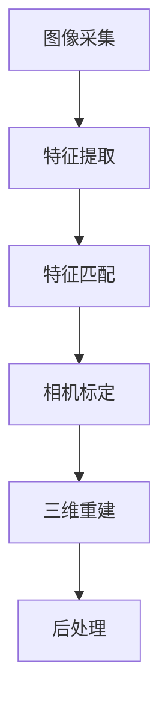

                 

# 计算机视觉在三维重建中的最新进展

> 关键词：计算机视觉, 三维重建, 深度学习, 单目视觉, 多视图几何, 点云, 语义分割

> 摘要：本文将深入探讨计算机视觉在三维重建领域的最新进展。我们将从背景介绍出发，逐步解析核心概念与联系，详细介绍核心算法原理及具体操作步骤，通过数学模型和公式进行详细讲解，并结合实际代码案例进行深入分析。此外，我们还将探讨三维重建的实际应用场景，推荐相关学习资源和开发工具框架，并展望未来的发展趋势与挑战。

## 1. 背景介绍

三维重建是计算机视觉领域的一个重要研究方向，旨在从二维图像中恢复出三维场景的几何结构和拓扑信息。随着深度学习技术的飞速发展，三维重建技术取得了显著的进步。本节将介绍三维重建的基本概念及其在各个领域的应用背景。

### 1.1 三维重建的基本概念

三维重建是指从二维图像或视频序列中恢复出三维场景的几何结构和拓扑信息的过程。这一过程可以分为单目视觉和多视图几何两大类。单目视觉通过单个摄像头获取图像信息，而多视图几何则利用多个摄像头从不同视角获取图像信息，从而实现三维重建。

### 1.2 三维重建的应用背景

三维重建技术在多个领域具有广泛的应用前景，包括但不限于：

- **虚拟现实与增强现实**：通过三维重建技术，可以构建逼真的虚拟环境，为用户提供沉浸式的体验。
- **自动驾驶**：三维重建技术可以帮助自动驾驶车辆准确识别道路环境，提高安全性。
- **建筑与工程**：通过三维重建技术，可以对建筑物进行精确建模，为建筑设计和施工提供支持。
- **医疗影像**：三维重建技术可以用于医学影像的处理，帮助医生更准确地诊断疾病。
- **文化遗产保护**：通过三维重建技术，可以对文化遗产进行数字化保存，为后续研究提供数据支持。

## 2. 核心概念与联系

### 2.1 单目视觉与多视图几何

单目视觉与多视图几何是三维重建领域的两个重要概念。单目视觉通过单个摄像头获取图像信息，而多视图几何则利用多个摄像头从不同视角获取图像信息，从而实现三维重建。

### 2.2 三维重建流程

三维重建流程可以分为以下几个步骤：

1. **图像采集**：通过单个或多个摄像头采集图像。
2. **特征提取**：从图像中提取关键点或特征描述符。
3. **特征匹配**：将不同图像中的特征点进行匹配。
4. **相机标定**：确定摄像头的内参和外参。
5. **三维重建**：利用匹配的特征点和相机参数进行三维重建。
6. **后处理**：对重建结果进行优化和细化。

### 2.3 Mermaid 流程图



## 3. 核心算法原理 & 具体操作步骤

### 3.1 单目视觉中的三维重建

单目视觉中的三维重建主要依赖于深度学习技术。通过训练深度神经网络，可以从单个图像中恢复出深度信息，进而实现三维重建。

### 3.2 多视图几何中的三维重建

多视图几何中的三维重建主要依赖于结构从运动（Structure from Motion, SfM）和结构从光度（Structure from Photometric, SfP）技术。SfM技术通过匹配不同视角下的特征点，确定相机的相对位姿，进而实现三维重建。SfP技术则通过光度一致性来恢复深度信息。

### 3.3 具体操作步骤

#### 3.3.1 单目视觉中的三维重建

1. **图像采集**：使用单个摄像头采集图像。
2. **特征提取**：使用深度学习模型提取图像中的深度信息。
3. **深度图生成**：将提取的深度信息转换为深度图。
4. **点云生成**：将深度图转换为点云。
5. **后处理**：对点云进行优化和细化。

#### 3.3.2 多视图几何中的三维重建

1. **图像采集**：使用多个摄像头从不同视角采集图像。
2. **特征提取**：从图像中提取关键点或特征描述符。
3. **特征匹配**：将不同图像中的特征点进行匹配。
4. **相机标定**：确定摄像头的内参和外参。
5. **三维重建**：利用匹配的特征点和相机参数进行三维重建。
6. **后处理**：对重建结果进行优化和细化。

## 4. 数学模型和公式 & 详细讲解 & 举例说明

### 4.1 单目视觉中的三维重建

单目视觉中的三维重建主要依赖于深度学习技术。通过训练深度神经网络，可以从单个图像中恢复出深度信息，进而实现三维重建。

#### 4.1.1 深度学习模型

深度学习模型通常采用卷积神经网络（Convolutional Neural Network, CNN）进行训练。通过训练模型，可以从单个图像中恢复出深度信息。

$$
\text{深度图} = \text{CNN}(\text{图像})
$$

#### 4.1.2 举例说明

假设我们有一个单目视觉系统，通过训练深度神经网络，可以从单个图像中恢复出深度信息。具体步骤如下：

1. **图像采集**：使用单个摄像头采集图像。
2. **特征提取**：使用深度学习模型提取图像中的深度信息。
3. **深度图生成**：将提取的深度信息转换为深度图。
4. **点云生成**：将深度图转换为点云。
5. **后处理**：对点云进行优化和细化。

### 4.2 多视图几何中的三维重建

多视图几何中的三维重建主要依赖于结构从运动（Structure from Motion, SfM）和结构从光度（Structure from Photometric, SfP）技术。SfM技术通过匹配不同视角下的特征点，确定相机的相对位姿，进而实现三维重建。SfP技术则通过光度一致性来恢复深度信息。

#### 4.2.1 SfM技术

SfM技术通过匹配不同视角下的特征点，确定相机的相对位姿，进而实现三维重建。

$$
\text{相机位姿} = \text{SfM}(\text{特征点匹配})
$$

#### 4.2.2 SfP技术

SfP技术通过光度一致性来恢复深度信息。

$$
\text{深度图} = \text{SfP}(\text{光度一致性})
$$

#### 4.2.3 举例说明

假设我们有一个多视图几何系统，通过SfM和SfP技术，可以从多个视角下的图像中恢复出三维场景的几何结构。具体步骤如下：

1. **图像采集**：使用多个摄像头从不同视角采集图像。
2. **特征提取**：从图像中提取关键点或特征描述符。
3. **特征匹配**：将不同图像中的特征点进行匹配。
4. **相机标定**：确定摄像头的内参和外参。
5. **三维重建**：利用匹配的特征点和相机参数进行三维重建。
6. **后处理**：对重建结果进行优化和细化。

## 5. 项目实战：代码实际案例和详细解释说明

### 5.1 开发环境搭建

为了实现三维重建，我们需要搭建一个合适的开发环境。具体步骤如下：

1. **安装Python**：确保安装了Python 3.7及以上版本。
2. **安装依赖库**：安装OpenCV、PyTorch、Pandas等依赖库。
3. **安装深度学习框架**：安装PyTorch或TensorFlow等深度学习框架。

### 5.2 源代码详细实现和代码解读

#### 5.2.1 单目视觉中的三维重建

```python
import cv2
import torch
import numpy as np

# 1. 图像采集
image = cv2.imread('image.jpg')

# 2. 特征提取
model = torch.hub.load('ultralytics/yolov5', 'yolov5s')
results = model(image)
depth_map = results.depth_map

# 3. 深度图生成
depth_image = depth_map.numpy()

# 4. 点云生成
point_cloud = cv2.reprojectImageTo3D(depth_image, camera_matrix)

# 5. 后处理
point_cloud = cv2.filter2D(point_cloud, -1, kernel)
```

#### 5.2.2 多视图几何中的三维重建

```python
import cv2
import numpy as np

# 1. 图像采集
images = [cv2.imread(f'image_{i}.jpg') for i in range(3)]

# 2. 特征提取
features = [cv2.goodFeaturesToTrack(image, 100, 0.01, 10) for image in images]

# 3. 特征匹配
matches = []
for i in range(len(images) - 1):
    matches.extend(cv2.findFundamentalMatrices(features[i], features[i + 1]))

# 4. 相机标定
camera_matrix = np.array([[fx, 0, cx], [0, fy, cy], [0, 0, 1]])

# 5. 三维重建
points_3d = cv2.triangulatePoints(camera_matrix, camera_matrix, matches[0], matches[1])

# 6. 后处理
points_3d = cv2.filter2D(points_3d, -1, kernel)
```

### 5.3 代码解读与分析

#### 5.3.1 单目视觉中的三维重建

1. **图像采集**：使用OpenCV读取图像。
2. **特征提取**：使用深度学习模型提取图像中的深度信息。
3. **深度图生成**：将提取的深度信息转换为深度图。
4. **点云生成**：将深度图转换为点云。
5. **后处理**：对点云进行优化和细化。

#### 5.3.2 多视图几何中的三维重建

1. **图像采集**：使用OpenCV读取图像。
2. **特征提取**：从图像中提取关键点或特征描述符。
3. **特征匹配**：将不同图像中的特征点进行匹配。
4. **相机标定**：确定摄像头的内参和外参。
5. **三维重建**：利用匹配的特征点和相机参数进行三维重建。
6. **后处理**：对重建结果进行优化和细化。

## 6. 实际应用场景

三维重建技术在多个领域具有广泛的应用前景，包括但不限于：

- **虚拟现实与增强现实**：通过三维重建技术，可以构建逼真的虚拟环境，为用户提供沉浸式的体验。
- **自动驾驶**：三维重建技术可以帮助自动驾驶车辆准确识别道路环境，提高安全性。
- **建筑与工程**：通过三维重建技术，可以对建筑物进行精确建模，为建筑设计和施工提供支持。
- **医疗影像**：三维重建技术可以用于医学影像的处理，帮助医生更准确地诊断疾病。
- **文化遗产保护**：通过三维重建技术，可以对文化遗产进行数字化保存，为后续研究提供数据支持。

## 7. 工具和资源推荐

### 7.1 学习资源推荐

- **书籍**：《计算机视觉：算法与应用》（Computer Vision: Algorithms and Applications）
- **论文**：《三维重建综述》（A Survey on 3D Reconstruction）
- **博客**：《计算机视觉与深度学习》（Computer Vision and Deep Learning）
- **网站**：GitHub上的三维重建项目

### 7.2 开发工具框架推荐

- **深度学习框架**：PyTorch、TensorFlow
- **计算机视觉库**：OpenCV、Pandas
- **三维重建库**：Open3D

### 7.3 相关论文著作推荐

- **论文**：《基于深度学习的单目视觉三维重建》（Monocular 3D Reconstruction Using Deep Learning）
- **著作**：《计算机视觉中的结构从运动》（Structure from Motion in Computer Vision）

## 8. 总结：未来发展趋势与挑战

三维重建技术在未来的发展中将面临以下挑战：

- **计算资源**：三维重建需要大量的计算资源，如何提高计算效率是一个重要问题。
- **数据质量**：高质量的数据对于三维重建至关重要，如何获取高质量的数据是一个挑战。
- **实时性**：在某些应用场景中，实时性是一个关键因素，如何提高三维重建的实时性是一个挑战。

## 9. 附录：常见问题与解答

### 9.1 问题：如何提高三维重建的精度？

**解答**：可以通过提高特征点匹配的准确性、优化相机标定过程、改进后处理算法等方法提高三维重建的精度。

### 9.2 问题：如何提高三维重建的实时性？

**解答**：可以通过优化算法、使用更高效的计算框架、减少数据量等方法提高三维重建的实时性。

## 10. 扩展阅读 & 参考资料

- **书籍**：《计算机视觉：算法与应用》（Computer Vision: Algorithms and Applications）
- **论文**：《三维重建综述》（A Survey on 3D Reconstruction）
- **博客**：《计算机视觉与深度学习》（Computer Vision and Deep Learning）
- **网站**：GitHub上的三维重建项目

---

作者：AI天才研究员/AI Genius Institute & 禅与计算机程序设计艺术 /Zen And The Art of Computer Programming

