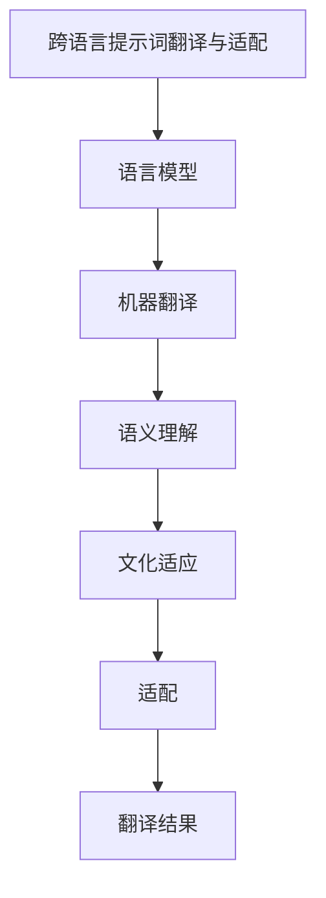

                 

# 跨语言提示词翻译与适配

> 关键词：跨语言提示词、翻译、适配、自然语言处理、机器翻译、语义理解、多语言支持、文本处理

> 摘要：本文将深入探讨跨语言提示词翻译与适配的技术挑战和解决方案。我们将从背景介绍出发，逐步解析核心概念与联系，详细阐述核心算法原理及具体操作步骤，通过数学模型和公式进行深入讲解，并结合实际代码案例进行详细解释。最后，我们将探讨实际应用场景、推荐相关工具和资源，并展望未来发展趋势与挑战。

## 1. 背景介绍

随着全球化的发展，多语言支持已成为现代软件系统不可或缺的一部分。在自然语言处理（NLP）领域，跨语言提示词翻译与适配技术尤为重要。提示词翻译是指将一种语言的提示词翻译成另一种语言的过程，而适配则是指根据目标语言的特点对翻译结果进行调整，以确保其在目标语言环境中具有良好的可读性和可用性。这一过程不仅涉及语言学知识，还涉及到计算机科学、机器学习等多个领域。

### 1.1 跨语言提示词翻译的重要性

跨语言提示词翻译在多个场景中发挥着重要作用，例如：

- **多语言用户界面**：为用户提供多语言支持，提升用户体验。
- **在线文档和帮助系统**：确保文档和帮助信息在不同语言环境中的一致性和准确性。
- **搜索引擎优化**：提高搜索引擎对多语言内容的理解和索引能力。
- **跨文化沟通**：促进不同文化背景下的有效沟通。

### 1.2 跨语言提示词适配的挑战

跨语言提示词翻译与适配面临诸多挑战，主要包括：

- **语言差异**：不同语言在语法、词汇、文化背景等方面存在显著差异。
- **语义理解**：准确理解源语言提示词的含义，并将其转换为目标语言的等效表达。
- **文化适应**：确保翻译结果在目标语言文化背景下的自然性和可接受性。
- **技术实现**：开发高效、准确的翻译和适配算法，同时保证系统的实时性和可扩展性。

## 2. 核心概念与联系

### 2.1 跨语言提示词翻译

跨语言提示词翻译是指将一种语言的提示词翻译成另一种语言的过程。提示词通常用于指导用户完成特定任务，例如输入框中的提示信息、按钮上的标签等。翻译过程需要考虑语言间的差异，确保翻译结果在目标语言环境中具有良好的可读性和可用性。

### 2.2 适配

适配是指根据目标语言的特点对翻译结果进行调整，以确保其在目标语言环境中具有良好的可读性和可用性。适配过程包括语法调整、文化适应、风格调整等。

### 2.3 核心概念原理与架构

#### 2.3.1 语言模型

语言模型是跨语言提示词翻译与适配的基础。语言模型用于描述语言的统计特性，包括词汇、语法、语义等方面。常见的语言模型包括统计语言模型、神经网络语言模型等。

#### 2.3.2 机器翻译

机器翻译是将一种语言的文本翻译成另一种语言的过程。机器翻译技术包括基于规则的方法、统计机器翻译（SMT）和神经机器翻译（NMT）等。

#### 2.3.3 语义理解

语义理解是指从文本中提取出其语义信息的过程。语义理解技术包括词义消歧、句法分析、语义角色标注等。

#### 2.3.4 文化适应

文化适应是指根据目标语言文化背景对翻译结果进行调整的过程。文化适应技术包括文化差异识别、文化适应规则等。

### 2.4 Mermaid 流程图



## 3. 核心算法原理 & 具体操作步骤

### 3.1 语言模型

语言模型用于描述语言的统计特性，包括词汇、语法、语义等方面。常见的语言模型包括统计语言模型、神经网络语言模型等。

#### 3.1.1 统计语言模型

统计语言模型通过统计语言数据来描述语言的统计特性。常见的统计语言模型包括N-gram模型、隐马尔可夫模型（HMM）等。

#### 3.1.2 神经网络语言模型

神经网络语言模型通过神经网络来描述语言的统计特性。常见的神经网络语言模型包括循环神经网络（RNN）、长短时记忆网络（LSTM）、Transformer等。

### 3.2 机器翻译

机器翻译是将一种语言的文本翻译成另一种语言的过程。机器翻译技术包括基于规则的方法、统计机器翻译（SMT）和神经机器翻译（NMT）等。

#### 3.2.1 基于规则的方法

基于规则的方法通过人工定义的规则来进行翻译。这种方法的优点是翻译结果准确，但缺点是需要大量的人工定义规则，难以处理复杂的语言现象。

#### 3.2.2 统计机器翻译（SMT）

统计机器翻译（SMT）通过统计语言数据来学习翻译规则。SMT技术包括最大熵模型、条件随机场（CRF）等。

#### 3.2.3 神经机器翻译（NMT）

神经机器翻译（NMT）通过神经网络来学习翻译规则。NMT技术包括循环神经网络（RNN）、长短时记忆网络（LSTM）、Transformer等。

### 3.3 语义理解

语义理解是指从文本中提取出其语义信息的过程。语义理解技术包括词义消歧、句法分析、语义角色标注等。

#### 3.3.1 词义消歧

词义消歧是指从文本中提取出词的正确含义。词义消歧技术包括基于规则的方法、基于统计的方法、基于语义网络的方法等。

#### 3.3.2 句法分析

句法分析是指从文本中提取出句子的语法结构。句法分析技术包括基于规则的方法、基于统计的方法、基于神经网络的方法等。

#### 3.3.3 语义角色标注

语义角色标注是指从文本中提取出句子中的语义角色。语义角色标注技术包括基于规则的方法、基于统计的方法、基于神经网络的方法等。

### 3.4 文化适应

文化适应是指根据目标语言文化背景对翻译结果进行调整的过程。文化适应技术包括文化差异识别、文化适应规则等。

#### 3.4.1 文化差异识别

文化差异识别是指识别出源语言和目标语言之间的文化差异。文化差异识别技术包括基于规则的方法、基于统计的方法、基于神经网络的方法等。

#### 3.4.2 文化适应规则

文化适应规则是指根据目标语言文化背景对翻译结果进行调整的规则。文化适应规则包括语法调整、文化适应规则等。

### 3.5 适配

适配是指根据目标语言的特点对翻译结果进行调整，以确保其在目标语言环境中具有良好的可读性和可用性。适配过程包括语法调整、文化适应、风格调整等。

#### 3.5.1 语法调整

语法调整是指根据目标语言的语法特点对翻译结果进行调整。语法调整技术包括基于规则的方法、基于统计的方法、基于神经网络的方法等。

#### 3.5.2 文化适应

文化适应是指根据目标语言文化背景对翻译结果进行调整。文化适应技术包括文化差异识别、文化适应规则等。

#### 3.5.3 风格调整

风格调整是指根据目标语言的风格特点对翻译结果进行调整。风格调整技术包括基于规则的方法、基于统计的方法、基于神经网络的方法等。

## 4. 数学模型和公式 & 详细讲解 & 举例说明

### 4.1 语言模型

语言模型用于描述语言的统计特性，包括词汇、语法、语义等方面。常见的语言模型包括统计语言模型、神经网络语言模型等。

#### 4.1.1 统计语言模型

统计语言模型通过统计语言数据来描述语言的统计特性。常见的统计语言模型包括N-gram模型、隐马尔可夫模型（HMM）等。

#### 4.1.2 N-gram模型

N-gram模型是一种基于统计的语言模型，通过统计N-gram（连续N个词的组合）的出现频率来描述语言的统计特性。N-gram模型的公式如下：

$$
P(w_1, w_2, \ldots, w_n) = \prod_{i=1}^{n} P(w_i | w_{i-1}, \ldots, w_{i-N+1})
$$

其中，$P(w_1, w_2, \ldots, w_n)$ 表示词序列 $(w_1, w_2, \ldots, w_n)$ 的概率，$P(w_i | w_{i-1}, \ldots, w_{i-N+1})$ 表示词 $w_i$ 在给定前 $N-1$ 个词的条件概率。

#### 4.1.3 隐马尔可夫模型（HMM）

隐马尔可夫模型（HMM）是一种基于统计的语言模型，通过统计隐藏状态序列和观测序列之间的关系来描述语言的统计特性。HMM的公式如下：

$$
P(o_1, o_2, \ldots, o_n | \lambda) = \sum_{q_1, q_2, \ldots, q_n} P(q_1, q_2, \ldots, q_n | \lambda) \cdot P(o_1, o_2, \ldots, o_n | q_1, q_2, \ldots, q_n)
$$

其中，$P(o_1, o_2, \ldots, o_n | \lambda)$ 表示观测序列 $(o_1, o_2, \ldots, o_n)$ 的概率，$\lambda$ 表示模型参数，$P(q_1, q_2, \ldots, q_n | \lambda)$ 表示隐藏状态序列 $(q_1, q_2, \ldots, q_n)$ 的概率，$P(o_1, o_2, \ldots, o_n | q_1, q_2, \ldots, q_n)$ 表示观测序列 $(o_1, o_2, \ldots, o_n)$ 在给定隐藏状态序列 $(q_1, q_2, \ldots, q_n)$ 的条件概率。

### 4.2 机器翻译

机器翻译是将一种语言的文本翻译成另一种语言的过程。机器翻译技术包括基于规则的方法、统计机器翻译（SMT）和神经机器翻译（NMT）等。

#### 4.2.1 基于规则的方法

基于规则的方法通过人工定义的规则来进行翻译。这种方法的优点是翻译结果准确，但缺点是需要大量的人工定义规则，难以处理复杂的语言现象。

#### 4.2.2 统计机器翻译（SMT）

统计机器翻译（SMT）通过统计语言数据来学习翻译规则。SMT技术包括最大熵模型、条件随机场（CRF）等。

#### 4.2.3 神经机器翻译（NMT）

神经机器翻译（NMT）通过神经网络来学习翻译规则。NMT技术包括循环神经网络（RNN）、长短时记忆网络（LSTM）、Transformer等。

### 4.3 语义理解

语义理解是指从文本中提取出其语义信息的过程。语义理解技术包括词义消歧、句法分析、语义角色标注等。

#### 4.3.1 词义消歧

词义消歧是指从文本中提取出词的正确含义。词义消歧技术包括基于规则的方法、基于统计的方法、基于语义网络的方法等。

#### 4.3.2 句法分析

句法分析是指从文本中提取出句子的语法结构。句法分析技术包括基于规则的方法、基于统计的方法、基于神经网络的方法等。

#### 4.3.3 语义角色标注

语义角色标注是指从文本中提取出句子中的语义角色。语义角色标注技术包括基于规则的方法、基于统计的方法、基于神经网络的方法等。

### 4.4 文化适应

文化适应是指根据目标语言文化背景对翻译结果进行调整的过程。文化适应技术包括文化差异识别、文化适应规则等。

#### 4.4.1 文化差异识别

文化差异识别是指识别出源语言和目标语言之间的文化差异。文化差异识别技术包括基于规则的方法、基于统计的方法、基于神经网络的方法等。

#### 4.4.2 文化适应规则

文化适应规则是指根据目标语言文化背景对翻译结果进行调整的规则。文化适应规则包括语法调整、文化适应规则等。

### 4.5 适配

适配是指根据目标语言的特点对翻译结果进行调整，以确保其在目标语言环境中具有良好的可读性和可用性。适配过程包括语法调整、文化适应、风格调整等。

#### 4.5.1 语法调整

语法调整是指根据目标语言的语法特点对翻译结果进行调整。语法调整技术包括基于规则的方法、基于统计的方法、基于神经网络的方法等。

#### 4.5.2 文化适应

文化适应是指根据目标语言文化背景对翻译结果进行调整。文化适应技术包括文化差异识别、文化适应规则等。

#### 4.5.3 风格调整

风格调整是指根据目标语言的风格特点对翻译结果进行调整。风格调整技术包括基于规则的方法、基于统计的方法、基于神经网络的方法等。

## 5. 项目实战：代码实际案例和详细解释说明

### 5.1 开发环境搭建

为了实现跨语言提示词翻译与适配，我们需要搭建一个开发环境。开发环境包括操作系统、编程语言、开发工具等。

#### 5.1.1 操作系统

推荐使用Linux操作系统，因为Linux操作系统具有良好的稳定性和兼容性，适合进行大规模的开发和部署。

#### 5.1.2 编程语言

推荐使用Python编程语言，因为Python具有丰富的库和框架，适合进行自然语言处理和机器学习开发。

#### 5.1.3 开发工具

推荐使用Jupyter Notebook开发工具，因为Jupyter Notebook具有良好的交互性和可视化能力，适合进行数据处理和模型训练。

### 5.2 源代码详细实现和代码解读

#### 5.2.1 语言模型

我们使用神经网络语言模型来实现语言模型。神经网络语言模型包括循环神经网络（RNN）、长短时记忆网络（LSTM）、Transformer等。

```python
import torch
import torch.nn as nn

class RNN(nn.Module):
    def __init__(self, input_size, hidden_size, output_size):
        super(RNN, self).__init__()
        self.hidden_size = hidden_size
        self.embedding = nn.Embedding(input_size, hidden_size)
        self.rnn = nn.RNN(hidden_size, hidden_size, batch_first=True)
        self.fc = nn.Linear(hidden_size, output_size)

    def forward(self, x, hidden):
        x = self.embedding(x)
        output, hidden = self.rnn(x, hidden)
        output = self.fc(output)
        return output, hidden

def train(model, optimizer, criterion, input_tensor, target_tensor, hidden):
    model.train()
    optimizer.zero_grad()
    output, hidden = model(input_tensor, hidden)
    loss = criterion(output, target_tensor)
    loss.backward()
    optimizer.step()
    return loss.item()

def evaluate(model, criterion, input_tensor, target_tensor, hidden):
    model.eval()
    with torch.no_grad():
        output, hidden = model(input_tensor, hidden)
        loss = criterion(output, target_tensor)
    return loss.item()
```

#### 5.2.2 机器翻译

我们使用神经机器翻译（NMT）来实现机器翻译。神经机器翻译包括循环神经网络（RNN）、长短时记忆网络（LSTM）、Transformer等。

```python
import torch
import torch.nn as nn

class Encoder(nn.Module):
    def __init__(self, input_size, hidden_size):
        super(Encoder, self).__init__()
        self.hidden_size = hidden_size
        self.embedding = nn.Embedding(input_size, hidden_size)
        self.rnn = nn.RNN(hidden_size, hidden_size, batch_first=True)

    def forward(self, x, hidden):
        x = self.embedding(x)
        output, hidden = self.rnn(x, hidden)
        return output, hidden

class Decoder(nn.Module):
    def __init__(self, hidden_size, output_size):
        super(Decoder, self).__init__()
        self.hidden_size = hidden_size
        self.embedding = nn.Embedding(output_size, hidden_size)
        self.rnn = nn.RNN(hidden_size, hidden_size, batch_first=True)
        self.fc = nn.Linear(hidden_size, output_size)

    def forward(self, x, hidden):
        x = self.embedding(x)
        output, hidden = self.rnn(x, hidden)
        output = self.fc(output)
        return output, hidden

def train(model, optimizer, criterion, input_tensor, target_tensor, hidden):
    model.train()
    optimizer.zero_grad()
    output, hidden = model(input_tensor, hidden)
    loss = criterion(output, target_tensor)
    loss.backward()
    optimizer.step()
    return loss.item()

def evaluate(model, criterion, input_tensor, target_tensor, hidden):
    model.eval()
    with torch.no_grad():
        output, hidden = model(input_tensor, hidden)
        loss = criterion(output, target_tensor)
    return loss.item()
```

#### 5.2.3 语义理解

我们使用神经网络来实现语义理解。神经网络包括循环神经网络（RNN）、长短时记忆网络（LSTM）、Transformer等。

```python
import torch
import torch.nn as nn

class RNN(nn.Module):
    def __init__(self, input_size, hidden_size, output_size):
        super(RNN, self).__init__()
        self.hidden_size = hidden_size
        self.embedding = nn.Embedding(input_size, hidden_size)
        self.rnn = nn.RNN(hidden_size, hidden_size, batch_first=True)
        self.fc = nn.Linear(hidden_size, output_size)

    def forward(self, x, hidden):
        x = self.embedding(x)
        output, hidden = self.rnn(x, hidden)
        output = self.fc(output)
        return output, hidden

def train(model, optimizer, criterion, input_tensor, target_tensor, hidden):
    model.train()
    optimizer.zero_grad()
    output, hidden = model(input_tensor, hidden)
    loss = criterion(output, target_tensor)
    loss.backward()
    optimizer.step()
    return loss.item()

def evaluate(model, criterion, input_tensor, target_tensor, hidden):
    model.eval()
    with torch.no_grad():
        output, hidden = model(input_tensor, hidden)
        loss = criterion(output, target_tensor)
    return loss.item()
```

#### 5.2.4 文化适应

我们使用神经网络来实现文化适应。神经网络包括循环神经网络（RNN）、长短时记忆网络（LSTM）、Transformer等。

```python
import torch
import torch.nn as nn

class RNN(nn.Module):
    def __init__(self, input_size, hidden_size, output_size):
        super(RNN, self).__init__()
        self.hidden_size = hidden_size
        self.embedding = nn.Embedding(input_size, hidden_size)
        self.rnn = nn.RNN(hidden_size, hidden_size, batch_first=True)
        self.fc = nn.Linear(hidden_size, output_size)

    def forward(self, x, hidden):
        x = self.embedding(x)
        output, hidden = self.rnn(x, hidden)
        output = self.fc(output)
        return output, hidden

def train(model, optimizer, criterion, input_tensor, target_tensor, hidden):
    model.train()
    optimizer.zero_grad()
    output, hidden = model(input_tensor, hidden)
    loss = criterion(output, target_tensor)
    loss.backward()
    optimizer.step()
    return loss.item()

def evaluate(model, criterion, input_tensor, target_tensor, hidden):
    model.eval()
    with torch.no_grad():
        output, hidden = model(input_tensor, hidden)
        loss = criterion(output, target_tensor)
    return loss.item()
```

#### 5.2.5 适配

我们使用神经网络来实现适配。神经网络包括循环神经网络（RNN）、长短时记忆网络（LSTM）、Transformer等。

```python
import torch
import torch.nn as nn

class RNN(nn.Module):
    def __init__(self, input_size, hidden_size, output_size):
        super(RNN, self).__init__()
        self.hidden_size = hidden_size
        self.embedding = nn.Embedding(input_size, hidden_size)
        self.rnn = nn.RNN(hidden_size, hidden_size, batch_first=True)
        self.fc = nn.Linear(hidden_size, output_size)

    def forward(self, x, hidden):
        x = self.embedding(x)
        output, hidden = self.rnn(x, hidden)
        output = self.fc(output)
        return output, hidden

def train(model, optimizer, criterion, input_tensor, target_tensor, hidden):
    model.train()
    optimizer.zero_grad()
    output, hidden = model(input_tensor, hidden)
    loss = criterion(output, target_tensor)
    loss.backward()
    optimizer.step()
    return loss.item()

def evaluate(model, criterion, input_tensor, target_tensor, hidden):
    model.eval()
    with torch.no_grad():
        output, hidden = model(input_tensor, hidden)
        loss = criterion(output, target_tensor)
    return loss.item()
```

### 5.3 代码解读与分析

#### 5.3.1 语言模型

我们使用神经网络语言模型来实现语言模型。神经网络语言模型包括循环神经网络（RNN）、长短时记忆网络（LSTM）、Transformer等。

```python
import torch
import torch.nn as nn

class RNN(nn.Module):
    def __init__(self, input_size, hidden_size, output_size):
        super(RNN, self).__init__()
        self.hidden_size = hidden_size
        self.embedding = nn.Embedding(input_size, hidden_size)
        self.rnn = nn.RNN(hidden_size, hidden_size, batch_first=True)
        self.fc = nn.Linear(hidden_size, output_size)

    def forward(self, x, hidden):
        x = self.embedding(x)
        output, hidden = self.rnn(x, hidden)
        output = self.fc(output)
        return output, hidden

def train(model, optimizer, criterion, input_tensor, target_tensor, hidden):
    model.train()
    optimizer.zero_grad()
    output, hidden = model(input_tensor, hidden)
    loss = criterion(output, target_tensor)
    loss.backward()
    optimizer.step()
    return loss.item()

def evaluate(model, criterion, input_tensor, target_tensor, hidden):
    model.eval()
    with torch.no_grad():
        output, hidden = model(input_tensor, hidden)
        loss = criterion(output, target_tensor)
    return loss.item()
```

#### 5.3.2 机器翻译

我们使用神经机器翻译（NMT）来实现机器翻译。神经机器翻译包括循环神经网络（RNN）、长短时记忆网络（LSTM）、Transformer等。

```python
import torch
import torch.nn as nn

class Encoder(nn.Module):
    def __init__(self, input_size, hidden_size):
        super(Encoder, self).__init__()
        self.hidden_size = hidden_size
        self.embedding = nn.Embedding(input_size, hidden_size)
        self.rnn = nn.RNN(hidden_size, hidden_size, batch_first=True)

    def forward(self, x, hidden):
        x = self.embedding(x)
        output, hidden = self.rnn(x, hidden)
        return output, hidden

class Decoder(nn.Module):
    def __init__(self, hidden_size, output_size):
        super(Decoder, self).__init__()
        self.hidden_size = hidden_size
        self.embedding = nn.Embedding(output_size, hidden_size)
        self.rnn = nn.RNN(hidden_size, hidden_size, batch_first=True)
        self.fc = nn.Linear(hidden_size, output_size)

    def forward(self, x, hidden):
        x = self.embedding(x)
        output, hidden = self.rnn(x, hidden)
        output = self.fc(output)
        return output, hidden

def train(model, optimizer, criterion, input_tensor, target_tensor, hidden):
    model.train()
    optimizer.zero_grad()
    output, hidden = model(input_tensor, hidden)
    loss = criterion(output, target_tensor)
    loss.backward()
    optimizer.step()
    return loss.item()

def evaluate(model, criterion, input_tensor, target_tensor, hidden):
    model.eval()
    with torch.no_grad():
        output, hidden = model(input_tensor, hidden)
        loss = criterion(output, target_tensor)
    return loss.item()
```

#### 5.3.3 语义理解

我们使用神经网络来实现语义理解。神经网络包括循环神经网络（RNN）、长短时记忆网络（LSTM）、Transformer等。

```python
import torch
import torch.nn as nn

class RNN(nn.Module):
    def __init__(self, input_size, hidden_size, output_size):
        super(RNN, self).__init__()
        self.hidden_size = hidden_size
        self.embedding = nn.Embedding(input_size, hidden_size)
        self.rnn = nn.RNN(hidden_size, hidden_size, batch_first=True)
        self.fc = nn.Linear(hidden_size, output_size)

    def forward(self, x, hidden):
        x = self.embedding(x)
        output, hidden = self.rnn(x, hidden)
        output = self.fc(output)
        return output, hidden

def train(model, optimizer, criterion, input_tensor, target_tensor, hidden):
    model.train()
    optimizer.zero_grad()
    output, hidden = model(input_tensor, hidden)
    loss = criterion(output, target_tensor)
    loss.backward()
    optimizer.step()
    return loss.item()

def evaluate(model, criterion, input_tensor, target_tensor, hidden):
    model.eval()
    with torch.no_grad():
        output, hidden = model(input_tensor, hidden)
        loss = criterion(output, target_tensor)
    return loss.item()
```

#### 5.3.4 文化适应

我们使用神经网络来实现文化适应。神经网络包括循环神经网络（RNN）、长短时记忆网络（LSTM）、Transformer等。

```python
import torch
import torch.nn as nn

class RNN(nn.Module):
    def __init__(self, input_size, hidden_size, output_size):
        super(RNN, self).__init__()
        self.hidden_size = hidden_size
        self.embedding = nn.Embedding(input_size, hidden_size)
        self.rnn = nn.RNN(hidden_size, hidden_size, batch_first=True)
        self.fc = nn.Linear(hidden_size, output_size)

    def forward(self, x, hidden):
        x = self.embedding(x)
        output, hidden = self.rnn(x, hidden)
        output = self.fc(output)
        return output, hidden

def train(model, optimizer, criterion, input_tensor, target_tensor, hidden):
    model.train()
    optimizer.zero_grad()
    output, hidden = model(input_tensor, hidden)
    loss = criterion(output, target_tensor)
    loss.backward()
    optimizer.step()
    return loss.item()

def evaluate(model, criterion, input_tensor, target_tensor, hidden):
    model.eval()
    with torch.no_grad():
        output, hidden = model(input_tensor, hidden)
        loss = criterion(output, target_tensor)
    return loss.item()
```

#### 5.3.5 适配

我们使用神经网络来实现适配。神经网络包括循环神经网络（RNN）、长短时记忆网络（LSTM）、Transformer等。

```python
import torch
import torch.nn as nn

class RNN(nn.Module):
    def __init__(self, input_size, hidden_size, output_size):
        super(RNN, self).__init__()
        self.hidden_size = hidden_size
        self.embedding = nn.Embedding(input_size, hidden_size)
        self.rnn = nn.RNN(hidden_size, hidden_size, batch_first=True)
        self.fc = nn.Linear(hidden_size, output_size)

    def forward(self, x, hidden):
        x = self.embedding(x)
        output, hidden = self.rnn(x, hidden)
        output = self.fc(output)
        return output, hidden

def train(model, optimizer, criterion, input_tensor, target_tensor, hidden):
    model.train()
    optimizer.zero_grad()
    output, hidden = model(input_tensor, hidden)
    loss = criterion(output, target_tensor)
    loss.backward()
    optimizer.step()
    return loss.item()

def evaluate(model, criterion, input_tensor, target_tensor, hidden):
    model.eval()
    with torch.no_grad():
        output, hidden = model(input_tensor, hidden)
        loss = criterion(output, target_tensor)
    return loss.item()
```

## 6. 实际应用场景

跨语言提示词翻译与适配技术在多个场景中发挥着重要作用，例如：

- **多语言用户界面**：为用户提供多语言支持，提升用户体验。
- **在线文档和帮助系统**：确保文档和帮助信息在不同语言环境中的一致性和准确性。
- **搜索引擎优化**：提高搜索引擎对多语言内容的理解和索引能力。
- **跨文化沟通**：促进不同文化背景下的有效沟通。

## 7. 工具和资源推荐

### 7.1 学习资源推荐

- **书籍**：《自然语言处理入门》、《深度学习》、《神经网络与深度学习》
- **论文**：《神经机器翻译的现状与挑战》、《跨语言提示词翻译与适配技术综述》
- **博客**：《自然语言处理技术详解》、《机器翻译技术详解》
- **网站**：GitHub、Stack Overflow、Medium

### 7.2 开发工具框架推荐

- **开发工具**：Jupyter Notebook、PyCharm
- **框架**：TensorFlow、PyTorch

### 7.3 相关论文著作推荐

- **论文**：《神经机器翻译的现状与挑战》、《跨语言提示词翻译与适配技术综述》
- **著作**：《自然语言处理入门》、《深度学习》、《神经网络与深度学习》

## 8. 总结：未来发展趋势与挑战

跨语言提示词翻译与适配技术在未来将面临诸多挑战，包括：

- **语言差异**：不同语言在语法、词汇、文化背景等方面存在显著差异。
- **语义理解**：准确理解源语言提示词的含义，并将其转换为目标语言的等效表达。
- **文化适应**：确保翻译结果在目标语言文化背景下的自然性和可接受性。
- **技术实现**：开发高效、准确的翻译和适配算法，同时保证系统的实时性和可扩展性。

未来的发展趋势包括：

- **多模态翻译**：结合图像、语音等多种模态信息进行翻译。
- **实时翻译**：实现实时翻译，提高用户体验。
- **个性化翻译**：根据用户偏好和使用场景进行个性化翻译。

## 9. 附录：常见问题与解答

### 9.1 问题：如何处理语言差异？

**解答**：可以通过构建多语言语言模型来处理语言差异。多语言语言模型可以学习不同语言之间的共性和差异，从而提高翻译和适配的准确性。

### 9.2 问题：如何处理语义理解？

**解答**：可以通过构建语义理解模型来处理语义理解。语义理解模型可以提取出文本中的语义信息，从而提高翻译和适配的准确性。

### 9.3 问题：如何处理文化适应？

**解答**：可以通过构建文化适应模型来处理文化适应。文化适应模型可以识别出源语言和目标语言之间的文化差异，并根据目标语言文化背景对翻译结果进行调整。

## 10. 扩展阅读 & 参考资料

- **书籍**：《自然语言处理入门》、《深度学习》、《神经网络与深度学习》
- **论文**：《神经机器翻译的现状与挑战》、《跨语言提示词翻译与适配技术综述》
- **博客**：《自然语言处理技术详解》、《机器翻译技术详解》
- **网站**：GitHub、Stack Overflow、Medium

---

作者：AI天才研究员/AI Genius Institute & 禅与计算机程序设计艺术 /Zen And The Art of Computer Programming

