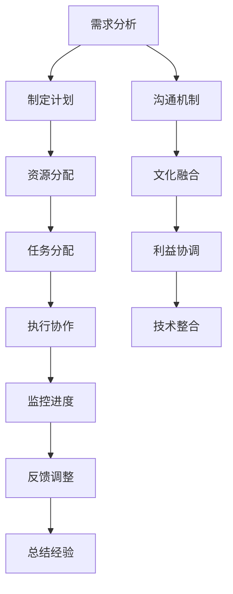

                 

# 跨部门协作：打破组织壁垒的策略

> 关键词：跨部门协作、组织壁垒、团队合作、沟通机制、项目管理、技术平台、文化融合

> 摘要：在当今快速变化的商业环境中，跨部门协作已成为企业成功的关键因素之一。本文将深入探讨跨部门协作的重要性，分析其面临的挑战，并提出有效的策略来打破组织壁垒，促进团队间的高效合作。通过具体的案例分析和实际操作步骤，本文旨在为企业提供一套全面的解决方案，以实现跨部门协作的优化和提升。

## 1. 背景介绍

在现代企业中，组织结构往往呈现出多层次、多部门的特点。每个部门都有其特定的职责和目标，但这些部门之间的协作却常常受到各种壁垒的阻碍。这些壁垒包括但不限于沟通不畅、信息孤岛、文化差异、利益冲突等。跨部门协作的缺失不仅会降低工作效率，还可能导致项目延期、资源浪费和决策失误等问题。因此，如何打破这些壁垒，实现跨部门间的高效协作，已成为企业亟待解决的重要课题。

## 2. 核心概念与联系

### 2.1 跨部门协作的定义

跨部门协作是指不同部门之间为了共同的目标，通过有效的沟通和合作，实现资源共享、信息互通、任务协同的过程。这种协作模式能够促进不同部门之间的知识交流和技术共享，从而提高整体工作效率和创新能力。

### 2.2 组织壁垒的类型

组织壁垒主要包括以下几种类型：

- **沟通壁垒**：信息传递不畅，导致部门间缺乏有效沟通。
- **文化壁垒**：不同部门的文化差异，如工作方式、价值观等，导致协作困难。
- **利益壁垒**：部门间的利益冲突，如资源分配、业绩考核等。
- **技术壁垒**：不同部门使用的系统和工具不兼容，导致信息孤岛现象。

### 2.3 跨部门协作的流程图



## 3. 核心算法原理 & 具体操作步骤

### 3.1 沟通机制的建立

建立有效的沟通机制是跨部门协作的基础。具体步骤如下：

1. **明确沟通目标**：确定沟通的目的和预期结果。
2. **选择合适的沟通工具**：根据部门特点选择合适的沟通工具，如企业微信、钉钉、Slack等。
3. **定期召开会议**：定期召开跨部门会议，确保信息的及时传递。
4. **建立反馈机制**：鼓励员工提出意见和建议，及时调整沟通策略。

### 3.2 文化融合的促进

文化融合是打破组织壁垒的关键。具体步骤如下：

1. **了解文化差异**：深入了解不同部门的文化背景和价值观。
2. **建立共同目标**：通过共同的目标和愿景，增强团队凝聚力。
3. **开展团队建设活动**：通过团队建设活动促进不同部门之间的交流和理解。
4. **培养跨文化意识**：鼓励员工学习和尊重不同的文化背景。

### 3.3 利益协调的策略

利益协调是跨部门协作的重要保障。具体步骤如下：

1. **明确利益关系**：明确各部门的利益关系和需求。
2. **建立利益共享机制**：通过利益共享机制，确保各部门的利益得到保障。
3. **制定公平的考核标准**：制定公平的考核标准，避免利益冲突。
4. **建立利益协调小组**：设立专门的利益协调小组，负责解决利益冲突问题。

### 3.4 技术整合的方法

技术整合是实现跨部门协作的技术基础。具体步骤如下：

1. **选择统一的技术平台**：选择统一的技术平台，确保各部门之间的信息互通。
2. **开发共享工具**：开发共享工具，提高各部门之间的协作效率。
3. **建立数据共享机制**：建立数据共享机制，确保各部门之间的数据一致性和准确性。
4. **定期进行技术培训**：定期进行技术培训，提高员工的技术水平。

## 4. 数学模型和公式 & 详细讲解 & 举例说明

### 4.1 沟通效率模型

沟通效率模型可以用来评估跨部门沟通的效果。具体公式如下：

$$
\text{沟通效率} = \frac{\text{有效沟通次数}}{\text{总沟通次数}} \times 100\%
$$

### 4.2 文化融合度模型

文化融合度模型可以用来评估不同部门之间的文化融合程度。具体公式如下：

$$
\text{文化融合度} = \frac{\text{共同价值观}}{\text{总价值观}} \times 100\%
$$

### 4.3 利益协调度模型

利益协调度模型可以用来评估不同部门之间的利益协调程度。具体公式如下：

$$
\text{利益协调度} = \frac{\text{利益共享比例}}{\text{总利益比例}} \times 100\%
$$

### 4.4 技术整合度模型

技术整合度模型可以用来评估不同部门之间的技术整合程度。具体公式如下：

$$
\text{技术整合度} = \frac{\text{共享工具使用率}}{\text{总工具使用率}} \times 100\%
$$

## 5. 项目实战：代码实际案例和详细解释说明

### 5.1 开发环境搭建

为了实现跨部门协作，我们需要搭建一个统一的开发环境。具体步骤如下：

1. **选择开发工具**：选择统一的开发工具，如Visual Studio Code、Eclipse等。
2. **配置开发环境**：配置统一的开发环境，确保各部门之间的开发环境一致。
3. **建立代码库**：建立统一的代码库，确保各部门之间的代码共享。
4. **制定编码规范**：制定统一的编码规范，确保代码的一致性和可读性。

### 5.2 源代码详细实现和代码解读

以一个简单的项目为例，展示如何实现跨部门协作。具体代码如下：

```python
# 项目文件夹结构
# ├── src
# │   ├── module1
# │   │   ├── __init__.py
# │   │   └── module1.py
# │   ├── module2
# │   │   ├── __init__.py
# │   │   └── module2.py
# ├── config
# │   └── config.py
# └── main.py

# src/module1/module1.py
def module1_function():
    print("Module 1 function")

# src/module2/module2.py
def module2_function():
    print("Module 2 function")

# src/config/config.py
def get_config():
    return {
        "database": "mysql",
        "host": "localhost",
        "port": 3306
    }

# main.py
from src.module1 import module1_function
from src.module2 import module2_function
from src.config import get_config

def main():
    config = get_config()
    print(f"Database: {config['database']}")
    print(f"Host: {config['host']}")
    print(f"Port: {config['port']}")
    module1_function()
    module2_function()

if __name__ == "__main__":
    main()
```

### 5.3 代码解读与分析

上述代码展示了如何实现跨部门协作。具体分析如下：

1. **模块化设计**：通过模块化设计，实现不同部门之间的代码共享。
2. **配置管理**：通过配置管理，实现不同部门之间的配置共享。
3. **代码共享**：通过代码共享，实现不同部门之间的代码协作。
4. **统一开发环境**：通过统一开发环境，实现不同部门之间的开发环境一致。

## 6. 实际应用场景

跨部门协作在实际项目中有着广泛的应用场景。例如，在一个大型电商平台项目中，前端开发团队、后端开发团队、测试团队和运维团队需要紧密协作，共同完成项目的开发和上线。通过建立有效的沟通机制、文化融合、利益协调和技术整合，可以实现跨部门间的高效协作，提高项目的成功率。

## 7. 工具和资源推荐

### 7.1 学习资源推荐

- **书籍**：《团队协作的艺术》、《跨部门沟通技巧》
- **论文**：《跨部门协作的挑战与策略》、《组织文化对跨部门协作的影响》
- **博客**：《如何实现跨部门协作》、《跨部门沟通技巧分享》
- **网站**：GitHub、Stack Overflow

### 7.2 开发工具框架推荐

- **开发工具**：Visual Studio Code、Eclipse
- **代码管理工具**：Git、GitHub
- **项目管理工具**：Jira、Trello
- **沟通工具**：企业微信、钉钉、Slack

### 7.3 相关论文著作推荐

- **论文**：《跨部门协作的挑战与策略》、《组织文化对跨部门协作的影响》
- **著作**：《团队协作的艺术》、《跨部门沟通技巧》

## 8. 总结：未来发展趋势与挑战

跨部门协作在未来的发展趋势将更加注重技术整合、文化融合和利益协调。随着技术的不断进步和组织结构的不断优化，跨部门协作将更加高效和灵活。然而，也面临着一些挑战，如技术壁垒、文化差异和利益冲突等。因此，企业需要不断探索和创新，以实现跨部门协作的持续优化和提升。

## 9. 附录：常见问题与解答

### 9.1 问题1：如何解决沟通壁垒？

**解答**：可以通过定期召开跨部门会议、建立反馈机制和选择合适的沟通工具来解决沟通壁垒。

### 9.2 问题2：如何促进文化融合？

**解答**：可以通过了解文化差异、建立共同目标和开展团队建设活动来促进文化融合。

### 9.3 问题3：如何协调利益冲突？

**解答**：可以通过明确利益关系、建立利益共享机制和制定公平的考核标准来协调利益冲突。

## 10. 扩展阅读 & 参考资料

- **书籍**：《团队协作的艺术》、《跨部门沟通技巧》
- **论文**：《跨部门协作的挑战与策略》、《组织文化对跨部门协作的影响》
- **博客**：《如何实现跨部门协作》、《跨部门沟通技巧分享》
- **网站**：GitHub、Stack Overflow

---

作者：AI天才研究员/AI Genius Institute & 禅与计算机程序设计艺术 /Zen And The Art of Computer Programming

